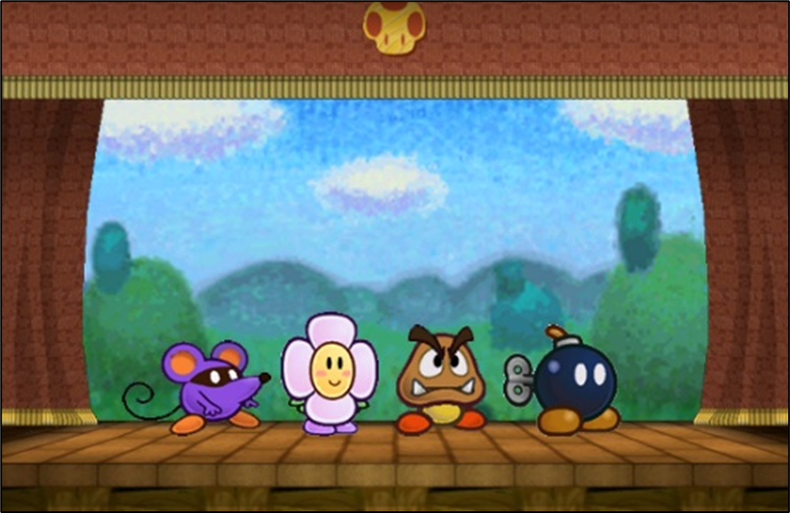

# Combat
{: .no_toc }

  

    Table of contents
  

  {: .text-delta }
- TOC
{:toc}

Combat in Paper Story is largely abstract; allied characters act as a single group, arranging themselves in a front-to-back formation at the start of combat (either arranged as they wish, or dictated based on circumstance).

{: .center-img }

Typically combats are between two groups, players and enemies. If players are fighting it out or enemies are split between factions, though, it can get more complicated and require more groups.

During each round of combat, each player has a turn where they can take one action. Turns proceed through the group one-by-one, going from front to back.  
At the end of the players' turns, each enemy group takes their actions in sequence, until there are no more enemies and the next round of combat begins.

## First Strikes and Initiative

Before most combats, all players have to roll Initiative to see how quickly they react – in other words, who gets a First Strike.

Typically this check depends on *Athletics*{: .heart-color }, but *Trickery*{: .spirit-color }, *Notice*{: .spirit-color } or other checks may be more appropriate, depending on how the fight begins.  
Usually, all players act in the same group, but sometimes you might have multiple players working independently – or fighting it out.  
Whichever group of players gets the most Grades of Success collectively goes first; if all player groups are tied, then the GM has to make a decision. In any case, enemies never move ahead of the players.

If a player gets a *Great!*{: .great-color } result, they can act in the Surprise Round, allowing them to strike quickly in the chaos before battle lines are drawn! They can freely target any one enemy, even if they'd normally be out of range.  
They can use one Innate or Geat Technique before turns are declared, treating the result of their initiative check as their Primary Check; if that Technique would require a Secondary Check, that has to be rolled as normal.

In most cases your First Strike can't target more than one enemy, and can't cost *FP*{: .spirit-color }, *SP*{: .courage-color } or equivalent (in the case of *Alt-Cost*{: .positive } Techniques. If the Technique would normally affect multiple targets, its effects are limited to one target.

On the other hand if a player *fails*{: .underlined } their Initiative check, an enemy can make an attack against them in the Surprise Round - even if they would normally be out of range.  
The same enemy cannot make multiple attacks in the Surprise Round.

The Surprise Round isn't counted as a full round, and while players can act during it and get to react to damage, this isn't considered a "turn" in the traditional sense. So [Statuses]({{ "/statuses" | absolute_url }}) and other durations aren't affected by the Surprise Round.

## Free Actions and Reactions

When the chips are down, players generally can't carry out more than one action on their turn. But there are cases where taking action is so straightforward, they don't have to think about it.  
Whenever something calls for a reaction (such as *[Guarding]({{ "/skills_in_detail#guard---guarding-reactively" | absolute_url }})*{: .heart-color }), or a free action (such as [Charming]({{ "/example_of_play" | absolute_url }}) foes), players can carry it out and make any rolls necessary without using up their own actions. 

## Targeting

When targeting someone with a [Technique]({{ "/techniques" | absolute_url }}) or an [Item]({{ "/inventory#items" | absolute_url }}), the first thing you need to consider is if they're an eligible target.  
Most attacks are made in melee range. Line up your groups and imagine a line between yourself and the target – if there are no enemies in between you, you're in melee range and good to go!

If however a target is Flying or otherwise out of reach, they can't be targeted in melee and will generally require *Ranged*{: .spirit-color }, *Reach*{: .spirit-color } or *Aerial*{: .spirit-color } Techniques. The good news is they're not able to block you off from other targets.

The same general rules apply to players – if you want to protect your teammates, you usually want to be standing in front of them, but it becomes harder to stop ranged or airborne attackers. If you need to get in front of your teammates, try *[Swapping]({{ "/skills_in_detail#coordination---swapping" | absolute_url }})*{: .heart-color } positions.

{: .center-img }

## Damage and Knockouts

Eventually, you're bound to take damage in a fight – you may even drop down to *0 HP*{: .heart-color } and be knocked out!

Once you have *0 HP*{: .heart-color } you're KO'd, and you can't really do anything; you can't block attackers from targeting allies behind you in melee, and you can't take actions on your turn.

Healing effects work like normal, but even if you restore your *HP*{: .heart-color }, you're still KO'd. But Life Shrooms, *Revive*{: .spirit-color } and similar effects can perk you up and get you back into the fight, immediately!  
If your turn would have passed by the time you get revived, you can take your turn immediately after revival.

Otherwise, you need a decent rest before you can get back up – or at least a 10 minute power nap. Typically these rests fully restore *HP*{: .heart-color } and *FP*{: .spirit-color }.

{: .center-img }

{: .tip-callout }
> *You're bound to run into some terrifying beasts on your adventure. But don't be afraid! Be brave! Even if your Game is Over, you can always pick yourself back up and try again. *{: .icon-right }

