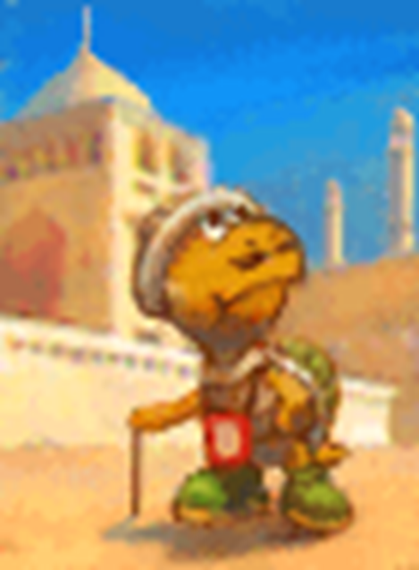

# Example of Play

Now if we put it all together, we can present an example of how a session works in Paper Story. For this example we'll be following the adventures of a group of three – *Kelly the Koopa*{: .heart-color }, *Buster the Bob-Omb*{: .spirit-color } and *Squinch the Squeek*{: .courage-color }.

{: .example-play-callout }
> *GM: Okay gang, when we last left off you were lost in the wild jungle of Keelhaul Key. The sun is starting to set and your rations are just about gone. Any bright ideas?*
>  
> *SQUINCH: I remember I tried sniffing out the shore last time... that didn't work out.*{: .courage-color }  
>  
> *BUSTER: If we follow the sun we'll eventually reach the shore, right?*{: .spirit-color }  
>  
> *GM: That would work, but the jungle is very thick. You'd need some way to blitz through the underbrush.*  
>  
> *KELLY: Well my claws are pretty sharp, can't I just hack through?*{: .heart-color }  
>  
> *GM: That would work, it'd be a messy job though. It sounds like an **Athletics**{: .heart-color } check to me.*  
>  
> *KELLY: Can I add my specialisation in Brute Force?*{: .heart-color }  
>  
> *GM: Yeah, I can see that working, go for it.*
>

The rest of the team sit back and wait to see how Kelly handles things.  
Kelly rolls 2d6 for her *Athletics*{: .heart-color }, plus 1d6 for her Brute Force specialisation. She rolls a 5, a 3 and a 2; one Grade of Success.

{: .example-play-callout }
> *KELLY: Okay that's a **Nice**{: .nice-color }... I have three Heart, so I'll nudge my 3 into a 4 for another Success... I can nudge the 2 into a 4 as well but that would still only be **Good**{: .good-color }, right?*{: .heart-color }  
>  
> *GM: Yeah, **Good**{: .good-color } is good though. So Kelly starts ripping and tearing, and pretty quickly you've established a path. She's making quite a bit of noise in the process.*  
>  
> *KELLY: Woo!*{: .heart-color }  
>  
> *BUSTER: That noise is probably going to attract some trouble, though. Do we notice anything?*{: .spirit-color }  
>  
> *GM: Kelly's a little too into it to hear much of anything right now, but yeah, maybe you guys should make a **Notice**{: .spirit-color } check*  
>

Buster and Squinch make their checks. Squinch includes his specialisation in Scent – normally he'd ask the GM, like Kelly did, but they've been doing this for a while and he pretty much always follows his nose. It's easier in this case for the GM to say when he can't use it instead.

{: .example-play-callout }
> *BUSTER: I've got a 4, and two 5's... If I nudge a 5 up to a 6 I can roll one more, that's a 2... I've got 2 Spirit left though so I can just nudge that up to a 4. All together that's 4 Successes, **Great**{: .great-color }!*{: .spirit-color }  
>  
> *SQUINCH: 5 Successes for me, so **Great**{: .great-color } too.*{: .courage-color }  
>  
> *GM: Very nice. Buster, you can hear something rustling around in the jungle that's not coming from Kelly's work... sounds like it's behind you. Squinch, you can smell the putrid too-ripe scent of poison plants.*  
>  
> *SQUINCH: Piranha Plants, maybe?*{: .courage-color }  
>  
> *BUSTER: I'll quietly get Kelly's attention, we need some muscle.*{: .spirit-color }  
>  
> *SQUINCH: I'm going to go ahead and hide myself if that's okay, I have a Stealth specialisation.*{: .courage-color }  
>  
> *GM: Yeah, we'll count that for your Initiative. A trio of slithering Putrid Piranhas burst out from the bushes behind you! Buster and Kelly I'll need **Athletics**{: .heart-color } from you, Squinch you can use your **Trickery**{: .spirit-color }.*  
>

The GM adds three small figurines to the table to represent the enemies. While the team rolls their Initiative checks, the GM looks over his notes on Putrid Piranhas.

{: .example-play-callout }
> *KELLY: Easy, I've got 2 for a... **Good**{: .good-color }! Right?*{: .heart-color }  
>  
> *SQUINCH: Yeah that's right. I've got 4, so **Great**{: .great-color }!*{: .courage-color }  
>  
> *BUSTER: Uhh, this isn't good. No successes from me.*{: .spirit-color }  
>  
> *GM: Okay, so Squinch bursts out from another, smaller bush and gets his surprise attack!*  
>

Squinch attacks the lead plant with his basic attack, Sneak Attack. It has *Piercing*{: .positive-color }, *Strong*{: .positive-color } and *Unwieldy*{: .negative-color }, so it deals 2 DMG on a *Nice*{: .nice-color } result, and 4 DMG on a *Good*{: .good-color } result. If the plants had Defense, he'd be able to bypass that with *Piercing*{: .positive-color }, too.

{: .example-play-callout }
> *SQUINCH: Alright, my **Coordination**{: .heart-color } was 3 Successes – so **Good**{: .good-color }, for 4 damage.*{: .courage-color }  
>  
> *GM: That's a respectable hit, the plant reels in shock! However his buddy sees an opportunity to bite down, hard, on Buster!*  
>  
> *BUSTER: Oh jeez, I'm really not the athletic type huh? I'll just try to block it with a **Guard**{: .heart-color } check I guess... 1, so just **Nice**{: .nice-color }. Plus my 1 Defense.*{: .spirit-color }  
>

The GM checks his notes, and sees that he's given Putrid Piranha's a 3 DMG attack with a three-turn Lingering (3) poison. If Buster suffers this poison he'll take another 3 damage at the end of the turn – but he knows Buster has a chance to respond.

{: .example-play-callout }
> *GM: Not quite enough, sorry Buster. You're able to deflect the bulk of it but you still take 1 damage, and its vile breath afflicts you with a Lingering poison!*  
>  
> *BUSTER: I do have **Steady**{: .courage-color } at least, so I'm going to try and reduce it... wait, hold on, I'm a Bob-Omb. Aren't I immune to poison?*{: .spirit-color }  
>  
> *GM: Yeah sorry, you're right. Alright, that's First Strikes over, who's moving first?*  
>  
> *KELLY: I'm the muscle here! I'll get in front. I dunno if it'll make much of a difference though if the plants can burrow past me. I'm not too distracted to go first, right?*{: .heart-color }  
>  
> *GM: No you're fine, Buster got your attention before things got too heated.*  
>  
> *BUSTER: Do you still have that Power Punch, Squinch?*{: .spirit-color }  
>  
> *SQUINCH: Oh yeah! I'll go after Kelly then so I can use it on Buster.*{: .courage-color }  
>  
> *BUSTER: Great! I'll bring up the rear. Hopefully I can get a big enough boom to end the fight quickly.*{: .spirit-color }  
>

The players arrange their own figurines in a row on the table, and the GM moves the three Putrid Piranha figurines in front of them.

{: .example-play-callout }
> *GM: Okay then, Kelly to act.*  
>  
> *KELLY: Rip and tear! I'm going to claw that front guy with my Savage Slicer!*{: .heart-color }  
>

Kelly moves her figurine up in front of the enemy while she rolls to act out an attack – this isn't really necessary, but it helps her visualise the action.  
Savage Slicer is Kelly's strongest attack, costing *4 FP*{: .spirit-color }, which Kelly marks off her sheet before she rolls. The Technique has *Indirect*{: .positive-color } (representing Kelly's scaly armoured claws), *Strong x2*{: .positive-color }, *Weaken (Defense) x2*{: .positive-color }, *Commitment (Primary)*{: .negative-color } and *Unwieldy*{: .negative-color }.  
Adding it all together with Kelly's 1 Power, this gives her a Technique with 3 Power, that requires a *Good*{: .good-color } *Coordination*{: .heart-color } check to deal damage, and can shake up enemy defenses with a secondary *Bully*{: .courage-color } check. Kelly's chosen to split the damage into two 3 DMG strikes, for 6 in total.

{: .example-play-callout }
> *KELLY: Oh yeah! That's **Good**{: .good-color }!*{: .heart-color }  
>

The GM quickly checks his notes again and confirms the Putrid Piranhas have 8 HP; including the damage Squinch already dealt, Kelly's attack will easily finish off the first enemy.

{: .example-play-callout }
> *KELLY: Okay so, for the **Bully**{: .courage-color } check –*{: .heart-color }  
>  
> *GM: No that's okay Kelly, you've torn through him just fine. With two mighty claw sweeps you scatter the plant's leaves to ribbon, and it slumps onto the ground, defeated.*  
>  
> *KELLY: Oh, okay. Woo!*{: .heart-color }  
>

The GM takes the figurine for the defeated plant off the table.

{: .example-play-callout }
> *GM: Squinch to act.*  
>  
> *SQUINCH: So Kelly obviously wasn't listening, but that's okay, we'll just go ahead with our plan.*{: .courage-color }  
>  
> *KELLY: Oh, sorry guys. Fights get me so heated!*{: .heart-color }  
>  
> *BUSTER: Haha, we get it, you're fine. And now we know they've got something like **10 HP**{: .heart-color }, and I can save some FP on my turn.*{: .spirit-color }  
>  
> *SQUINCH: Yeah it's all good, we appreciate your moxie. So anyway, I'm going to hand Buster my Power Punch and boost him up.*{: .courage-color }  
>  
> *GM: Did you want to make a **Heal**{: .heart-color } check to improve that at all?*  
>  
> *SQUINCH: On no dice? No I'll give that a miss, thanks.*{: .courage-color }  
>  
> *GM: Okay, that's fine. So you hand it off to Buster and he's able to chug it down, then suddenly doubles in size. Buster, your move.*  
>  
> *BUSTER: Fee, fi, fo, fum... Heh heh, I think the basic Boombast should do it here.*{: .spirit-color }  
>

Boombast is Buster's basic explosive attack, with *Scaling*{: .positive-color }, *Indirect*{: .positive-color }, *Element (Blast)*{: .positive-color }, *Variant (Athletics)*{: .positive-color }, *Burst*{: .positive-color }, *Strong*{: .positive-color } and *Exhausting*{: .negative-color }, *Unwieldy*{: .negative-color }. Because most of the FP cost is covered by his Bob-Omb Tech Defaults, he's able to reduce it down to 0 FP, but can't act during the next turn.  
The end result is an explosive attack that can hit both plants, dealing 4 DMG with a *Nice*{: .nice-color }, 6 DMG with a *Good*{: .good-color } and 8 DMG with a *Great*{: .great-color }.

{: .example-play-callout }
> *BUSTER: Come on, Athletics... No! That's just a **Good**{: .spirit-color }. So 6 DMG.*{: .spirit-color }  
>  
> *SQUINCH: +1 from your Attack.*{: .courage-color }  
>  
> *BUSTER: Yeah, thanks, that wasn't including the Attack boost, but I don't think 7 damage is going to cut it... I'd boost that up to a **Great**{: .great-color } with **SP**{: .courage-color }, if I had any.*{: .spirit-color }  
>  
> *GM: Yeah, unfortunately not – it's quite a powerful attack, though. The super-sized Buster explodes right in front of them! You deal 7 damage to the front plant, then 6 to the one behind it.*  
>  
> *BUSTER: Ah, I forgot about the **Burst**{: .positive-color } penalty too.*{: .spirit-color }  
>  
> *GM: That's okay. So, the Putrid Piranhas are covered in soot and badly shaken up, but they're still aggressive and can see that Buster hasn't got another attack in him. So while the front one lashes out at Kelly in melee, the other burrows under and pops out behind her, chomping down on Buster! That's 3 damage to both of you – plus the poison, for Kelly.*  
>  
> *KELLY: I've got Defense too, so I'll Guard. That's a **Great**{: .great-color }! So it goes down to 2 from my Defense, then I reduce it twice with blocking, so I won't take any poison. And I have an extra Grade of Success. Oh! I can Superguard, right?*{: .heart-color }  
>  
> *GM: Yep, you're able to defend and pirouette into a shell strike. Their fangs bounce off your tough shell and they recoil in pain! You deal 1 more damage to the Putrid Piranha, and it slumps over, KO'd!*  
>

The GM takes another figurine off the table, leaving just one enemy.

{: .example-play-callout }
> *KELLY: Guys, they've got 8 HP! So the last one is barely standing.*{: .heart-color }  
>  
> *BUSTER: Yeah, I can't do much about it now though. I **Guarded**{: .heart-color } as well, but got nothing.*{: .spirit-color }  
>  
> *GM: So your metal hide is a bit tougher, but the Piranha's desperate bite crunches down with force, dealing 2 damage to you. So, there's just one more enemy to fight, but it's looking pretty frightened. Next round, it's Kelly from the top, what do you do?*  
>

And that's the basics of play in Paper Story!

{: .center-img }

{: .tip-callout }
> *Now you're ready to get out there and explore the world yourself! The rest of the book goes into a lot more detail on specific skills and Items you might need to know about, but if you're eager to start, you can jump right into a game and look it up as you go!* 
> {: .icon-right }