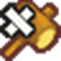
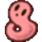
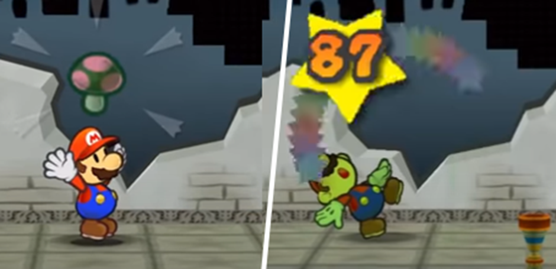
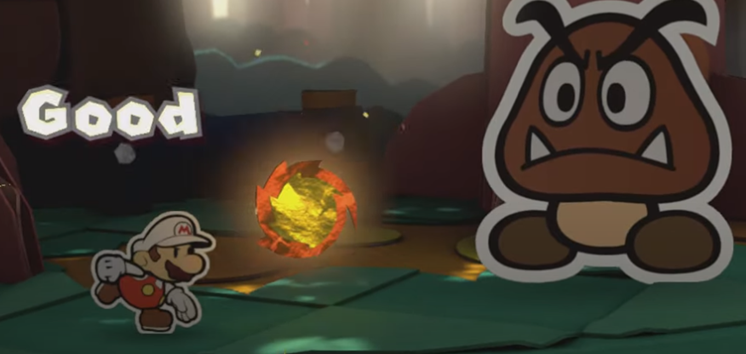
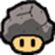
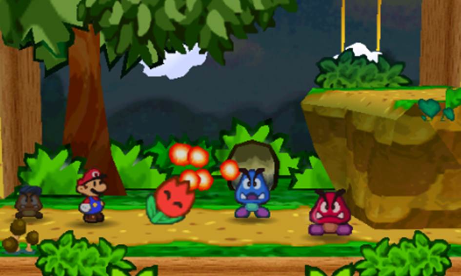
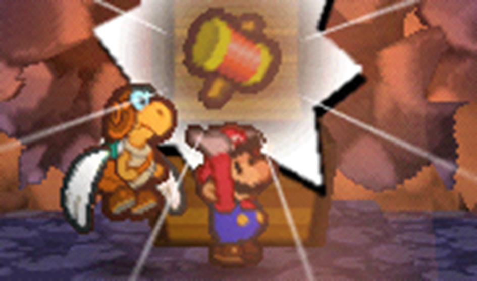

# Inventory
{: .no_toc }

  

    Table of contents
  

  {: .text-delta }
- TOC
{:toc}

Players can carry around a wide variety of Items, Power-Ups, Gear and Badges.  
Regardless of the size or number of things being carried, all players begin play with 10 Inventory slots, which can each fit an Item, Power-Up, piece of Gear or similarly-sized handheld object.

## Items

Items are single-use consumables with a wide variety of effects. Generally, Items require an action to use and are consumed immediately. You don't need to make any special checks, though you can get more out of your Items using [*Aim*{: .heart-color }](TODO:LINK), [*Heal*{: .heart-color }](TODO:LINK) and [*Crafts*{: .spirit-color }](TODO:LINK).

{: .item-callout .item-left }
> 
>
> {: .item-inner-callout }
> > *Mushroom*{: .fs-6 .header-font }  
> > *Item*{: .label .item .header-font }*Curative*{: .label .curative .header-font }  
> > {: .inline-icon } • 5 Coins
> >
> > Restores *5 HP*{: .heart-color } to a willing target.

{: .item-callout .item-left }
> 
>
> {: .item-inner-callout }
> > *Super Shroom*{: .fs-6 .header-font }  
> > *Item*{: .label .item .header-font }*Curative*{: .label .curative .header-font }  
> > {: .inline-icon } • 15 Coins
> >
> > Restores *10 HP*{: .heart-color } to a willing target.

{: .item-callout .item-left }
> 
>
> {: .item-inner-callout }
> > *Ultra Shroom*{: .fs-6 .header-font }  
> > *Item*{: .label .item .header-font }*Curative*{: .label .curative .header-font }  
> > {: .inline-icon } • 200 Coins
> >
> > Restores *50 HP*{: .heart-color } to a willing target.

{: .item-callout .item-left }
> 
>
> {: .item-inner-callout }
> > *Slow Shroom*{: .fs-6 .header-font }  
> > *Item*{: .label .item .header-font }*Curative*{: .label .curative .header-font }  
> > {: .inline-icon } • 15 Coins
> >
> > Restores *2 HP*{: .heart-color } a turn for 10 turns to a willing target.

{: .item-callout .item-left }
> 
>
> {: .item-inner-callout }
> > *Life Shroom*{: .fs-6 .header-font }  
> > *Item*{: .label .item .header-font }*Curative*{: .label .curative .header-font }  
> > {: .inline-icon } • 50 Coins
> >
> > Restores *10 HP*{: .heart-color } and revives a willing target from KO.  
> > If a character is KO'd while holding a Life Shroom, it is automatically consumed and heals them back to *10 HP*{: .heart-color }.

{: .item-callout .item-left }
> 
>
> {: .item-inner-callout }
> > *Dried Shroom*{: .fs-6 .header-font }  
> > *Item*{: .label .item .header-font }*Curative*{: .label .curative .header-font }  
> > {: .inline-icon } • 2 Coins
> >
> > Restores *1 HP*{: .heart-color } to a willing target.

{: .item-callout .item-left }
> 
>
> {: .item-inner-callout }
> > *Honey Syrup*{: .fs-6 .header-font }  
> > *Item*{: .label .item .header-font }*Curative*{: .label .curative .header-font }  
> > {: .inline-icon } • 5 Coins
> >
> > Restores *5 FP*{: .spirit-color } to a willing target.

{: .item-callout .item-left }
> 
>
> {: .item-inner-callout }
> > *Maple Syrup*{: .fs-6 .header-font }  
> > *Item*{: .label .item .header-font }*Curative*{: .label .curative .header-font }  
> > {: .inline-icon } • 20 Coins
> >
> > Restores *10 FP*{: .spirit-color } to a willing target.

{: .item-callout .item-left }
> 
>
> {: .item-inner-callout }
> > *Jammin' Jelly*{: .fs-6 .header-font }  
> > *Item*{: .label .item .header-font }*Curative*{: .label .curative .header-font }  
> > {: .inline-icon } • 200 Coins
> >
> > Restores *50 FP*{: .spirit-color } to a willing target.

{: .item-callout .item-left }
> 
>
> {: .item-inner-callout }
> > *Gradual Syrup*{: .fs-6 .header-font }  
> > *Item*{: .label .item .header-font }*Curative*{: .label .curative .header-font }  
> > {: .inline-icon } • 15 Coins
> >
> > Restores *2 FP*{: .spirit-color } a turn for 10 turns to a willing target.

{: .item-callout .item-left }
> 
>
> {: .item-inner-callout }
> > *Tasty Tonic*{: .fs-6 .header-font }  
> > *Item*{: .label .item .header-font }*Curative*{: .label .curative .header-font }  
> > {: .inline-icon } • 3 Coins
> >
> > Cures status ailments (e.g. Lingering, Stun) for a willing target.

{: .item-callout .item-left }
> 
>
> {: .item-inner-callout }
> > *Hustle Drink*{: .fs-6 .header-font }  
> > *Item*{: .label .item .header-font }*Curative*{: .label .curative .header-font }  
> > {: .inline-icon } • 40 Coins
> >
> > Cures Status ailments (e.g. Lingering, Stun) for a willing target, and allows them to Hustle (1) for the next turn.

{: .item-callout .item-left }
> 
>
> {: .item-inner-callout }
> > *Tasty Tonic*{: .fs-6 .header-font }  
> > *Item*{: .label .item .header-font }*Curative*{: .label .curative .header-font }  
> > {: .inline-icon } • 200 Coins
> >
> > Restores *25 HP*{: .heart-color } and *25 FP*{: .spirit-color } to a willing target.

{: .item-callout .item-left }
> 
>
> {: .item-inner-callout }
> > *Dusty Hammer*{: .fs-6 .header-font }  
> > *Item*{: .label .item .header-font }*Attack*{: .label .attack .header-font }  
> > {: .inline-icon } • 2 Coins
> >
> > Deals 1 Piercing damage to target enemy.

{: .item-callout .item-left }
> 
>
> {: .item-inner-callout }
> > *Dusty Boomerang*{: .fs-6 .header-font }  
> > *Item*{: .label .item .header-font }*Attack*{: .label .attack .header-font }  
> > {: .inline-icon } • 5 Coins
> >
> > Deals 1 Piercing damage, twice, to all enemies in target group in a straight line.

{: .item-callout .item-left }
> 
>
> {: .item-inner-callout }
> > *POW Block*{: .fs-6 .header-font }  
> > *Item*{: .label .item .header-font }*Attack*{: .label .attack .header-font }  
> > {: .inline-icon } • 5 Coins
> >
> > Deals 2 Piercing Earth/Quake damage to all enemies outside the user's group in contact with a solid surface.

{: .item-callout .item-left }
> 
>
> {: .item-inner-callout }
> > *Reflect Cape*{: .fs-6 .header-font }  
> > *Item*{: .label .item .header-font }*Attack*{: .label .attack .header-font }*Booster*{: .label .booster .header-font }  
> > {: .inline-icon } • 10 Coins
> >
> > Deals 2 Piercing damage to a target in melee, then equips the user with a cape; until the end of the round, they receive +1d6 to *Guard*{: .heart-color } checks against ranged attacks, as if Boosted.

{: .item-callout .item-left }
> 
>
> {: .item-inner-callout }
> > *Fire Burst*{: .fs-6 .header-font }  
> > *Item*{: .label .item .header-font }*Attack*{: .label .attack .header-font }  
> > {: .inline-icon } • 10 Coins
> >
> > Deals 3 Piercing Fire damage to all enemies in target group and leaves a Lingering (1) burn for 3 turns.

{: .item-callout .item-left }
> 
>
> {: .item-inner-callout }
> > *Ice Storm*{: .fs-6 .header-font }  
> > *Item*{: .label .item .header-font }*Attack*{: .label .attack .header-font }  
> > {: .inline-icon } • 15 Coins
> >
> > Deals 3 Piercing Ice damage to all enemies in target group – targets are frozen, Dazing (1) them for 1 turn.

{: .item-callout .item-left }
> 
>
> {: .item-inner-callout }
> > *Bubble Wave*{: .fs-6 .header-font }  
> > *Item*{: .label .item .header-font }*Attack*{: .label .attack .header-font }  
> > {: .inline-icon } • 15 Coins
> >
> > Deals 3 Piercing Water damage to all enemies in target group – targets are encased in bubbles, Dazing (1) them for 1 turn.

{: .item-callout .item-left }
> 
>
> {: .item-inner-callout }
> > *HP Drain*{: .fs-6 .header-font }  
> > *Item*{: .label .item .header-font }*Attack*{: .label .attack .header-font }  
> > {: .inline-icon } • 10 Coins
> >
> > Deals 5 Piercing Shadow damage to target, then restores the damage dealt as *HP*{: .heart-color } for the user.

{: .item-callout .item-left }
> 
>
> {: .item-inner-callout }
> > *Thunder Bolt*{: .fs-6 .header-font }  
> > *Item*{: .label .item .header-font }*Attack*{: .label .attack .header-font }  
> > {: .inline-icon } • 10 Coins
> >
> > Deals 5 Piercing Shock damage to target.

{: .item-callout .item-left }
> 
>
> {: .item-inner-callout }
> > *Thunder Rage*{: .fs-6 .header-font }  
> > *Item*{: .label .item .header-font }*Attack*{: .label .attack .header-font }  
> > {: .inline-icon } • 20 Coins
> >
> > Deals 5 Piercing Shock damage to all enemies outside the user's group.

{: .item-callout .item-left }
> 
>
> {: .item-inner-callout }
> > *Earth Quake*{: .fs-6 .header-font }  
> > *Item*{: .label .item .header-font }*Attack*{: .label .attack .header-font }  
> > {: .inline-icon } • 15 Coins
> >
> > Deals 5 Piercing Earth/Quake damage to all enemies outside the user's group in contact with a solid surface.

{: .item-callout .item-left }
> 
>
> {: .item-inner-callout }
> > *Shooting Star*{: .fs-6 .header-font }  
> > *Item*{: .label .item .header-font }*Attack*{: .label .attack .header-font }  
> > {: .inline-icon } • 30 Coins
> >
> > Deals 6 Piercing Star damage to all enemies outside the user's group.

{: .item-callout .item-left }
> 
>
> {: .item-inner-callout }
> > *Fright Mask*{: .fs-6 .header-font }  
> > *Item*{: .label .item .header-font }*Hazard*{: .label .hazard .header-font }  
> > {: .inline-icon } • 5 Coins
> >
> > All enemies in target group are terrified, either fleeing or leaving them Stunned (3) for 3 turns (their choice).

{: .item-callout .item-left }
> 
>
> {: .item-inner-callout }
> > *Sleepy Sheep*{: .fs-6 .header-font }  
> > *Item*{: .label .item .header-font }*Hazard*{: .label .hazard .header-font }  
> > {: .inline-icon } • 8 Coins
> >
> > All enemies in target group are put to sleep, Dazing (1) them for 3 turns.

{: .item-callout .item-left }
> 
>
> {: .item-inner-callout }
> > *Mini Mr. Mini*{: .fs-6 .header-font }  
> > *Item*{: .label .item .header-font }*Hazard*{: .label .hazard .header-font }  
> > {: .inline-icon } • 8 Coins
> >
> > All enemies in target group are shrunken, Weakening (1) Attack for 3 turns.

{: .item-callout .item-left }
> 
>
> {: .item-inner-callout }
> > *Mr. Softener*{: .fs-6 .header-font }  
> > *Item*{: .label .item .header-font }*Hazard*{: .label .hazard .header-font }  
> > {: .inline-icon } • 8 Coins
> >
> > All enemies in target group are softened up, Weakening (1) Defense for 3 turns.

{: .item-callout .item-left }
> 
>
> {: .item-inner-callout }
> > *Dizzy Dial*{: .fs-6 .header-font }  
> > *Item*{: .label .item .header-font }*Hazard*{: .label .hazard .header-font }  
> > {: .inline-icon } • 12 Coins
> >
> > All enemies in target group are dizzied, Disorienting (1) them for 3 turns.

{: .item-callout .item-left }
> 
>
> {: .item-inner-callout }
> > *Stopwatch*{: .fs-6 .header-font }  
> > *Item*{: .label .item .header-font }*Hazard*{: .label .hazard .header-font }  
> > {: .inline-icon } • 25 Coins
> >
> > All enemies in target group are partially frozen in time, leaving them Stunned (3) for 3 turns.

{: .item-callout .item-left }
> 
>
> {: .item-inner-callout }
> > *Ruin Powder*{: .fs-6 .header-font }  
> > *Item*{: .label .item .header-font }*Hazard*{: .label .hazard .header-font }  
> > {: .inline-icon } • 15 Coins
> >
> > All enemies in target group have their senses addled, Confusing (1) them for 3 turns.

{: .item-callout .item-left }
> 
>
> {: .item-inner-callout }
> > *Power Punch*{: .fs-6 .header-font }  
> > *Item*{: .label .item .header-font }*Booster*{: .label .booster .header-font }  
> > {: .inline-icon } • 15 Coins
> >
> > Enlarges a willing target, Boosting (1) Attack for 3 turns.

{: .item-callout .item-left }
> 
>
> {: .item-inner-callout }
> > *Courage Shell*{: .fs-6 .header-font }  
> > *Item*{: .label .item .header-font }*Booster*{: .label .booster .header-font }  
> > {: .inline-icon } • 5 Coins
> >
> > Toughens a willing target's body, Boosting (1) Defense for 3 turns.

{: .item-callout .item-left }
> 
>
> {: .item-inner-callout }
> > *Volt Shroom*{: .fs-6 .header-font }  
> > *Item*{: .label .item .header-font }*Booster*{: .label .booster .header-font }  
> > {: .inline-icon } • 10 Coins
> >
> > Electrifies a willing target, bestowing the following Contact trait for 3 turns:  
> > *Contact*{: .mgl }  
> > *The attacker takes 1 Piercing Shock DMG, and you make a **Steady**{: .courage-color } check; the attacker is Dazed for 1 turn for each Grade of Success.*{: .mgl-big .fs-3 }

{: .item-callout .item-left }
> 
>
> {: .item-inner-callout }
> > *Spite Pouch*{: .fs-6 .header-font }  
> > *Item*{: .label .item .header-font }*Booster*{: .label .booster .header-font }  
> > {: .inline-icon } • 10 Coins
> >
> > Protects a willing target with a vengeful curse, bestowing the following Contact trait for 3 turns:  
> > *Contact*{: .mgl }  
> > *The attacker takes Piercing damage equal to half the damage dealt to you, with no chance to resist.*{: .mgl-big .fs-3 }

{: .item-callout .item-left }
> 
>
> {: .item-inner-callout }
> > *Repel Cape*{: .fs-6 .header-font }  
> > *Item*{: .label .item .header-font }*Booster*{: .label .booster .header-font }  
> > {: .inline-icon } • 15 Coins
> >
> > Makes a willing target dodgier; for the next 3 turns, their *Dodge*{: .spirit-color } checks are Boosted (1).  
> > While this Boost lasts, they can attempt to *Dodge*{: .spirit-color } before they *Block*{: .heart-color }.

{: .item-callout .item-left }
> 
>
> {: .item-inner-callout }
> > *Boo's Sheet*{: .fs-6 .header-font }  
> > *Item*{: .label .item .header-font }*Booster*{: .label .booster .header-font }  
> > {: .inline-icon } • 25 Coins
> >
> > Turns a willing target invisible like a Boo for 1 turn, making them invisible, intangible and bestowing the following Weakness:  
> > *Weakness (Sudden Light)*{: .mgl }  
> > *This weakness overrules any existing immunity or resistance.*{: .mgl-big .fs-3 }
> > *You are stunned by the light, ending your invisibility and Dazing (1) you for a turn for each point of damage taken (minimum 1 turn).*{: .mgl-big .fs-3 }

{: .item-callout .item-left }
> 
>
> {: .item-inner-callout }
> > *Stone Cap*{: .fs-6 .header-font }  
> > *Item*{: .label .item .header-font }*Booster*{: .label .booster .header-font }  
> > {: .inline-icon } • 30 Coins
> >
> > Turns a willing target into a solid stone statue for 3 turns, preventing them from taking any action, but making them immune to all attacks, hazards, Statuses and similar effects.  
> > If used while airborne, the user can crash into a single target from above, dealing 6 Earth DMG with an Aerial attack!  
> > In any case, the user is grounded for the duration, ignoring their Fly or Hover Traits.  
> > Also bestows the following Weakness:  
> > *Weakness (Blast, Quake)*{: .mgl }  
> > *This weakness overrules any existing immunity or resistance.*{: .mgl-big .fs-3 }  
> > *Your stone form is chipped, ending your invulnerability and Dazing (1) you for a turn for each point of damage taken (minimum 1 turn).*{: .mgl-big .fs-3 }

{: .item-callout .item-left }
> 
>
> {: .item-inner-callout }
> > *Carry Cloud*{: .fs-6 .header-font }  
> > *Item*{: .label .item .header-font }*Booster*{: .label .booster .header-font }  
> > {: .inline-icon } • 30 Coins
> >
> > Gives a willing target a cloud to ride in for 3 turns, bestowing the Hover and Fly Traits; checks made to Fly with the cloud can use either *Coordination*{: .heart-color } or *Magic*{: .spirit-color } instead of *Athletics*{: .heart-color }.  
> > The cloud becomes intangible and floats away afterwards.

{: .item-callout .item-left }
> 
>
> {: .item-inner-callout }
> > *Mystery Box*{: .fs-6 .header-font }  
> > *Item*{: .label .item .header-font }*Quirk*{: .label .quirk .header-font }  
> > {: .inline-icon } • 3 Coins
> >
> > When used, roll 2d6 to determine this Item's effect.  
> > If the user would receive an Item after use, it must either be used on themselves immediately (as part of the same action) or be wasted as the magic of the Mystery Box fades away.  
> > - 2: The user is struck by a Dusty Hammer, with no chance to resist.
> > - 3: The user briefly receives a Repel Cape.
> > - 4: The user briefly receives an Ultra Shroom.
> > - 5: The user briefly receives a Slow Shroom.
> > - 6: The user briefly receives a Mushroom.
> > - 7: Target enemy group is affected by a Fire Burst.
> > - 8: The user briefly receives a Honey Syrup.
> > - 9: The user briefly receives a Gradual Syrup.
> > - 10: The user briefly receives a Jammin' Jelly.
> > - 11: Target enemy group is affected by a Stopwatch.
> > - 12: All enemies outside the user's group are affected by a Shooting Star.
> >
> > If a Mystery Box would be crafted into another Item, roll 2d6 as above, and treat the Mystery Box as that Item. Its value stays the same.

{: .item-callout .item-left }
> 
>
> {: .item-inner-callout }
> > *Point Swap*{: .fs-6 .header-font }  
> > *Item*{: .label .item .header-font }*Quirk*{: .label .quirk .header-font }  
> > {: .inline-icon } • 5 Coins
> >
> > Swaps any target's current *HP*{: .heart-color } and *FP*{: .spirit-color } totals, without exceeding their maximum values.  
> > Effectiveness on enemies can vary depending on their effective *FP*{: .spirit-color }.

{: .item-callout .item-left }
> 
>
> {: .item-inner-callout }
> > *Poison Shroom*{: .fs-6 .header-font }  
> > *Item*{: .label .item .header-font }*Quirk*{: .label .quirk .header-font }  
> > {: .inline-icon } • 50 Coins
> >
> > When fed to a willing target, they roll 1d6:
> > - On 1-5, if the user is immune to poison or similar statuses, they heal 10 HP.  
> > Otherwise they're afflicted with a Lingering (1) poison for 3 turns; if they're unable to shrug it off with Steady outright, their current HP is also halved.
> > - On 6, their HP is completely restored, and their status ailments (e.g. Lingering, Stun) are cured.

{: .center-img }

{: .tip-callout }
> *Why would you want to eat a Poison Shroom? The risk far outweighs the reward. Although, if you get creative, you can find all sorts of uses for weird Items like these.* 
> {: .icon-right }

## Power-Ups

Power-Ups are particularly special kinds of consumable Items which provide ongoing effects for a single willing target, similar to Statuses caused by Booster Items.  
A character can have one Power-Up active at a time, with new Power-Ups replacing existing Power-Ups immediately.

Power-Ups provide a variety of passive benefits, and can grant modifiers to Techniques or give the user access to entirely new Techniques.  
These Technique benefits can't be used simultaneously; you can't use a Power-Up Technique while the Power-Up enhances it, and you can't enhance your Techniques with more than one Power-Up effect.

The magic of a Power-Up doesn't last long! It takes special care to preserve them for future use, requiring a *Crafts*{: .spirit-color }, *Magic*{: .spirit-color } or similar check to keep them safe. Typically this requires at least a *Great*{: .great-color } result, though as always, you may be able to get by with less.  
Otherwise if they aren't used, a Power-Up will wilt or expire within a few minutes of acquiring it. Some of their magic will last, though, allowing them to be used as ordinary Items.  
When purchased in stores, Power-Ups come pre-preserved in special containers – accounting for their higher cost.

Once a Power-Up is used, its Power-Up state lasts as long as its user is able to concentrate, typically ending on its own outside of combat or during breaks between adventure.  
Whenever the user takes damage from an attack or is otherwise shaken up, they have to make a *Steady*{: .courage-color } check to hold on; on failure, the Power-Up is lost.  
Each *Steady*{: .courage-color } check made requires a higher Grade of Success than the last check, until the Power-Up is lost.  
*No matter what*{: .underlined }, the effects of the Power-Up don't impact this *Steady*{: .courage-color } check, either to make it easier or harder.

{: .center-img }

{: .item-callout .item-left }
> 
>
> {: .item-inner-callout }
> > *Fire Flower*{: .fs-6 .header-font }  
> > *Power-Up*{: .label .power-up .header-font }  
> > {: .inline-icon } • 50 Coins
> >
> > Bestows the power to generate fire.  
> > When wilted, the petals can be scattered to produce a similar effect to a Fire Burst.  
> > For *5 FP*{: .spirit-color }:  
> > *Adds +1 Attack, Lingering x2 and Element (Fire) to an attack.*{: .mgl .fs-3 }  
> > For *5 FP*{: .spirit-color }:  
> > *Fireball*{: .mgl .fs-3 .header-font }  
> > *Launches a volley of fireballs at a single enemy.*{: .mgl .fs-3 }  
> > ***Aim**{: .heart-color } or **Magic**{: .spirit-color }:*{: .mgl .fs-3 }  
> > *Deals 1 Piercing Fire DMG to the target, repeating with another strike for each Grade of Success, hitting up to [2 x (Power + 1)] times.*{: .mgl .fs-3 }  
> > *Excess damage spills over to new targets.*{: .mgl .fs-3 }  
> > *Each target may be burnt.*{: .mgl .fs-3 }  
> > ***Bully**{: .courage-color } or **Magic**{: .spirit-color }:*{: .mgl .fs-3 }  
> > ***Nice!**{: .nice-color }: Lingering (1) for 3 turns*{: .mgl .fs-3 }  
> > ***Good!**{: .good-color }: Lingering (2) for 3 turns*{: .mgl .fs-3 }  
> > ***Great!**{: .great-color }: Lingering (3) for 3 turns*{: .mgl .fs-3 }  
> > Adds:  
> > *+1 Resist (Fire)*{: .mgl .fs-3 }  
> > Removes:  
> > *Immunities and Resistances to Ice and Water*{: .mgl .fs-3 }

{: .item-callout .item-left }
> 
>
> {: .item-inner-callout }
> > *Ice Flower*{: .fs-6 .header-font }  
> > *Power-Up*{: .label .power-up .header-font }  
> > {: .inline-icon } • 50 Coins
> >
> > Bestows the power to generate ice.  
> > When wilted, the petals can be scattered to produce a similar effect to an Ice Storm.  
> > For *5 FP*{: .spirit-color }:  
> > *Adds +1 Attack, Daze x2 and Element (Ice) to an attack.*{: .mgl .fs-3 }  
> > For *5 FP*{: .spirit-color }:  
> > *Iceball*{: .mgl .fs-3 .header-font }  
> > *Launches a barrage of ice at a single enemy.*{: .mgl .fs-3 }  
> > ***Aim**{: .heart-color } or **Magic**{: .spirit-color }:*{: .mgl .fs-3 }  
> > *Deals 1 Piercing Ice DMG to the target, repeating with another strike for each Grade of Success, hitting up to [2 x (Power + 1)] times.*{: .mgl .fs-3 }  
> > *Excess damage spills over to new targets.*{: .mgl .fs-3 }
> > *Each target may be frozen in place.*{: .mgl .fs-3 }  
> > ***Bully**{: .courage-color } or **Magic**{: .spirit-color }:*{: .mgl .fs-3 }  
> > ***Nice!**{: .nice-color }: Daze (1) for 3 turns*{: .mgl .fs-3 }  
> > ***Good!**{: .good-color }: Daze (2) for 3 turns*{: .mgl .fs-3 }  
> > ***Great!**{: .great-color }: Daze (3) for 3 turns*{: .mgl .fs-3 }  
> > Adds:  
> > *+1 Resist (Ice)*{: .mgl .fs-3 }  
> > Removes:  
> > *Immunities and Resistances to Fire*{: .mgl .fs-3 }

{: .item-callout .item-left }
> 
>
> {: .item-inner-callout }
> > *Bubble Flower*{: .fs-6 .header-font }  
> > *Power-Up*{: .label .power-up .header-font }  
> > {: .inline-icon } • 50 Coins
> >
> > Bestows the power to generate bubbles of water.  
> > When wilted, the petals can be scattered to produce a similar effect to a Bubble Wave.  
> > For *5 FP*{: .spirit-color }:  
> > *Adds +1 Attack, Indirect and Element (Water) to an attack.*{: .mgl .fs-3 }  
> > For *5 FP*{: .spirit-color }:  
> > *Bubble Blower*{: .mgl .fs-3 .header-font }  
> > *Launches a cloud of bubbles at a foe at range, which breeze past them to strike enemies behind them. Each new target causes the cloud to grow weaker, dealing 1 less damage (to a minimum of 1).*{: .mgl .fs-3 }  
> > *Each target may be encased in bubbles.*{: .mgl .fs-3 }  
> > ***Aim**{: .heart-color } or **Magic**{: .spirit-color }:*{: .mgl .fs-3 }  
> > ***Good!**{: .good-color }: [2 x (Power + 1)] Piercing Water DMG*{: .mgl .fs-3 }  
> > ***Bully**{: .courage-color } or **Magic**{: .spirit-color }:*{: .mgl .fs-3 }  
> > ***Nice!**{: .nice-color }: Daze (1) for 3 turns*{: .mgl .fs-3 }  
> > ***Good!**{: .good-color }: Daze (2) for 3 turns*{: .mgl .fs-3 }  
> > ***Great!**{: .great-color }: Daze (3) for 3 turns*{: .mgl .fs-3 }  
> > Adds:  
> > *+1 Resist (Water)*{: .mgl .fs-3 }  
> > Removes:  
> > *Immunities and Resistances to Shock*{: .mgl .fs-3 }

{: .item-callout .item-left }
> 
>
> {: .item-inner-callout }
> > *Gold Flower*{: .fs-6 .header-font }  
> > *Power-Up*{: .label .power-up .header-font }  
> > {: .inline-icon } • 100 Coins
> >
> > Bestows the power to generate radiant orbs of golden light.  
> > Even when wilted, the petals can be scattered to produce a burst of light, producing a similar effect to a Dizzy Dial – which also causes (roughly) 1d6 Coins to be scattered around.  
> > For *5 FP*{: .spirit-color }:  
> > *Adds +1 Attack, Burst and Element (Light) to an attack.*{: .mgl .fs-3 }  
> > For *5 FP*{: .spirit-color }:  
> > *Gold Burst*{: .mgl .fs-3 .header-font }  
> > *Hurls an orb of golden light at the enemy, which explodes to strike a target in front of and behind them; the additional targets take 1 less damage (to a minimum of 1).*{: .mgl .fs-3 }  
> > *Each target may blinded by the light.*{: .mgl .fs-3 }  
> > ***Aim**{: .heart-color } or **Magic**{: .spirit-color }:*{: .mgl .fs-3 }  
> > ***Good!**{: .good-color }: [2 x (Power + 1)] Piercing Light DMG*{: .mgl .fs-3 }  
> > ***Bully**{: .courage-color } or **Magic**{: .spirit-color }:*{: .mgl .fs-3 }  
> > ***Nice!**{: .nice-color }: Disorient (1) for 3 turns*{: .mgl .fs-3 }  
> > ***Good!**{: .good-color }: Disorient (2) for 3 turns*{: .mgl .fs-3 }  
> > ***Great!**{: .great-color }: Disorient (3) for 3 turns*{: .mgl .fs-3 }  
> > Adds:  
> > *Immune (Light)*{: .mgl .fs-3 }  
> > Removes:  
> > *Immunities and Resistances to Shadow*{: .mgl .fs-3 }  
> > Coins scatter around the battlefield when successfully attacking with a Gold Flower, leaving (roughly) 1d6 Coins for each attack made.

{: .item-callout .item-left }
> 
>
> {: .item-inner-callout }
> > *Cloud Flower*{: .fs-6 .header-font }  
> > *Power-Up*{: .label .power-up .header-font }  
> > {: .inline-icon } • 50 Coins
> >
> > Surrounds the target with a fluffy coat of clouds, allowing them to sculpt similar clouds from thin air.  
> > When wilted, the head of the flower can expand to function similarly to a Carry Cloud.  
> > For *5 FP*{: .spirit-color }:  
> > *Adds +1 Attack, Indirect and Element (Air) to an attack.*{: .mgl .fs-3 }  
> > For *5 FP*{: .spirit-color }:  
> > *Cloud Blast*{: .mgl .fs-3 .header-font }  
> > *Conjures a thick wall of clouds and blasts it at the target indirectly, which then breeze past to strike enemies behind them. The size of the cloud allows it to hit enemies regardless of their elevation.*{: .mgl .fs-3 }  
> > *Each new target causes the clouds to thin out, dealing 1 less damage (to a minimum of 1).*{: .mgl .fs-3 }  
> > *Each target may be entangled in clouds, making it harder for them to fight back.*{: .mgl .fs-3 }  
> > ***Crafts**{: .spirit-color } or **Magic**{: .spirit-color }:*{: .mgl .fs-3 }  
> > ***Good!**{: .good-color }: [2 x (Power + 1)] Air DMG*{: .mgl .fs-3 }  
> > ***Bully**{: .courage-color } or **Magic**{: .spirit-color }:*{: .mgl .fs-3 }  
> > ***Nice!**{: .nice-color }: -1 Attack for 3 turns*{: .mgl .fs-3 }  
> > ***Good!**{: .good-color }: -2 Attack for 3 turns*{: .mgl .fs-3 }  
> > ***Great!**{: .great-color }: -3 Attack for 3 turns*{: .mgl .fs-3 }  
> > Adds:  
> > *+1 Resist (Air)*{: .mgl .fs-3 }  
> > *Elevation*{: .mgl .fs-3 }  
> > *Spend **2 FP**{: .spirit-color } for each use. Elevation can be provided for yourself or for another willing character, and lasts as long as your Power-Up state.*{: .mgl-big .fs-3 }  
> > *When used on yourself, you can use **Athletics**{: .heart-color }, **Crafts**{: .spirit-color } or **Magic**{: .spirit-color }.*{: .mgl-big .fs-3 }  
> > *When used on other characters, either they use **Athletics**{: .heart-color }, or you use **Crafts**{: .spirit-color } or **Magic**{: .spirit-color }.*{: .mgl-big .fs-3 }  
> > Removes:  
> > *Immunities and Resistances to Water*{: .mgl .fs-3 }

{: .item-callout .item-left }
> 
>
> {: .item-inner-callout }
> > *Amp Shroom*{: .fs-6 .header-font }  
> > *Power-Up*{: .label .power-up .header-font }  
> > {: .inline-icon } • 50 Coins
> >
> > Bestows the power to generate electricity.  
> > When wilted, can be eaten to produce a similar effect to a Volt Shroom.  
> > For *5 FP*{: .spirit-color }:  
> > *Adds +1 Attack, Piercing and Element (Shock) to an attack.*{: .mgl .fs-3 }  
> > For *5 FP*{: .spirit-color }:  
> > *Lightning Bolt*{: .mgl .fs-3 .header-font }  
> > *Launches a blast of electricity at the enemy, arcing from them to strike enemies behind them.*{: .mgl .fs-3 }  
> > *Each new target causes the bolt to lose some charge, dealing 1 less damage (to a minimum of 1).*{: .mgl .fs-3 }  
> > *Each target may be temporarily paralysed by the shock.*{: .mgl .fs-3 }  
> > ***Aim**{: .heart-color } or **Magic**{: .spirit-color }:*{: .mgl .fs-3 }  
> > ***Good!**{: .good-color }: [2 x (Power + 1)] Piercing Shock DMG*{: .mgl .fs-3 }  
> > ***Bully**{: .courage-color } or **Magic**{: .spirit-color }:*{: .mgl .fs-3 }  
> > ***Nice!**{: .nice-color }: Stun (1) for 3 turns*{: .mgl .fs-3 }  
> > ***Good!**{: .good-color }: Stun (2) for 3 turns*{: .mgl .fs-3 }  
> > ***Great!**{: .great-color }: Stun (3) for 3 turns*{: .mgl .fs-3 }  
> > Adds:  
> > *+1 Resist (Shock)*{: .mgl .fs-3 }  
> > Removes:  
> > *Immunities and Resistances to Earth*{: .mgl .fs-3 }

{: .item-callout .item-left }
> 
>
> {: .item-inner-callout }
> > *Boo Mushroom*{: .fs-6 .header-font }  
> > *Power-Up*{: .label .power-up .header-font }  
> > {: .inline-icon } • 50 Coins
> >
> > Turns the user ghostly and pale; they may even take on an uncanny resemblance to a Boo!  
> > When wilted, can be eaten to produce a similar effect to a Boo's Sheet.  
> > For *5 FP*{: .spirit-color }:  
> > *Adds +1 Attack, Fear x2 and Element (Shadow) to an attack.*{: .mgl .fs-3 }  
> > For *2 FP*{: .spirit-color }:  
> > *Outta Sight*{: .mgl .fs-3 .header-font }  
> > *Turns the user and a willing ally invisible and intangible*{: .mgl .fs-3 }  
> > ***Magic**{: .spirit-color } or **Trickery**{: .spirit-color }:*{: .mgl .fs-3 }  
> > ***Nice!**{: .nice-color }: Become Secure for 1 turn*{: .mgl .fs-3 }  
> > Adds:  
> > *Immune (Fear, Shadow)*{: .mgl .fs-3 }  
> > *Weakness (Sudden Light)*{: .mgl .fs-3 }  
> > *This weakness overrules any existing immunity or resistance.*{: .mgl-big .fs-3 }  
> > *You are stunned by the light, Dazing (1) you for a turn for each point of damage taken (minimum 1 turn).*{: .mgl-big .fs-3 }  
> > *Hover*{: .mgl .fs-3 }
> > *Intangibilit*{: .mgl .fs-3 }
> > *Invisibility*{: .mgl .fs-3 }

{: .item-callout .item-left }
> 
>
> {: .item-inner-callout }
> > *Rotten Mushroom*{: .fs-6 .header-font }  
> > *Power-Up*{: .label .power-up .header-font }  
> > {: .inline-icon } • 50 Coins
> >
> > Floods the user's body with poison; if they're not immune to poison or similar statuses, they have to make a *Steady*{: .courage-color } check to resist a Lingering (1) poison lasting 3 turns; if they can't prevent the poison outright, their current *HP*{: .heart-color } is halved, and the Power-Up fails.  
> > When wilted, can be eaten (by the brave and the foolish) for an effect similar to a Poison Shroom.  
> > For *5 FP*{: .spirit-color }:  
> > *Adds +1 Attack, Lingering x2 and Element (Poison) to an attack.*{: .mgl .fs-3 }  
> > For *5 FP*{: .spirit-color }:  
> > *Touch of Death*{: .mgl .fs-3 .header-font }  
> > *A simple touch carrying a potent poison.*{: .mgl .fs-3 }  
> > ***Coordination**{: .heart-color }:*{: .mgl .fs-3 }  
> > ***Good!**{: .good-color }: [2 x (Power + 1)] Piercing Poison DMG*{: .mgl .fs-3 }  
> > ***Bully**{: .courage-color } or **Magic**{: .spirit-color }:*{: .mgl .fs-3 }  
> > ***Nice!**{: .nice-color }: Lingering (1) for 3 turns*{: .mgl .fs-3 }  
> > ***Good!**{: .good-color }: Lingering (2) for 3 turns*{: .mgl .fs-3 }  
> > ***Great!**{: .great-color }: Lingering (3) for 3 turns*{: .mgl .fs-3 }  
> > Adds:  
> > *Immune (Poison)*{: .mgl .fs-3 }  
> > Removes:  
> > *Immunities and Resistances to Fire and Water*{: .mgl .fs-3 }

{: .item-callout .item-left }
> 
>
> {: .item-inner-callout }
> > *Super Leaf*{: .fs-6 .header-font }  
> > *Power-Up*{: .label .power-up .header-font }  
> > {: .inline-icon } • 50 Coins
> >
> > Gives the target a magic raccoon-like tail and ears, and some of the qualities of a Tanooki creature.  
> > When the magic fades, the leaf can be wielded for an effect similar to a Reflect Cape.  
> > For *0 FP*{: .spirit-color }:  
> > *Tail Smack*{: .mgl .fs-3 .header-font }  
> > *A hefty spinning smack of the tail, hitting the target indirectly.*{: .mgl .fs-3 }  
> > ***Coordination**{: .heart-color }:*{: .mgl .fs-3 }  
> > *Auto: [Power] DMG*{: .mgl .fs-3 }  
> > ***Nice!**{: .nice-color }: [2 x Power] DMG*{: .mgl .fs-3 }  
> > For *2 FP*{: .spirit-color }:  
> > *Adds Aerial and/or Indirect to an attack.*{: .mgl .fs-3 }  
> > Adds:  
> > *Fly*{: .mgl .fs-3 }  
> > *Latent (Stone Cap)*{: .mgl .fs-3 }  
> > *For **5 FP**{: .spirit-color }: Activate the effect of a Stone Cap, targeting yourself.*{: .mgl-big .fs-3 }  
> > Grants the user +1d6 to checks where their tail and ears provides them a clear advantage, such as *Notice*{: .spirit-color } checks to listen, or *Steady*{: .courage-color } checks to balance.

{: .item-callout .item-left }
> 
>
> {: .item-inner-callout }
> > *Cape Feather*{: .fs-6 .header-font }  
> > *Power-Up*{: .label .power-up .header-font }  
> > {: .inline-icon } • 50 Coins
> >
> > Gives the target a magic cape.  
> > When the magic fades, the feather can be wielded for an effect similar to a Reflect Cape.  
> > For *0 FP*{: .spirit-color }:  
> > *Cape Spin*{: .mgl .fs-3 .header-font }  
> > *A quick spinning smack with the cape, hitting the target indirectly.*{: .mgl .fs-3 }  
> > ***Coordination**{: .heart-color }:*{: .mgl .fs-3 }  
> > *Auto: [Power] DMG*{: .mgl .fs-3 }  
> > ***Nice!**{: .nice-color }: [Power] DMG x2*{: .mgl .fs-3 }  
> > For *2 FP*{: .spirit-color }:  
> > *Adds Aerial and/or Indirect to an attack.*{: .mgl .fs-3 }  
> > For *5 FP*{: .spirit-color }:  
> > *Plunging Tremor*{: .mgl .fs-3 .header-font }  
> > *The user slams into the earth from above, causing a mighty tremor – affecting all enemies outside the user's group in contact with the floor, wall or ceiling.*{: .mgl .fs-3 }  
> > *The user must be airborne before attacking, and becomes grounded afterwards.*{: .mgl .fs-3 }  
> > ***Athletics**{: .heart-color }:*{: .mgl .fs-3 }  
> > ***Good!**{: .good-color }: : [2 x [Power + 1]] Piercing Earth Quake DMG*{: .mgl .fs-3 }  
> > Adds:  
> > *Fly*{: .mgl .fs-3 }  
> > Grants the user +1d6 to checks where their cape provides a clear advantage, such as *Athletics*{: .heart-color } checks to fly with a running start, or *Guard*{: .heart-color } checks to deflect projectiles.

{: .item-callout .item-left }
> 
>
> {: .item-inner-callout }
> > *Boomerang Flower*{: .fs-6 .header-font }  
> > *Power-Up*{: .label .power-up .header-font }  
> > {: .inline-icon } • 50 Coins
> >
> > Gives the target the ability to generate boomerangs from thin air.  
> > When wilted, the head of the flower can be thrown similarly to a Dusty Boomerang.  
> > For *0 FP*{: .spirit-color }:  
> > *Boomer-Whack*{: .mgl .fs-3 .header-font }  
> > *A quick smack with a held boomerang, hitting the target indirectly.*{: .mgl .fs-3 }  
> > ***Coordination**{: .heart-color }:*{: .mgl .fs-3 }  
> > *Auto: [Power] DMG*{: .mgl .fs-3 }  
> > ***Nice!**{: .nice-color }: [2x Power] DMG*{: .mgl .fs-3 }  
> > For *5 FP*{: .spirit-color }:  
> > *Boomerang*{: .mgl .fs-3 .header-font }  
> > *A hefty spinning boomerang smack from afar.*{: .mgl .fs-3 }  
> > *Hits all targets in a straight line, twice.*{: .mgl .fs-3 }  
> > ***Aim**{: .heart-color }:*{: .mgl .fs-3 }  
> > ***Good!**{: .good-color }: : [Power + 1] DMG x2*{: .mgl .fs-3 }  
> > Adds:  
> > *Fly*{: .mgl .fs-3 }  
> > Grants the user +1d6 to checks where their cape provides a clear advantage, such as *Athletics*{: .heart-color } checks to fly with a running start, or *Guard*{: .heart-color } checks to deflect projectiles.

{: .item-callout .item-left }
> 
>
> {: .item-inner-callout }
> > *Super Bell*{: .fs-6 .header-font }  
> > *Power-Up*{: .label .power-up .header-font }  
> > {: .inline-icon } • 50 Coins
> >
> > Gives the target a fluffy outer coat, making them look and behave more cat-like.  
> > When the magic fades, the bell can be rung loudly, producing a similar effect to a Dizzy Dial, but based on sound.  
> > For *2 FP*{: .spirit-color }:  
> > *Adds Aerial, Piercing or Indirect to an unarmed melee attack.*{: .mgl .fs-3 }  
> > For *0 FP*{: .spirit-color }:  
> > *Cat Claws*{: .mgl .fs-3 .header-font }  
> > *A rapid duo of claw swipes, striking indirectly with the suit's sharp claws at the foe's weak point.*{: .mgl .fs-3 }  
> > ***Coordination**{: .heart-color }:*{: .mgl .fs-3 }  
> > *Auto: [Power] Piercing DMG*{: .mgl .fs-3 }  
> > ***Nice!**{: .nice-color }: [Power] Piercing DMG x2*{: .mgl .fs-3 }  
> > Grants the user +1d6 to checks where their cat-like nature provides a clear advantage, such as *Athletics*{: .heart-color } when jumping and climbing, or *Steady*{: .courage-color } when balancing.

{: .item-callout .item-left }
> 
>
> {: .item-inner-callout }
> > *Rock Mushroom*{: .fs-6 .header-font }  
> > *Power-Up*{: .label .power-up .header-font }  
> > {: .inline-icon } • 50 Coins
> >
> > Coats the target in a light-weight rocky shell and allows them to bend the earth to their will.  
> > When wilted, the mushroom can be thrown to the ground for a similar effect to a POW Block.  
> > For *5 FP*{: .spirit-color }:  
> > *Adds +1 Attack, Indirect and Element (Earth) to an attack.*{: .mgl .fs-3 }  
> > For *5 FP*{: .spirit-color }:  
> > *Rolling Rock*{: .mgl .fs-3 .header-font }  
> > *Forms a boulder around the user, then bowls through enemies – hitting indirectly. The user can bowl over the target to strike targets behind them. Each new target slows them down, dealing 1 less damage (to a minimum of 1).*{: .mgl .fs-3 }  
> > *The sheer force of the blow can leave each target reeling.*{: .mgl .fs-3 }  
> > ***Athletics**{: .heart-color }:*{: .mgl .fs-3 }  
> > ***Good!**{: .good-color }: [2 x (Power + 1)] Earth DMG*{: .mgl .fs-3 }  
> > ***Athletics**{: .heart-color } or **Bully**{: .courage-color }:*{: .mgl .fs-3 }  
> > ***Nice!**{: .nice-color }: Disorient (1) for 3 turns*{: .mgl .fs-3 }  
> > ***Good!**{: .good-color }: Disorient (2) for 3 turns*{: .mgl .fs-3 }  
> > ***Great!**{: .great-color }: Disorient (3) for 3 turns*{: .mgl .fs-3 }  
> > Adds:  
> > *+1 Defense*{: .mgl .fs-3 }  
> > *+1 Resist (Shock)*{: .mgl .fs-3 }  
> > *Weakness (Blast, Quake)*{: .mgl .fs-3 }  
> > *This weakness overrules any existing immunity or resistance.*{: .mgl-big .fs-3 }
> > *Your stone form is chipped, nullifying this Power-Up's Defense and Resist boosts for a turn for each point of damage taken (minimum 1 turn), as well as Dazing (1) you for the same duration.*{: .mgl-big .fs-3 }
> > Removes:  
> > *Hover*{: .mgl .fs-3 }  
> > *Fly*{: .mgl .fs-3 }

{: .item-callout .item-left }
> 
>
> {: .item-inner-callout }
> > *Mini Mushroom*{: .fs-6 .header-font }  
> > *Power-Up*{: .label .power-up .header-font }  
> > {: .inline-icon } • 30 Coins
> >
> > Causes the user to shrink to miniscule proportions.  
> > When wilted, can be thrown at enemies to produce a similar effect to a Mini Mr. Mini.  
> > For *5 FP*{: .spirit-color }:  
> > *The user becomes Hustled (1) for 1 turn.*{: .mgl .fs-3 }  
> > For *2 FP*{: .spirit-color }:  
> > *Under-Foot*{: .mgl .fs-3 .header-font }  
> > *The user ducks away from combat with superior quickness, hiding behind something bigger.*{: .mgl .fs-3 }  
> > ***Trickery**{: .spirit-color }:*{: .mgl .fs-3 }  
> > ***Nice!**{: .nice-color }: Become Secure of 1 turn*{: .mgl .fs-3 }  
> > Adds:  
> > *-2 Power*{: .mgl .fs-3 }  
> > *Homing and Selective to **all**{: .underlined } Techniques*{: .mgl .fs-3 }  
> > *Weakness (Air, Crushing)*{: .mgl .fs-3 }  
> > *Crushing attacks can't bypass your Secure status from Under-Foot.*{: .mgl-big .fs-3 }  
> > *The Level and Duration of all Statuses you suffer from these attacks are doubled.*{: .mgl-big .fs-3 }  
> > Grants the user +2d6 to checks where their small size provides them a clear advantage, such as landing a hit with *Coordination*{: .heart-color }, or dodging attacks with *Trickery*{: .spirit-color }.  
> > However, checks where the user's size is a hindrance, such as *Guard*{: .heart-color }, require a higher Grade of Success than usual.

{: .item-callout .item-left }
> 
>
> {: .item-inner-callout }
> > *Mega Mushroom*{: .fs-6 .header-font }  
> > *Power-Up*{: .label .power-up .header-font }  
> > {: .inline-icon } • 200 Coins
> >
> > Causes the user to grow to a tremendous size.  
> > When wilted, can be consumed for an effect similar to a Power Punch.  
> > For *5 FP*{: .spirit-color }:  
> > *Megaton Charge*{: .mgl .fs-3 .header-font }  
> > *The user barrels forwards with their full weight, striking all enemies in the target group.*{: .mgl .fs-3 }  
> > ***Athletics**{: .heart-color }:*{: .mgl .fs-3 }  
> > ***Good!**{: .good-color }: [Power] DMG*{: .mgl .fs-3 }  
> > ***Great!**{: .great-color }: [2x Power] DMG*{: .mgl .fs-3 }  
> > For *5 FP*{: .spirit-color }:  
> > *Megaton Stomp*{: .mgl .fs-3 .header-font }  
> > *The user slams the ground with their full weight, causing a powerful shockwave – affecting all enemies outside the user's group in contact with the floor, wall or ceiling.*{: .mgl .fs-3 }  
> > ***Athletics**{: .heart-color }:*{: .mgl .fs-3 }  
> > ***Great!**{: .great-color }: [2x Power] Piercing Earth Quake DMG*{: .mgl .fs-3 }  
> > Adds:  
> > *+3 Power*{: .mgl .fs-3 }  
> > Grants the user +2d6 to checks where their large size provides them a clear advantage, such as blocking attacks with *Guard*{: .heart-color }, or standing their ground with *Steady*{: .courage-color }.  
> > Checks where the user's size is a hindrance, such as *Coordination*{: .heart-color }, require two more Grades of Success than usual; in the case of this Power-Up's Megaton Charge and Megaton Stomp, this is already factored in.

{: .center-img }

{: .tip-callout }
> *Power-Ups don't need to be preserved – if you don't want to use one right away, letting it wilt so you can use it as an Item can be a solid strategy. After all, the original games didn't have any Power-Ups!* 
> {: .icon-right }

## Gear

Gear are specialised pieces of equipment that provide the user with new Techniques and other significant advantages, both in the field and in combat.  
If players request personalised Gear, [*Craft*{: .spirit-color }](TODO:LINK) it themselves or (in the case of Basic Gear) begin play with a Tool Technique, they can even design their own!

{: .item-callout .item-left }
> 
>
> {: .item-inner-callout }
> > *Basic Gear*{: .fs-6 .header-font }  
> > {: .inline-icon } • Costs 30 Coins
> >
> > - Doesn't provide bonuses to stats or checks.  
> > - If the Gear was generated through a Tool Technique in character creation, players can begin play with it without spending Coins, and don't design another Technique for the Gear; unfamiliar users only have access to a basic version of that Technique, using the below rules at the GM's discretion.  
> > - Otherwise, this Gear provides the user with a new Technique.  
> > This Technique must cost *0 FP*{: .spirit-color }, and can include one Trait as a Tech Default, based on the Gear's primary use (e.g. Tool for weapons, or Aerial for boots).  
> > Regardless of the user's level, only 1 Trait can be used to reduce the Technique's *FP cost*{: .spirit-color }.
> > - Personal Traits can be added for a cost of 10 Coins each, but checks using those Traits (e.g. Fly) can only score up to a Nice result, and their numerical values (e.g. Resist, *HP*{: .heart-color } healed with Immune, Contact damage) are limited to 1.

{: .item-callout .item-left }
> 
>
> {: .item-inner-callout }
> > *Super Gear*{: .fs-6 .header-font }  
> > {: .inline-icon } • Costs 400 Coins
> >
> > - Grants either +1 Power (when wielded as a Weapon), +1 Defense (when carried as a Shield or worn as Armour), or +1 to a Stat.
> > - Adds +1d6 to appropriate checks.
> > - Grants the user a new Technique using the Gear.  
> > This Technique can include one Trait as a Tech Default, based on the Gear's primary use (e.g. Tool for weapons, or Aerial for boots).  
> > Regardless of the user's level, only 2 Traits can be used to reduce the Technique's *FP cost*{: .spirit-color }.
- Personal Traits can be added for a cost of 25 Coins each, with their numerical values beginning at 1. Checks using those Traits can score up to a *Great*{: .great-color } result, but no higher.  
> > Each numerical effect of a Trait can be enhanced to 2 for another 25 Coins, but no further.

{: .item-callout .item-left }
> 
>
> {: .item-inner-callout }
> > *Ultra Gear*{: .fs-6 .header-font }  
> > {: .inline-icon } • Costs 800 Coins
> >
> > - Grants either +2 Power (when wielded as a Weapon), +2 Defense (when carried as a Shield or worn as Armour), or +2 to a Stat.
> > - Adds +2d6 to appropriate checks.
> > - Grants the user txo new Techniques using the Gear.  
> > These Techniques can include one Trait as a Tech Default, based on the Gear's primary use (e.g. Tool for weapons, or Aerial for boots).  
> > Regardless of the user's level, only 4 Traits can be used to reduce the Technique's *FP cost*{: .spirit-color }.
- Personal Traits can be added for a further 50 Coins each, with their numerical values values (e.g. Resist, HP healed with Immune, Contact damage) beginning at 1.  
> > Each numerical effect of a Trait can be increased, 1 point at a time, for another 50 Coins.

The following pieces of Gear are just a few examples of what can be found in the world, either following these rules or as unique examples.

{: .item-callout .item-left }
> 
>
> {: .item-inner-callout }
> > *Basic Boots*{: .fs-6 .header-font }  
> > *Gear*{: .label .gear .header-font }*Basic*{: .label .gear .header-font }*Boots*{: .label .item .header-font }  
> > {: .inline-icon } • 30 Coins
> >
> > An ordinary pair of jumping shoes.  
> > For *0 FP*{: .spirit-color }:  
> > *Jump*{: .mgl .fs-3 .header-font }  
> > *The user leaps onto the foe's head, attacking with a double-bounce.*{: .mgl .fs-3 }  
> > ***Athletics**{: .heart-color} or **Coordination**{: .heart-color }:*{: .mgl .fs-3 }  
> > *Auto: [Power] DMG*{: .mgl .fs-3 }  
> > ***Nice!**{: .nice-color }: [Power] DMG x2*{: .mgl .fs-3 }

{: .item-callout .item-left }
> 
>
> {: .item-inner-callout }
> > *Basic Hammer*{: .fs-6 .header-font }  
> > *Gear*{: .label .gear .header-font }*Basic*{: .label .gear .header-font }*Weapon*{: .label .item .header-font }  
> > {: .inline-icon } • 30 Coins
> >
> > An ordinary tool for busting blocks.  
> > For *0 FP*{: .spirit-color }:  
> > *Hammer Whack*{: .mgl .fs-3 .header-font }  
> > *The user smacks the foe with a straightforward hammer attack.*{: .mgl .fs-3 }  
> > ***Coordination**{: .heart-color }:*{: .mgl .fs-3 }  
> > *Auto: [Power] DMG*{: .mgl .fs-3 }  
> > ***Nice!**{: .nice-color }: [2x Power] DMG*{: .mgl .fs-3 }

{: .item-callout .item-left }
> 
>
> {: .item-inner-callout }
> > *Spiny Hat*{: .fs-6 .header-font }  
> > *Gear*{: .label .gear .header-font }*Basic*{: .label .gear .header-font }*Headgear*{: .label .item .header-font }  
> > {: .inline-icon } • 50 Coins
> >
> > A skullcap with one or more sharp spikes, intended to ward off attacks from above.  
> > In a pinch, it can be used to attack.  
> > Adds:  
> > *Immune (Aerial)*{: .mgl .fs-3 }  
> > *This Immunity is negated if the attacker has Immune (Spikes).*{: .mgl-big .fs-3 }  
> > *Contact*{: .mgl .fs-3 }  
> > *The attacker takes 1 Piercing DMG, and you make a **Steady**{: .courage-color } check; with a Nice result, the attacker is Dazed for 1 turn.*{: .mgl-big .fs-3 }
> > For *0 FP*{: .spirit-color }:  
> > *Pointed Headbonk*{: .mgl .fs-3 .header-font }  
> > *The user leaps onto the foe's head, skewering them with their own spiky head.*{: .mgl .fs-3 }  
> > ***Athletics**{: .heart-color } or **Coordination**{: .heart-color }:*{: .mgl .fs-3 }  
> > ***Nice!**{: .nice-color }: [Power + 1] DMG*{: .mgl .fs-3 }  
> > ***Good!**{: .good-color }: [2x (Power + 1)] DMG*{: .mgl .fs-3 }

{: .item-callout .item-left }
> 
>
> {: .item-inner-callout }
> > *Spiny Spear*{: .fs-6 .header-font }  
> > *Gear*{: .label .gear .header-font }*Basic*{: .label .gear .header-font }*Weapon*{: .label .item .header-font }  
> > {: .inline-icon } • 50 Coins
> >
> > A stick with a pointed spike attached at the end. While it's intended as a weapon, just carrying it around helps protect against jump attacks.  
> > Adds:  
> > *Immune (Aerial)*{: .mgl .fs-3 }  
> > *This Immunity is negated if the attacker has Immune (Spikes).*{: .mgl-big .fs-3 }  
> > *Contact*{: .mgl .fs-3 }  
> > *The attacker takes 1 Piercing DMG, and you make a **Steady**{: .courage-color } check; with a Nice result, the attacker is Dazed for 1 turn.*{: .mgl-big .fs-3 }
> > For *0 FP*{: .spirit-color }:  
> > *Spear Strike*{: .mgl .fs-3 .header-font }  
> > *The user stabs from afar with their spear. This attack has reach, allowing it to hit airborne enemies.*{: .mgl .fs-3 }  
> > *It can strike through the initial target to hit one more target behind them, but this attack deals -1 damage.*{: .mgl .fs-3 }  
> > ***Coordination**{: .heart-color }:*{: .mgl .fs-3 }  
> > ***Nice!**{: .nice-color }: [Power] DMG / [Power - 1] DMG*{: .mgl .fs-3 }  
> > ***Good!**{: .good-color }: [2x Power] DMG / [(2x Power) - 1] DMG*{: .mgl .fs-3 }

{: .item-callout .item-left }
> 
>
> {: .item-inner-callout }
> > *Super Boots*{: .fs-6 .header-font }  
> > *Gear*{: .label .gear .header-font }*Super*{: .label .super-gear .header-font }*Boots*{: .label .item .header-font }  
> > {: .inline-icon } • 400 Coins
> >
> > Sturdy leather boots. Comfy, but reliable.  
> > Grants +1d6 to appropriate checks (e.g. *Athletics*{: .heart-color }), and +1 Power when wielded, such as in Spin Jump.  
> > For *2 FP*{: .spirit-color }:  
> > *Spin Jump*{: .mgl .fs-3 .header-font }  
> > *The user jumps on the foe, then slams them with a forceful ground-pound.*{: .mgl .fs-3 }  
> > ***Athletics**{: .heart-color} or **Coordination**{: .heart-color }:*{: .mgl .fs-3 }  
> > *Auto: [Power] DMG*{: .mgl .fs-3 }  
> > ***Nice!**{: .nice-color }: [Power] DMG, [2 + Power] DMG*{: .mgl .fs-3 }

{: .item-callout .item-left }
> 
>
> {: .item-inner-callout }
> > *Super Hammer*{: .fs-6 .header-font }  
> > *Gear*{: .label .gear .header-font }*Super*{: .label .super-gear .header-font }*Weapon*{: .label .item .header-font }  
> > {: .inline-icon } • 400 Coins
> >
> > A heavy iron hammer. Solid and reliable.  
> > Grants +1d6 to appropriate checks (e.g. *Coordination*{: .heart-color }) using this hammer, and +1 Power when wielded, such as in Spin Hammer.  
> > For *2 FP*{: .spirit-color }:  
> > *Spin Hammer*{: .mgl .fs-3 .header-font }  
> > *The user spins in place with their hammer, smacking targets into foes behind them.*{: .mgl .fs-3 }  
> > ***Coordination**{: .heart-color }:*{: .mgl .fs-3 }  
> > *Auto: [Power] DMG*{: .mgl .fs-3 }  
> > ***Nice!**{: .nice-color }: [2x Power] DMG*{: .mgl .fs-3 }  
> > ***Athletics**{: .heart-color } or **Bully**{: .courage-color }:*{: .mgl .fs-3 }
> > For each Grade of Success, launch the target into one additional target behind them, dealing [Power] DMG to each new target.

{: .item-callout .item-left }
> 
>
> {: .item-inner-callout }
> > *Ultra Boots*{: .fs-6 .header-font }  
> > *Gear*{: .label .gear .header-font }*Ultra*{: .label .ultra-gear .header-font }*Boots*{: .label .item .header-font }  
> > {: .inline-icon } • 800 Coins
> >
> > Aerodynamic jumping shoes. Built for maximum mobility as well as comfort.  
> > Grants +2d6 to appropriate checks (e.g. *Athletics*{: .heart-color }), and +2 Power when wielded, such as in Spin Jump and Spring Jump.  
> > For *2 FP*{: .spirit-color }:  
> > *Spin Jump*{: .mgl .fs-3 .header-font }  
> > *The user jumps on the foe, then slams them with a forceful ground-pound.*{: .mgl .fs-3 }  
> > ***Athletics**{: .heart-color} or **Coordination**{: .heart-color }:*{: .mgl .fs-3 }  
> > *Auto: [Power] DMG*{: .mgl .fs-3 }  
> > ***Nice!**{: .nice-color }: [Power] DMG, [2 + Power] DMG*{: .mgl .fs-3 }  
> > For *4 FP*{: .spirit-color }:  
> > *Spring Jump*{: .mgl .fs-3 .header-font }  
> > *The user leaps high into the air, then slams back down onto the foe with a single decisive strike.*{: .mgl .fs-3 }  
> > ***Athletics**{: .heart-color} or **Coordination**{: .heart-color }:*{: .mgl .fs-3 }  
> > ***Nice!**{: .nice-color }: [3 + Power] DMG*{: .mgl .fs-3 }  
> > ***Good!**{: .good-color }: [2x (3 + Power)] DMG*{: .mgl .fs-3 }  

{: .item-callout .item-left }
> 
>
> {: .item-inner-callout }
> > *Ultra Hammer*{: .fs-6 .header-font }  
> > *Gear*{: .label .gear .header-font }*Ultra*{: .label .ultra-gear .header-font }*Weapon*{: .label .item .header-font }  
> > {: .inline-icon } • 800 Coins
> >
> > A solid steel hammer. Extremely heavy and nigh-unbreakable.  
> > Grants +2d6 to appropriate checks (e.g. *Coordination*{: .heart-color }) using this hammer, and +2 Power when wielded, such as in Spin Hammer and Ultra Whack.  
> > For *2 FP*{: .spirit-color }:  
> > *Spin Hammer*{: .mgl .fs-3 .header-font }  
> > *The user spins in place with their hammer, smacking targets into foes behind them..*{: .mgl .fs-3 }  
> > ***Coordination**{: .heart-color }:*{: .mgl .fs-3 }  
> > *Auto: [Power] DMG*{: .mgl .fs-3 }  
> > ***Nice!**{: .nice-color }: [2x Power] DMG*{: .mgl .fs-3 }  
> > ***Athletics**{: .heart-color } or **Bully**{: .courage-color }:*{: .mgl .fs-3 }
> > For each Grade of Success, launch the target into one additional target behind them, dealing [Power] DMG to each new target.  
> > For *4 FP*{: .spirit-color }:  
> > *Ultra Whack*{: .mgl .fs-3 .header-font }  
> > *The user builds up as much power as they can, then brings the hammer down on an enemy.*{: .mgl .fs-3 }  
> > ***Coordination**{: .heart-color }:*{: .mgl .fs-3 }  
> > ***Nice!**{: .nice-color }: [Power + 3] DMG*{: .mgl .fs-3 }  
> > ***Good!**{: .good-color }: [2x (Power + 3)] DMG*{: .mgl .fs-3 }

{: .item-callout .item-left }
> 
>
> {: .item-inner-callout }
> > *Legendary Cookbook*{: .fs-6 .header-font }  
> > *Gear*{: .label .gear .header-font }*Unique*{: .label .unique-gear .header-font }*Book*{: .label .item .header-font }  
> > {: .inline-icon } • 500 Coins
> >
> > A master chef's cookbook. Their legendary instruction can help any chef master the art of combining ingredients.  
> > It has no Techniques, but when the holder consults this book while cooking, they can make *Crafts*{: .spirit-color } checks with *+2 Spirit*{: .spirit-color }.  
> > Checks made to combine two ingredients are especially effective, receiving +2d6.

{: .item-callout .item-left }
> 
>
> {: .item-inner-callout }
> > *Strange Sack*{: .fs-6 .header-font }  
> > *Gear*{: .label .gear .header-font }*Unique*{: .label .unique-gear .header-font } *Container*{: .label .item .header-font }  
> > {: .inline-icon } • 500 Coins
> >
> > An exceptionally roomy pack, equivalent in value and rarity to Ultra Gear.  
> > It has no Techniques, but provides an additional 10 Inventory slots for the holder to use, without occupying an Inventory slot itself.  
> > Items are still relatively easy to locate, even when the sack is full, as they seem to rise up to the top whenever they're needed.

{: .center-img }

{: .tip-callout }
> *Gear is rare and expensive, but well worth the effort to track down. A good piece of Gear can either supplement your existing skillset or make you more reliable in different fields, giving you more options to work with.* 
> {: .icon-right }

## Badges 

Badges are a special piece of equipment that take up no space in the inventory.  
Instead, a character equips a number of their owned Badges at once. You can equip any number of Badges, but their *BP*{: .courage-color } total must be equal to or less than your maximum *BP*{: .courage-color }.  
Badges enhance your abilities in a variety of ways, often subverting the rules of standard checks and Techniques.
Generally you can change your equipped Badges at-will, but during combat and other stressful situations, you're unable to change your equipped Badges – at least, not without a concentrated effort, and how much you can actually change at a time will depend on the circumstances.

{: .item-callout .item-left }
> 
>
> {: .item-inner-callout }
> > *Heart Plus*{: .fs-6 .header-font }  
> > *Badge*{: .label .item .header-font }*Stats*{: .label .stats-badge .header-font }  
> > {: .inline-icon } • 3 BP
> > {: .inline-icon } • 150 Coins
> >
> > Increases *Heart*{: .heart-color } by 1 and adds *5 Max HP*{: .heart-color }.

**Credits:**

Boo Mushroom Sprite by [LadyLuck](https://ladyluck.itch.io/).  
Rotten Mushroom Sprite by [LadyLuck](https://ladyluck.itch.io/).  
Mega Mushroom Sprite by [LadyLuck](https://ladyluck.itch.io/).  
Fire Power Badge Sprite by [LadyLuck](https://ladyluck.itch.io/).  
Handyman Badge original Sprite by [LadyLuck](https://ladyluck.itch.io/), concept by *@landsharkrawr*{: .courage-color }.  
Markmans Badge original Sprite by [LadyLuck](https://ladyluck.itch.io/).