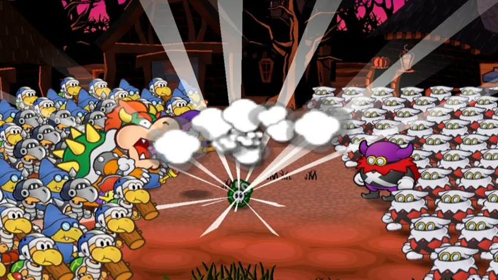

# Skills in Detail
{: .no_toc }

  

    Table of contents
  

  {: .text-delta }
- TOC
{:toc}

Typically, Skills have simple applications, and the outcome of any one check will depend on the Techniques used or the situation it's made in.

Sometimes though it's useful to have hard-and-fast rules for more complicated effects. The Skills suggested here should be considered the default, though depending on the situation, other Skills may be appropriate.

{: .content-callout }
> ## *Aim - Item Attacks*{: .heart-color }
> 
> Usually, using consumable Items is fairly straightforward; you take an action to use an Item's effect, and no check is required.  
> However, if you put in some extra effort, you can get a little more out of your Items.  
> Make an *Aim*{: .heart-color } check alongside your Item action. Each Grade of Success earns a point you can spend on any of the following bonus effects.
> Be warned that failing a check will use up the Item without providing any of its usual benefits. Worse still, any result lower than *Great!*{: .great-color } has a risk of backfiring as you throw caution into the wind! It's up to the GM exactly what that risk looks like or how likely it is.
> 
> - 1: This action is safe, and suffers no risk of backfiring. Has no effect on *Great*{: .great-color } or higher results.
> - 1: The Item adds +2 damage onto one of its Strikes; the Item must deal damage in order to choose this effect.
> - 1: Any damage dealt by this Item is Piercing.
> - 1: Add or remove an appropriate Element from this Items' effect.
> - 1: Increase either the Status Level or the duration of one of this Item's Statuses by 1.
> - 2: If this Item wouldn't normally deal damage, it deals 1 Piercing damage to all targets.
> - 2: Add an appropriate Status onto this Item's effect, starting at Status Level 1 and lasting for 3 turns.
> - 3: This Item affects additional targets. If it was a single-target Item, it can affect an entire group. If it was a group-target Item, it can affect all targets outside of the user's group.
> - 3: The Item isn't consumed during this action; it either remains usable or is in some fashion recoverable, though you may have to wait for a spare moment to retrieve it.
> 
> 
> {: .center-img }
> 
> {: .tip-callout }
> > *Aiming your Items may be risky without proper training, but sometimes that little bit of extra damage is worth the risk. Besides, it's satisfying to really nail a bad guy with whatever you can throw at them.* 
> > {: .icon-right }
>

{: .content-callout }
> ## *Athletics - Fleeing*{: .heart-color }
> 
> Sometimes you need to get away from a fight – but it's never easy to make a clean getaway.  
> Make an *Athletics*{: .heart-color } check; you need at least a Grade of Success for each combatant trying to stay on your tail or otherwise keep you in the fight. In most cases you need at least a *Great!*{: .great-color } result, though if you have allies keeping them at bay or some other support you might be able to get away with less.  
> Keep in mind that just getting away from a turn-based battle doesn't always mean you're in the clear; you might just be turning a fight scene into a chase scene!

{: .content-callout }
> ## *Coordination - Swapping*{: .heart-color }
> 
> In battle, you sometimes want – or need – to swap places with an ally. This takes an action for you to initiate, but the ally you swap places with doesn't need to take any action themselves.  
> Both you and your ally can make a *Coordination*{: .heart-color } check as part of your action; If *either of you*{: .underlined } earn a *Great!*{. great-color } result or better, you cadn treat this as a free action!

{: .content-callout }
> ## *Guard - Defending Actively*{: .heart-color }
> 
> During your turn, you may want to size up the foe and prepare to weather a storm of blows. The best option then is to spend an action to *Defend*{: .heart-color } yourself against future attacks.  
> You make a *Guard*{: .heart-color } check as an action. Until your next turn, your Defense is increased by +1 for each Grade of Success.  
> Since you're concentrating on defense, you even get to *[Guard as a reaction]({{ "/skills_in_detail#guard---guarding-reactively" | absolute_url }})*{: .heart-color } - reducing the damage even further! This means you can't *Defend*{: .heart-color } and *[Dodge]({{ "/skills_in_detail#trickery---dodging" | absolute_url }})*{: .spirit-color } at the same time, though. unless some other effect would let you both *Dodge*{: .spirit-color } and *Guard*{: .heart-color } as a reaction.  
> You don't have to make any more rolls for this *Guard*{: .heart-color } reaction; you instead use the same Grades of Success you earned for this check, as if you'd rolled them for your reaction.
>
> 
> {: .center-img }
>
> {: .tip-callout }
> > *Defending can seriously improve your Guards, making it easier to go for Superguards! This way you can turn the tables on your enemies instead of just weathering their hits. Sometimes it's better to let them come to you!* 
> > {: .icon-right }
>

{: .content-callout }
> ## *Guard - Guarding Reactively*{: .heart-color }
>
> In battle, you can use *Guard*{: .heart-color } to reduce damage from incoming attacks. At the end of the round, if any attacks are made that target you, you can react with *either*{: .underlined } a *Guard*{: .heart-color } check or a *[Dodge]({{ "/skills_in_detail#trickery---dodging" | absolute_url }})*{: .spirit-color } check.  
> For each Grade of Success, you can reduce the raw damage you would take this round (after applying Defense and Resist) by 1 point. If you're being target by multiple strikes, you can assign this damage reduction to any of them as you see fit.  
> By *Guarding*{: .heart-color } you can even ignore an attack's Status effects! When you reduce an attack's damage to 0 (or less), and you don't have any Weaknesses to consider, you can ignore its Status effects. Otherwise you may have to resist them with *[Steady]({{ "/skills_in_detail#steady---resisting-effects" | absolute_url }})*{: .courage-color }, even if your Defense nullified the damage.
>
> If you have a relevant Weakness, its effects are applied after you finish *Guarding*{: .heart-color } - even if you reduced the damage to 0.
>
> {: .example-callout}
> > *Example: Guarding Weaknesses*{: .header-font }
> >
> > A Piranha Plant is attacked by a Fire Bro's fireball, dealing 2 damage, and a Paragoomba's dive, dealing 1 damage.  
> > The Piranha Plant reacts by *Guarding*{: .heart-color } and gets a *Good*{: .good-color } result, allowing them to block 2 points of damage.  
> > The Piranha Plant can block the Fire Bro's initial attack completely, but they still have a Weakness to Fire, so they have to take an extra +2 damage from their Weakness, and then 1 more damage from the Paragoomba!
>
> With exceptional *Guarding*{: .heart-color }, though, you can turn the tables with a *Superguard*{: .heart-color }! If your *Guarding*{: .heart-color } would reduce a strike's damage below 0, it triggers a *Superguard*{: .heart-color } instead.  
> *Superguards*{: .heart-color } completely ignore all damage, Statuses, and other effects from an attack. They even ignore your own Weaknesses!  
> If the attacker struck you in melee, you interrupt their attack and deal 1 Piercing damage back at them. And if they attacked at range, you can reflect the strike's raw damage back at them!
> 
> {: .example-callout}
> > *Example: Superguard*{: .header-font }
> >
> > A Koopa is attacked by a Goomba's leaping headbonk (dealing 1 damage), and a Clubba's swing (dealing 3 damage).  
> > The Koopa has 1 Defense, and *Guards*{: .heart-color } as a reaction with a *Good*{: .good-color } result; in between their Defense and their *Guard*{: .heart-color } result they could block all damage, but they have a Weakness to Aerial attacks - they would still be flipped by the Goomba's headbonk, which would nullify their Defense against the Clubba's attack.  
> > Instead, the Koopa *Superguards*{: .heart-color } the Goomba's attack, using their Defense and one Grade of Success to reduce the damage below 0. This way they can stay standing, giving them 1 Defense and 1 Grade from their *Guard*{: .heart-color } result against the Clubba's attack.
> 
> 
> {: .center-img }
> 
> {: .tip-callout }
> > *When you're especially confident in your Guard checks, Superguarding lets you turn the tables! Sometimes it's actually more valuable than just Blocking or Dodging an attack, so be sure to consider your options!* 
> > {: .icon-right }
> 

{: .content-callout }
> ## *Heal - First Aid*{: .heart-color }
> 
> Restoring your health is usually very simple; most of the time getting some rest in a comfortable place is enough to fully restore *HP*{: .heart-color } and *FP*{: .spirit-color }, as well as recover from [Status]({{ "/statuses" | absolute_url }}) ailments.  
> But if you're under pressure and need to patch someone up right away, you can always try some *First Aid*{: .heart-color }  
> As an action, make a *Heal*{: .heart-color } check; each Grade of Success restores *2 HP*{: .heart-color } to the target and/or reduces a Status' duration by 1 turn.  
> If this would restore a KO'd target back to full health, they're revived on the spot!
>
> *First Aid*{: .heart-color } is only really useful as an initial response, so it gets a little harder each time you try; each time you carry out *First Aid*{: .heart-color } on a target, the required Grades of Success increase by 1. This penalty lasts until the target gets some proper rest.  
> If your *First Aid*{: .heart-color } attempt fails, you instead cause them to lose 1 HP for each Grade you failed by. Or worse, if you fail spectacularly.
>
> {: .example-callout}
> > *Example: Recovery*{: .header-font }
> >
> > After a tough fight, a Dayzee's ally is injured and still suffering from a poison for 4 more turns.  
> > The Dayzee makes a *Heal*{: .heart-color } check to administer First Aid, with a *Good*{: .spirit-color } result.  
> > They're able to restore *4 HP*{: .heart-color } and reduce the poison to 2 turns.  
> > In the time it takes to perform First Aid, their ally suffers from another turn of poison (reducing the duration to 1 turn) – the Dayzee makes another *Heal*{: .heart-color } check, but only gets a *Nice*{: .nice-color } result. Because they've already administered First Aid once, this isn't enough, and they end up hurting their ally instead.

{: .content-callout }
> ## *Heal - Administering Medicine*{: .heart-color }
>
> Usually, using consumable Items on yourself or an ally is faily straightforward; you take an action to use an Item's effect, and no check is required.  
> However, if you have the skills to back it up, you can get a little more out of your *Booster*{: .booster } or *Curative*{: .curative } Items.  
> Make a *Heal*{: .heart-color } check alongside your Item action. Each Grade of Success earns a point you can spend on any of the following bonus effects.  
> Be warned that failing a check will use up the Item without providing any of its usual benefits. Worse still, any result lower than *Great!*{: .great-color } has a risk of backfiring from your brazen actions! It's up to the GM exactly what that risk looks like, or how likely it is.  
> Note that *Heal*{: .heart-color } can't be used to improve Items consumed automatically, such as a Life Shroom.  
>
> - 1: This action is safe, and suffers no risk of backfiring. Has no effect on *Great!*{: .great-color} or higher results.
> - 1: Choose *HP*{: .heart-color } or *FP*{: .spirit-color }; if this Item didn't restore that before, it restores *+5 HP*{: .heart-color } or *+5 FP*{: .spirit-color} to each target.
> - 1: The Item adds one fifth of its base *HP*{: .heart-color } and *FP*{: .spirit-color } restoring effects onto each heal, including gradual effects (like a Slow Shroom or Gradual Syrup).
> - 1: You can share the use of this Item with another valid target, exactly as if the Item was used on them.
> - 1: This Item cures all targets of one Status of their choice.
> - 1: Increase the Status Level of one of this Item's Statuses, or the numerical effects of oen of this Item's Traits by +1.
> - 1: Increase the duration of one of this Item's Statuses or Traits by 1 turn.
> - 2: Add an appropriate Status onto this Item's effect, starting at Status Level 1 and lasting for 3 turns.
> - 2: This Item provides its targets with an appropriate Personal Trait, lasting for 3 turns. Its numerical values (e.g. damage resisted) begin at 1.
> - 3: This Item immediately revives any KO'd targets; if the Item doesn't heal *HP*{: .heart-color }, the targets are revived with *1 HP*{: .heart-color }.
> - 3: This Item isn't consumed duringn this action; you're able to use just enough of it to ensure you get the full effects while preserving enough for another dose.

{: .content-callout }
> ## *Crafts - Working from Scratch*{: .spirit-color }
> 
> *Crafts*{: .spirit-color } (and other appropriate Skills) can be used to develop usable products from raw materials, which may otherwise be useless.
> 
> First, choose an Item, Power-Up, Badge or Gear you want to make and have the materials for.
> 
> A *Nice*{: .nice-color } result is enough to make something with an equivalent value of 5 Coins; for each Grade of Success earned, you can double the value range of the Items you can make, as follows:
> 
> - *Nice!*{: .nice-color }: 5 Coins
> - *Good!*{: .good-color }: 10 Coins
> - *Great!*{: .great-color }: 20 Coins
> - *Wonderful!*{: .wonderful-color }: 40 Coins
> - *Excellent!*{: .excellent-color }: 80 Coins
> - *Unbelievable!*{: .unbelievable-color }: 160 Coins
> 
> Failure consumes all materials involved and produces a Mistake; a useless Item that may provide only a severely restricted form of the intended effect, or something much worse. Critical Failure is bound to create even worse Mistakes.
> 
> {: .example-callout}
> > *Example: Crafting Gear*{: .header-font }
> >
> > A Koopa smithy wants to smith a Super Hammer. Super Gear costs a whopping 400 Coins, so this is a tall order, but it's well worth the effort.  
> > They earn a *Wonderful*{: .wonderful-color } result, for an equivalent of 40 Coins; an impressive outcome but only a fifth of the way there.  
> > They try to push themselves to keep working, and earn a *Great*{: .great-color } result on the second check; this only adds on 10 Coins, for a total of 50.  
> > They decide to set the project aside before they make a Mistake, but take pride that their new Gear is 1/8 complete.
> 
> Once you've created something or otherwise know how it's made, it becomes easier to craft, with value starting from 10 Coins on a *Nice*{: .nice-color } result.  
> In any case, one attempt to *Craft*{: .spirit-color } can only produce one Item, Gear or Power-Up at a time, and can't produce enhanced or mixed Items.
> 
> Depending on the quality of the materials you use, you may be able to craft Items with less Grades of Success than normal; however, appropriate materials must always be sourced and used up.
> 
> As a general rule, when it comes to materials:
> 
> - [Items]({{ "/inventory#items" | absolute_url }}) can be made with common materials which can be sourced on the cheap in most settlements, costing no more than half the Item's value.
> - [Badges]({{ "/inventory#badges" | absolute_url }}) and [Gear]({{ "/inventory#gear" | absolute_url }}) require more valuable and rarer materials, which may take more work to find on the market, or require the crafter to seek them out in the field.
> - [Power-Ups]({{ "/inventory#power-ups" | absolute_url }}) require some form of magical charge, either taken from rare materials, or crafted with [*Magic*{: .spirit-color }]({{ "/skills_in_detail#magic---spontaneous-spells" | absolute_url }}) assistance (as a Skill Substitution or Skill Enhancement; if you have an ally assisting, you don't necessarily have to do the magic yourself).
> 
> If you don't achieve a high enough result, you can either settle for a similar product you could have made with the materials you used instead (such as settling for a Mushroom over a Super Mushroom), accept failure and make a Mistake, or take the time to make another check; each additional check made in this way takes more time, and successive checks without rest require a higher Grade of Success.
> 
> {: .tip-callout }
> > *Tracking down the materials for crafting can be an adventure in and of itself, taking you to far away places with all sorts of exotic goods.* 
> > {: .icon-right }

{: .content-callout }
> ## *Crafts - Enhancing and Mixing*{: .spirit-color }
> 
> In addition to creating things from scratch, *Crafts*{: .spirit-color } (and other appropriate Skills) can be used to enhance or combine consumable [Items]({{ "/inventory#items" | absolute_url }}).  
> For each Grade of Success, you can choose one of the following effects to apply to the new Item:
> 
> - Consume another Item, adding *all*{: .underlined } of its effects (*HP*{: .heart-color }, *FP*{: .spirit-color }, gradual recovery, damage, Status, etc.) to the new Item, using the first Item's targets.  
> *No matter what*{: .underlined }, you can't combine more than two Items at once.
> - Increase an existing *HP*{: .heart-color } and/or *FP*{: .spirit-color } recovery effect by 2.
> - Increase the Item's damage by 1 (if it would deal damage).
> - Add an Element or replace an existing Element, changing the type of damage dealt.
> - Add a Status, or increase an existing Status Level by 1.  
> New Statuses have the same duration as the original Item's Statuses (if applicable), lasting up to a minimum of 1 turn.
> - Increase the duration of all the Item's Statuses and other effects by 1 turn.  
> 
> Failure instead consumes all Items involved and produces a Mistake; a useless Item that may provide only a severely restricted form of the intended effect, or something much worse. Critical Failure is bound to create even worse Mistakes.
> 
> 
> {: .center-img }
> 
> {: .tip-callout }
> > *Cooking can be a costly exercise, but well worth it! Stronger attacks, better healing, and simply condensing multiple Items into one Inventory slot are all good reasons to top up when you're in town.* 
> > {: .icon-right }
> 
> Once you've created an Item or otherwise know its recipe, it becomes easier to make it again, requiring half as many Grades of Success (to a minimum of *Nice*{: .nice-color }).  
> However, you have to use the same method when following a recipe – a chef sweetening an Ice Storm to make an Icicle Pop is very different to an alchemist strengthening it to make a Blizzard Storm, for instance.
> 
> Treat the new Item's Coin value as equivalent to ½ of its component Items' values, +5 more Coins for each Grade of Success required to make it (not accounting for the halved Grades of a known recipe).
> 
> Including a previously enhanced or mixed Item in your crafting adds one more Grade of Success to the recipe's difficulty *for each time an ingredient was previously enhanced or mixed*{: .underlined }, as it becomes a more volatile ingredient.
> 
> {: .example-callout}
> > *Example: Mixing Items*{: .header-font }
> >
> > A Dayzee wants to combine some delicious Honey Syrup with their own special recipe, a Fried Sparkshroom (combining a Super Shroom and a Volt Shroom). They make a Crafts roll, and earn a *Good*{: .good-result } result.  
> > Since the Fried Sparkshroom was previously mixed together, they need one more Grade of Success to go ahead with this recipe.  
> > They have just enough Grades to finish off the recipe, slathering the mushroom to make a Glazed Sparkshroom, which restores 10 HP, 5 FP and bestows the same Contact Trait as a Volt Shroom.  
> > If they wanted to sell this invention, it would have an equivalent value of 27 Coins (15 from the Fried Sparkshroom, 2 from the Honey Syrup and 10 from their *Good*{: .good-result } result).
> >
> 
> 
> {: .center-img }
> 
> {: .tip-callout }
> > *Just be careful you don't take things too far. You wouldn't want that powerful Superbombomb you've been working on to backfire once you take it into the field, would you?* 
> > {: .icon-right }
> > 
>

{: .content-callout }
> ## *Knowhow - Tattling on Foes*{: .spirit-color }
>
> Characters with *Knowhow*{: .spirit-color } are savvy individuals, and usually know a thing or two about their enemies - though it might take them some time to recall, or they might need to check their notes.  
> By making a *Knowhow*{: .spirit-color } check as an action, you can figure out some of the qualities of a place, character, or hazard. Where appropriate you may be able to use other skills to Tattle, such as *Notice*{: .spirit-color } or *Persuade*{: .courage-color }, but the type of information you can learn may depend on the skill you used.  
> You can divide your Grades of Success up between multiple targets. For each target, you learn information based on the total Grades of Success assigned, as well as any information you could have with less Grades.  
> No matter how many targets you Tattle on, if you only allocate *Great!*{: .great-color } results or better you can treat this as a free action!
>
> - *Nice!*{: .nice-color }: You know general information about things similar to the target, but not the target specifically. You can at best determine a couple fun facts and their current and maximum *HP*{: .heart-color }, and can easily track their current *HP*{: .heart-color } going forwards.
> - *Good!*{: .good-color }: You know a little about the specific target, including some of their main methods of attack, their Defense and any general danger they may pose.
> - *Great!*{: .great-color }: You know specialised information about the target, including their Immunities, Resistances or Weaknesses, and usually some juicy gossip.
> - *Wonderful!*{: .wonderful-color }: You know just about all that you could reasonably determine about the target, including all of their attacks, common strategies, and equiment available to them - or that you might be able to take from them!
> - *Excellent!*{: .excellent-color }: You can glean all sorts of useful information about the target, including the sorts of details only an expert could know!

{: .content-callout }
> ## *Magic - Spontaneous Spells*{: .spirit-color }
> 
> *Magic*{: .spirit-color }'s most powerful quality is its versatility – the ability to do *anything!*{: .underlined }  
> These rules apply whenever you would cast a spell that's not already a key part of your repertoire, like a Technique, representing the challenging art of spontaneous casting.
> 
> Whatever kind of spell you cast, you choose beforehand how much of your *Magic*{: .spirit-color } dicepool to use and *Spirit*{: .spirit-color } to "unlock"; this includes dice you receive from your Skill and your relevant Specialisations.  
> Note though you don't have to pay or unlock situational or temprary bonuses, like the aid you'd get from someone's assistance, a *Boost*{: .booster } Status, or the extra *Spirit*{: .spirit-color } you get from a Spirit Plus Badge.  
> 
> - To unlock up to 1 of your *Magic*{: .spirit-color } dice and up to 2 of your *Spirit*{: .spirit-color } points, pay *3 FP*{: .spirit-color } at a time.  
> - If you have a relevant Specialisation, you pay *2 FP*{: .spirit-color } at a time instead.  
> - If you have a relevant Efficient trait, you only pay *1 FP*{: .spirit-color } at a time.  
> - If this spell would be restricted by one or more Devotion Traits, you pay twice as much *FP*{: .spirit-color } overall.
> - No matter the circumstances, you *always*{: .underlined } pay at least as much *FP*{: .spirit-color } as one d6 or point of *Spirit*{: .spirit-color } would cost.  
>
> Then just like a normal check, roll your dicepool, and nudge it along with your unlocked *Spirit*{: .spirit-color }.
> Keep in mind though that *no matter what*{: .underlined }, *Magic*{: .spirit-color } spells can't be used to gain or bestow *FP*{: .spirit-color } or *SP*{: .courage-color } (besides the *SP*{: .courage-color } you'd earn from an [Exceptional Result]({{ "/grades_of_success#exceptional-results" | absolute_url }})).
> 
> - *Skill Substitution*{: .header-font }  
  *Magic*{: .spirit-color } can be used to emulate other skills, such as *Athletics*{: .heart-color }, *Notice*{: .spirit-color } or *Bully*{: .courage-color }, by making a *Magic*{: .spirit-color } check instead – completely replacing the check you'd make with your *Magic*{: .spirit-color } pool. Since this is a magical effect it can even offset the penalties you'd normally have to endure!
>
> {: .example-callout}
> > *Example: Substituted Skills*{: .header-font }
> >
> > A Cleft witch finds themselves stranded on a river bank while their Koopa companion swims across. They have no *Athletics*{: .heart-color } to speak of, and their dense stone body isn't great at swimming, but they do have *3 Magic*{: .spirit-color } and a specialisation in Terraforming.  
> > Instead of swimming across, they conjure a stone bridge to walk across - paying *8 FP*{: .spirit-color } to use all four *Magic*{: .spirit-color } dice at their disposal. Better still, if any of their other al0lies needed a ride, they could walk across the bridge too!
>
> - *Skill Enhancement*{: .header-font }  
  When an ally makes a non-Magic check, you can enhance it with *Magic*{: .spirit-color }. You can even enhance your own checks, if it's something you're already skilled in. This works as if you simultaneously made the check with your action, and were assisted by yourself using your *Magic*{: .spirit-color } as a free action. You pay *FP*{: .spirit-color } to unlock your *Magic*{: .spirit-color } and *Spirit*{: .spirit-color } as normal, then add half of that dicepool (to a minimum of 0) and up to your unlocked *Spirit*{: .spirit-color } onto the main Skill check.
> 
> {: .example-callout}
> > *Example: Enhanced Skills*{: .header-font }
> >
> > A Koopa sorcerer comes under attack! While they have *2 Heart*{: .heart-color } and *1 Guard*{: .heart-color }, they're much better at spellcasting, with *3 Spirit*{: .spirit-color } and *2 Magic*{: .spirit-color }.  
> > They can pay *6 FP*{: .spirit-color } to use their two *Magic*{: .spirit-color } dice; as they're assisting themselves, they add half of that onto their main *Guard*{: .heart-color } dicepool, for +1d6 and a total of 2d6.  
> > The dice come up 1 and 2; since they can use both their *Heart*{: .heart-color } and their *Spirit*{: .spirit-color }, this is enough to boost both dice to 4's for a *Good*{: .good-color } result! Their tough shell is bolstered with a glyph of warding.
> >
> 
> - *Enchantments*{: .header-font }  
  *Magic*{: .spirit-color } can be used to temporarily enchant targets with [Personal Traits]({{ "/personal_traits" | absolute_url }}), such as Fly, Invisibility or Mimicry.  
  Make a *Magic*{: .spirit-color } check and choose a Personal Trait; if you succeed, the target receives the chosen Trait, lasting a number of turns equal to your *Magic*{: .spirit-color } dicepool or *Spirit*{: .spirit-color } statpool (whichever's higher).  
  Numerical values of the Trait (e.g. Resist, Contact damage, Status Level) are all set to 1, even if they would normally be higher.  
  For each Grade of Success you earn, you can choose one:
>   
>   - The Enchantment lasts for one more turn.
>   - The Enchantment includes another Trait.
>   - A numerical value of one of the Traits increases by +1.
>   - One of the Traits includes one more element (if applicable).
>   - The Enchantment affects one more valid target.
> 
> If the target already has a Trait they would receive from this enchantment, the enchantment temporarily overrides their Trait; this can be used to substitute existing Immunities and Resistances.
> 
> You have to specify any particulars of the Trait, such as the elements affected or the exact Contact effect, when you cast the enchantment; these effects should be based on existing Personal Traits, with the GM having final say on what's possible.
> 
> Any *FP*{: .spirit-color } costs associated with the Trait cost *double FP*{: .spirit-color }; however, you can substitute that with whatever *FP*{: .spirit-color } you spent casting the enchantment, for as long as the enchantment lasts.  
> As an added bonus, any action taken or checks made to initiate the Trait (such as starting to fly or transforming with Mimicry) use the action and *Magic*{: .spirit-color } check of the enchantment instead. Trying to take these actions after being enchanted requires the target roll as normal, though.
> 
> {: .example-callout}
> > *Example: Enchanting Traits*{: .header-font }
> >
> > A Goomba enchanter with 3 *Magic*{: .spirit-color } and 3 *Spirit*{: .spirit-color } is sneaking along behind their Boo ally; their friend is able to fly and turn invisible, and not wanting to get left behind, the Goomba decides they should too.  
> > They decide to be conservative and pay *6 FP*{: .spirit-color } for two of their *Magic*{: .spirit-color } dice.  
> > They get a *Good*{: .good-color } result, and choose to give themselves the Invisibility Trait; they also add in the Fly Trait. Since their *Spirit*{: .spirit-color } is currently higher than their *Magic*{: .spirit-color } dicepool, both Traits end up lasting for a total of 3 turns. They immediately turn invisible and start flying.  
> > Ordinarily it would cost *2 FP*{: .spirit-color } to turn invisible for a turn, and *2 FP*{: .spirit-color } for each turn after that; but because they've already spent *6 FP*{: .spirit-color }, they're already covered for as long as the enchantment lasts!
> > 
> 
> - *Curses*{: .header-font }  
  Similarly, *Magic*{: .spirit-color } can be used to temporarily neutralise the target's qualities and other Personal Traits.  
  Make a *Magic*{: .spirit-color } check and choose a quality the target has (e.g. a Personal Trait, a Status delivered by their attack, or an elemental affinity of their attack); if you succeed, the target suffers a Curse as if it was a Status, temporarily neutralising their ability to use that quality in some fashion. They can recover as normal, such as with [Items]({{ "/inventory#items" | absolute_url }}) or [*Steady*{: .courage-color }]({{ "/skills_in_detail#steady---resisting-effects" | absolute_url }}), and players can make a *Steady*{: .courage-color } check to resist as a reaction, just like any other Status.  
  The Curse lasts a number of turns equal to your *Magic*{: .spirit-color } dicepool or *Spirit*{: .spirit-color } statpool (whichever's higher).  
  For each Grade of Success you earn, you can choose one:
>   - The Curse lasts for one more turn.
>   - The Curse includes another quality.
>   - The Curse affects one more valid target.
> 
> {: .example-callout}
> > *Example: A Curse on Ye*{: .header-font }
> >
> > A Squeek wizard, with *3 Magic*{: .spirit-color } and *3 Spirit*{: .spirit-color } is beset on all sides by a storm of 4 Paratroopas – and their allies are firmly set on the ground.  
> > They attempt to bring the enemy down to earth, spending *8 FP*{: .spirit-color } to use their full 4 dice from *3 Magic*{: .spirit-color } and a Specialisation in Curses, earning a *Great!*{: .great-color } result.  
> > They choose to remove the Paratroopas' ability to fly, equivalent to the Fly Trait. With their Grades of Success, they're able to ground each of their enemies. Since their *Magic*{: .spirit-color } dicepool of 4 is higher than their *Spirit*{: .spirit-color } of 3, the effect lasts for a total of 4 turns.
> >
>  
> 
> {: .center-img }
> 
> {: .tip-callout }
> > *Curses come in many forms, but usually, they're a horrible time. There's not much you can do besides tough it out.* 
> > {: .icon-right }
> >
> 
> - *Technique Spells*{: .header-font }  
  *Magic*{: .spirit-color } can even be used to improvise Techniques on the fly! Instead of making any Technique checks, you make one *Magic*{: .spirit-color } check to conjure up an effect; as long as you succeed, this Technique begins with 1 Grade of Success in any of its Primary or Secondary checks, 1 Power (regardless of your own), and an effective *FP cost*{: .spirit-color } of 0.  
  For each Grade of Success you earn, you can choose one:
>   - Add *3 FP*{: .spirit-color } to the final Technique's effective cost.
>   - Add a Grade of Success to the outcome of the Technique's Primary and/or Secondary Checks.
>   - Add +1 Power.
> 
> You can select up to your dicepool or *Spirit*{: .spirit-color } pool (whichever's higher) in positive Traits, and the same amount again in negative Traits, as long as the *FP cost*{: .spirit-color } for the combined Traits doesn't exceed the effective cost.  
>
> As this isn't an Innate Technique, and you're not directly attacking, it works a bit differently to a normal attack.  
> None of your own Tech Defaults are included in the Technique, you don't include your Attack modifier, and you can't benefit from *[Exceptional Techniques]({{ "/exceptional_techniques" | absolute_url }})*{: .courage-color }.  
> You can however add *Indirect*{: .positive-color }, *Ranged*{: .positive-color }, and/or *Harmless*{: .negative-color } as Tech Defaults for no additional cost; this is simply the nature of *Magic*{: .spirit-color }.
> 
> {: .example-callout}
> > *Example: Improvised Spells*{: .header-font }
> >
> > A Dayzee witch with *3 Magic*{: .spirit-color } and *5 Spirit*{: .spirit-color } wants to cast a hex on their enemies, but doesn't have the right Techniques for the job. Instead, they improvise.  
> > They spend *8 FP*{: .spirit-color } to use their full 4 dice from *3 Magic*{: .spirit-color } with a Specialisation in Hexes, and earn a *Great!*{: .great-color } result.  
> > They can add up to 4 positive Traits, and up to 4 negative Traits. They want the hex to stop all their enemies in their tracks, so they add *Group*{: .positive-color }, *Lengthen*{: .positive-color } and *Daze x3*{: .positive-color }, giving the hex an effective cost of *8 FP*{: .spirit-color }.  
> > They don't need it to deal any damage though, and they're sure it will work without a hitch; so they give it the negative Traits *Harmless*{: .negative-color } and *Commitment*{: .negative-color }, reducing the effective cost to just *3 FP*{: .spirit-color }.  
> > Finally, they take their 3 Grades of Success; 1 is spent increasing the *FP*{: .spirit-color } pool for the Technique to *3*{: .spirit-color }, which is enough to pay the effective cost. The last 2 are spent to give the Technique a *Great!*{: .great-color } Grade of Success.  
> > The end result is a Technique that Dazes (3) their enemies. Since their *Spirit*{: .spirit-color } statpool of 5 is higher than their *Magic*{: .spirit-color } dicepool of 4, the Status lasts for a total of 5 turns, giving them plenty of time to act.
> >
>

{: .content-callout }
> ## *Trickery - Dodging*{: .spirit-color }
> 
> In battle, you can use *Trickery*{: .spirit-color } to completely side-step attacks.  
> If you attempt to *Dodge*{: .spirit-color }, you can't also *Guard*{: .heart-color } against attacks in the same round, unless an [Item]({{ "/inventory#items" | absolute_url }}) or other effect would specifically allow it.  
> A *Great!*{: .great-color } result allows you to dodge *all*{: .underlined } attacks from one target. For each additional Grade of Success, you can dodge attacks from another target.
> 
> {: .example-callout}
> > *Example: Dodging*{: .header-font }
> >
> > A Squeek is attacked by a gang of three Hammer Bros! They can't handle their powerful hammer throws, and decide to *Dodge*{: .spirit-color } instead.  
> > They make a *Trickery*{: .spirit-color } check and earn a *Wonderful!*{: .wonderful-color } result. They're able to completely dodge the attacks of the first two Hammer Bros, but have to take the last Hammer Bro's attacks head-on.
> >
> 
> 
> {: .center-img }
> 
> {: .tip-callout }
> > *You don't need to Dodge attacks if you can prevent them! Invisibility effects and Secure Techniques are great for getting around attacks, if used carefully. And if you can avoid a fight in the first place, even better!* 
> > {: .icon-right }
>

{: .content-callout }
> ## *Cheer - Cheering People On*{: .courage-color }
> 
> *Cheer*{: .courage-color } can be used when [Rolling With Your Friends]({{ "/how_to_play#rolling-with-your-friends" | absolute_url }}) - as long as you can provide support without being a nuisance (like loudly cheering someone trying to sneak around with *Trickery*{: .spirit-color }). When you assist someone else's action, you can substitute *Cheer*{: .courage-color } for any other skill.  
> As usual, you don't make any check; your ally instead receives extra dice equal to half the dice you'd have to *Cheer*{: .courage-color } them on.  
> Importantly, cheering them on like this is less effective than normal support - when you assist someone with *Cheer*{: .courage-color } they don't receive any of your *Courage*{: .courage-color } to nudge results.

{: .content-callout }
> ## *Cheer - Motivating Energy*{: .courage-color }
>
> You can use *Cheer*{: .courage-color } as an action to replenish an ally's *FP*{: .spirit-color } or *SP*{: .courage-color }.  
> Choose *FP*{: .spirit-color } or *SP*{: .courage-color } - if you succeed the target restores +2 points, and an extra +2 for every additional Grade of Success you achieve. Keep in mind though that if you restore any *SP*{: .courage-color } during this check, you can't get any more *SP*{: .courage-color } from Exceptional Results.  
> Repetitive cheering gets to be a bore, with each follow-up check requiring a higher Grade of Success. After you get some rest, or the session ends, the difficulty reverts back to normal.

{: .content-callout }
> ## *Perform - Appeals*{: .courage-color }
> 
> The Stars watch over everything, like an audience watching the stage. Heroes, villains and all creatures in between can count on their favour if they play to the crowd. Whether it's through prayer, focus or showboating, the Stars reward you for great showmanship.  
> Make a *Perform*{: .courage-color } check; you don't receive any extra *SP*{: .courage-color } for [Exceptional Successes]({{ "/grades_of_success#exceptional-results" | absolute_url }}), but if you succeed you receive *2 SP*{: .courage-color }, plus an extra *+2 SP*{: .courage-color } per additional Grade of Success.  
> Repetitive Appeals get to be a bore, with each follow-up check requiring a higher Grade of Success. After you get some rest, or the session ends, the difficulty reverts back to normal.
> 
> 
> {: .center-img }
> 
> {: .tip-callout }
> > *All the world's a stage, so smile for the crowd! SP is always useful to have, so it can be worth investing in your appeals. You can even appeal outside of battle to prepare for the future!* 
> > {: .icon-right }
> >
>

{: .content-callout }
> ## *Perform - Stylish Moves*{: .courage-color }
> 
> Stylish Moves are risky gambits and fancy flourishes for little to no gain – but the crowd goes wild when you nail them, and the Stars reward such great showmanship.  
> When making a Stylish Move, once per round you can use *Perform*{: .courage-color } in place of your ordinary check – this can be any kind of check, as long as it doesn't normally use *Perform*{: .courage-color }. You can even make a Stylish Move when using *Magic*{: .spirit-color }, though you still pay *FP*{: .spirit-color } as normal.  
> Bear in mind though that if you commit to a Stylish Move, you can't spend the *SP*{: .courage-color } you would gain on [Exceptional Techniques]({{ "/exceptional_techniques" | absolute_url }}); the thrill of the spotlight is its own reward!
>
> Your effective *Perform*{: .courage-color } Skill is limited by your value in the Skill being substituted, including any of its relevant Specialisations.  
> Any extra dice you'd receive for *Perform*{: .courage-color }, such as from your Badges or your *Perform*{: .courage-color } Specialisations, is added on after your *Perform*{: .courage-color } is limited.
> 
> Nailing a Stylish Move is harder than usual, requiring one more Grade of Success than usual.  
> If you succeed you earn *2 SP*{: .courage-color } on the spot, and *double the SP*{: .courage-color } you would have received from an Exceptional Result!
> 
> {: .example-callout}
> > *Example: Stylish Moves*{: .header-font }
> >
> > A Dayzee with *1 Coordination*{: .heart-color } and *3 Perform*{: .courage-color } makes a flashy melee attack.  
> > Since their *Perform*{: .courage-color } is higher than their *Coordination*{: .heart-color }, they can only use 1 of their Perform dice, but can add +1d6 for their Perform Specialisation in Stylish Moves, and have access to their full *3 Courage*{: .courage-color }.  
> > Ordinarily they'd need a *Nice*{: .nice-color } result to deal their full damage, but due to the difficulty of a Stylish Move, they need a *Good*{: .good-color } result instead.  
> > They earn a *Wonderful*{: .wonderful-color } result, much more than they needed!  
> > In addition to the effects of their attack, they earn *2 SP*{: .courage-color } for pulling off their Stylish Move, and *double the SP*{: .courage-color } they'd normally get from a *Wonderful*{: .wonderful-color } result – another *4 SP*{: .courage-color }, for a total of *6*{: .courage-color }.
> >
> 

{: .content-callout }
> ## *Steady - Resisting Effects*{: .courage-color }
> 
> Whether you're affected by a Status or resisting some other effect, *Steady*{: .courage-color } allows you to grit your teeth and bear it.
> 
> You can resist with *Steady*{: .courage-color } as a reaction the first time you're affected by a Status, with your result affecting that Status alone.  
> For each Grade of Success, reduce its Status Level and duration by 1 – Status Level can't be reduced lower than 1, but duration can be dropped to 0, negating the status!
> 
> As an action you can attempt to remedy as many of your active Statuses as you want, affecting them all at the same time.  
> If your *Steady*{: .courage-color } check manages to lower all your negative Status' durations to 0, any excess Grades of Success instead make this check into a free action.
> 
> {: .example-callout}
> > *Example: Steadying Yourself*{: .header-font }
> >
> > A Squeek is bitten by a particularly deadly variety of Piranha Plant, which normally afflicts its prey with Lingering (5) for 5 turns.  
> > When the Squeek is bitten, they get to make a *Steady*{: .courage-color } check as a reaction, and achieve a *Good*{: .good-color } result – reducing it to Lingering (3) for 3 turns. At the end of the round, they take 3 damage, and the poison downgrades to Lingering (2) for 2 turns.  
> > On their turn, the Squeek tries to get the poison under control. They take an action to *Steady*{: .courage-color } themselves, and achieve a *Great*{: .great-color } result. They're able to reduce the duration down to 0 turns and negate the Status entirely. In fact, they have a spare Grade of Success, allowing them to make this into a free action!
> >
> 
> 
> {: .center-img }
> 
> {: .tip-callout }
> > *Don't neglect your Steady, brave warriors! It's tempting to focus on your combat skills, but Steady is the only way to avoid a lot of Statuses. You can always make up for the experience you invest into Courage with more powerful Badges, and you'll get to look cool in the face of pressure like a zen warrior!* 
> > {: .icon-right }
> >
> 