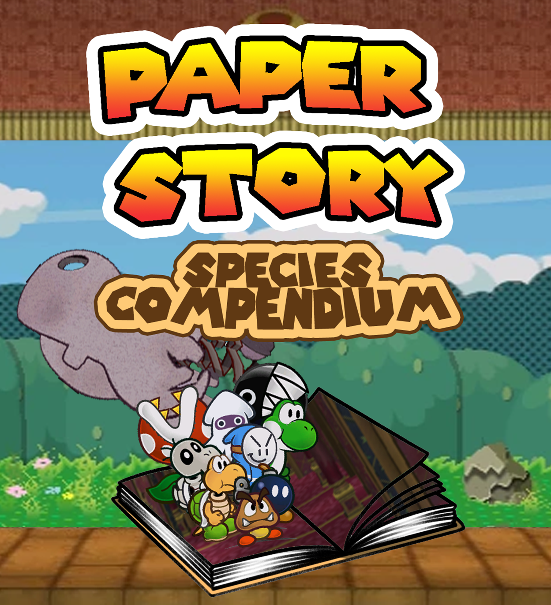
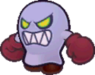

# Species Compendium
{: .no_toc }

  

    Table of contents
  

  {: .text-delta }
- TOC
{:toc}

While all the Species of the Mushroom Kingdom are wildly different, their advantages are roughly alike. A playable Species in Paper Story looks something like this: 

{: .specie-callout }
> ## Species Name
> {: .no_toc }
>
> 
> {: .float-right-desktop }
> A description of the Species and how they fit into the world. These descriptions are simple and general, and do not define individual members of their Species.
>
> *Stat Modifiers*{: .text-gamma .header-font }  
> *Base Power & Defense*{: .text-gamma .header-font }  
>
> {: .specie-pros-callout }
> > *Pros*{: .text-gamma .header-font }  
> > The Skill Specialisations and other Traits that make denizens of that Species more capable.  
*Some Traits, like Immune, will be described in more detail like this.*{: .mgl .fs-3 }
>
> {: .specie-cons-callout }
> > *Cons*{: .text-gamma .header-font }  
> > The Traits that a character of that Species have to deal with that are generally less desirable.  
*Some Traits, like Weakness, will be described in more detail like this.*{: .mgl .fs-3 }
>
> {: .specie-inner-callout }
> > *Other Traits*{: .text-gamma .header-font }  
> > Any other qualities the species has that may not fit neatly into a Pro or a Con go here in one large block underneath Pros and Cons.  
> > Most often this is for Species with a State Trait, which grants them contextual bonuses/penalties.
>
> {: .specie-inner-callout }
> > *Tech Defaults*{: .text-gamma .header-font }  
> > Sets of Technique Traits a character of that Species can include when they start designing a Technique, without affecting its cost.  
> > Multiple instances of a Trait are listed as "Trait x2", "Trait x3", and so on.  
> > Each Technique can only benefit from one set of Tech Defaults without affecting its cost at a time.  
> > Each set of Tech Defaults is set apart by colour and by line.Each Trait in a set is set apart by commas.  
> >
> > Example Tech 1  
> > *Example Tech 2, 2nd part of Tech 2*{: .alt-grey-line }  
> > Example Tech 3
> >
> > Any *Required*{: .underlined } or *Optional*{: .underlined } effects are listed underneath, and can (or must) be taken in addition to Tech Defaults.
>
> {: .specie-inverted-callout }
> > *Example Techniques*{: .text-gamma .header-font .text-grey-lt-000 }  
> > *An example of a Technique a character of this Species might use, assuming they have 1 Power and not accounting for their level limit on negative Traits.*{: .text-grey-lt-000 }  
> > *Includes potential outcomes and skills required for Primary and Secondary checks.*{: .text-grey-lt-000 }
> >
> > {: .specie-inner-callout }  
> > > *Example*{: .header-font } (**X FP**{: .spirit-color })  
> > > Primary Check  
> > > Secondary Check  
> > > Includes potential outcomes and skills required for Primary and Secondary checks.  
> > > *The traits used to make this Technique are shown here*{: .italic }
> > >
> >
> > {: .specie-inner-callout }  
> > > *Example*{: .header-font } (**X FP**{: .spirit-color })  
> > > Primary Check  
> > > Secondary Check  
> > > Includes potential outcomes and skills required for Primary and Secondary checks.  
> > > *The traits used to make this Technique are shown here*{: .italic }
> > >
> >
>

{: .center-img }

{: .specie-callout }
> ## Bandit  
>
> 
> {: .float-right-desktop }
> While not every Bandit is a thief, they have their name for a reason. Bandits tend towards more direct petty thievery, cons and trickery. A Bandit is more likely to smash-and-grab than to skulk around.
>
> ***+1 Heart**{: .heart-color }, **+1 Spirit**{: .spirit-color }*{: .text-gamma .header-font }  
> *1 Power, 0 Defense*{: .text-gamma .header-font }  
>
> {: .specie-pros-callout }
> > *Pros*{: .text-gamma .header-font }  
> > *+ Athletics (Run)*{: .heart-color }  
> > *+ Notice (Tricks)*{: .spirit-color }  
> > *+ Trickery (Theft)*{: .spirit-color }
>
> {: .specie-cons-callout }
> > *Cons*{: .text-gamma .header-font }  
> > N/A
>
> {: .specie-inner-callout }
> > *Tech Defaults*{: .text-gamma .header-font }  
> > 
> > Disarm x2  
> > *Snatch*{: .alt-grey-line }  
> > Overrun  
> > *Variant (**Trickery**{: .spirit-color })*{: .alt-grey-line }  
> >
>
> {: .specie-inverted-callout }
> > *Example Techniques*{: .text-gamma .header-font .text-grey-lt-000 }  
> >
> > {: .specie-inner-callout }  
> > > *Barging Theft*{: .header-font } (**0 FP**{: .spirit-color })  
> > > Slams the enemy and steals one of their Tools, Disarming them.  
> > > *Coordination*{: .heart-color }:  
> > > *Nice!*{: .nice-color }: 1 DMG  
> > > *Good!*{: .good-color }: 2 DMG  
> > > *Trickery (+ Theft)*{: .spirit-color}:  
> > > *Nice!*{: .nice-color }: Disarm Tool (1) for 4 turns  
> > > *Good!*{: .good-color }: Disarm Tool (2) for 4 turns  
> > > *Great!*{: .great-color }: Disarm Tool (3) for 4 turns  
> > > *Wonderful!*{: .wonderful-color }: Disarm Tool (4) for 4 turns  
> > > *Disarm (Tool) x4, Unwieldy*{: .italic }
> > >
> >
> > {: .specie-inner-callout }  
> > > *Cunning Poison*{: .header-font } (**4 FP**{: .spirit-color })  
> > > Sneakily delivers a poison attack, dealing Lingering damage for 5 turns.
> > > *Trickery*{: .spirit-color }:
> > > *Nice!*{: .nice-color }: Lingering (2) for 5 turns  
> > > *Good!*{: .good-color }: Lingering (3) for 5 turns  
> > > *Great!*{: .great-color }: Lingering (4) for 5 turns  
> > > *Wonderful!*{: .wonderful-color }: Lingering (5) for 5 turns  
> > > *Variant (**Trickery**{: .spirit-color }), Empower, Lingering x5, Harmless*{: .italic }
> > >
> >
>

{: .specie-callout }
> ## Beanish  
>
> 
> {: .float-right-desktop }
> Hailing from the Beanbean Kingdom, Beanish are a rare sight abroad. Their quick wits and good humour make them reliable and likable allies. On the other hand, they tend to be more self-centred than their mushroom neighbours, and they count a few rogues among their number.
>
> ***+2 Spirit**{: .spirit-color } or **+1 Spirit**{: .spirit-color }, **+1 Courage**{: .courage-color }*{: .text-gamma .header-font }  
> *1 Power, 0 Defense*{: .text-gamma .header-font }  
>
> {: .specie-pros-callout }
> > *Pros*{: .text-gamma .header-font }  
> > *+ Craft (Beans)*{: .spirit-color }  
> > *+ Knowhow (Any)*{: .spirit-color }  
> > *+ Cheer (Comedy)*{: .courage-color }
>
> {: .specie-cons-callout }
> > *Cons*{: .text-gamma .header-font }  
> > N/A
>
> {: .specie-inner-callout }
> > *Tech Defaults*{: .text-gamma .header-font }  
> >
> > Boost (Any)  
> > *Flowery*{: .alt-grey-line }  
> > Shared  
> > *Tool*{: .alt-grey-line }  
> >
> > *Optional*{: .underlined }: Split on Flowery Techniques
>
> {: .specie-inverted-callout }
> > *Example Techniques*{: .text-gamma .header-font .text-grey-lt-000 }  
> > *An example of a Technique a character of this Species might use, assuming they have 1 Power and not accounting for their level limit on negative Traits.*{: .text-grey-lt-000 }  
> > *Includes potential outcomes and skills required for Primary and Secondary checks.*{: .text-grey-lt-000 }
> >
> > {: .specie-inner-callout }  
> > > *Chuckle Charge*{: .header-font } (**0 FP**{: .spirit-color })  
> > > Distractedly rams the enemy while laughing. Invigorates the user to restore *FP*{: .spirit-color }.  
> > > *Coordination*{: .heart-color }:  
> > > *Nice!*{: .nice-color }: 1 DMG  
> > > *Good!*{: .good-color }: 2 DMG  
> > > *Cheer (+ Comedy)*{: .courage-color }:  
> > > *Nice!*{: .nice-color }: *+1 FP*{: .spirit-color }  
> > > *Good!*{: .good-color }: *+2 FP*{: .spirit-color }  
> > > *Flowery x2, Split, Unwieldy*{: .italic }
> > >
> >
> > {: .specie-inner-callout }  
> > > *Laugh It Off*{: .header-font } (**4 FP**{: .spirit-color })  
> > > Cracks a joke about the enemy, helping to boost morale for the user and their allies. 
> > > *Cheer (+ Comedy)*{: .courage-color }:  
> > > *Good!*{: .good-color }: +1 Attack and +1 Defense for 3 turns  
> > > *Great!*{: .great-color }: +2 Attack and +2 Defense for 3 turns  
> > > *Boost (Attack) x2, Allies, Boost (Defense) x2, Lengthen, Harmless (Indirect), Unwieldy*{: .italic }
> > >
> >
>

{: .specie-callout }
> ## Birdo
>
> 
> {: .float-right-desktop }
> Birdos are strange dinosaurs from distant lands with the ability to shoot eggs – and other objects – from their snout. Brawny and quick-witted, these excitable creatures excel wherever they're found.
>
> ***+1 Heart**{: .heart-color }, **+1 Spirit**{: .spirit-color }*{: .text-gamma .header-font }  
> *1 Power, 0 Defense*{: .text-gamma .header-font }  
>
> {: .specie-pros-callout }
> > *Pros*{: .text-gamma .header-font }  
> > *+ Aim (Shoot)*{: .heart-color }  
> > *+ Athletics (Brawn)*{: .heart-color }  
> > *+ Notice (Scent)*{: .spirit-color }  
> > Immune (Charm)  
> > Carrier
>
> {: .specie-cons-callout }
> > *Cons*{: .text-gamma .header-font }  
> > Weakness (Scent)  
> > *The Level and Duration of all Statuses you suffer from scent-based sources are doubled.*{: .mgl .fs-3 }
>
> {: .specie-inner-callout }
> > *Tech Defaults*{: .text-gamma .header-font }  
> >
> > Ranged  
> > *Launch*{: .alt-grey-line }  
> > Provoke x2  
> > *Throw*{: .alt-grey-line }  
> >
> > *Optional*{: .underlined }: Element (Blast) on Ranged attacks
>
> {: .specie-inverted-callout }
> > *Example Techniques*{: .text-gamma .header-font .text-grey-lt-000 }  
> >
> > {: .specie-inner-callout }  
> > > *Egg Shot*{: .header-font } (**0 FP**{: .spirit-color })  
> > > Blasts an enemy with an explosive egg attack.  
> > > *Aim (+ Shoot)*{: .heart-color }:  
> > > Auto: 1 Blast DMG  
> > > *Nice!*{: .nice-color }: 2 Blast DMG  
> > > *Ranged, Element (Blast)*{: .italic }
> > >
> >
> > {: .specie-inner-callout }  
> > > *Snout Shooter*{: .header-font } (**5 FP**{: .spirit-color })  
> > > Swallow an enemy in melee, then spit them out at another target at range. Both targets take damage.  
> > > *Aim (+ Shoot)*{: .heart-color }:  
> > > Auto: 1 DMG  
> > > *Nice!*{: .nice-color }: 2 DMG  
> > > *Good!*{: .good-color }: 4 DMG  
> > > *Great!*{: .great-color }: 6 DMG  
> > > *Throw x2, Scaling*{: .italic }
> > >
> >
>

{: .specie-callout }
> ## Blizzard
>
> 
> {: .float-right-desktop }
> Blizzards (formally, Mr Blizzards) are enchanted snow sculptures, which can spring up from the snow on their own or else be made by other Blizzards. Just getting around can be a little awkward for them, and hot weather is always a concern, but they're brimming with enthusiasm for life.
>
> ***+1 Heart**{: .heart-color }, **+1 Spirit**{: .spirit-color }*{: .text-gamma .header-font }  
> *1 Power, 0 Defense*{: .text-gamma .header-font }  
>
> {: .specie-pros-callout }
> > *Pros*{: .text-gamma .header-font }  
> > *+ Aim (Throw)*{: .heart-color }  
> > *+ Athletics (Jump)*{: .heart-color }  
> > *+ Crafts (Snow)*{: .spirit-color }  
> > Immune (Ice)  
> > 1 Resist (Water)  
> > Construct (Lifelike)
>
> {: .specie-cons-callout }
> > *Cons*{: .text-gamma .header-font }  
> > Weakness (Disorient)  
*The Level and Duration of any Disorientation inflicted on you is doubled.*{: .mgl .fs-3 }  
> > Weakness (Fire)  
> > *You take double damage. If this Technique wouldn't usually deal damage, it deals 2 Piercing damage.*{: .mgl .fs-3 }  
> > *Your Attack is Weakened (1) for a number of turns equal to the damage taken.*{: .mgl .fs-3 }
>
> {: .specie-inner-callout }
> > *Tech Defaults*{: .text-gamma .header-font }  
> >
> > Aerial  
> > *Daze x2*{: .alt-grey-line }  
> > Ranged  
> > *Terrain (Snow)*{: .alt-grey-line }  
> >
> > *Optional*{: .underlined }: Element (Ice) on Daze or Ranged attacks
>
> {: .specie-inverted-callout }
> > *Example Techniques*{: .text-gamma .header-font .text-grey-lt-000 }  
> >
> > {: .specie-inner-callout }  
> > > *Snowball Lob*{: .header-font } (**0 FP**{: .spirit-color })  
> > > Lobs a snowball in an overhead arc.  
> > > *Aim (+ Throw)*{: .heart-color }:  
> > > Auto: 1 DMG  
> > > *Nice!*{: .nice-color }: 2 DMG  
> > > *Element (Ice), Ranged*{: .italic }
> > >
> >
> > {: .specie-inner-callout }  
> > > *Snow Storm*{: .header-font } (**3 FP**{: .spirit-color })  
> > > Whips up a freezing blast of wind, attempting to freeze the enemy group.
> > > *Coordination*{: .heart-color }:
> > > *Nice!*{: .nice-color }: 2 Air & Ice DMG  
> > > *Good!*{: .good-color }: 4 Air & Ice DMG  
> > > *Bully*{: .courage-color }:  
> > > *Good!*{: .good-color }: Daze (1) for 2 turns  
> > > *Great!*{: .great-color }: Daze (2) for 2 turns  
> > > *Daze x2, Element (Ice), Element (Air), Group (Indirect), Strong, Unwieldy x2*{: .italic }
> > >
> >
>

{: .specie-callout }
> ## Blooper
>
> 
> {: .float-right-desktop }
> Bloopers are equally adept in the air and underwater, though they're more comfortable swimming. They're not picky about where they swim, though the larger area the better, as with enough time they can grow to huge sizes.
>
> ***+2 Spirit**{: .spirit-color }*{: .text-gamma .header-font }  
> *1 Power, 0 Defense*{: .text-gamma .header-font }  
>
> {: .specie-pros-callout }
> > *Pros*{: .text-gamma .header-font }  
> > *+ Athletics (Swim)*{: .heart-color }  
> > *+ Notice (Underwater)*{: .spirit-color }  
> > *+ Trickery (Deception)*{: .spirit-color }  
> > 1 Resist (Shock, Water)  
> > Aquatic  
> > Carrier (In Water)  
> > Hover  
>
> {: .specie-cons-callout }
> > *Cons*{: .text-gamma .header-font }  
> > N/A
>
> {: .specie-inner-callout }
> > *Tech Defaults*{: .text-gamma .header-font }  
> >
> > Counter  
> > *Disorient*{: .alt-grey-line }  
> > Ranged  
> > *Stun*{: .alt-grey-line }  
> >
> > *Optional*{: .underlined }: Element (Shock) on Counter or Stun Techniques, *or*{: .italic } Element (Water) on Disorient or Ranged Techniques
>
> {: .specie-inverted-callout }
> > *Example Techniques*{: .text-gamma .header-font .text-grey-lt-000 }  
> >
> > {: .specie-inner-callout }  
> > > *Ink Cloud*{: .header-font } (**0 FP**{: .spirit-color })  
> > > Blasts an enemy in melee with an inky water jet.  
> > > *Coordination*{: .heart-color }:  
> > > *Nice!*{: .nice-color }: 1 Water DMG  
> > > *Good!*{: .good-color }: 2 Water DMG  
> > > *Trickery (+ Deception)*{: .spirit-color }:  
> > > *Nice!*{: .nice-color }: Disorient (1) for 1 turn  
> > > *Disorient, Element (Water), Indirect, Unwieldy*{: .italic }
> > >
> >
> > {: .specie-inner-callout }  
> > > *Electric Sheen*{: .header-font } (**3 FP**{: .spirit-color })  
> > > You generate static electricity, punishing melee attackers.
> > > *Steady*{: .courage-color }:  
> > > Gain Contact trait for 1 turn for each Grade of Success, with the following effect:  
> > > *Nice!*{: .nice-color }: 2 Piercing Shock DMG  
> > > *Good!*{: .good-color }: 4 Piercing Shock DMG  
> > > *Bully*{: .courage-color }:  
> > > *Good!*{: .good-color }: Daze (1) for 3 turns  
> > > *Great!*{: .great-color }: Daze (2) for 3 turns  
> > > *Wonderful!*{: .wonderful-color }: Daze (3) for 3 turns  
> > > *Counter, Element (Shock), Piercing, Daze x3, Strong, Self, Unwieldy x2*{: .italic }
> > >
> >
>

{: .specie-callout }
> ## Bob-Omb
>
> 
> {: .float-right-desktop }
> Bob-Ombs are demolitions experts. As much as it confuses people, Bob-Ombs suffer no ill effects from blowing themselves up, and many seem to relish the act. Despite this they are rarely violent and often even-tempered.
>
> ***+1 Heart**{: .heart-color }, **+1 Spirit**{: .spirit-color }*{: .text-gamma .header-font }  
> *1 Power, 1 Defense*{: .text-gamma .header-font }  
>
> {: .specie-pros-callout }
> > *Pros*{: .text-gamma .header-font }  
> > *+ Athletics (Explode)*{: .heart-color }  
> > *+ Crafts (Demolition)*{: .spirit-color }  
> > *or **+ Crafts (Explosives)**{: .spirit-color }*{: .mgl }  
> > *+ Crafts (Repairs)*{: .spirit-color }  
> > Immune (Poison)  
> > 1 Resist (Ice)  
> > Construct (Lifelike)
>
> {: .specie-cons-callout }
> > *Cons*{: .text-gamma .header-font }  
> > Weakness (Blast, Fire)  
> > *You take +2 damage and detonate harmlessly, leaving you completely Stunned (6) for the next 2 turns.*{: .mgl .fs-3 }  
> > Handless
>
> {: .specie-inner-callout }
> > *Tech Defaults*{: .text-gamma .header-font }  
> >
> > Burst  
> > *Indirect*{: .alt-grey-line }  
> > Ranged  
> > *Scaling*{: .alt-grey-line }
> > 
> > *Optional*{: .underlined }: Element (Blast) on attacks, or Element (Blast) and Variant (*Athletics*{: .heart-color} - Primary Only) on Indirect attacks
> >
>
> {: .specie-inverted-callout }
> > *Example Techniques*{: .text-gamma .header-font .text-grey-lt-000 }  
> >
> > {: .specie-inner-callout }  
> > > *Quick Blast*{: .header-font } (**0 FP**{: .spirit-color })  
> > > Quickly detonates to blast foes away.  
> > > *Athletics (+Explode)*{: .heart-color }:  
> > > *Nice!*{: .nice-color }: 4 DMG  
> > > *Element (Blast), Indirect, Variant (**Athletics**{: .heart-color }), Strong, Commitment*{: .italic }
> > >
> >
> > {: .specie-inner-callout }  
> > > *Bob-Ombast*{: .header-font } (**8 FP**{: .spirit-color })  
> > > A powerful explosion that blasts everything away – including your allies.  
> > > *Athletics (+Explode)*{: .heart-color }:  
> > > Auto: 2 DMG  
> > > *Nice!*{: .nice-color }: 4 DMG  
> > > *Good!*{: .good-color }: 6 DMG  
> > > *Great!*{: .great-color }: 8 DMG  
> > > *Wonderful!*{: .wonderful-color }: 10 DMG  
> > > *Excellent!*{: .excellent-color }: 12 DMG  
> > > *Element (Blast), Scaling x2, Variant (**Athletics**{: .heart-color }), All (Indirect), Strong*{: .italic }
> > >
> >
>

{: .specie-callout }
> ## Boo
>
> 
> {: .float-right-desktop }
> The origins of Boos are shrouded in mystery. What is known for sure though is they're ghosts with a penchant for trickery. While most are reclusive, few Boos can resist a good scare.
>
> ***+2 Spirit**{: .spirit-color }*{: .text-gamma .header-font }  
> *1 Power, 0 Defense*{: .text-gamma .header-font }  
>
> {: .specie-pros-callout }
> > *Pros*{: .text-gamma .header-font }  
> > *+ Trickery (Dodge)*{: .spirit-color }  
> > *+ Knowhow (Lore)*{: .spirit-color }  
> > *+ Bully (Surprises)*{: .courage-color }  
> > Immune (Fear, Poison)  
> > Immune (Shadow)  
> > *You recover **HP**{: .heart-color } equal to the attack's damage (minimum **1 HP**{: .heart-color }).*{: .mgl .fs-3 }  
> > *If there's any excess **HP**{: .heart-color }, your Attack is Boosted (1) for a number of turns equal to the excess **HP**{: .heart-color }.*{: .mgl .fs-3 }  
> > Clone (Illusions)  
> > Hover  
> > Fly  
> > Intangibility  
> > Invisibility  
> > Undead (Lifelike)
>
> {: .specie-cons-callout }
> > *Cons*{: .text-gamma .header-font }  
> > Weakness (Life Magic, Sudden Light, Stars)  
> > *Any **HP**{: .heart-color } you would normally recover is treated as damage instead; then, you take double damage.*{: .mgl .fs-3 }  
> > *If this Technique wouldn't usually deal damage, it deals 2 Piercing damage.*{: .mgl .fs-3 }  
> > *You're left Dazed (1) for a number of turns equal to the damage taken.*{: .mgl .fs-3 }
>
> {: .specie-inner-callout }
> > *Tech Defaults*{: .text-gamma .header-font }  
> > Boost (*Dodge*{: .spirit-color })  
> > *Element (Shadow)*{: .alt-grey-line }  
> > Fear x2  
> > *Secure (Intangible)*{: .alt-grey-line }
> > 
> > *Optional*{: .underlined }: Element (Shadow) on Indirect or Ranged Techniques
> >
>
> {: .specie-inverted-callout }
> > *Example Techniques*{: .text-gamma .header-font .text-grey-lt-000 }  
> >
> > {: .specie-inner-callout }  
> > > *Frightening Smack*{: .header-font } (*0 FP*{: .spirit-color })  
> > > A spooky backhand terrifies the foe, causing them to either flee or cower in fear.  
> > > *Coordination*{: .heart-color }:  
> > > *Nice!*{: .nice-color }: 1 DMG    
> > > *Good!*{: .good-color }: 2 DMG  
> > > *Bully (+Surprises)*{: .courage-color }:  
> > > *Nice!*{: .nice-color }: Stun (1) for 4 turns  
> > > *Good!*{: .good-color }: Stun (2) for 4 turns  
> > > *Great!*{: .great-color }: Stun (3) for 4 turns  
> > > *Wonderful!*{: .wonderful-color }: Stun (4) for 4 turns  
> > > *Fear x4, Unwieldy*{: .italic }
> > >
> >
> > {: .specie-inner-callout }  
> > > *Outta Sight*{: .header-font } (*0 FP*{: .spirit-color })  
> > > Hides you and your allies away from attacks.  
> > > *Trickery (+Evade)*{: .spirit-color }:  
> > > *Nice!*{: .nice-color }: Become Secure for one turn.  
> > > *Secure, Allies, Harmless*{: .italic }
> > >
> >
>

{: .specie-callout }
> ## Broozer
>
> 
> {: .float-right-desktop }
> Like their Boo cousins, Broozers are reclusive, mysterious ethereal beings. Unlike them, they're largely aggressive and confrontational, and would rather clobber intruders than enjoy a good scare. Despite this, most Boo enclaves recognise how useful a Broozer bouncer can be.
>
> ***1 Heart**{: .heart-color}, **+1 Spirit**{: .spirit-color }*{: .text-gamma .header-font }  
> *1 Power, 0 Defense*{: .text-gamma .header-font }  
>
> {: .specie-pros-callout }
> > *Pros*{: .text-gamma .header-font }  
> > *+ Athletics (Brawn)*{: .heart-color }  
> > *+ Trickery (Dodge)*{: .spirit-color }  
> > *+ Bully (Shove)*{: .courage-color }  
> > Immune (Charm, Fear, Poison)  
> > Immune (Shadow)
> > *You recover **HP**{: .heart-color } equal to the attack's raw damage (minimum **1 HP**{: .heart-color }).*{: .mgl .fs-3 }  
> > *If there's any excess **HP**{: .heart-color }, your Attack is Boosted (1) for a number of turns equal to the excess **HP**{: .heart-color }.*{: .mgl .fs-3 }  
> > Invisibility  
> > Undead (Lifelike)
>
> {: .specie-cons-callout }
> > *Cons*{: .text-gamma .header-font }  
> > Weakness (Confuse, Provoke)  
> > *The Level and Duration of any of these Statuses inflicted on you is doubled.*{: .mgl .fs-3 }  
> > Weakness (Life Magic, Sudden Light, Stars)  
> > *Any **HP**{: .heart-color } you would normally recover is treated as damage instead; then, you take double damage.*{: .mgl .fs-3 }  
> > *If this Technique wouldn't usually deal damage, it deals 2 Piercing damage.*{: .mgl .fs-3 }  
> > *You're left Dazed (1) for a number of turns equal to the damage taken.*{: .mgl .fs-3 }
>
> {: .specie-inner-callout }
> > *Tech Defaults*{: .text-gamma .header-font }  
> >
> > Boost (Attack)  
> > *Element (Shadow)*{: .alt-grey-line }  
> > Sequential  
> > *Strong*{: .alt-grey-line }  
> >
> > *Optional*{: .underlined }: Element (Shadow) on Indirect or Ranged attacks
>
> {: .specie-inverted-callout }
> > *Example Techniques*{: .text-gamma .header-font .text-grey-lt-000 }  
> >
> > {: .specie-inner-callout }  
> > > *Whirlwind Fists*{: .header-font } (**0 FP**{: .spirit-color })  
> > > Rushes the enemy while spinning their fists.  
> > > *Coordination*{: .heart-color }:  
> > > *Good!*{: .good-color }: 4 DMG; attacks 1 more target behind the first for each additional Grade of Success.  
> > > *Sequential, Strong, Unwieldy*{: .italic }
> > >
> >
> > {: .specie-inner-callout }  
> > > *Power-Up Punch*{: .header-font } (**3 FP**{: .spirit-color })  
> > > Winds up a punch, then smacks the foe; Attack is boosted afterwards from the workout, but cools down quickly.  
> > > *Coordination*{: .heart-color }:  
> > > *Good!*{: .good-color }: 6 DMG  
> > > *Athletics (+ Brawn)*{: .heart-color }:  
> > > *Nice!*{: .nice-color }: +1 Attack for 1 turn  
> > > *Good!*{: .good-color }: +2 Attack for 1 turn  
> > > *Great!*{: .great-color }: +3 Attack for 1 turn  
> > > *Boost (Attack) x3, Split, Strong x2, Commitment (Primary), Shorten x2, Unwieldy*{: .italic }
> > >
> >
>

{: .specie-callout }
> ## Bubble (WIP)
>
> 
> {: .float-right-desktop }
> A description of the Species and how they fit into the world. These descriptions are simple and general, and do not define individual members of their Species.
>
> *Stat Modifiers*{: .text-gamma .header-font }  
> *Base Power & Defense*{: .text-gamma .header-font }  
>
> {: .specie-pros-callout }
> > *Pros*{: .text-gamma .header-font }  
> > The Skill Specialisations and other Traits that make denizens of that Species more capable.  
*Some Traits, like Immune, will be described in more detail like this.*{: .mgl .fs-3 }
>
> {: .specie-cons-callout }
> > *Cons*{: .text-gamma .header-font }  
> > The Traits that a character of that Species have to deal with that are generally less desirable.  
*Some Traits, like Weakness, will be described in more detail like this.*{: .mgl .fs-3 }
>
> {: .specie-inner-callout }
> > *Other Traits*{: .text-gamma .header-font }  
> > Any other qualities the species has that may not fit neatly into a Pro or a Con go here in one large block underneath Pros and Cons.  
> > Most often this is for Species with a State Trait, which grants them contextual bonuses/penalties.
>
> {: .specie-inner-callout }
> > *Tech Defaults*{: .text-gamma .header-font }  
> >
> > Example Tech 1  
> > *Example Tech 2, 2nd part of Tech 2*{: .alt-grey-line }  
> > Example Tech 3
> >
> > Any *Required*{: .underlined } or *Optional*{: .underlined } effects are listed underneath, and can (or must) be taken in addition to Tech Defaults.
>
> {: .specie-inverted-callout }
> > *Example Techniques*{: .text-gamma .header-font .text-grey-lt-000 }  
> >
> > {: .specie-inner-callout }  
> > > *Example*{: .header-font } (**X FP**{: .spirit-color })  
> > > Primary Check  
> > > Secondary Check  
> > > Includes potential outcomes and skills required for Primary and Secondary checks.  
> > > *The traits used to make this Technique are shown here*{: .italic }
> > >
> >
> > {: .specie-inner-callout }  
> > > *Example*{: .header-font } (**X FP**{: .spirit-color })  
> > > Primary Check  
> > > Secondary Check  
> > > Includes potential outcomes and skills required for Primary and Secondary checks.  
> > > *The traits used to make this Technique are shown here*{: .italic }
> > >
> >
>