# Species Compendium
{: .no_toc }

  

    Table of contents
  

  {: .text-delta }
- TOC
{:toc}

While all the Species of the Mushroom Kingdom are wildly different, their advantages are roughly alike. A playable Species in Paper Story looks something like this: 

{: .specie-callout }
> ## Species Name
> {: .no_toc }
>
> 
> {: .float-right-desktop }
> A description of the Species and how they fit into the world. These descriptions are simple and general, and do not define individual members of their Species.
>
> *Stat Modifiers*{: .text-gamma .header-font }  
> *Base Power & Defense*{: .text-gamma .header-font }  
>
> {: .specie-pros-callout }
> > *Pros*{: .text-gamma .header-font }  
> > The Skill Specialisations and other Traits that make denizens of that Species more capable.  
*Some Traits, like Immune, will be described in more detail like this.*{: .mgl .fs-3 }
>
> {: .specie-cons-callout }
> > *Cons*{: .text-gamma .header-font }  
> > The Traits that a character of that Species have to deal with that are generally less desirable.  
*Some Traits, like Weakness, will be described in more detail like this.*{: .mgl .fs-3 }
>
> {: .specie-inner-callout }
> > *Other Traits*{: .text-gamma .header-font }  
> > Any other qualities the species has that may not fit neatly into a Pro or a Con go here in one large block underneath Pros and Cons.  
> > Most often this is for Species with a State Trait, which grants them contextual bonuses/penalties.
>
> {: .specie-inner-callout }
> > *Tech Defaults*{: .text-gamma .header-font }  
> > Sets of Technique Traits a character of that Species can include when they start designing an Innate Technique, without affecting its cost.  
> > Multiple instances of a Trait are listed as "Trait x2", "Trait x3", and so on.  
> > Each Technique can only benefit from one set of Tech Defaults without affecting its cost at a time.  
> > Each set of Tech Defaults is set apart by colour and by line, with multiple Traits in a set is set apart by commas.  
> >
> > Example Tech 1  
> > *Example Tech 2, 2nd part of Tech 2*{: .alt-grey-line }  
> > Example Tech 3
> >
> > Any *Required*{: .underlined } or *Optional*{: .underlined } effects are listed underneath, and can (or must) be taken in addition to Tech Defaults.
>
> {: .specie-inverted-callout }
> > *Example Techniques*{: .text-gamma .header-font .text-grey-lt-000 }  
> > *An example of a Technique a character of this Species might use, assuming they have 1 Power and not accounting for their level limit on negative Traits.*{: .text-grey-lt-000 }  
> > *Includes potential outcomes and skills required for Primary and Secondary checks.*{: .text-grey-lt-000 }
> >
> > {: .specie-inner-callout }  
> > > *Example*{: .header-font } (**X FP**{: .spirit-color })  
> > > Primary Check  
> > > Secondary Check  
> > > Includes potential outcomes and skills required for Primary and Secondary checks.  
> > > *Traits used sit her in italics, for reference.*{: .italic }
> > >
> >
>

{: .center-img }

{: .specie-callout }
> ## Bandit  
>
> 
> {: .float-right-desktop }
> While not every Bandit is a thief, they have their name for a reason. Bandits tend towards more direct petty thievery, cons and trickery. A Bandit is more likely to smash-and-grab than to skulk around.
>
> ***+1 Heart**{: .heart-color }, **+1 Spirit**{: .spirit-color }*{: .text-gamma .header-font }  
> *1 Power, 0 Defense*{: .text-gamma .header-font }  
>
> {: .specie-pros-callout }
> > *Pros*{: .text-gamma .header-font }  
> > *+ Athletics (Run)*{: .heart-color }  
> > *+ Notice (Tricks)*{: .spirit-color }  
> > *+ Trickery (Theft)*{: .spirit-color }
>
> {: .specie-cons-callout }
> > *Cons*{: .text-gamma .header-font }  
> > N/A
>
> {: .specie-inner-callout }
> > *Tech Defaults*{: .text-gamma .header-font }  
> > 
> > Disarm x2  
> > *Snatch*{: .alt-grey-line }  
> > Overrun  
> > *Variant (**Trickery**{: .spirit-color })*{: .alt-grey-line }  
> >
>
> {: .specie-inverted-callout }
> > *Example Techniques*{: .text-gamma .header-font .text-grey-lt-000 }  
> >
> > {: .specie-inner-callout }  
> > > *Barging Theft*{: .header-font } (**0 FP**{: .spirit-color })  
> > > Slams the enemy and steals one of their Tools, Disarming them.  
> > > *Coordination*{: .heart-color }:  
> > > *Nice!*{: .nice-color }: 1 DMG  
> > > *Good!*{: .good-color }: 2 DMG  
> > > *Trickery (+ Theft)*{: .spirit-color}:  
> > > *Nice!*{: .nice-color }: Disarm Tool (1) for 4 turns  
> > > *Good!*{: .good-color }: Disarm Tool (2) for 4 turns  
> > > *Great!*{: .great-color }: Disarm Tool (3) for 4 turns  
> > > *Wonderful!*{: .wonderful-color }: Disarm Tool (4) for 4 turns  
> > > *Disarm (Tool) x4, Unwieldy*{: .italic }
> > >
> >
> > {: .specie-inner-callout }  
> > > *Cunning Poison*{: .header-font } (**4 FP**{: .spirit-color })  
> > > Sneakily delivers a poison attack, dealing Lingering damage for 5 turns.
> > > *Trickery*{: .spirit-color }:  
> > > *Nice!*{: .nice-color }: Lingering (2) for 5 turns  
> > > *Good!*{: .good-color }: Lingering (3) for 5 turns  
> > > *Great!*{: .great-color }: Lingering (4) for 5 turns  
> > > *Wonderful!*{: .wonderful-color }: Lingering (5) for 5 turns  
> > > *Variant (**Trickery**{: .spirit-color }), Empower, Lingering x5, Harmless*{: .italic }
> > >
> >
>

{: .specie-callout }
> ## Beanish  
>
> 
> {: .float-right-desktop }
> Hailing from the Beanbean Kingdom, Beanish are a rare sight abroad. Their quick wits and good humour make them reliable and likable allies. On the other hand, they tend to be more self-centred than their mushroom neighbours, and they count a few rogues among their number.
>
> ***+2 Spirit**{: .spirit-color } or **+1 Spirit**{: .spirit-color }, **+1 Courage**{: .courage-color }*{: .text-gamma .header-font }  
> *1 Power, 0 Defense*{: .text-gamma .header-font }  
>
> {: .specie-pros-callout }
> > *Pros*{: .text-gamma .header-font }  
> > *+ Craft (Beans)*{: .spirit-color }  
> > *+ Knowhow (Any)*{: .spirit-color }  
> > *+ Cheer (Comedy)*{: .courage-color }
>
> {: .specie-cons-callout }
> > *Cons*{: .text-gamma .header-font }  
> > N/A
>
> {: .specie-inner-callout }
> > *Tech Defaults*{: .text-gamma .header-font }  
> >
> > Boost (Any)  
> > *Flowery*{: .alt-grey-line }  
> > Shared  
> > *Tool*{: .alt-grey-line }  
> >
> > *Optional*{: .underlined }: Add a single Split Slot to Flowery Techniques; it can't contain Strikes
>
> {: .specie-inverted-callout }
> > *Example Techniques*{: .text-gamma .header-font .text-grey-lt-000 }  
> >
> > {: .specie-inner-callout }  
> > > *Chuckle Charge*{: .header-font } (**0 FP**{: .spirit-color })  
> > > Distractedly rams the enemy while laughing. Invigorates the user to restore *FP*{: .spirit-color }.  
> > > *Coordination*{: .heart-color }:  
> > > *Nice!*{: .nice-color }: 1 DMG  
> > > *Good!*{: .good-color }: 2 DMG  
> > > *Cheer (+ Comedy)*{: .courage-color }:  
> > > *Nice!*{: .nice-color }: *+1 FP*{: .spirit-color }  
> > > *Good!*{: .good-color }: *+2 FP*{: .spirit-color }  
> > > *Variant (**Athletics**{: .heart-color }), Unwieldy*{: .italic }
> > > *+Split Slot (Flowery x2, Self)*{: .italic }
> > >
> >
> > {: .specie-inner-callout }  
> > > *Laugh It Off*{: .header-font } (**4 FP**{: .spirit-color })  
> > > Cracks a joke about the enemy, helping to boost morale for the user and their allies.  
> > > *Cheer (+ Comedy)*{: .courage-color }:  
> > > *Good!*{: .good-color }: +1 Attack and +1 Defense for 3 turns  
> > > *Great!*{: .great-color }: +2 Attack and +2 Defense for 3 turns  
> > > *Boost (Attack) x2, Allies, Boost (Defense) x2, Lengthen, Harmless (Indirect), Unwieldy*{: .italic }
> > >
> >
>

{: .specie-callout }
> ## Birdo
>
> 
> {: .float-right-desktop }
> Birdos are strange dinosaurs from distant lands with the ability to shoot eggs – and other objects – from their snout. Brawny and quick-witted, these excitable creatures excel wherever they're found.
>
> ***+1 Heart**{: .heart-color }, **+1 Spirit**{: .spirit-color }*{: .text-gamma .header-font }  
> *1 Power, 0 Defense*{: .text-gamma .header-font }  
>
> {: .specie-pros-callout }
> > *Pros*{: .text-gamma .header-font }  
> > *+ Aim (Shoot)*{: .heart-color }  
> > *+ Athletics (Brawn)*{: .heart-color }  
> > *+ Notice (Scent)*{: .spirit-color }  
> > Immune (Charm)  
> > Carrier
>
> {: .specie-cons-callout }
> > *Cons*{: .text-gamma .header-font }  
> > Weakness (Scent)  
> > *The Level and Duration of all Statuses you suffer from scent-based sources are doubled.*{: .mgl .fs-3 }
>
> {: .specie-inner-callout }
> > *Tech Defaults*{: .text-gamma .header-font }  
> >
> > Ranged  
> > *Launch*{: .alt-grey-line }  
> > Provoke x2  
> > *Throw*{: .alt-grey-line }  
> >
> > *Optional*{: .underlined }: Element (Blast) on Ranged attacks
>
> {: .specie-inverted-callout }
> > *Example Techniques*{: .text-gamma .header-font .text-grey-lt-000 }  
> >
> > {: .specie-inner-callout }  
> > > *Egg Shot*{: .header-font } (**0 FP**{: .spirit-color })  
> > > Blasts an enemy with an explosive egg attack.  
> > > *Aim (+ Shoot)*{: .heart-color }:  
> > > Auto: 1 Blast DMG  
> > > *Nice!*{: .nice-color }: 2 Blast DMG  
> > > *Ranged, Element (Blast)*{: .italic }
> > >
> >
> > {: .specie-inner-callout }  
> > > *Snout Shooter*{: .header-font } (**5 FP**{: .spirit-color })  
> > > Swallow an enemy in melee, then spit them out at another target at range. Both targets take damage.  
> > > *Aim (+ Shoot)*{: .heart-color }:  
> > > Auto: 1 DMG  
> > > *Nice!*{: .nice-color }: 2 DMG  
> > > *Good!*{: .good-color }: 4 DMG  
> > > *Great!*{: .great-color }: 6 DMG  
> > > *Throw x2, Scaling*{: .italic }
> > >
> >
>

{: .specie-callout }
> ## Blargg
>
> 
> {: .float-right-desktop }
> Blarggs are elemental beings with an affinity for the laval - often taking the form of predatory dinosaurs. They thrive as ambush hunters, lunging out of the laval when their foe least expects it. They're not quite as capable on dry land, but will often spread lava around to make their way - no matter the consequences.
>
> ***+1 Heart**{: .heart-color }*{: .text-gamma .header-font }  
> *2 Power, 0 Defense*{: .text-gamma .header-font }  
>
> {: .specie-pros-callout }
> > *Pros*{: .text-gamma .header-font }  
> > *+ Athletics (Swim)*{: .heart-color }  
> > *+ Trickery (Stealth)*{: .spirit-color }  
> > *+ Bully (Surprises)*{: .courage-color }  
> > Immune (Fire)
> > *You recover **HP**{: .heart-color } equal to the attack's raw damage (minimum **1 HP**{: .heart-color }).*{: .mgl .fs-3 }  
> > *If there's any excess **HP**{: .heart-color }, your Attack is Boosted (1) for a number of turns equal to the excess **HP**{: .heart-color }.*{: .mgl .fs-3 }  
> > 2 Resist (Blast, Plants)  
> > Carrier  
> > Contact  
> > *The attacker takes 1 Piercing Fire DMG, and you make a **Steady**{: .courage-color } check; the attacker suffers a Lingering (1) burn for 1 turn for each Grade of Success*{: .mgl .fs-3 }
>
> {: .specie-cons-callout }
> > *Cons*{: .text-gamma .header-font }  
> > Weakness (Ice, Water)  
> > *You take double damage. If this Technique wouldn't usually deal damage, it deals 2 Piercing damage.*{: .mgl .fs-3 }  
> > *Your Attack is Weakened (1) for a number of turns equal to the damage taken.*{: .mgl .fs-3 }  
> > Legless  
> > Handless
>
> {: .specie-inner-callout }
> > *Tech Defaults*{: .text-gamma .header-font }  
> >
> > Counter  
> > *Lingering x2*{: .alt-grey-line }  
> > Spillover  
> > *Terrain (Heatwave/Lava)*{: .alt-grey-line }  
> >
> > *Optional*{: .underlined }: Element (Fire) on attacks and Lingering Techniques
>
> {: .specie-inverted-callout }
> > *Example Techniques*{: .text-gamma .header-font .text-grey-lt-000 }  
> >
> > {: .specie-inner-callout }  
> > > *Wait 'n' Lunge*{: .header-font } (**0 FP**{: .spirit-color })  
> > > Prepares to lunge at the foe the second they get too close to the target.
> > > *Athletics*{: .heart-color }:  
> > > Bestow Contact trait for 1 turn for each Grade of Success.  
> > > *Good!*{: .good-color }: 6 Fire DMG  
> > > *Counter, Element (Fire), Strong x2, Commitment (Primary), Unwieldy*{: .italic }
> > >
> >
> > {: .specie-inner-callout }  
> > > *Lava Deluge*{: .header-font } (**3 FP**{: .spirit-color })  
> > > Spews forth a deluge of lava at the nearest foe, then swims through it to spread the lava around to the affected area.
> > > *Coordination*{: .heart-color }:  
> > > *Good!*{: .good-color }: 6 Fire DMG  
> > > *Athletics (+Swim)*{: .heart-color }:  
> > > *Good!*{: .good-color }: Lava (Level 1) for 3 turns  
> > > *Element (Fire), Terrain (Lava), Length x2, Spillover, Strong x2, Variant (**Athletics**{: .heart-color }), Commitment (Primary), Unweildy x2*{: .italic }
> > >
> >
>

{: .specie-callout }
> ## Blizzard
>
> 
> {: .float-right-desktop }
> Blizzards (formally, Mr. Blizzards) are enchanted snow sculptures, which can spring up from the snow on their own or else be made by other Blizzards. Just getting around can be a little awkward for them, and hot weather is always a concern, but they're brimming with enthusiasm for life.
>
> ***+1 Heart**{: .heart-color }, **+1 Spirit**{: .spirit-color }*{: .text-gamma .header-font }  
> *1 Power, 0 Defense*{: .text-gamma .header-font }  
>
> {: .specie-pros-callout }
> > *Pros*{: .text-gamma .header-font }  
> > *+ Aim (Throw)*{: .heart-color }  
> > *+ Athletics (Jump)*{: .heart-color }  
> > *+ Crafts (Snow)*{: .spirit-color }  
> > Immune (Ice)  
> > *You heal **+5 HP**{: .heart-color } instead.*{: .mgl .fs-3 }  
> > 1 Resist (Water)  
> > Construct (Lifelike)
>
> {: .specie-cons-callout }
> > *Cons*{: .text-gamma .header-font }  
> > Weakness (Disorient)  
*The Level and Duration of any Disorientation inflicted on you is doubled.*{: .mgl .fs-3 }  
> > Weakness (Fire)  
> > *You take double damage. If this Technique wouldn't usually deal damage, it deals 2 Piercing damage.*{: .mgl .fs-3 }  
> > *Your Attack is Weakened (1) for a number of turns equal to the damage taken.*{: .mgl .fs-3 }
>
> {: .specie-inner-callout }
> > *Tech Defaults*{: .text-gamma .header-font }  
> >
> > Aerial  
> > *Daze x2*{: .alt-grey-line }  
> > Ranged  
> > *Terrain (Snow)*{: .alt-grey-line }  
> >
> > *Optional*{: .underlined }: Element (Ice) on Daze or Ranged attacks
>
> {: .specie-inverted-callout }
> > *Example Techniques*{: .text-gamma .header-font .text-grey-lt-000 }  
> >
> > {: .specie-inner-callout }  
> > > *Snowball Lob*{: .header-font } (**0 FP**{: .spirit-color })  
> > > Lobs a snowball in an overhead arc.  
> > > *Aim (+ Throw)*{: .heart-color }:  
> > > Auto: 1 DMG  
> > > *Nice!*{: .nice-color }: 2 DMG  
> > > *Element (Ice), Ranged*{: .italic }
> > >
> >
> > {: .specie-inner-callout }  
> > > *Snow Storm*{: .header-font } (**3 FP**{: .spirit-color })  
> > > Whips up a freezing blast of wind, attempting to freeze the enemy group.
> > > *Coordination*{: .heart-color }:  
> > > *Nice!*{: .nice-color }: 2 Air & Ice DMG  
> > > *Good!*{: .good-color }: 4 Air & Ice DMG  
> > > *Bully*{: .courage-color }:  
> > > *Good!*{: .good-color }: Daze (1) for 2 turns  
> > > *Great!*{: .great-color }: Daze (2) for 2 turns  
> > > *Daze x2, Element (Ice), Element (Air), Group (Indirect), Strong, Unwieldy x2*{: .italic }
> > >
> >
>

{: .specie-callout }
> ## Blooper
>
> 
> {: .float-right-desktop }
> Bloopers are equally adept in the air and underwater, though they're more comfortable swimming. They're not picky about where they swim, though the larger area the better, as with enough time they can grow to huge sizes.
>
> ***+2 Spirit**{: .spirit-color }*{: .text-gamma .header-font }  
> *1 Power, 0 Defense*{: .text-gamma .header-font }  
>
> {: .specie-pros-callout }
> > *Pros*{: .text-gamma .header-font }  
> > *+ Athletics (Swim)*{: .heart-color }  
> > *+ Notice (Underwater)*{: .spirit-color }  
> > *+ Trickery (Deception)*{: .spirit-color }  
> > 1 Resist (Shock, Water)  
> > Aquatic  
> > Carrier (In Water)  
> > Hover  
>
> {: .specie-cons-callout }
> > *Cons*{: .text-gamma .header-font }  
> > N/A
>
> {: .specie-inner-callout }
> > *Tech Defaults*{: .text-gamma .header-font }  
> >
> > Counter  
> > *Disorient*{: .alt-grey-line }  
> > Ranged  
> > *Stun*{: .alt-grey-line }  
> >
> > *Optional*{: .underlined }: Element (Shock) on Counter or Stun Techniques,  
> > *or*{: .italic } Element (Water) on Disorient or Ranged Techniques
>
> {: .specie-inverted-callout }
> > *Example Techniques*{: .text-gamma .header-font .text-grey-lt-000 }  
> >
> > {: .specie-inner-callout }  
> > > *Ink Cloud*{: .header-font } (**0 FP**{: .spirit-color })  
> > > Blasts an enemy in melee with an inky water jet.  
> > > *Coordination*{: .heart-color }:  
> > > *Nice!*{: .nice-color }: 1 Water DMG  
> > > *Good!*{: .good-color }: 2 Water DMG  
> > > *Trickery (+ Deception)*{: .spirit-color }:  
> > > *Nice!*{: .nice-color }: Disorient (1) for 1 turn  
> > > *Disorient, Element (Water), Indirect, Unwieldy*{: .italic }
> > >
> >
> > {: .specie-inner-callout }  
> > > *Electric Sheen*{: .header-font } (**3 FP**{: .spirit-color })  
> > > You generate static electricity, punishing melee attackers.
> > > *Steady*{: .courage-color }:  
> > > Gain Contact trait for 1 turn for each Grade of Success, with the following effect:  
> > > *Nice!*{: .nice-color }: 2 Piercing Shock DMG  
> > > *Good!*{: .good-color }: 4 Piercing Shock DMG  
> > > *Bully*{: .courage-color }:  
> > > *Good!*{: .good-color }: Daze (1) for 3 turns  
> > > *Great!*{: .great-color }: Daze (2) for 3 turns  
> > > *Wonderful!*{: .wonderful-color }: Daze (3) for 3 turns  
> > > *Counter, Element (Shock), Piercing, Daze x3, Strong, Self, Unwieldy x2*{: .italic }
> > >
> >
>

{: .specie-callout }
> ## Bob-Omb
>
> 
> {: .float-right-desktop }
> Bob-Ombs are demolitions experts. As much as it confuses people, Bob-Ombs suffer no ill effects from blowing themselves up, and many seem to relish the act. Despite this they are rarely violent and often even-tempered.
>
> ***+1 Heart**{: .heart-color }, **+1 Spirit**{: .spirit-color }*{: .text-gamma .header-font }  
> *1 Power, 1 Defense*{: .text-gamma .header-font }  
>
> {: .specie-pros-callout }
> > *Pros*{: .text-gamma .header-font }  
> > *+ Athletics (Explode)*{: .heart-color }  
> > *+ Crafts (Demolition)*{: .spirit-color }  
> > *or **+ Crafts (Explosives)**{: .spirit-color }*{: .mgl }  
> > *+ Crafts (Repairs)*{: .spirit-color }  
> > Immune (Poison)  
> > 1 Resist (Ice)  
> > Construct (Lifelike)
>
> {: .specie-cons-callout }
> > *Cons*{: .text-gamma .header-font }  
> > Weakness (Blast, Fire)  
> > *You take +2 damage and detonate harmlessly, leaving you completely Stunned (6) for the next 2 turns.*{: .mgl .fs-3 }  
> > Handless
>
> {: .specie-inner-callout }
> > *Tech Defaults*{: .text-gamma .header-font }  
> >
> > Burst  
> > *Indirect*{: .alt-grey-line }  
> > Ranged  
> > *Scaling*{: .alt-grey-line }
> > 
> > *Optional*{: .underlined }: Element (Blast) on attacks,  
> > *or*{: .italic } Element (Blast) and Variant (*Athletics*{: .heart-color}) on Indirect attacks
> >
>
> {: .specie-inverted-callout }
> > *Example Techniques*{: .text-gamma .header-font .text-grey-lt-000 }  
> >
> > {: .specie-inner-callout }  
> > > *Quick Blast*{: .header-font } (**0 FP**{: .spirit-color })  
> > > Quickly detonates to blast foes away.  
> > > *Athletics (+Explode)*{: .heart-color }:  
> > > *Nice!*{: .nice-color }: 4 DMG  
> > > *Element (Blast), Indirect, Variant (**Athletics**{: .heart-color }), Strong, Commitment*{: .italic }
> > >
> >
> > {: .specie-inner-callout }  
> > > *Bob-Ombast*{: .header-font } (**8 FP**{: .spirit-color })  
> > > A powerful explosion that blasts everything away – including your allies.  
> > > *Athletics (+Explode)*{: .heart-color }:  
> > > Auto: 2 DMG  
> > > *Nice!*{: .nice-color }: 4 DMG  
> > > *Good!*{: .good-color }: 6 DMG  
> > > *Great!*{: .great-color }: 8 DMG  
> > > *Wonderful!*{: .wonderful-color }: 10 DMG  
> > > *Excellent!*{: .excellent-color }: 12 DMG  
> > > *Element (Blast), Scaling x2, Variant (**Athletics**{: .heart-color }), All (Indirect), Strong*{: .italic }
> > >
> >
>

{: .specie-callout }
> ## Boo
>
> 
> {: .float-right-desktop }
> The origins of Boos are shrouded in mystery. What is known for sure though is they're ghosts with a penchant for trickery. While most are reclusive, few Boos can resist a good scare.
>
> ***+2 Spirit**{: .spirit-color }*{: .text-gamma .header-font }  
> *1 Power, 0 Defense*{: .text-gamma .header-font }  
>
> {: .specie-pros-callout }
> > *Pros*{: .text-gamma .header-font }  
> > *+ Trickery (Dodge)*{: .spirit-color }  
> > *+ Knowhow (Lore)*{: .spirit-color }  
> > *+ Bully (Surprises)*{: .courage-color }  
> > Immune (Fear, Poison)  
> > Immune (Shadow)  
> > *You recover **HP**{: .heart-color } equal to the attack's raw damage (minimum **1 HP**{: .heart-color }).*{: .mgl .fs-3 }  
> > *If there's any excess **HP**{: .heart-color }, your Attack is Boosted (1) for a number of turns equal to the excess **HP**{: .heart-color }.*{: .mgl .fs-3 }  
> > Hover  
> > Fly  
> > Intangibility  
> > Invisibility  
> > Mirage  
> > Undead (Lifelike)
>
> {: .specie-cons-callout }
> > *Cons*{: .text-gamma .header-font }  
> > Weakness (Life Magic, Sudden Light, Stars)  
> > *Any **HP**{: .heart-color } you would normally recover is treated as damage instead; then, you take double damage.*{: .mgl .fs-3 }  
> > *If this Technique wouldn't usually deal damage, it deals 2 Piercing damage.*{: .mgl .fs-3 }  
> > *You're left Dazed (1) for a number of turns equal to the damage taken.*{: .mgl .fs-3 }  
> > Legless
>
> {: .specie-inner-callout }
> > *Tech Defaults*{: .text-gamma .header-font }  
> > Boost (*Dodge*{: .spirit-color })  
> > *Element (Shadow)*{: .alt-grey-line }  
> > Fear x2  
> > *Secure (Intangible)*{: .alt-grey-line }
> > 
> > *Optional*{: .underlined }: Element (Shadow) on Indirect or Ranged Techniques
> >
>
> {: .specie-inverted-callout }
> > *Example Techniques*{: .text-gamma .header-font .text-grey-lt-000 }  
> >
> > {: .specie-inner-callout }  
> > > *Frightening Smack*{: .header-font } (*0 FP*{: .spirit-color })  
> > > A spooky backhand terrifies the foe, causing them to either flee or cower in fear.  
> > > *Coordination*{: .heart-color }:  
> > > *Nice!*{: .nice-color }: 1 DMG    
> > > *Good!*{: .good-color }: 2 DMG  
> > > *Bully (+Surprises)*{: .courage-color }:  
> > > *Nice!*{: .nice-color }: Stun (1) for 4 turns  
> > > *Good!*{: .good-color }: Stun (2) for 4 turns  
> > > *Great!*{: .great-color }: Stun (3) for 4 turns  
> > > *Wonderful!*{: .wonderful-color }: Stun (4) for 4 turns  
> > > *Fear x4, Unwieldy*{: .italic }
> > >
> >
> > {: .specie-inner-callout }  
> > > *Outta Sight*{: .header-font } (*0 FP*{: .spirit-color })  
> > > Hides you and your allies away from attacks.  
> > > *Trickery (+Dodge)*{: .spirit-color }:  
> > > *Nice!*{: .nice-color }: Become Secure for one turn.  
> > > *Secure, Allies, Shared, Harmless*{: .italic }
> > >
> >
>

{: .specie-callout }
> ## Bristle
>
> 
> {: .float-right-desktop }
> Bristles are ancient golems and extremely difficult to approach, given all their prickly bits. They can be extremely patient and, often, vindictive. These traits made for excellent guards, but because of this they often have trouble integrating into the modern world.
>
> ***+1 Spirit**{: .heart-color }*{: .text-gamma .header-font }  
> *1 Power, 2 Defense*{: .text-gamma .header-font }  
>
> {: .specie-pros-callout }
> > *Pros*{: .text-gamma .header-font }  
> > *+ Guard (VS Melee)*{: .heart-color }  
> > *+ Notice (Vibrations)*{: .spirit-color }  
> > *+ Bully (Needling)*{: .courage-color }  
> > Immune (Contact)
> > *This immunity is negated if the attacker uses an Indirect attack or is otherwise unaffected by your spikes.*{: .mgl .fs-3 }  
> > Immune (Fire, Poison)  
> > 1 Resist (Earth, Shock)  
> > Contact  
> > *The attacker takes 1 Piercing DMG, and you make a **Steady**{: .courage-color } check; the attacker is Dazed (1) for 1 turn for each Grade of Success.*{: .mgl fs-3 }  
> > Construct
>
> {: .specie-cons-callout }
> > *Cons*{: .text-gamma .header-font }  
> > Weakness (Blast, Quake)  
> > *You are flipped over; however you retain your Defense against Blast attacks, and for the duration that you're flipped over. This leaves you completely Stunned (6) for the next 2 turns.*{: .mgl .fs-3 }  
> > Handless  
> > Legless
>
> {: .specie-inner-callout }
> > *Tech Defaults*{: .text-gamma .header-font }  
> > Counter  
> > *Indirect*{: .alt-grey-line }  
> > Secure (Proximity Ward)  
> > *Terrain (Spikes)*{: .alt-grey-line }  
> >
> > *Optional*{: .underlined }: Variant (*Bully*{: .courage-color }) on Counter, Secure or Terrain (Spikes) Techniques
> >
>
> {: .specie-inverted-callout }
> > *Example Techniques*{: .text-gamma .header-font .text-grey-lt-000 }  
> >
> > {: .specie-inner-callout }  
> > > *Scattered Spines*{: .header-font } (*0 FP*{: .spirit-color })  
> > > Spins into the foe and attacks with their bristles while scattering spines around themselves.  
> > > *Coordination*{: .heart-color }:  
> > > *Nice!*{: .nice-color }: 1 DMG    
> > > *Good!*{: .good-color }: 2 DMG  
> > > *Bully (+Needling)*{: .courage-color }:  
> > > *Good!*{: .good-color }: Terrain (Spikes) for 2 turns  
> > > *Terrain (Spikes), Variant (Secondary, **Bully**{: .courage-color }), Indirect, Lengthen, Unwieldy x2*{: .italic }
> > >
> >
> > {: .specie-inner-callout }  
> > > *Sentinel*{: .header-font } (*0 FP*{: .spirit-color })  
> > > Covers for allies by hounding the enemy, focusing entirely on defense.  
> > > *Bully (+Needling)*{: .courage-color }:  
> > > *Nice!*{: .nice-color }: Allies are Secure for 2 turns  
> > > *Secure, Allies, Lengthen, Harmless*{: .italic }
> > >
> >
>

{: .specie-callout }
> ## Broozer
>
> 
> {: .float-right-desktop }
> Like their Boo cousins, Broozers are reclusive, mysterious ethereal beings. Unlike them, they're largely aggressive and confrontational, and would rather clobber intruders than enjoy a good scare. Despite this, most Boo enclaves recognise how useful a Broozer bouncer can be.
>
> ***1 Heart**{: .heart-color}, **+1 Spirit**{: .spirit-color }*{: .text-gamma .header-font }  
> *1 Power, 0 Defense*{: .text-gamma .header-font }  
>
> {: .specie-pros-callout }
> > *Pros*{: .text-gamma .header-font }  
> > *+ Athletics (Brawn)*{: .heart-color }  
> > *+ Trickery (Dodge)*{: .spirit-color }  
> > *+ Bully (Shove)*{: .courage-color }  
> > Immune (Charm, Fear, Poison)  
> > Immune (Shadow)
> > *You recover **HP**{: .heart-color } equal to the attack's raw damage (minimum **1 HP**{: .heart-color }).*{: .mgl .fs-3 }  
> > *If there's any excess **HP**{: .heart-color }, your Attack is Boosted (1) for a number of turns equal to the excess **HP**{: .heart-color }.*{: .mgl .fs-3 }  
> > Invisibility  
> > Undead (Lifelike)
>
> {: .specie-cons-callout }
> > *Cons*{: .text-gamma .header-font }  
> > Weakness (Confuse, Provoke)  
> > *The Level and Duration of any of these Statuses inflicted on you is doubled.*{: .mgl .fs-3 }  
> > Weakness (Life Magic, Sudden Light, Stars)  
> > *Any **HP**{: .heart-color } you would normally recover is treated as damage instead; then, you take double damage.*{: .mgl .fs-3 }  
> > *If this Technique wouldn't usually deal damage, it deals 2 Piercing damage.*{: .mgl .fs-3 }  
> > *You're left Dazed (1) for a number of turns equal to the damage taken.*{: .mgl .fs-3 }
>
> {: .specie-inner-callout }
> > *Tech Defaults*{: .text-gamma .header-font }  
> >
> > Boost (Attack)  
> > *Element (Shadow)*{: .alt-grey-line }  
> > Sequential  
> > *Strong*{: .alt-grey-line }  
> >
> > *Optional*{: .underlined }: Element (Shadow) on Indirect or Ranged attacks
>
> {: .specie-inverted-callout }
> > *Example Techniques*{: .text-gamma .header-font .text-grey-lt-000 }  
> >
> > {: .specie-inner-callout }  
> > > *Whirlwind Fists*{: .header-font } (**0 FP**{: .spirit-color })  
> > > Rushes the enemy while spinning their fists.  
> > > *Coordination*{: .heart-color }:  
> > > *Good!*{: .good-color }: 4 DMG; attacks 1 more target behind the first for each additional Grade of Success.  
> > > *Sequential, Strong, Unwieldy*{: .italic }
> > >
> >
> > {: .specie-inner-callout }  
> > > *Power-Up Punch*{: .header-font } (**3 FP**{: .spirit-color })  
> > > Winds up a punch, then smacks the foe; Attack is boosted afterwards from the workout, but cools down quickly.  
> > > *Coordination*{: .heart-color }:  
> > > *Good!*{: .good-color }: 6 DMG  
> > > *Athletics (+ Brawn)*{: .heart-color }:  
> > > *Nice!*{: .nice-color }: +1 Attack for 1 turn  
> > > *Good!*{: .good-color }: +2 Attack for 1 turn  
> > > *Great!*{: .great-color }: +3 Attack for 1 turn  
> > > *Split (Boost (Attack) x3, Self), Strong x2, Commitment (Primary), Shorten x2, Unwieldy*{: .italic }
> > >
> >
>

{: .specie-callout }
> ## Bubble
>
> 
> {: .float-right-desktop }
> Also known as Podoboos or Embers, Bubbles are frightful spirits of flame – though exactly how fearsome they appear will vary from person to person, or Bubble to Bubble. In between this and their fiery nature they're rarely welcomed into society, but their magical power is undeniable and must be respected.
>
> ***+2 Spirit**{: .spirit-color }*{: .text-gamma .header-font }  
> *1 Power, 0 Defense*{: .text-gamma .header-font }  
>
> {: .specie-pros-callout }
> > *Pros*{: .text-gamma .header-font }  
> > *+ Magic (Fire)*{: .spirit-color }  
> > *+ Magic (Illusion)*{: .spirit-color }  
> > *+ Bully (Surprises)*{: .courage-color }  
> > Immune (Charm, Fear, Poison)  
> > Immune (Fire, Shadow)  
> > *You recover **HP**{: .heart-color } equal to the attack's raw damage (minimum **1 HP**{: .heart-color }).*{: .mgl .fs-3 }  
> > *If there's any excess **HP**{: .heart-color }, your Attack is Boosted (1) for a number of turns equal to the excess **HP**{: .heart-color }.*{: .mgl .fs-3 }  
> > Contact  
> > *The attacker takes 1 Piercing Fire DMG, and you make a **Steady**{: .courage-color } check; the attacker suffers a Lingering (1) burn for 1 turn for each Grade of Success.*{: .mgl .fs-3 }  
> > Clone 
> > Efficient (Fire)  
> > Fly  
> > Hover  
> > Mirage  
> > Undead (Lifelike)
>
> {: .specie-cons-callout }
> > *Cons*{: .text-gamma .header-font }  
> > Weakness (Blast, Ice, Life Magic, Stars, Water)  
> > *Any **HP**{: .heart-color } you would normally recover is treated as damage instead; then, you take double damage.*{: .mgl .fs-3 }  
> > *If this Technique wouldn't usually deal damage, it deals 2 Piercing damage.*{: .mgl .fs-3 }  
> > *Ice and Water effects douse your flames, causing your Attack to be Weakened (1) for a number of turns equal to the damage taken.*{: .mgl .fs-3 }  
> > *Other effects instead leave you Dazed (1) for a number of turns equal to the damage taken.*{: .mgl .fs-3 }  
> > Handless  
> > Legless
>
> {: .specie-inner-callout }
> > *Tech Defaults*{: .text-gamma .header-font }  
> >
> > Element (Fire)  
> > *Fear x2*{: .alt-grey-line }  
> > Lingering x2  
> > *Ranged*{: .alt-grey-line }  
> >
> > *Optional*{: .underlined }: Element (Fire) on attacks or Lingering Techniques
>
> {: .specie-inverted-callout }
> > *Example Techniques*{: .text-gamma .header-font .text-grey-lt-000 }  
> >
> > {: .specie-inner-callout }  
> > > *Charcoal Charge*{: .header-font } (**0 FP**{: .spirit-color })  
> > > A blazing tackle attack.  
> > > *Coordination*{: .heart-color }:  
> > > Auto: 1 Fire DMG  
> > > *Nice!*{: .nice-color }: 2 Fire DMG  
> > > *Magic (+ Fire)*{: .spirit-color }:  
> > > *Nice!*{: .nice-color }: Lingering (1) for 2 turns  
> > > *Good!*{: .good-color }: Lingering (2) for 2 turns  
> > > *Lingering x2, Element (Fire)*{: .italic }
> > >
> >
> > {: .specie-inner-callout }  
> > > *Dread Mirage*{: .header-font } (**4 FP**{: .spirit-color })  
> > > Conjures a terrifying visage to scare off a group of foes, causing them to either flee or cower in fear.  
> > > *Magic (+ Illusion)*{: .spirit-color }:  
> > > *Nice!*{: .nice-color }: Stun (1) for 2 turns  
> > > *Good!*{: .good-color }: Stun (2) for 2 turns  
> > > *Fear x2, Group, Variant (**Magic**{: .spirit-color }), Harmless*{: .italic }
> > >
> >
>

{: .specie-callout }
> ## Bub-Ulb
>
> 
> {: .float-right-desktop }
> Bub-Ulbs are living flowers who take great pride in their own appearance and the gardens they care for. Most often they stay buried underground, but keep an awareness of their surroundings through their flowers.
>
> ***+1 Heart**{: .heart-color }, **+1 Courage**{: .courage-color }*{: .text-gamma .header-font }  
> *1 Power, 0 Defense*{: .text-gamma .header-font }  
>
> {: .specie-pros-callout }
> > *Pros*{: .text-gamma .header-font }  
> > *+ Athletics (Burrowing)*{: .heart-color }  
> > *+ Crafts (Gardening)*{: .spirit-color }  
> > *or **+ Knowhow (Gardening)**{: .spirit-color }*{: .mgl }  
> > *+ Cheer (FP)*{: .courage-color }  
> > Immune (Water)  
> > *You heal **5 HP**{: .heart-color } instead.*{: .mgl .fs-3 }  
> > 1 Resist (Earth, Shock)  
> > Elevation  
> > *Requires elevated earth to burrow into.*{: .mgl .fs-3 }
>
> {: .specie-cons-callout }
> > *Cons*{: .text-gamma .header-font }  
> > Weakness (Fire)  
> > *You take +2 damage and suffer from a Lingering burn, lasting a number of turns equal to the damage taken.*{: .mgl .fs-3 }  
> > Weakness (Quake)  
> > *Ignore this Weakenss unless you're currently underground. It overrides any Immunity or Resistance you have.*{: .mgl .fs-3 }  
> > *You're forced to the surface, leaving you completely Stunned (6) for 2 turns.*{: .mgl .fs-3 }
>
> {: .specie-inner-callout }
> > *Tech Defaults*{: .text-gamma .header-font }  
> >
> > Flowery  
> > *Secure (Burrowed)*{: .alt-grey-line }  
> > Terrain (Overgrown)  
> > *Underfoot*{: .alt-grey-line }  
> >
> > *Optional*{: .underlined }: Add a single Split Slot to Flowery Techniques; it can't contain strikes,  
> > *or*{: .underlined } Element (Earth) on melee attacks
>
> {: .specie-inverted-callout }
> > *Example Techniques*{: .text-gamma .header-font .text-grey-lt-000 }  
> >
> > {: .specie-inner-callout }  
> > > *Petal Swipe*{: .header-font } (**0 FP**{: .spirit-color })  
> > > A swipe with their flowering head scatters petals at the enemy while restoring some of their own *FP*{: .spirit-color }.  
> > > *Coordination*{: .heart-color }:  
> > > *Nice!*{: .nice-color }: 1 Earth DMG  
> > > *Good!*{: .good-color }: 2 Earth DMG  
> > > *Cheer (+ FP)*{: .courage-color }:  
> > > *Nice!*{: .nice-color }: *+1 FP*{: .spirit-color }  
> > > *Good!*{: .good-color }: *+2 FP*{: .spirit-color }  
> > > *Element (Earth), Reach, Unwieldy, +Split Slot(Flowery x2, Self)*{: .italic }
> > >
> >
> > {: .specie-inner-callout }  
> > > *Hedge Hammer*{: .header-font } (**1 FP**{: .spirit-color })  
> > > Causes a large hedge to pop up from the ground, striking everyone in the enemy group from underneath and splitting them into two groups. Fails against hovering or flying enemies.  
> > > *Crafts (+ Gardening)*{: .spirit-color }:  
> > > *Good!*{: .good-color }: 4 Earth Quake DMG  
> > > *Trickery*{: .spirit-color }:  
> > > *Good!*{: .good-color }: Splits the enemy group into two groups for 2 turns.  
> > > *Underfoot, Divider, Element (Earth), Lengthen, Strong, Variant (Primary Crafts), Commitment (Primary), Unwieldy x2*{: .italic }
> > >
> >
>

{: .specie-callout }
> ## Bullet Bill
>
> 
> {: .float-right-desktop }
> Originally manufactured to be intelligent, relentless weapons, Bullet Bills pursue their goals with single-minded dedication; in peace-time, things get a little more complicated for them.  
> Bullet Bills tend to look out for one another in the field with triage repairs, and this camaraderie is often extended to their friends and allies.
>
> ***+1 Heart**{: .heart-color }, **+1 Courage**{: .courage-color }*{: .text-gamma .header-font }  
> *1 Power, 1 Defense*{: .text-gamma .header-font }  
>
> {: .specie-pros-callout }
> > *Pros*{: .text-gamma .header-font }  
> > *+ Athletics (Flight)*{: .heart-color }  
> > *+ Crafts (Repairs)*{: .spirit-color }  
> > *+ Bully (Shove)*{: .courage-color }  
> > Immune (Poison)  
> > 1 Resist (Ice)  
> > Construct (Lifelike)  
> > Fly
>
> {: .specie-cons-callout }
> > *Cons*{: .text-gamma .header-font }  
> > Weakness (Blast, Fire)  
> > *You take +2 damage and detonate harmlessly, leaving you completely Stunned (6) for the next 2 turns.*{: .mgl .fs-3 }  
> > Legless
>
> {: .specie-inner-callout }
> > *Tech Defaults*{: .text-gamma .header-font }  
> >
> > Aerial  
> > *Burst*{: .alt-grey-line }  
> > Scaling  
> > *Strike-Through*{: .alt-grey-line }  
> >
> > *Optional*{: .underlined }: Element (Blast) on melee attacks  
>
> {: .specie-inverted-callout }
> > *Example Techniques*{: .text-gamma .header-font .text-grey-lt-000 }  
> >
> > {: .specie-inner-callout }  
> > > *Bombard*{: .header-font } (**0 FP**{: .spirit-color })  
> > > Crash into the enemy from above like a mortar.  
> > > *Athletics (+ Flight)*{: .heart-color }:  
> > > *Nice!*{: .nice-color }: 3 Blast DMG  
> > > *Good!*{: .good-color }: 6 Blast DMG  
> > > Can only be used while flying. You stop flying afterwards.  
> > > *Aerial, Element (Blast), Strong, Situational (Plummet Only)*{: .italic }
> > >
> >
> > {: .specie-inner-callout }  
> > > *Wrecking Calibre*{: .header-font } (**3 FP**{: .spirit-color })  
> > > Smashes into the enemy with a wreckless explosion.  
> > > You lose HP equal to ½ this attack's DMG.  
> > > *Athletics (+ Flight)*{: .heart-color }:  
> > > *Nice!*{: .nice-color }: 3 Blast DMG  
> > > *Good!*{: .good-color }: 6 Blast DMG  
> > > *Great!*{: .great-color }: 8 Blast DMG  
> > > *Wonderful!*{: .wonderful-color }: 10 Blast DMG  
> > > *Excellent!*{: .excellent-color }: 12 Blast DMG  
> > > *Unbelievable!*{: .unbelievable-color }: 14 Blast DMG  
> > > *Element (Blast), Scaling x2, Strong, Variant (**Athletics**{: .heart-color }), Blowback, Unwieldy*{: .italic }
> > >
> >
>

{: .specie-callout }
> ## Bully
>
> 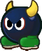
> {: .float-right-desktop }
> Stubborn and territorial metal-clad brutes, it's said that the only thing harder to budge than a Bully is a Bully's opinion. When they find allies they can trust, they make for stalwart guardians – but most often, Bullies are a nuisance to others around them.
>
> ***+1 Heart**{: .heart-color }, **+1 Courage**{: .courage-color }*{: .text-gamma .header-font }  
> *1 Power, 1 Defense*{: .text-gamma .header-font }  
>
> {: .specie-pros-callout }
> > *Pros*{: .text-gamma .header-font }  
> > *+ Athletics (Brawn)*{: .heart-color }  
> > *+ Bully (Shove)*{: .courage-color }  
> > *+ Steady (Poise)*{: .courage-color }  
> > Immune (Charm, Poison)  
> > 1 Resist (Blast, Fire, Ice)  
> > Construct (Lifelike)  
> > Sinker
>
> {: .specie-cons-callout }
> > *Cons*{: .text-gamma .header-font }  
> > Weakness (Confuse, Provoke)  
> > *The Level and Duration of any of these Statuses inflicted on you is doubled.*{: .mgl .fs-3 }  
> > Handless
>
> {: .specie-inner-callout }
> > *Tech Defaults*{: .text-gamma .header-font }  
> >
> > Launch  
> > *Overrun*{: .alt-grey-line }  
> > Provoke x2  
> > *Strong*{: .alt-grey-line }  
> >
>
> {: .specie-inverted-callout }
> > *Example Techniques*{: .text-gamma .header-font .text-grey-lt-000 }  
> >
> > {: .specie-inner-callout }  
> > > *Standing Bonk*{: .header-font } (**0 FP**{: .spirit-color })  
> > > Smashes a tough metal head into the enemy.  
> > > *Coordination*{: .heart-color }:  
> > > *Nice!*{: .nice-color }: 3 DMG  
> > > *Good!*{: .good-color }: 6 DMG  
> > > *Strong x2, Unwieldy*{: .italic }
> > >
> >
> > {: .specie-inner-callout }  
> > > *Domino Charge*{: .header-font } (**5 FP**{: .spirit-color })  
> > > Rushes into all enemies in the target group in melee range, pinning them and slamming them into other targets.  
> > > *Athletics (+ Brawn)*{: .heart-color }:  
> > > *Good!*{: .good-color }: 3 DMG  
> > > *Great!*{: .great-color }: 6 DMG  
> > > *Bully (+ Shove)*{: .courage-color }:  
> > > *Good!*{: .good-color }: Launch each target into the target behind them, dealing 3 DMG to each new target. For each additional Grade of Success, launched targets hit one more enemy.  
> > > Can launch up to 3 targets at once.  
> > > *Launch x3, Overrun, Strong x2, Variant (Primary, **Athletics**{: .heart-color }), Unwieldy x3*{: .italic }
> > >
> >
>

{: .specie-callout }
> ## Bumpty
>
> 
> {: .float-right-desktop }
> Concept by *@tact.elive*{: .courage-color }  
> Short and stout penguins found mostly in the kingdom's colder climates. Though small and generally harmless, their rubbery feathers hold a hard-to-move, yet hard-moving force
>
> ***+1 Heart**{: .heart-color }, **+1 Courage**{: .courage-color }*{: .text-gamma .header-font }  
> *1 Power, 1 Defense*{: .text-gamma .header-font }  
>
> {: .specie-pros-callout }
> > *Pros*{: .text-gamma .header-font }  
> > *+ Athletics (Bump)*{: .heart-color }  
> > *+ Guard (Melee)*{: .heart-color }  
> > *+ Steady (Poise)*{: .courage-color }  
> > Immune (Ice, Shock)  
> > 1 Resist (Water)  
> > Aquatic
>
> {: .specie-cons-callout }
> > *Cons*{: .text-gamma .header-font }  
> > Weakness (Fire)  
> > *You take +2 damage and become Dazed (1) for a number of turns equal to the damage taken.*{: .mgl .fs-3 }
>
> {: .specie-inner-callout }
> > *Tech Defaults*{: .text-gamma .header-font }  
> >
> > Boost (*Steady*{: .courage-color })  
> > *Element (Ice)*{: .alt-grey-line }  
> > Launch  
> > *Throw*{: .alt-grey-line }  
> >
> > *Optional*{: .underlined }: Element (Ice) on Indirect or Ranged Techniques
>
> {: .specie-inverted-callout }
> > *Example Techniques*{: .text-gamma .header-font .text-grey-lt-000 }  
> >
> > {: .specie-inner-callout }  
> > > *Bum-Rush*{: .header-font } (**0 FP**{: .spirit-color })  
> > > Run into a foe, sending them flying backwards!  
> > > *Coordination*{: .heart-color }:  
> > > Auto: 1 DMG  
> > > *Nice!*{: .nice-color }: 2 DMG  
> > > *Athletics (+ Bump)*{: .heart-color }:  
> > > For each Grade of Success, launch the foe into one target behind them, dealing 1 DMG to each.  
> > > *Launch*{: .italic }
> > >
> >
> > {: .specie-inner-callout }  
> > > *Cozy Bundle*{: .header-font } (**3 FP**{: .spirit-color })  
> > > Wrap a target in a warm downy quilt, making them feel more secure for 4 turns.  
> > > *Cheer*{: .courage-color }:  
> > > *Nice!*{: .nice-color }: +1d6 to *Steady*{: .courage-color } for 4 turns  
> > > *Good!*{: .good-color }: +2d6 to *Steady*{: .courage-color } for 4 turns  
> > > *Great!*{: .great-color }: +3d6 to *Steady*{: .courage-color } for 4 turns  
> > > *Wonderful!*{: .wonderful-color }: +4d6 to *Steady*{: .courage-color } for 4 turns  
> > > *Boost (**Steady**{: .courage-color }) x4, Harmless (Indirect)*{: .italic }
> > >
> >
>

{: .specie-callout }
> ## Buzzy Beetle
>
> 
> {: .float-right-desktop }
> Buzzy Beetles are similar to Koopas, but less athletic, less sociable and far sturdier. They can often be found climbing around in dark caves, and despite their defensive prowess, tend to avoid direct confrontation. 
>
> ***+1 Heart**{: .heart-color }*{: .text-gamma .header-font }  
> *1 Power, 2 Defense*{: .text-gamma .header-font }  
>
> {: .specie-pros-callout }
> > *Pros*{: .text-gamma .header-font }  
> > *+ Athletics (Climb)*{: .heart-color }  
> > *+ Athletics (Shells)*{: .heart-color }  
> > *+ Notice (Vibrations)*{: .spirit-color }  
> > Immune (Blast, Fire)
>
> {: .specie-cons-callout }
> > *Cons*{: .text-gamma .header-font }  
> > Weakness (Aerial, Quake)  
> > *You are flipped over; you retain your Defense against Aerial attacks initially, but otherwise your Defense is negated for the duration.*{: .mgl .fs-3 }  
> > *This leaves you completely Stunned (6) for the next 2 turns.*{: .mgl .fs-3 }  
> > Handless
>
> {: .specie-inner-callout }
> > *Tech Defaults*{: .text-gamma .header-font }  
> >
> > Boost (Defense)  
> > *Counter*{: .alt-grey-line }  
> > Indirect  
> > *Overrun*{: .alt-grey-line }  
> >
> > *Optional*{: .underlined }: Variant (*Athletics*{: .heart-color } - Primary Only) on Indirect attacks
>
> {: .specie-inverted-callout }
> > *Example Techniques*{: .text-gamma .header-font .text-grey-lt-000 }  
> >
> > {: .specie-inner-callout }  
> > > *Shell Spin*{: .header-font } (**0 FP**{: .spirit-color })  
> > > Hits one target in melee with a shell strike.  
> > > *Athletics (+ Shells)*{: .heart-color }:  
> > > Auto: 1 DMG  
> > > *Nice!*{: .nice-color }: 2 DMG  
> > > *Indirect, Variant (**Athletics**{: .heart-color })*{: .italic }
> > >
> >
> > {: .specie-inner-callout }  
> > > *Power Shell*{: .header-font } (**3 FP**{: .spirit-color })  
> > > Spin through all enemies on the ground with a shell strike.  
> > > *Athletics (+ Shells)*{: .heart-color }:  
> > > Auto: 1 DMG  
> > > *Nice!*{: .nice-color }: 2 DMG  
> > > *Indirect, Variant (**Athletics**{: .heart-color }), Overrun*{: .italic }
> > >
> >
>

{: .specie-callout }
> ## Cheep Cheep
>
> 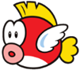
> {: .float-right-desktop }
> While they excel in water, Cheep Cheep have great acrobatic skills too; though they dislike spending much time on land. They can expel water with considerable force, either to attack or as a deterrant.
>
> ***+1 Heart**{: .heart-color }, **+1 Spirit**{: .spirit-color }*{: .text-gamma .header-font }  
> *1 Power, 0 Defense*{: .text-gamma .header-font }  
>
> {: .specie-pros-callout }
> > *Pros*{: .text-gamma .header-font }  
> > *+ Athletics (Jump)*{: .heart-color }  
> > *+ Athletics (Swim)*{: .heart-color }  
> > *+ Notice (Underwater)*{: .spirit-color }  
> > 1 Resist (Fire, Water)  
> > Aquatic  
> > Carrier (In Water)
>
> {: .specie-cons-callout }
> > *Cons*{: .text-gamma .header-font }  
> > Weakness (Shock)  
> > *You take +2 damage and become Dazed (1) for a number of turns equal to the damage taken.*{: .mgl .fs-3 }  
> > Handless  
> > Legless
>
> {: .specie-inner-callout }
> > *Tech Defaults*{: .text-gamma .header-font }  
> >
> > Aerial  
> > *Element (Water)*{: .alt-grey-line }  
> > Ranged  
> > *Weaken (Any)*{: .alt-grey-line }  
> >
> > *Optional*{: .underlined }: Element (Water) on Indirect or Ranged Techniques
>
> {: .specie-inverted-callout }
> > *Example Techniques*{: .text-gamma .header-font .text-grey-lt-000 }  
> >
> > {: .specie-inner-callout }  
> > > *Belly Flop*{: .header-font } (**0 FP**{: .spirit-color })  
> > > Flops onto the enemy from above.  
> > > *Athletics (+ Jump)*{: .heart-color }:  
> > > Auto: 1 DMG  
> > > *Nice!*{: .nice-color }: 2 DMG  
> > > *Aerial*{: .italic }
> > >
> >
> > {: .specie-inner-callout }  
> > > *Drench*{: .header-font } (**5 FP**{: .spirit-color })  
> > > Softens the foe up with water, weakening their Attack and Defense.
> > > *Bully*{: .courage-color }:  
> > > *Good!*{: .good-color }: -1 Attack, -1 Defense, for 3 turns  
> > > *Great!*{: .great-color }: -2 Attack, -2 Defense, for 3 turns  
> > > *Wonderful!*{: .wonderful-color }: -3 Attack, -3 Defense, for 3 turns  
> > > *Weaken (Attack) x3, Element (Water), Weaken (Defense) x3, Harmless (Indirect), Unwieldy*{: .italic }
> > >
> >
>

{: .specie-callout }
> ## Chomp
>
> 
> {: .float-right-desktop }
> Chomps are terrifying beasts to behold; wild, reckless and virtually impossible to calm down. It's possible they could communicate and live peacefully, but they seem to prefer barking and biting at anything that moves.
>
> ***+2 Heart**{: .heart-color }, **-1 Spirit**{: .spirit-color }*{: .text-gamma .header-font }  
> *2 Power, 1 Defense*{: .text-gamma .header-font }  
>
> {: .specie-pros-callout }
> > *Pros*{: .text-gamma .header-font }  
> > *+ Athletics (Brawn)*{: .heart-color }  
> > *+ Athletics (Jump)*{: .heart-color }  
> > *+ Bully (Bark)*{: .courage-color }  
> > 2 Resist (Blast, Fire, Ice)  
> > Immune (Poison)  
> > Carrier  
> > Sinker
>
> {: .specie-cons-callout }
> > *Cons*{: .text-gamma .header-font }  
> > Weakness (Charm, Confuse, Provoke)  
> > *The Level and Duration of any of these Statuses inflicted on you is doubled.*{: .mgl .fs-3 }  
> > Handless  
> > Legless
>
> {: .specie-inner-callout }
> > *Tech Defaults*{: .text-gamma .header-font }  
> >
> > Aerial  
> > *Fear x2*{: .alt-grey-line }  
> > Strike-Through x2  
> > *Strong*{: .alt-grey-line }  
> >
> > *Required*{: .underlined }: Unwieldy (Primary) on attacks
>
> {: .specie-inverted-callout }
> > *Example Techniques*{: .text-gamma .header-font .text-grey-lt-000 }  
> >
> > {: .specie-inner-callout }  
> > > *Power Chomp*{: .header-font } (**0 FP**{: .spirit-color })  
> > > Crunches the foe with powerful jaws.  
> > > *Coordination*{: .heart-color }:  
> > > *Nice!*{: .nice-color }: 3 DMG  
> > > *Good!*{: .good-color }: 6 DMG  
> > > *Strong, Unwieldy*{: .italic }
> > >
> >
> > {: .specie-inner-callout }  
> > > *Rolling Boulder*{: .header-font } (**4 FP**{: .spirit-color })  
> > > Rolls into melee and bowls enemies over, one by one, hitting up to 4 targets. Strikes get weaker after each target.  
> > > *Athletics (+ Brawn)*{: .heart-color }:  
> > > *Good!*{: .good-color }: 4 DMG / 3 DMG / 2 DMG / 1 DMG  
> > > *Great!*{: .great-color }: 8 DMG / 7 DMG / 6 DMG / 5 DMG  
> > > *Strong x2, Strike-Through x3, Variant (**Athletics**{: .heart-color }), Unwieldy x2*{: .italic }
> > >
> >
>

{: .specie-callout }
> ## Chuck
>
> 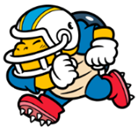
> {: .float-right-desktop }
> Tough Koopas who primarily fixate on athletic ability, especially sports. When they're rallied to a cause, they're known for great brawn and unwavering faith in their allies – treating them like their favourite sports team.
>
> ***+2 Heart**{: .heart-color } or **+1 Heart**{: .heart-color }, **+1 Courage**{: .courage-color }*{: .text-gamma .header-font }  
> *1 Power, 0 Defense*{: .text-gamma .header-font }  
>
> {: .specie-pros-callout }
> > *Pros*{: .text-gamma .header-font }  
> > *+ Athletics (Any)*{: .heart-color }  
> > *or **+ Aim (Throw)**{: .heart-color }*{: .mgl }  
> > *+ Athletics (Run)*{: .heart-color }  
> > *+ Cheer (Team)*{: .courage-color }  
> > Immune (Fear)
>
> {: .specie-cons-callout }
> > *Cons*{: .text-gamma .header-font }  
> > Weakness (Confuse, Provoke)  
> > *The Level and Duration of any of these Statuses inflicted on you is doubled.*{: .mgl .fs-3 }
>
> {: .specie-inner-callout }
> > *Tech Defaults*{: .text-gamma .header-font }  
> >
> > Aerial  
> > *Overrun*{: .alt-grey-line }  
> > Tool  
> > *Launch*{: .alt-grey-line }  
> >
> > *Optional*{: .underlined }: Variant (*Athletics*{: .heart-color } on Techniques that use an *Athletics*{: .heart-color } specialisation
>
> {: .specie-inverted-callout }
> > *Example Techniques*{: .text-gamma .header-font .text-grey-lt-000 }  
> >
> > {: .specie-inner-callout }  
> > > *Football Toss*{: .header-font } (**0 FP**{: .spirit-color })  
> > > Hurls a trusty football into the enemy.  
> > > *Aim*{: .heart-color }:  
> > > *Nice!*{: .nice-color }: 2 DMG  
> > > *Good!*{: .good-color }: 4 DMG  
> > > *Tool (Ranged), Strong, Unwieldy*{: .italic }
> > >
> >
> > {: .specie-inner-callout }  
> > > *Endzone Charge*{: .header-font } (**2 FP**{: .spirit-color })  
> > > Shoulder-charges straight through all enemies in front of them.
> > > *Athletics (+ Run)*{: .heart-color }:  
> > > *Nice!*{: .nice-color }: 3 DMG  
> > > *Good!*{: .good-color }: 6 DMG  
> > > *Overrun, Variant (**Athletics**{: .heart-color }), Strong x2, Unwieldy*{: .italic }
> > >
> >
>

{: .specie-callout }
> ## Chuckya
>
> 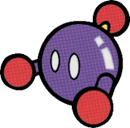
> {: .float-right-desktop }
> Hefty clockwork automatons, capable of lifting great weights and throwing them around like they're nothing.  
> Chuckyas are complex machines, but are fundamentally similar to Bob-Ombs in design. They tend to take silent pride in their work, but have the same spark of life.
>
> ***+2 Heart**{: .heart-color }*{: .text-gamma .header-font }  
> *1 Power, 1 Defense*{: .text-gamma .header-font }  
>
> {: .specie-pros-callout }
> > *Pros*{: .text-gamma .header-font }  
> > *+ Athletics (Brawn)*{: .heart-color }  
> > *+ Aim (Throw)*{: .heart-color }  
> > *+ Bully (Grapple)*{: .courage-color }  
> > Immune (Poison)  
> > 1 Resist (Blast, Fire, Ice)  
> > Construct (Lifelike)  
> > Sinker  
>
> {: .specie-cons-callout }
> > *Cons*{: .text-gamma .header-font }  
> > Weakness (Shock, Water)  
> > *You take +2 damage and become Confused (1) for a number of turns equal to the damage taken.*{: .mgl .fs-3 }
>
> {: .specie-inner-callout }
> > *Tech Defaults*{: .text-gamma .header-font }  
> >
> > Disorient  
> > *Snatch*{: .alt-grey-line }  
> > Strong  
> > *Throw*{: .alt-grey-line }  
> >
>
> {: .specie-inverted-callout }
> > *Example Techniques*{: .text-gamma .header-font .text-grey-lt-000 }  
> >
> > {: .specie-inner-callout }  
> > > *Go-Long Throw*{: .header-font } (**0 FP**{: .spirit-color })  
> > > Grabs onto the enemy, then tosses them into another target at range. Both targets take damage.  
> > > *Athletics (+ Brawn)*{: .heart-color }:  
> > > *Good!*{: .good-color }: 4 DMG  
> > > *Throw x2, Strong, Commitment (Primary), Unwieldy*{: .italic }
> > >
> >
> > {: .specie-inner-callout }  
> > > *Roundabout Toss*{: .header-font } (**4 FP**{: .spirit-color })  
> > > Grabs onto the foe, spins them about then tosses them into the closest enemy. Both targets take damage, and the thrown enemy is left dizzy.
> > > *Athletics (+ Brawn)*{: .heart-color }:  
> > > *Good!*{: .good-color }: 4 DMG  
> > > *Bully (+ Grapple)*{: .courage-color }:  
> > > *Nice!*{: .nice-color }: Disorient (1) for 3 turns  
> > > *Good!*{: .good-color }: Disorient (2) for 3 turns  
> > > *Great!*{: .great-color }: Disorient (3) for 3 turns  
> > > *Throw, Disorient x3, Strong, Commitment (Primary), Unwieldy*{: .italic }
> > >
> >
>

{: .specie-callout }
> ## Cleft
>
> 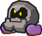
> {: .float-right-desktop }
> Clefts are truly stoic creatures, made almost entirely of solid stone and virtually indistinguishable from ordinary rocks. They're resilient in the face of most attacks, making them reliable defenders.
>
> ***+1 Heart**{: .heart-color }*{: .text-gamma .header-font }  
> *1 Power, 2 Defense*{: .text-gamma .header-font }  
>
> {: .specie-pros-callout }
> > *Pros*{: .text-gamma .header-font }  
> > *+ Guard (Melee)*{: .heart-color }  
> > *+ Trickery (Camouflage)*{: .spirit-color }  
> > *+ Steady (Poise)*{: .courage-color }  
> > Immune (Fire, Poison)  
> > 1 Resist (Earth, Shock)  
> > Sinker
>
> {: .specie-cons-callout }
> > *Cons*{: .text-gamma .header-font }  
> > Handless  
> > Weakness (Aerial, Blast, Quake)  
> > *You are flipped over; you retain your Defense against Aerial and Blast attacks initially, but otherwise your Defense is negated for the duration.*{: .mgl .fs-3 }  
> > *This leaves you completely Stunned (6) for the next 2 turns.*{: .mgl .fs-3 }
>
> {: .specie-inner-callout }
> > *Tech Defaults*{: .text-gamma .header-font }  
> >
> > Boost (Attack/Defense)  
> > *Overrun*{: .alt-grey-line }  
> > Quake  
> > *Underfoot*{: .alt-grey-line }  
> >
>
> {: .specie-inverted-callout }
> > *Example Techniques*{: .text-gamma .header-font .text-grey-lt-000 }  
> >
> > {: .specie-inner-callout }  
> > > *Earthshaker*{: .header-font } (**0 FP**{: .spirit-color })  
> > > You pound the ground with force, affecting all enemies in contact with the ground, wall or ceiling.  
> > > *Athletics*{: .heart-color }:  
> > > Auto: 1 Quake DMG  
> > > *Nice!*{: .nice-color }: 2 Quake DMG  
> > > *Quake*{: .italic }
> > >
> >
> > {: .specie-inner-callout }  
> > > *Stone Lunge*{: .header-font } (**2 FP**{: .spirit-color })  
> > > You barge at the enemy while tucking into a safe stone-like stance, protecting you from attacks until your next turn.  
> > > *Coordination*{: .heart-color }:  
> > > *Nice!*{: .nice-color }: 3 DMG  
> > > *Good!*{: .good-color }: 6 DMG  
> > > *Guard*{: .heart-color }:  
> > > *Good!*{: .good-color }: +2 Defense for 1 turn  
> > > *Split (Boost (Defense) x2, Self), Strong x2, Unwieldy x2, Shorten*{: .italic }
> > >
> >
>

{: .specie-callout }
> ## Clubba
>
> 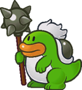
> {: .float-right-desktop }
> Sometimes known as Spikes, Clubbas are renowned for their strength and ability with all manner of spiky tools.  
> While they tend to be easy-going, their keen senses have served them well as guards.
>
> ***+2 Heart**{: .heart-color }*{: .text-gamma .header-font }  
> *1 Power, 0 Defense*{: .text-gamma .header-font }  
>
> {: .specie-pros-callout }
> > *Pros*{: .text-gamma .header-font }  
> > *+ Aim (Throw)*{: .heart-color }  
> > *+ Coordination (Weapon)*{: .heart-color }  
> > *+ Notice (Listen)*{: .spirit-color }  
> > Immune (Provoke)
>
> {: .specie-cons-callout }
> > *Cons*{: .text-gamma .header-font }  
> > Weakness (Sleep)  
> > *The Level and Duration of all Statuses you suffer associated with sleep are doubled.*{: .mgl .fs-3 }
>
> {: .specie-inner-callout }
> > *Tech Defaults*{: .text-gamma .header-font }  
> >
> > Daze x2  
> > *Strong, Tool (Indirect)*{: .alt-grey-line }  
> > Strike-Through x2, Tool (Ranged)  
> > *Quake*{: .alt-grey-line }  
> >
>
> {: .specie-inverted-callout }
> > *Example Techniques*{: .text-gamma .header-font .text-grey-lt-000 }  
> >
> > {: .specie-inner-callout }  
> > > *Clubba Swing*{: .header-font } (**0 FP**{: .spirit-color })  
> > > Slams an enemy in melee with a heavy club, dealing incredible damage – if it hits.  
> > > *Coordination (+ Weapon)*{: .heart-color }:  
> > > *Good!*{: .good-color }: 4 DMG  
> > > *Great!*{: .great-color }: 8 DMG  
> > > *Strong x3, Tool (Indirect), Unwieldy x2*{: .italic }
> > >
> >
> > {: .specie-inner-callout }  
> > > *Roling Toss*{: .header-font } (**2 FP**{: .spirit-color })  
> > > Tosses a heavy object at the enemy that bowls them over, one by one, hitting up to 4 targets.  
> > > Strikes get weaker after each target.  
> > > *Aim (+ Throw)*{: .heart-color }:  
> > > *Good!*{: .good-color }: 3 DMG / 2 DMG / 1 DMG / 1 DMG  
> > > *Great!*{: .great-color }: 6 DMG / 5 DMG / 4 DMG / 3 DMG  
> > > *Strike-Through x4, Tool (Ranged), Strong x2, Unwieldy x2*{: .italic }
> > >
> >
>

{: .specie-callout }
> ## Coffer
>
> 
> {: .float-right-desktop }
> Concept by *@bigmeatyflaws*{: .courage-color }  
> Coffers are known to collect and greedily hoard whatever takes their fancy – usually, Coins, though they have a variety of tastes. Given that they're skittish and selfish, they're rarely found, but that's usually the way they like it.
>
> ***+1 Heart**{: .heart-color }, **+1 Spirit**{: .spirit-color }*{: .text-gamma .header-font }  
> *1 Power, 0 Defense*{: .text-gamma .header-font }  
>
> {: .specie-pros-callout }
> > *Pros*{: .text-gamma .header-font }  
> > *+ Aim (Spit)*{: .heart-color }  
> > *+ Knowhow (Commerce)*{: .spirit-color }  
> > *or **+ Notice (Trasure)**{: .spirit-color }*{: .mgl }  
> > *+ Trickery (Camouflage)*{: .spirit-color }  
> > \+ +½ Starting Coins  
> > Invisiblity
>
> {: .specie-cons-callout }
> > *Cons*{: .text-gamma .header-font }  
> > Weakness (Fear)  
> > *The Level and Duration of all Statusesyou suffer associated with fear are doubled.*{: .mgl .fs-3 }  
> > Handless
>
> {: .specie-inner-callout }
> > *Tech Defaults*{: .text-gamma .header-font }  
> >
> > Alt-Cost (Coins)  
> > *Ranged*{: .alt-grey-line }  
> > Repeat  
> > *Snatch*{: .alt-grey-line }  
> >
>
> {: .specie-inverted-callout }
> > *Example Techniques*{: .text-gamma .header-font .text-grey-lt-000 }  
> >
> > {: .specie-inner-callout }  
> > > *Pickpocket*{: .header-font } (**0 FP**{: .spirit-color })  
> > > Latches onto an enemy in melee and attempts to steal their goods.  
> > > *Coordination*{: .heart-color }:  
> > > *Nice!*{: .nice-color }: 2 DMG  
> > > *Trickery (+ Theft)*{: .spirit-color }:  
> > > Choose one option based on your Grades of Success.  
> > > *Nice!*{: .nice-color }: 1d6 Coins, +1d6 per Grade of Success  
> > > *Nice!*{: .nice-color }: A small Item  
> > > *Good!*{: .good-color }: A large Item  
> > > *Great!*{: .great-color }: An equipped Item  
> > > *Snatch, Empower, Commitment (Primary)*{: .italic }
> > >
> >
> > {: .specie-inner-callout }  
> > > *Make It Rain*{: .header-font } (20 Coins)  
> > > Spits up a volley of the user's own Coins at a target.  
> > > *Aim (+ Spit)*{: .heart-color }:  
> > > Deal 1 DMG once for each Grade of Success.  
> > > *Repeat, Alt-Cost (Coins), Ranged*{: .italic }
> > >
> >
>

{: .specie-callout }
> ## Craw
>
> 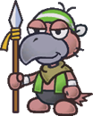
> {: .float-right-desktop }
> Craws are rare around the Mushroom Kingdom, but are known primarily for their seedy reputation.  
> That said, anyone who knows one will be quick to praise their resilience, loyalty and prowess, both as melee warriors and as guardsmen.
>
> ***+1 Heart**{: .heart-color }, **+1 Courage**{: .courage-color }*{: .text-gamma .header-font }  
> *1 Power, 0 Defense*{: .text-gamma .header-font }  
>
> {: .specie-pros-callout }
> > *Pros*{: .text-gamma .header-font }  
> > *+ Coordination (Weapon)*{: .heart-color }  
> > *+ Guard (Melee)*{: .heart-color }  
> > *+ Steady (VS Poison)*{: .courage-color }  
> > Immune (Charm)  
>
> {: .specie-cons-callout }
> > *Cons*{: .text-gamma .header-font }  
> > Weakness (Provoke)  
> > *The Level and Duration of any Provocation inflicted on you is doubled.*{: .mgl .fs-3 }
>
> {: .specie-inner-callout }
> > *Tech Defaults*{: .text-gamma .header-font }  
> >
> > Counter  
> > *Dismiss*{: .alt-grey-line }  
> > Hearty x2  
> > *Strike-Through, Tool (Indirect)*{: .alt-grey-line }  
> > Tool
> >
>
> {: .specie-inverted-callout }
> > *Example Techniques*{: .text-gamma .header-font .text-grey-lt-000 }  
> >
> > {: .specie-inner-callout }  
> > > *Spear Charge*{: .header-font } (**0 FP**{: .spirit-color })  
> > > Spears the enemy in melee, piercing through to hit the target behind them. The follow-up attack is weaker.  
> > > *Coordination (+ Weapon)*{: .heart-color }:  
> > > Auto: 1 DMG / 1 DMG  
> > > *Nice!*{: .nice-color }: 2 DMG / 1 DMG  
> > > *Strike-Through, Tool (Indirect)*{: .italic }
> > >
> >
> > {: .specie-inner-callout }  
> > > *First Aid*{: .header-font } (**3 FP**{: .spirit-color })  
> > > The user heals themselves and tends to their status ailments.  
> > > *Heal*{: .heart-color }:  
> > > *Nice!*{: .nice-color }: *+6 HP*{: .heart-color }; up to 3 Statuses, -3 turns  
> > > *Good!*{: .good-color }: *+8 HP*{: .heart-color }; up to 4 Statuses, -4 turns  
> > > *Great!*{: .great-color }: *+10 HP*{: .heart-color }; up to 5 Statuses, -5 turns  
> > > *Wonderful!*{: .wonderful-color }: *+12 HP*{: .heart-color }; up to 6 Statuses, -6 turns  
> > > Additional Grades of Success allow an extra Status to be reduced and reduces Status durations by another turn.  
> > > *Hearty x3, Dismiss, Empower x2, Self, Harmless*{: .italic }
> > >
> >
>

{: .specie-callout }
> ## Dayzee  
>
> 
> {: .float-right-desktop }
> Dayzees are quiet and soft-spoken sorts, which is fitting given their soothing lullabies. While they may be quick to flee, their strength of character is undeniable, and their voices are breathtaking.
>
> ***+2 Courage**{: .courage-color } **or**{: .italic } **+1 Spirit**{: .spirit-color }, **+1 Courage**{: .courage-color }*{: .text-gamma .header-font }  
> *1 Power, 0 Defense*{: .text-gamma .header-font }  
>
> {: .specie-pros-callout }
> > *Pros*{: .text-gamma .header-font }  
> > *+ Athletics (Run)*{: .heart-color }  
> > *+ Cheer (FP)*{: .courage-color }  
> > *+ Perform (Sing)*{: .courage-color }  
> > Immune (Water)  
> > *You heal **5 HP**{: .heart-color } instead.*{: .mgl .fs-3 }  
> > 1 Resist (Earth, Shock)
>
> {: .specie-cons-callout }
> > *Cons*{: .text-gamma .header-font }  
> > Weakness (Fear)  
> > *The Level and Duration of all Statuses you suffer associated with fear are doubled.*{: .mgl .fs-3 }  
> > Weakness (Fire)  
> > *You take +2 damage and suffer from a Lingering (1) burn, lasting a number of turns equal to the damage taken.*{: .mgl .fs-3 }
>
> {: .specie-inner-callout }
> > *Tech Defaults*{: .text-gamma .header-font }  
> > Charm  
> > *Daze x2*{: .alt-grey-line }  
> > Flowery  
> > *Variant (**Perform**{: .courage-color })*{: .alt-grey-line }
> > 
> > *Optional*{: .underlined }: Add a single Split Slot to Flowery Techniques; it can't contain strikes,  
> > *or*{: .underlined } Ranged on Techniques with Variant (*Perform*{: .courage-color })  
> > *or*{: .underlined } Element (Earth) on melee attacks
> >
>
> {: .specie-inverted-callout }
> > *Example Techniques*{: .text-gamma .header-font .text-grey-lt-000 }  
> >
> > {: .specie-inner-callout }  
> > > *Pollen Pounder*{: .header-font } (*0 FP*{: .spirit-color })  
> > > An aggressive headbutt rife with pollen puts foes to sleep.  
> > > *Coordination*{: .heart-color }:  
> > > Auto: 1 Earth DMG  
> > > *Nice!*{: .nice-color }: 2 Earth DMG  
> > > *Bully*{: .courage-color }:  
> > > *Nice!*{: .nice-color }: Daze (1) for 2 turns  
> > > *Good!*{: .good-color }: Daze (2) for 2 turns  
> > > *Daze x2, Element (Earth)*{: .italic }
> > >
> >
> > {: .specie-inner-callout }  
> > > *Lullaby*{: .header-font } (*3 FP*{: .spirit-color })  
> > > Targeted singing puts the target to sleep while dealing damage.  
> > > *Perform (+Sing)*{: .courage-color }:  
> > > *Good!*{: .good-color }: 4 DMG  
> > > *Perform (+Sing)*{: .courage-color }:  
> > > *Nice!*{: .nice-color }: Daze (2) for 3 turns  
> > > *Good!*{: .good-color }: Daze (3) for 3 turns  
> > > *Daze x3, Ranged, Empower, Strong, Variant (**Perform**{: .courage-color}) x2, Commitment (Primary), Unwieldy*{: .italic }
> > >
> >
>

{: .specie-callout }
> ## Dino Rhino
>
> 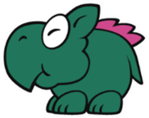
> {: .float-right-desktop }
> Dino Rhinos are mighty prehistoric beasts; similar to Yoshi's, they're not quite dinosaurs and not quite dragons, but something in between. Most live peaceful lives in the wild, but can be convinced to journey afar – and they prove extremely dangerous when angered.
>
> ***+1 Heart**{: .heart-color }*{: .text-gamma .header-font }  
> *2 Power, 1 Defense*{: .text-gamma .header-font }  
>
> {: .specie-pros-callout }
> > *Pros*{: .text-gamma .header-font }  
> > *+ Athletics (Brawn)*{: .heart-color }  
> > *+ Notice (Scent)*{: .spirit-color }  
> > *+ Bully (Shove)*{: .courage-color }  
> > Immune (Fire)  
> > Carrier
>
> {: .specie-cons-callout }
> > *Cons*{: .text-gamma .header-font }  
> > Weakness (Charm, Confuse, Provoke)  
> > *The Level and Duration of any of these Statuses inflicted on you is doubled.*{: .mgl .fs-3 }  
> > Handless
>
> {: .specie-inner-callout }
> > *Tech Defaults*{: .text-gamma .header-font }  
> >
> > Element (Fire), Ranged  
> > *Launch*{: .alt-grey-line }  
> > Spillover  
> > *Throw*{: .alt-grey-line }  
> >
>
> {: .specie-inverted-callout }
> > *Example Techniques*{: .text-gamma .header-font .text-grey-lt-000 }  
> >
> > {: .specie-inner-callout }  
> > > *Spiral Flame*{: .header-font } (**0 FP**{: .spirit-color })  
> > > Launches a swirling ball of fire from the mouth, burning the foe on contact.  
> > > *Aim*{: .heart-color }:  
> > > *Good!*{: .good-color }: 6 DMG  
> > > *Bully*{: .courage-color }:  
> > > *Nice!*{: .nice-color }: Lingering (1) for 3 turns  
> > > *Good!*{: .good-color }: Lingering (2) for 3 turns  
> > > *Element (Fire), Ranged, Lingering x2, Strong, Commitment (Primary), Unwieldy*{: .italic }
> > >
> >
> > {: .specie-inner-callout }  
> > > *Bare Down*{: .header-font } (**2 FP**{: .spirit-color })  
> > > Throws their full weight at the enemy in melee, slamming them into the next available target.  
> > > Both targets take the same damage and make Contact with one another.  
> > > *Athletics (+ Brawn)*{: .heart-color }:  
> > > *Nice!*{: .nice-color }: 4 DMG  
> > > *Good!*{: .good-color }: 8 DMG  
> > > *Throw, Strong x2, Unwieldy*{: .italic }
> > >
> >
>

{: .specie-callout }
> ## Doogan
>
> 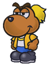
> {: .float-right-desktop }
> Doogans are rare around the Mushroom Kingdom, and they're certainly not known for their valour. However they have a nose for Coins and a long history in trade.  
> While their battle prowess is nothing to write home about, nobody, but nobody, calls a Doogan a mutt.
>
> ***+2 Courage**{: .courage-color } or **+1 Spirit**{: .spirit-color }, **+1 Courage**{: .courage-color }*{: .text-gamma .header-font }  
> *1 Power, 0 Defense*{: .text-gamma .header-font }  
>
> {: .specie-pros-callout }
> > *Pros*{: .text-gamma .header-font }  
> > *+ Aim (Items)*{: .heart-color }  
> > *or **Knowhow (Commerce)**{: .spirit-color }*{: .mgl }  
> > *+ Notice (Appraise)*{: .spirit-color }  
> > *+ Persuade (Deals)*{: .courage-color }  
> > \+½ Starting Coins
>
> {: .specie-cons-callout }
> > *Cons*{: .text-gamma .header-font }  
> > N/A
>
> {: .specie-inner-callout }
> > *Tech Defaults*{: .text-gamma .header-font }  
> >
> > Boost (Attack)  
> > *Hearty x2*{: .alt-grey-line }  
> > Tool  
> > *Flowery*{: .alt-grey-line }  
> >
>
> {: .specie-inverted-callout }
> > *Example Techniques*{: .text-gamma .header-font .text-grey-lt-000 }  
> >
> > {: .specie-inner-callout }  
> > > *Fling*{: .header-font } (**0 FP**{: .spirit-color })  
> > > Tosses something, anything, at the enemy from a distance.  
> > > *Aim (+ Items)*{: .heart-color }:  
> > > *Nice!*{: .nice-color }: 1 DMG / 2 DMG (2, 6)  
> > > *Good!*{: .good-color }: 2 DMG / 4 DMG (2, 6)  
> > > Roll 1d6 to determine effects.
> > > 1. Hurts the user instead, with no chance to resist.
> > > 2. Deals more damage, but the user takes ½ of that damage with no chance to resist.
> > > 3. Dazes the target with *Bully*{: .courage-color } for 3 turns. Status Level is equal to Grades of Success (maximum 2).
> > > 4. Weakens the target's Defense with *Bully*{: .courage-color } for 2 turns. Status Level is 1.
> > > 5. Deals Piercing damage.
> > > 6. Deals more damage.  
> > >
> > > *Tool (Ranged), Unwieldy, Lengthen,*{: .italic }  
> > > *Roulette*{: .italic }  
> > > *1. Self*{: .mgl .italic }  
> > > *2. Strong, Blowback*{: .mgl .italic }  
> > > *3. Daze x2*{: .mgl .italic }  
> > > *4. Weaken (Defense)*{: .mgl .italic }  
> > > *5. Piercing*{: .mgl .italic }  
> > > *6. Strong*{: .mgl .italic }  
> > >
> >
> > {: .specie-inner-callout }  
> > > *Dig In*{: .header-font } (**2 FP**{: .spirit-color })  
> > > Cooks up an impromptu meal to share with their allies.  
> > > *Heal*{: .heart-color }:  
> > > *Nice!*{: .nice-color }: *+2 HP*{: .heart-color }, *+1 FP*{: .spirit-color }  
> > > *Good!*{: .good-color }: *+4 HP*{: .heart-color }, *+2 FP*{: .spirit-color }  
> > > *Hearty x2, Allies, Flowery x2, Shared, Harmless (Indirect)*{: .italic }
> > >
> >
>

{: .specie-callout }
> ## Duplighost
>
> 
> {: .float-right-desktop }
> These mysterious beings live on the fringes of society, usually striving to master their innate transformation magic; though when a Duplighost gives up on mastering this path, they tend to fall back on their more deceitful qualities.
>
> ***+2 Spirit**{: .spirit-color }*{: .text-gamma .header-font }  
> *1 Power, 0 Defense*{: .text-gamma .header-font }  
>
> {: .specie-pros-callout }
> > *Pros*{: .text-gamma .header-font }  
> > *+ Magic (Shape-Change)*{: .spirit-color }  
> > *or **+ Trickery (Disguise)**{: .spirit-color }*{: .mgl }  
> > *+ Notice (Lies)*{: .spirit-color }  
> > *+ Trickery (Stealth)*{: .spirit-color }  
> > Invisibility  
> > Mimicry  
> > Mirage
>
> {: .specie-cons-callout }
> > *Cons*{: .text-gamma .header-font }  
> > N/A
>
> {: .specie-inner-callout }
> > *Tech Defaults*{: .text-gamma .header-font }  
> >
> > Aerial  
> > *Boost (**Dodge**{: .spirit-color })*{: .alt-grey-line }  
> > Confuse x2  
> > *Disorient*{: .alt-grey-line }  
> >
>
> {: .specie-inverted-callout }
> > *Example Techniques*{: .text-gamma .header-font .text-grey-lt-000 }  
> >
> > {: .specie-inner-callout }  
> > > *Ghostly Leap*{: .header-font } (**0 FP**{: .spirit-color })  
> > > Rushes the enemy with an airborne tackle.  
> > > *Coordination*{: .heart-color }:  
> > > Auto: 1 DMG  
> > > *Nice!*{: .nice-color }: 2 DMG  
> > > *Aerial*{: .italic }
> > >
> >
> > {: .specie-inner-callout }  
> > > *Confusing Form*{: .header-font } (**3 FP**{: .spirit-color })  
> > > Confuses a group of targets by rapidly changing form, overwhelming their senses.  
> > > *Trickery (+ Disguise)*{: .spirit-color }:  
> > > *Nice!*{: .nice-color }: Confused (1) for 3 turns  
> > > *Good!*{: .good-color }: Confused (2) for 3 turns  
> > > *Great!*{: .great-color }: Confused (3) for 3 turns  
> > > *Confuse x3, Group (Indirect), Harmless*{: .italic }
> > >
> >
>

{: .specie-callout }
> ## Elemental
>
> 
> {: .float-right-desktop }
> These bundles of elemental energy vary based on their element - Shock Spirits (like Hotheads) tend to be alert and peppy, with their young being notoriously hard to handle. However, Ice Spirits (like Freezies) are usually cool and indifferent, to the point of appearing lifeless.
>
> ***+1 Spirit**{: .spirit-color }, **+1 Courage**{: .courage-color }*{: .text-gamma .header-font }  
> *1 Power, 0 Defense*{: .text-gamma .header-font }  
>
> {: .specie-pros-callout }
> > *Pros*{: .text-gamma .header-font }  
> > "Element": Any  
> > *Element must be specified during character creation.*{: .mgl .fs-3 }  
> > *If an Elemental gains an [Elemental] subspecies, their element must match that subspecies.*{: .mgl .fs-3 }  
> > *+ Notice (Environmental)*{: .spirit-color }  
> > *Environment must be specified during character creation.*{: .mgl .fs-3 }  
> > *Magic ("Element")*{: .spirit-color }  
> > ***or*{: .italic } *+Cheer (Charge Up)*{: .courage-color }**{: .mgl }  
> > *+Bully (:Element")*{: .courage-color }  
> > ***or*{: .italic } *+Steady (Counter)*{: .courage-color }**{: .mgl }  
> > Immune ("Element")  
> > *You recover **HP**{: .heart-color } equal to the attack's raw damage (minimum **1 HP**{: .heart-color }).*{: .mgl .fs-3 }  
> > *If there's any excess **HP**{: .heart-color }, your Attack is Boosted for a number of turns equal to the excess **HP**{: .heart-color }.*{: .mgl .fs-3 }  
> > *Up to 2 of the following:*{: .underlined }  
> > *1 Resist (Other Element)*{: .mgl }  
> > *This Element must be specified during character creation. This can be chosen twice with two different elements.*{: .mgl-big .fs-3 }  
> > *Contact*{: .mgl }  
> > *The attacker takes 1 Piercing DMG of your element, and you make a **Steady**{: .courage-color } check; the attacker is Dazed (1) for 1 turn for each Grade of Success.*{: .mgl-big .fs-3 }
>
> {: .specie-cons-callout }
> > *Cons*{: .text-gamma .header-font }  
> > Weakness (Opposing Element)  
> > *You take double damage. If this Technique wouldn't usually deal damage, it deals 2 Piercing damage.*{: .mgl .fs-3 }  
> > *Your Attack is Weakened (1) for a number of turns equal to the damage taken.*{: .mgl .fs-3 }  
> > *Your Opposing Elements are defined at the same time as your Element.*{: .mgl .fs-3 }  
> > Devotion ("Element")  
> > *Up to 2 of the following:*{: .underlined }  
> > *Handless*{: .mgl }  
> > *Legless*{: .mgl }  
> > *Sinker*{: .mgl }  
> > *Weakness (Other Element)*{: .mgl }  
> > *This Element must be specified during character creation. This can be chosen twice with two different elements.*{: .mgl-big .fs-3 }  
> > *You take +2 damage.*{: .mgl-big .fs-3 }  
> > *Aquatic*{: .mgl }  
> > *Clone*{: .mgl }  
> > *Efficient ("Element")*{: .mgl }  
> > *Fly*{: .mgl }  
> > *Hover*{: .mgl }  
> > *Intangibility*{: .mgl }  
> > *Invisibility*{: .mgl }  
> > *Mirage*{: .mgl }
>
> {: .specie-inner-callout }
> > *Tech Defaults*{: .text-gamma .header-font }  
> > Boost (Any)
> >
> > ***Optional:**{: .underlined } Element ("Element") on any Technique*{: .alt-grey-line }  
> >
> > *Up to 3 of the following:*{: .underlined }  
> > Counter  
> > *Daze x2*{: .alt-grey-line }  
> > Disorient  
> > *Lingering x2*{: .alt-grey-line }  
> > Overrun  
> > *Piercing*{: .alt-grey-line }  
> > Quake  
> > *Stun*{: .alt-grey-line }  
> > Tutor  
> > *Underfoot*{: .alt-grey-line }
> >
>
> {: .specie-inverted-callout }
> > *Example Techniques*{: .text-gamma .header-font .text-grey-lt-000 }  
> >
> > {: .specie-inner-callout }  
> > > *Piercing Charge*{: .header-font } (**0 FP**{: .spirit-color })  
> > > Rushes the enemy with a full-body tackel, electrifying their defenses.  
> > > *(Element: Shock)*{: .italic }  
> > > *Coordination*{: .heart-color }:  
> > > Auto: 1 Piercing DMG  
> > > *Nice!*{: .nice-color }: 2 Piercing DMG  
> > > *Element (Shock), Piercing*{: .italic }
> > >
> >
> > {: .specie-inner-callout }  
> > > *Fire Up*{: .header-font } (**3 FP**{: .spirit-color })  
> > > Empowers the target with burning passion, firing up their attacks.  
> > > *(Element: Fire)*{: .italic }  
> > > *Cheer (+Charge Up)*{: .courage-color }:  
> > > *Nice!*{: .nice-color }: +1 Attack and Fire DMG for 5 turns  
> > > *Good!*{: .good-color }: +2 Attack and Fire DMG for 5 turns  
> > > *Great!*{: .great-color }: +3 Attack and Fire DMG for 5 turns  
> > > *Boost (Attack) x3, Element (Fire), Lengthen x2, Harmless*{: .italic }
> > >
> >
>

{: .specie-callout }
> ## Fuzzy
>
> 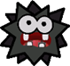
> {: .float-right-desktop }
> Fuzzies are unpredictable parasites. Repeatedly splitting themselves apart has left very little brain power in any one Fuzzy. However, they tend to inherit curious insights from their ancestry.
>
> ***+1 Heart**{: .heart-color }, **+1 Spirit**{: .spirit-color }*{: .text-gamma .header-font }  
> *1 Power, 0 Defense*{: .text-gamma .header-font }  
>
> {: .specie-pros-callout }
> > *Pros*{: .text-gamma .header-font }  
> > *+ Athletics (Climb)*{: .heart-color }  
> > *+ Knowhow (Lore)*{: .spirit-color }  
> > *+ Steady (Clone)*{: .courage-color }  
> > Clone
>
> {: .specie-cons-callout }
> > *Cons*{: .text-gamma .header-font }  
> > Weakness (Confuse)  
> > *The Level and Duration of any Confusion inflicted on you is doubled.*{: .mgl .fs-3 }  
> > Handless  
> > Legless
>
> {: .specie-inner-callout }
> > *Tech Defaults*{: .text-gamma .header-font }  
> >
> > Aerial  
> > *Drain x2*{: .alt-grey-line }  
> > Piercing  
> > *Snatch*{: .alt-grey-line }  
> >
>
> {: .specie-inverted-callout }
> > *Example Techniques*{: .text-gamma .header-font .text-grey-lt-000 }  
> >
> > {: .specie-inner-callout }  
> > > *Kissy-Kissy*{: .header-font } (**0 FP**{: .spirit-color })  
> > > Latches onto the foe in melee, and attempts to drain their health.  
> > > *Coordination*{: .heart-color }:  
> > > Auto: 1 DMG  
> > > *Nice!*{: .nice-color }: 1 DMG x2  
> > > Restores *HP*{: .heart-color } equal to the damage dealt.  
> > > *Drain x2*{: .italic }
> > >
> >
> > {: .specie-inner-callout }  
> > > *Leaping Sucker*{: .header-font } (**4 FP**{: .spirit-color })  
> > > Launches into the foe, tackling them from above and attempting to drain their health with Defense-piercing fangs.  
> > > *Athletics*{: .heart-color }:  
> > > *Nice!*{: .nice-color }: 2 Piercing DMG  
> > > *Good!*{: .good-color }: 2 Piercing DMG, 1 Piercing DMG  
> > > *Great!*{: .great-color }: 2 Piercing DMG, 1 Piercing DMG x2  
> > > Restores *HP*{: .heart-color } equal to half the damage dealt.  
> > > *Piercing, Aerial, Drain, Strong, Unwieldy*{: .italic }
> > >
> >
>

{: .specie-callout }
> ## Goomba  
>
> 
> {: .float-right-desktop }
> Underdogs by nature, Goombas have a lot of guts and a lot to prove. Whether it's bonking heads or hitting the books, Goombas strive to better themselves constantly.
>
> ***+1 Heart**{: .heart-color }, **+1 Courage**{: .courage-color }*{: .text-gamma .header-font }  
> *1 Power, 0 Defense*{: .text-gamma .header-font }  
>
> {: .specie-pros-callout }
> > *Pros*{: .text-gamma .header-font }  
> > *+ Athletics (Jump)*{: .heart-color }  
> > *+ Knowhow (Battle)*{: .spirit-color }  
> > *+ Cheer (Aggression)*{: .courage-color }
>
> {: .specie-cons-callout }
> > *Cons*{: .text-gamma .header-font }  
> > Weakness (Aerial, Crushing)  
> > *The Level and Duration of all Statuses you suffer from these attacks are doubled.*{: .mgl .fs-3 }  
> > Handless
>
> {: .specie-inner-callout }
> > *Tech Defaults*{: .text-gamma .header-font }  
> > Aerial  
> > *Boost (Any)*{: .alt-grey-line }  
> > Repeat  
> > *Sequential*{: .alt-grey-line }
> > 
>
> {: .specie-inverted-callout }
> > *Example Techniques*{: .text-gamma .header-font .text-grey-lt-000 }  
> >
> > {: .specie-inner-callout }  
> > > *Headbonk*{: .header-font } (*0 FP*{: .spirit-color })  
> > > A double-tapping aerial strike, made with the head.  
> > > *Athletics (+Jump)*{: .heart-color }:  
> > > Auto: 1 DMG
> > > *Nice!*{: .nice-color }: 1 DMG x2  
> > > *Aerial*{: .italic }
> > >
> >
> > {: .specie-inner-callout }  
> > > *Charge*{: .header-font } (*2 FP*{: .spirit-color })  
> > > Focus you power for 4 turns.  
> > > *Cheer (+Aggression)*{: .courage-color }:  
> > > *Nice!*{: .nice-color }: +1 Attack for 4 turns  
> > > *Good!*{: .good-color }: +2 Attack for 4 turns  
> > > *Great!*{: .great-color }: +3 Attack for 4 turns  
> > > *Wonderful!*{: .wonderful-color }: +4 Attack for 4 turns  
> > > *Boost (Attack) x4, Self, Harmless*{: .italic }
> > >
> >
>

{: .specie-callout }
> ## Gulpit
>
> 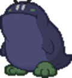
> {: .float-right-desktop }
> The average Gulpit is a burly mountain-dwelling loner, making them quite a rare sight – and a frightening prospect for a traveller lost in the mountains. They can be pretty territorial, and grabby, but they're pretty handy guides.
>
> ***+2 Heart**{: .heart-color }*{: .text-gamma .header-font }  
> *1 Power, 0 Defense*{: .text-gamma .header-font }  
>
> {: .specie-pros-callout }
> > *Pros*{: .text-gamma .header-font }  
> > *+ Aim (Spit)*{: .heart-color }  
> > *+ Athletics (Brawn)*{: .heart-color }  
> > *or **+ Bully (Shove)**{: .courage-color }*{: .mgl }  
> > *+ Knowhow (Mountains)*{: .spirit-color }  
> > *or **+ Notice (High Altitude)**{: .spirit-color }*{: .mgl }  
> > 1 Resist (Ice)
>
> {: .specie-cons-callout }
> > *Cons*{: .text-gamma .header-font }  
> > N/A
>
> {: .specie-inner-callout }
> > *Tech Defaults*{: .text-gamma .header-font }  
> >
> > Launch  
> > *Snatch*{: .alt-grey-line }  
> > Strong, Tool (Ranged)  
> > *Throw*{: .alt-grey-line }  
> >
>
> {: .specie-inverted-callout }
> > *Example Techniques*{: .text-gamma .header-font .text-grey-lt-000 }  
> >
> > {: .specie-inner-callout }  
> > > *Tongue Lash*{: .header-font } (**0 FP**{: .spirit-color })  
> > > An aggressive lick with a big, gross tongue! Has a tendency to latch onto things the target would rather keep.  
> > > *Coordination*{: .heart-color }:  
> > > *Nice!*{: .nice-color }: 2 DMG  
> > > *Good!*{: .good-color }: 4 DMG  
> > > *Bully*:  
> > > Choose one option based on your Grades of Success.  
> > > *Nice!*{: .nice-color }: 1d6 Coins, +1d6 per Grade of Success  
> > > *Good!*{: .nice-color }: A small Item  
> > > *Great!*{: .nice-color }: A large Item  
> > > *Wonderful!*{: .nice-color }: An equipped Item  
> > > *Snatch, Strong, Unwieldy*{: .italic }
> > >
> >
> > {: .specie-inner-callout }  
> > > *Rock Blaster*{: .header-font } (**3 FP**{: .spirit-color })  
> > > Spits out a rock from a carefully maintained pile; if they're lucky, it'll be one of the big ones.  
> > > *Aim (+ Spit)*{: .heart-color }:  
> > > Flip a coin; if it comes up Heads, deal more damage.  
> > > *Nice!*{: .nice-color }: 4 DMG / 8 DMG  
> > > *Tool (Ranged), Coin Toss (Strong x2), Strong, Commitment (Primary)*{: .italic }
> > >
> >
>

{: .specie-callout }
> ## Hammer Bro
> 
> 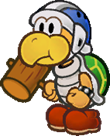
> {: .float-right-desktop }
> More confrontational than the average Koopa, these Bros are known for their combat prowess, bravery and camaraderie. Most Bro clans stick hard to a traditional weapon, though hammers are traditional. Whatever their specialty, they make for fierce combatants.
>
> ***+2 Heart**{: .heart-color } or **+1 Heart**{: .heart-color }, **+1 Courage**{: .courage-color }*{: .text-gamma .header-font }  
> *1 Power, 0 Defense*{: .text-gamma .header-font }  
>
> {: .specie-pros-callout }
> > *Pros*{: .text-gamma .header-font }  
> > *+ Aim (Throw)*{: .heart-color }  
> > *+ Coordination (Weapon of Choice)*{: .heart-color }  
> > *Choose a specific weapon for this specialisation during character creation.*{: .mgl .fs-3 }  
> > *+ Cheer (Boosts)*{: .courage-color }  
> > Immune (Fear)
>
> {: .specie-cons-callout }
> > *Cons*{: .text-gamma .header-font }  
> > Weakness (Magic)  
> > *If a magic attack would deal damage to you, it deals +1 damage.*{: .mgl .fs-3 }  
> > *Statuses you suffer from magical sources receive +1 Level and +1 Duration.*{: .mgl .fs-3 }
>
> {: .specie-inner-callout }
> > *Tech Defaults*{: .text-gamma .header-font }  
> >
> > Boost (Attack)  
> > *Disarm x2*{: .alt-grey-line }  
> > Tool  
> > *Weaken (Attack)*{: .alt-grey-line }  
> >
>
> {: .specie-inverted-callout }
> > *Example Techniques*{: .text-gamma .header-font .text-grey-lt-000 }  
> >
> > {: .specie-inner-callout }  
> > > *Hammer Toss*{: .header-font } (**0 FP**{: .spirit-color })  
> > > Throws a hammer at range.  
> > > *Aim (+ Throw)*{: .heart-color }:  
> > > Auto: 1 DMG  
> > > *Nice!*{: .nice-color }: 2 DMG  
> > > *Tool (Ranged)*{: .italic }
> > >
> >
> > {: .specie-inner-callout }  
> > > *Psyche Up*{: .header-font } (**3 FP**{: .spirit-color })  
> > > Pump the target up for 4 turns.  
> > > *Cheer (+ Boosts)*{: .courage-color }:  
> > > *Nice!*{: .nice-color }: +1 Attack for 4 turns  
> > > *Good!*{: .good-color }: +2 Attack for 4 turns  
> > > *Great!*{: .great-color }: +3 Attack for 4 turns  
> > > *Wonderful!*{: .wonderful-color }: +4 Attack for 4 turns  
> > > *Boost (Attack) x4, Harmless (Indirect)*{: .italic }
> > >
> >
>

{: .specie-callout }
> ## Human
>
> 
> {: .float-right-desktop }
> Humans are exceptionally rare, though given their abilities, very well-known and familiar to most in the Mushroom Kingdom. As always, humans prove to be incredibly versatile, rising to meet any challenge.
>
> *+1 Any Stat, +1 Any Stat*{: .text-gamma .header-font }  
> *1 Power, 0 Defense*{: .text-gamma .header-font }  
>
> {: .specie-pros-callout }
> > *Pros*{: .text-gamma .header-font }  
> > \+ Skill Specialisation (Any) x2  
> > \+ 1 Inventory Slot
>
> {: .specie-cons-callout }
> > *Cons*{: .text-gamma .header-font }  
> > N/A  
>
> {: .specie-inner-callout }
> > *Tech Defaults*{: .text-gamma .header-font }  
> >
> > Tool  
> > 
> > \+ 2x Custom Set of Traits  
> > Custom Sets are defined during character creation. For Humans, they can include any Traits totalling no more than *3 FP*{: .spirit-color }, but can't include negative Traits.
> >
>
> {: .specie-inverted-callout }
> > *Example Techniques*{: .text-gamma .header-font .text-grey-lt-000 }  
> >
> > {: .specie-inner-callout }  
> > > *Weapon Strike*{: .header-font } (**0 FP**{: .spirit-color })  
> > > Attacks with a hand-held weapon.  
> > > *Coordination*{: .heart-color }:  
> > > Auto: 1 DMG  
> > > *Nice!*{: .nice-color }: 2 DMG  
> > > *Tool (Indirect)*{: .italic }
> > >
> >
> > {: .specie-inner-callout }  
> > > *Power Attack*{: .header-font } (**2 FP**{: .spirit-color })  
> > > A weapon attack with more power.  
> > > *Coordination*{: .heart-color }:  
> > > Auto: 2 DMG  
> > > *Nice!*{: .nice-color }: 4 DMG  
> > > *Tool (Indirect), Strong*{: .italic }
> > >
> >
>

{: .specie-callout }
> ## Jabbi
>
> 
> {: .float-right-desktop }
> The Jabbies are small and frail insects who hide away in long forsaken forests. Many scholars believe they're just a myth. When they do travel abroad, they make for persistent nuisances.
>
> ***-1 Heart**{: .heart-color }, **+2 Spirit**{: .spirit-color }*{: .text-gamma .header-font }  
> *0 Power, 0 Defense*{: .text-gamma .header-font }  
>
> {: .specie-pros-callout }
> > *Pros*{: .text-gamma .header-font }  
> > *+ Notice (Details)*{: .spirit-color }  
> > *+ Trickery (Dodge or Stealth)*{: .spirit-color }  
> > *+ Bully (Poison)*{: .courage-color }  
> > Fly
>
> {: .specie-cons-callout }
> > *Cons*{: .text-gamma .header-font }  
> > Weakness (Air)  
> > *You must make a **Steady**{: .courage-color } check versus Disorientation (1), lasting a number of turns equal to the damage taken (minimum 1 turn).*{: .mgl .fs-3 }  
> > Weakness (Crushing)  
> > *You take +2 damage and fall to the ground, unable to fly until you get some rest.*{: .mgl .fs-3 }  
> > *This leaves you Dazed (1) for a number of turns equal to the damage dealt.*{: .mgl .fs-3 }  
> > Handless  
> > Legless
>
> {: .specie-inner-callout }
> > *Tech Defaults*{: .text-gamma .header-font }  
> >
> > Disorient  
> > *Drain x2*{: .alt-grey-line }  
> > Lingering x2  
> > *Minion*{: .alt-grey-line }  
> > Repeat  
> >
>
> {: .specie-inverted-callout }
> > *Example Techniques*{: .text-gamma .header-font .text-grey-lt-000 }  
> >
> > {: .specie-inner-callout }  
> > > *Stinger Sucker*{: .header-font } (**0 FP**{: .spirit-color })  
> > > Meekly nips at an enemy in an attempt to drain their *HP*{: .heart-color }.  
> > > *Coordination*{: .heart-color }:  
> > > *Nice!*{: .nice-color }: 1 DMG  
> > > Restore *HP*{: .heart-color } equal to the damage dealt.  
> > > *Drain x2*{: .italic }
> > >
> >
> > {: .specie-inner-callout }  
> > > *Poison Flurry*{: .header-font } (**2 FP**{: .spirit-color })  
> > > Flies around the target and jabs at them repeatedly, delivering venom all the while.  
> > > *Coordination*{: .heart-color }:  
> > > Deal 1 DMG once for each Grade of Success.  
> > > *Bully (+ Poison)*{: .courage-color }:  
> > > *Nice!*{: .nice-color }: Lingering (1) for 2 turns  
> > > *Good!*{: .good-color }: Lingering (2) for 2 turns  
> > > *Repeat, Lingering x2*{: .italic }
> > >
> >
>

{: .specie-callout }
> ## Kong
>
> 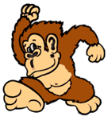
> {: .float-right-desktop }
> The term "Kong" refers to any number of intelligent simian species, not just a specific kind. Kongs tend to band together in crews, and despite their easy-going nature, they're quick to anger when their comrades are in danger.
>
> ***+2 Heart**{: .heart-color } or **+1 Heart**{: .heart-color }, **+1 Courage**{: .courage-color }*{: .text-gamma .header-font }  
> *1 Power, 0 Defense*{: .text-gamma .header-font }  
>
> {: .specie-pros-callout }
> > *Pros*{: .text-gamma .header-font }  
> > *+ Aim (Throw)*{: .heart-color }  
> > *+ Athletics (Brawn)*{: .heart-color }  
> > *or **+ Athletics (Climb)**{: .heart-color }*{: .mgl }  
> > *or **+ Athletics (Jump)**{: .heart-color }*{: .mgl }  
> > *Cheer (Allies)*{: .courage-color }  
> > Immune (Fear)
>
> {: .specie-cons-callout }
> > *Cons*{: .text-gamma .header-font }  
> > Weakness (Charm, Confuse, Provoke)  
> > *The Level and Duration of any of these Statuses inflicted on you is doubled.*{: .mgl .fs-3 }
>
> {: .specie-inner-callout }
> > *Tech Defaults*{: .text-gamma .header-font }  
> >
> > Aerial  
> > *Strong*{: .alt-grey-line }  
> > Throw  
> > *Tool*{: .alt-grey-line }  
> >
>
> {: .specie-inverted-callout }
> > *Example Techniques*{: .text-gamma .header-font .text-grey-lt-000 }  
> >
> > {: .specie-inner-callout }  
> > > *Banana Slamma*{: .header-font } (**0 FP**{: .spirit-color })  
> > > Leaps on top of the enemy with a double-fisted slam attack.  
> > > *Athletics (+ Jump)*{: .heart-color }:  
> > > *Good!*{: .good-color }: 6 DMG  
> > > *Aerial, Strong x2, Commitment, Unwieldy*{: .italic }
> > >
> >
> > {: .specie-inner-callout }  
> > > *Underhand Bowl*{: .header-font } (**3 FP**{: .spirit-color })  
> > > Bowls the enemy over with a rolling weapon (such as a barrel), hitting up to 4 targets after the first.  
> > > *Aim (+ Throw)*{: .heart-color }:  
> > > *Good!*{: .good-color }: 6 DMG / 5 DMG / 4 DMG / 3 DMG  
> > > *Strong x2, Strike-Through x4, Tool (Ranged), Commitment, Unwieldy*{: .italic }
> > >
> >
>

{: .specie-callout }
> ## Koopa
>
> 
> {: .float-right-desktop }
> Koopas are fit and easygoing. Though cowardice is often in their nature, they can be quite formidable when push comes to shove.  
> Often associated with Bowser's armies in the past, these days there are many peace-loving Koopas in the Mushroom Kingdom.
>
> ***+2 Heart**{: .heart-color }*{: .text-gamma .header-font }  
> *1 Power, 1 Defense*{: .text-gamma .header-font }  
>
> {: .specie-pros-callout }
> > *Pros*{: .text-gamma .header-font }  
> > *+ Athletics (Shells)*{: .heart-color }  
> > *or **+ Athletics (Swim)**{: .heart-color }*{: .mgl }  
> > *+ Guard (Melee)*{: .heart-color }  
> > *+ Steady (VS Weaken)*{: .courage-color }  
> > 1 Resist (Water)
>
> {: .specie-cons-callout }
> > *Cons*{: .text-gamma .header-font }  
> > Weakness (Aerial, Blast, Quake)  
> > *You are flipped over; you retain your Defense against Aerial and Blast attacks initially, but otherwise your Defense is negated for the duration.*{: .mgl .fs-3 }
> > *This leaves you completely Stunned (6) for the next 2 turns.*{: .mgl .fs-3 }
>
> {: .specie-inner-callout }
> > *Tech Defaults*{: .text-gamma .header-font }  
> > Boost (Defense)  
> > *Disorient*{: .alt-grey-line }  
> > Indirect  
> > *Overrun*{: .alt-grey-line }
> > 
> > *Optional*{: .underlined }: Variant (*Athletics*{: .heart-color } - Primary Only) on Indirect attacks
> >
>
> {: .specie-inverted-callout }
> > *Example Techniques*{: .text-gamma .header-font .text-grey-lt-000 }  
> >
> > {: .specie-inner-callout }  
> > > *Shell Toss*{: .header-font } (*0 FP*{: .spirit-color })  
> > > Hits one target in melee with your shell.  
> > > *Athletics (+Shells)*{: .heart-color }:  
> > > Auto: 1 DMG  
> > > *Nice!*{: .nice-color }: 2 DMG  
> > > *Indirect, Variant (**Athletics**{: .heart-color })*{: .italic }
> > >
> >
> > {: .specie-inner-callout }  
> > > *Shell Shield*{: .header-font } (*3 FP*{: .spirit-color })  
> > > Bolsters the target's Defense with a borrowed shell.  
> > > *Guard*{: .heart-color }:  
> > > *Nice!*{: .nice-color }: +1 Defense for 4 turns  
> > > *Good!*{: .good-color }: +2 Defense for 4 turns  
> > > *Great!*{: .great-color }: +3 Defense for 4 turns  
> > > *Wonderful!*{: .wonderful-color }: +4 Defense for 4 turns  
> > > *Boost (Defense) x4, Harmless (Indirect)*{: .italic }
> > >
> >
>

{: .specie-callout }
> ## Kremling
>
> 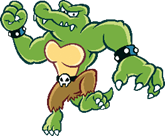
> {: .float-right-desktop }
> Reptiles from exotic lands, typically associated with the Kremling Krew – an amoral band of pirates and thugs.  
> Though there are exceptions. Despite their rough edges, they're confident, versatile adventurers, and are surprisingly industrious.
>
> ***+1 Heart**{: .heart-color }, **+1 Spirit**{: .spirit-color }*{: .text-gamma .header-font }  
> *1 Power, 0 Defense*{: .text-gamma .header-font }  
>
> {: .specie-pros-callout }
> > *Pros*{: .text-gamma .header-font }  
> > *+ Athletics (Brawn)*{: .heart-color }  
> > *or **+ Athletics (Jump)**{: .heart-color }*{: .mgl }  
> > *or **+ Athletics (Swim)**{: .heart-color }*{: .mgl }  
> > *+ Crafts (Gadgets)*{: .spirit-color }  
> > *or **+ Knowhow (Gadgets)**{: .spirit-color }*{: .mgl }  
> > *+ Bully (Threats)*{: .courage-color }  
> > Immune (Charm)  
> > Aquatic
>
> {: .specie-cons-callout }
> > *Cons*{: .text-gamma .header-font }  
> > Weakness (Ice)  
> > *You take +2 damage and become Dazed (1) for a number of turns equal to the damage taken.*{: .mgl .fs-3 }  
> > Weakness (Provoke)  
> > *The Level and Duration of any Provocation inflicted on you is doubled.*{: .mgl .fs-3 }  
>
> {: .specie-inner-callout }
> > *Tech Defaults*{: .text-gamma .header-font }  
> >
> > Aerial  
> > *Launch*{: .alt-grey-line }  
> > Strong  
> > *Tool*{: .alt-grey-line }  
> >
>
> {: .specie-inverted-callout }
> > *Example Techniques*{: .text-gamma .header-font .text-grey-lt-000 }  
> >
> > {: .specie-inner-callout }  
> > > *Wind-Up Punch*{: .header-font } (**0 FP**{: .spirit-color })  
> > > Readies a powerful right-hook, then launches it at the end of the next turn. You can't act during the turn you're winding up.  
> > > *Coordination*{: .heart-color }:  
> > > Auto: 5 DMG  
> > > *Nice!*{: .nice-color }: 10 DMG  
> > > *Strong x4, Delayed, Exhausting*{: .italic }
> > >
> >
> > {: .specie-inner-callout }  
> > > *Blunderbuss*{: .header-font } (**3 FP**{: .spirit-color })  
> > > Fires a heavy Kannonball from a blunderbuss, which barrels through the target to hit two targets behind them, too.  
> > > *Aim*{: .heart-color }:  
> > > *Nice!*{: .nice-color }: 3 DMG / 2 DMG / 1 DMG  
> > > *Good!*{: .good-color }: 6 DMG / 5 DMG / 4 DMG  
> > > *Strong x2, Strike-Through x2, Tool (Ranged), Unwieldy*{: .italic }
> > >
> >
>

{: .specie-callout }
> ## Lakitu
>
> 
> {: .float-right-desktop }
> Lakitu are offshoots of Koopas known for their partnership with the clouds. While they can walk around like a normal Koopa they rarely leave their clouds, preferring to attack from above.
>
> ***+2 Spirit***{: .text-gamma .header-font }  
> *1 Power, 0 Defense*{: .text-gamma .header-font }  
>
> {: .specie-pros-callout }
> > *Pros*{: .text-gamma .header-font }  
> > *+ Aim (Throw)*{: .heart-color }  
> > *+ Knowhow (Weather)*{: .spirit-color }  
> > *+ Trickery (Dodge)*{: .spirit-color }  
> > 1 Resist (Ice, Shock, Water)  
> > Carrier  
> > Fly  
> > Hover  
>
> {: .specie-cons-callout }
> > *Cons*{: .text-gamma .header-font }  
> > Weakness (Air)  
> > *You must make a **Steady**{: .courage-color } check versus Disorientation (1), lasting a number of turns equal to the damage taken (minimum 1 turn).*{: .mgl .fs-3 }
>
> {: .specie-inner-callout }
> > *Tech Defaults*{: .text-gamma .header-font }  
> >
> > Boost (*Dodge*{: .spirit-color })  
> > *Minion (Spiny)*{: .alt-grey-line }  
> > Ranged  
> > *Terrain (Weather)*{: .alt-grey-line }  
> >
>
> {: .specie-inverted-callout }
> > *Example Techniques*{: .text-gamma .header-font .text-grey-lt-000 }  
> >
> > {: .specie-inner-callout }  
> > > *Spiny Toss*{: .header-font } (**0 FP**{: .spirit-color })  
> > > Tosses a Spiny Egg at the foe.  
> > > *Aim (+ Throw)*{: .heart-color }:  
> > > Auto: 1 DMG  
> > > *Nice!*{: .nice-color }: 2 DMG  
> > > *Ranged*{: .italic }
> > >
> >
> > {: .specie-inner-callout }  
> > > *Cloud Nine*{: .header-font } (**3 FP**{: .spirit-color })  
> > > Hides the target away in the user's cloud, making it easier for them to *Dodge*{: .spirit-color } for 4 turns.  
> > > *Cheer*{: .courage-color }:  
> > > *Nice!*{: .nice-color }: +1d6 to *Dodge*{: .spirit-color } for 4 turns  
> > > *Good!*{: .good-color }: +2d6 to *Dodge*{: .spirit-color } for 4 turns  
> > > *Great!*{: .great-color }: +3d6 to *Dodge*{: .spirit-color } for 4 turns  
> > > *Wonderful!*{: .wonderful-color }: +4d6 to *Dodge*{: .spirit-color } for 4 turns  
> > > *Boost (**Dodge**{: .spirit-color }) x4, Harmless*{: .italic }
> > >
> >
>

{: .specie-callout }
> ## Lantern Ghost
>
> 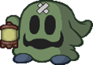
> {: .float-right-desktop }
> Despite the name, these relatives of Shy Guys are very much alive – they're just creepy. They thrive in dark and secluded places, but are seldom seen without a light to guide them and their allies. They have to take great care not to turn that light on themselves.
>
> ***+1 Spirit**{: .spirit-color }, **+1 Courage**{: .courage-color }*{: .text-gamma .header-font }  
> *1 Power, 0 Defense*{: .text-gamma .header-font }  
>
> {: .specie-pros-callout }
> > *Pros*{: .text-gamma .header-font }  
> > *+ Notice (Dark Places)*{: .spirit-color }  
> > *+ Trickery (Shadows)*{: .spirit-color }  
> > *+ Bully (Surprises)*{: .courage-color }  
> > Immune (Fear, Shadow)
>
> {: .specie-cons-callout }
> > *Cons*{: .text-gamma .header-font }  
> > Weakness (Sudden Light)  
> > *The light blinds you, leaving you Dazed (1) for a number of turns equal to the damage taken (minimum 1).*{: .mgl .fs-3 }
>
> {: .specie-inner-callout }
> > *Tech Defaults*{: .text-gamma .header-font }  
> >
> > Element (Light)  
> > *Fear x2*{: .alt-grey-line }  
> > Disorient  
> > *Snatch*{: .alt-grey-line }  
> >
> > *Optional*{: .underlined }: Element (Light) on indirectt or Ranged attacks
>
> {: .specie-inverted-callout }
> > *Example Techniques*{: .text-gamma .header-font .text-grey-lt-000 }  
> >
> > {: .specie-inner-callout }  
> > > *Flash of Light*{: .header-font } (**0 FP**{: .spirit-color })  
> > > Waves a searingly bright lantern in the enemy's face.  
> > > *Coordination*{: .heart-color }:  
> > > *Good!*{: .good-color }: 2 DMG  
> > > *Bully*:  
> > > *Nice!*{: .nice-color }: Disorient (1) for 2 turns  
> > > *Good!*{: .good-color }: Disorient (2) for 2 turns  
> > > *Disorient x2, Element (Light), Indirect, Commitment (Primary), Unwieldy*{: .italic }
> > >
> >
> > {: .specie-inner-callout }  
> > > *Shadow-Play Spook*{: .header-font } (**7 FP**{: .spirit-color })  
> > > Uses the light from their lantern to conjure up vivid shadows, terrifying a group of enemies – causing them to either flee or cower in fear.  
> > > *Trickery (+ Shadows)*{: .spirit-color }:  
> > > *Nice!*{: .nice-color }: Stun (2) for 1 turns  
> > > *Good!*{: .good-color }: Stun (3) for 1 turns  
> > > *Fear x4, Empower x2, Group, Harmless (Indirect), Shorten x3*{: .italic }
> > >
> >
>

{: .specie-callout }
> ## Magikoopa
>
> 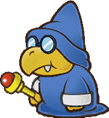
> {: .float-right-desktop }
> While a Koopa's magic requires study, it's not what you'd call spiritual. It tends to be pragmatic, straightforward, and a little bit weird.  
> Still, no one can deny they have a knack for it. When a Koopa devotes themselves to magical study they can make for powerful wizards. As long as they can keep a hold of their wands, anyway.
>
> ***+1 Heart**{: .heart-color }, **+1 Spirit**{: .spirit-color }*{: .text-gamma .header-font }  
> *1 Power, 0 Defense*{: .text-gamma .header-font }  
>
> {: .specie-pros-callout }
> > *Pros*{: .text-gamma .header-font }  
> > *+ Aim (Magic)*{: .heart-color }  
> > *+ Knowhow (Lore)*{: .spirit-color }  
> > *+ Magic (Boosts)*{: .spirit-color }  
> > *or **+ Magic (Shape-Change)**{: .spirit-color }*{: .mgl }  
> > Efficient (Flight, Power-Ups, Shape-Change)
>
> {: .specie-cons-callout }
> > *Cons*{: .text-gamma .header-font }  
> > Weakness (Confuse)  
> > *The Level and Duration of any Confusion inflicted on you is doubled.*{: .mgl .fs-3 }
>
> {: .specie-inner-callout }
> > *Tech Defaults*{: .text-gamma .header-font }  
> >
> > Boost (Any)  
> > *Empower*{: .alt-grey-line }  
> > Tool (Ranged)  
> > *Weaken (Any)*{: .alt-grey-line }  
> >
>
> {: .specie-inverted-callout }
> > *Example Techniques*{: .text-gamma .header-font .text-grey-lt-000 }  
> >
> > {: .specie-inner-callout }  
> > > *Magic Blast*{: .header-font } (**0 FP**{: .spirit-color })  
> > > Fires a flashy magic missile at range.  
> > > *Aim (+ Magic)*{: .heart-color }:  
> > > Auto: 1 DMG  
> > > *Nice!*{: .nice-color }: 2 DMG  
> > > *Tool (Ranged)*{: .italic }
> > >
> >
> > {: .specie-inner-callout }  
> > > *Cursed Form*{: .header-font } (**6 FP**{: .spirit-color })  
> > > Transforms an enemy into a weaker form for 3 turns.  
> > > *Magic (+ Shape-Change)*{: .spirit-color }:  
> > > *Good!*{: .good-color }: -1 Attack, -1 Defense, for 3 turns  
> > > *Great!*{: .great-color }: -2 Attack, -2 Defense, for 3 turns  
> > > *Wonderful!*{: .wonderful-color }: -3 Attack, -3 Defense, for 3 turns  
> > > *Weaken (Attack) x3, Tool (Ranged), Weaken (Defense) x3, Harmless, Unwieldy*{: .italic }
> > >
> >
>

{: .specie-callout }
> ## Monty Mole
>
> 
> {: .float-right-desktop }
> Otherwise known simply as "moles", these stout creatures keep to themselves. When they do venture out of their burrows, it's usually not for very long, and – typically – for selfish, petty reasons.
>
> ***+2 Heart**{: .heart-color }*{: .text-gamma .header-font }  
> *1 Power, 0 Defense*{: .text-gamma .header-font }  
>
> {: .specie-pros-callout }
> > *Pros*{: .text-gamma .header-font }  
> > *+ Athletics (Burrow)*{: .heart-color }  
> > *+ Aim (Throw)*{: .heart-color }  
> > *+ Trickery (Stealth)*{: .spirit-color }  
> > Elevation  
> > *Requires elevated earth to burrow into.*{: .mgl .fs-3 }
>
> {: .specie-cons-callout }
> > *Cons*{: .text-gamma .header-font }  
> > Weakness (Quake)  
> > *Has no effect unless you're currently underground.*{: .mgl .fs-3 }  
> > *If you're currently underground, you're forced to the surface, dealing +2 damage and completely Stunning (6) you for the next turn.*{: .mgl .fs-3 }
>
> {: .specie-inner-callout }
> > *Tech Defaults*{: .text-gamma .header-font }  
> >
> > Aerial  
> > *Secure (Burrowed)*{: .alt-grey-line }  
> > Selective  
> > *Tool (Ranged)*{: .alt-grey-line }  
> >
>
> {: .specie-inverted-callout }
> > *Example Techniques*{: .text-gamma .header-font .text-grey-lt-000 }  
> >
> > {: .specie-inner-callout }  
> > > *Debris Toss*{: .header-font } (**0 FP**{: .spirit-color })  
> > > Hurls whatever you can find at the foe; if you're lucky, it'll be sharp.  
> > > *Aim (+ Throw)*{: .heart-color }:  
> > > Roll 1d6; on a 1s, deal damage to an ally. on a 6, deals more damage.  
> > > *Nice!*{: .nice-color }: 2 DMG / 6 DMG  
> > > *Tool (Ranged), Lucky Hit (Strong x2), Commitment*{: .italic }
> > >
> >
> > {: .specie-inner-callout }  
> > > *Burrowing Piledriver*{: .header-font } (**3 FP**{: .spirit-color })  
> > > Body slams the enemy, then burrows safely underground.  
> > > *Athletics*{: .heart-color }:  
> > > *Nice!*{: .nice-color }: 3 DMG  
> > > *Good!*{: .good-color }: 6 DMG  
> > > *Athletics (+ Burrow)*{: .heart-color }:  
> > > *Good!*{: .good-color }: Secure (1, Burrowed) for 1 turn  
> > > *Split (Secure, Self), Aerial, Strong x2, Unwieldy x2*{: .italic }
> > >
> >
>

{: .specie-callout }
> ## Nimbus
>
> 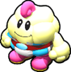
> {: .float-right-desktop }
> Concept by *@bigmeatyflaws*{: .courage-color }  
> Nimbus folk are highly social people weather spirits who live among the clouds. Naturally their fluffy marshmallow-like bodies give them a knack for all things airborne and weather-related, though they also take on some volatility – the weather is hard to predict, after all.
>
> ***+1 Spirit**{: .spirit-color }, **+1 Courage**{: .courage-color }*{: .text-gamma .header-font }  
> *1 Power, 0 Defense*{: .text-gamma .header-font }  
>
> {: .specie-pros-callout }
> > *Pros*{: .text-gamma .header-font }  
> > *+ Knowhow (Weather)*{: .spirit-color }  
> > *or **Magic (Weather)**{: .spirit-color }*{: .mgl }  
> > *+ Cheer (Encourage)*{: .courage-color }  
> > *+ Perform (Appeal)*{: .courage-color }  
> > Immune (Water)  
> > *You heal **5 HP**{: .heart-color } instead.*{: .mgl .fs-3 }  
> > 1 Resist (Shock)  
> > *You receive the following as a Contact trait, lasting for 1 turn per point of Raw Damage:*{: .mgl .fs-3 }  
> > *The attacker takes 1 Piercing Shock DMG, and you make a **Steady**{: .courage-color } check; the attacker is Dazed (1) for 1 turn for each Grade of Success.*{: .mgl-big .fs-3 }  
> > Efficient (Elements, Flight, Weather)
>
> {: .specie-cons-callout }
> > *Cons*{: .text-gamma .header-font }  
> > Weakness (Air)  
> > *You must make a **Steady**{: .courage-color } check versus Disorientation, lasting a number of turns equal to the damage taken (minimum 1 turn).*{: .mgl .fs-3 }  
> > Weakness (Fire, Ice)  
> > *You become Dazed (1), lasting a number of turns equal to the damage taken (minimum 1 turn).*{: .mgl .fs-3 }  
>
> {: .specie-inner-callout }
> > *Tech Defaults*{: .text-gamma .header-font }  
> >
> > Hearty x2  
> > *Ranged*{: .alt-grey-line }  
> > Stun  
> > *Terrain (Weather)*{: .alt-grey-line }  
> >
> > *Optional*{: .underlined }: Element (Air/Ice/Shock/Water) on Indirect or Ranged Techniques
>
> {: .specie-inverted-callout }
> > *Example Techniques*{: .text-gamma .header-font .text-grey-lt-000 }  
> >
> > {: .specie-inner-callout }  
> > > *Thunderbolt*{: .header-font } (**0 FP**{: .spirit-color })  
> > > A barely controlled discharge of electricity.  
> > > *Aim*{: .heart-color }:  
> > > *Good!*{: .good-color }: 4 DMG  
> > > *Magic (+ Weather)*{: .spirit-color }:  
> > > *Nice!*{: .nice-color }: Stun (1) for 1 turn  
> > > *Good!*{: .good-color }: Stun (2) for 1 turn  
> > > *Element (Shock), Ranged, Commitment (Primary), Stun, Strong, Unwieldy*{: .italic }
> > >
> >
> > {: .specie-inner-callout }  
> > > *Recover Shower*{: .header-font } (**3 FP**{: .spirit-color })  
> > > Conjures a light drizzle over an ally to heal them.  
> > > *Magic (+ Weather)*{: .spirit-color }:  
> > > *Nice!*{: .nice-color }: *+4 HP*{: .heart-color }  
> > > *Good!*{: .good-color }: *+5 HP*{: .heart-color }  
> > > *Great!*{: .great-color }: *+6 HP*{: .heart-color }  
> > > *Element (Water), Hearty x3, Empower x3, Harmless (Indirect), Others*{: .italic }
> > >
> >
>

{: .specie-callout }
> ## Ninji
>
> 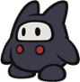
> {: .float-right-desktop }
> Concept by *@tact.elive*{: .courage-color }  
> Naturally sneaky and fleet-footed, the mysterious Ninji clan have often found their skills in high demand. They excel both as spies and as bodyguards, though sharp as they are, they aren't limited to grunt-work.
>
> ***+1 Heart**{: .heart-color }, **+1 Spirit**{: .spirit-color }*{: .text-gamma .header-font }  
> *1 Power, 0 Defense*{: .text-gamma .header-font }  
>
> {: .specie-pros-callout }
> > *Pros*{: .text-gamma .header-font }  
> > *+ Athletics (Jump)*{: .heart-color }  
> > *+ Trickery (Dodge)*{: .spirit-color }  
> > *+ Trickery (Stealth)*{: .spirit-color }  
> > 1 Resist (Shadow)    
> > Invisibility  
> > Mirage
>
> {: .specie-cons-callout }
> > *Cons*{: .text-gamma .header-font }  
> > Weakness (Sudden Light)  
> > *This Weakness only applies to your clones or while Invisible.*{: .mgl .fs-3 }  
> > *You are stunned by the light, Dazing (1) you for a turn for each point of damage taken (minimum 1 turn).*{: .mgl .fs-3 }
>
> {: .specie-inner-callout }
> > *Tech Defaults*{: .text-gamma .header-font }  
> >
> > Aerial  
> > *Ranged*{: .alt-grey-line }  
> > Secure (Invisible)  
> > *Variant (**Trickery**{: .spirit-color })*{: .alt-grey-line }  
> >
>
> {: .specie-inverted-callout }
> > *Example Techniques*{: .text-gamma .header-font .text-grey-lt-000 }  
> >
> > {: .specie-inner-callout }  
> > > *Jump Kick*{: .header-font } (**0 FP**{: .spirit-color })  
> > > Leaps at the foe from above with one quick strike.  
> > > *Atheltics (+ Jump)*{: .heart-color }:  
> > > Auto: 1 DMG  
> > > *Nice!*{: .nice-color }: 2 DMG  
> > > *Aerial*{: .italic }
> > >
> >
> > {: .specie-inner-callout }  
> > > *Shuriken Barrage*{: .header-font } (**4 FP**{: .spirit-color })  
> > > Tosses a flurry of shuriken at the foe, hitting multiple times.  
> > > *Aim*{: .heart-color }:  
> > > *Nice!*{: .nice-color }: 2 DMG  
> > > *Good!*{: .good-color }: 2 DMG x2  
> > > *Great!*{: .great-color }: 2 DMG x3  
> > > *Wonderful!*{: .wonderful-color }: 2 DMG x4  
> > > *Ranged, Strong x3, Unwieldy*{: .italic }
> > >
> >
>

{: .specie-callout }
> ## Noki
>
> 
> {: .float-right-desktop }
> Art by [Wolfsam](https://www.deviantart.com/wolfsam)  
> Nokis are a laidback aquatic people. They're not quite as proactive and prone to action as their land-dwelling brethren; instead, Nokis tend to solve their problems by relying on their tough shells and social graces.
>
> ***+1 Heart**{: .heart-color }, **+1 Courage**{: .courage-color }*{: .text-gamma .header-font }  
> *1 Power, 1 Defense*{: .text-gamma .header-font }  
>
> {: .specie-pros-callout }
> > *Pros*{: .text-gamma .header-font }  
> > *+ Athletics (Swim)*{: .heart-color }  
> > *+ Guard (Melee)*{: .heart-color }  
> > *+ Persuade (Diplomacy)*{: .courage-color }  
> > 1 Resist (Fire, Water)  
> > Aquatic
>
> {: .specie-cons-callout }
> > *Cons*{: .text-gamma .header-font }  
> > Weakness (Aerial, Blast, Quake)  
> > *You are flipped over; you retain your Defense against Aerial and Blast attacks initially, but otherwise your Defense is negated for the duration.*{: .mgl .fs-3 }  
> > *This leaves you completely Stunned (6) for the next 2 turns.*{: .mgl .fs-3 }  
> > Weakness (Shock)  
> > *You take +2 damage and become Dazed (1), lasting a number of turns equal to the damage taken.*{: .mgl .fs-3 }  
>
> {: .specie-inner-callout }
> > *Tech Defaults*{: .text-gamma .header-font }  
> >
> > Charm  
> > *Dismiss*{: .alt-grey-line }  
> > Element (Water)  
> > *Indirect*{: .alt-grey-line }  
> >
> > *Optional*{: .underlined }: Element (Water) on Indirect or Ranged Techniques  
> > *or*{: .underlined } Variant (*Athletics*{: .heart-color }) on Indirect attacks
>
> {: .specie-inverted-callout }
> > *Example Techniques*{: .text-gamma .header-font .text-grey-lt-000 }  
> >
> > {: .specie-inner-callout }  
> > > *Shell Spin*{: .header-font } (**0 FP**{: .spirit-color })  
> > > Withdraws into their shell, then spins at the enemy. Defense is boosted afterwards.  
> > > *Athletics*{: .heart-color }:  
> > > *Nice!*{: .nice-color }: 1 DMG  
> > > *Good!*{: .good-color }: 2 DMG  
> > > *Guard*{: .heart-color }:  
> > > *Good!*{: .good-color }: +1 Defense for 1 turn  
> > > *Indirect, Variant (**Athletics**{: .heart-color }), Split(Boost (Defense), Self), Unwieldy x2*{: .italic }
> > >
> >
> > {: .specie-inner-callout }  
> > > *Plea For Help*{: .header-font } (**3 FP**{: .spirit-color })  
> > > Talks an enemy into helping out.  
> > > *Persuade (+ Diplomacy)*{: .courage-color }:  
> > > *Nice!*{: .nice-color }: Charm (1) for 3 turns  
> > > *Good!*{: .good-color }: Charm (2) for 3 turns  
> > > *Great!*{: .great-color }: Charm (3) for 3 turns  
> > > *Charm x3, Ranged, Harmless*{: .italic }
> > >
> >
>

{: .specie-callout }
> ## Outsider
>
> 
> {: .float-right-desktop }
> Concept by *@bigmeatyflaws*{: .courage-color }  
> All manner of Outsiders exist on the fringe of reality, appearing with all sorts of physical differences.  
> Occasionally, they cross over and explore the Mushroom Kingdom. Outsider adventurers tend to have a knack for getting around in different dimensions.
>
> ***+1 Spirit**{: .spirit-color }, **+1 Courage**{: .courage-color }*{: .text-gamma .header-font }  
> *1 Power, 0 Defense*{: .text-gamma .header-font }  
>
> {: .specie-pros-callout }
> > *Pros*{: .text-gamma .header-font }  
> > *+ Knowhow (Dimensions)*{: .spirit-color }  
> > *+ Magic (Dimensions)*{: .spirit-color }  
> > *or **+ Trickery (Dimensions)**{: .spirit-color }*{: .mgl }  
> > *+ Persuade (Common Ground)*{: .courage-color }  
> > Intangibility  
> > Invisibility  
> > 1 of the following:  
> > *1 Resist (Element)*{: .mgl }  
> > *Choose the resisted element during character creation.*{: .mgl-big .fs-3 }  
> > *Aquatic*{: .mgl }  
> > *Efficient (Dimensions)*{: .mgl }  
> > *Hover*{: .mgl }  
> > *Latent (Mini Mushroom)*{: .mgl }  
> > *For **5 FP**{: .spirit-color }: Activate a Mini Mushroom as a Power-Up, targeting yourself.*{: .mgl-big .fs-3 }  
> > *Mimicry*{: .mgl }  
> > *Mirage*{: .mgl }  
>
> {: .specie-cons-callout }
> > *Cons*{: .text-gamma .header-font }  
> > At least 2 of the following:  
> > *Weakness (Confuse)*{: .mgl }  
> > *The Level and Duration of any Confusion inflicted on you is doubled.*{: .mgl-big .fs-3 }  
> > *Weakness (Disorient)*{: .mgl }  
> > *The Level and Duration of any Disorientation inflicted on you is doubled.*{: .mgl-big .fs-3 }  
> > *Weakness (Provoke)*{: .mgl }  
> > *The Level and Duration of any Provocation inflicted on you is doubled.*{: .mgl-big .fs-3 }  
> > *Handless*{: .mgl }  
> > *Legless*{: .mgl }  
> > *Sinker*{: .mgl }  
>
> {: .specie-inner-callout }
> > *Tech Defaults*{: .text-gamma .header-font }  
> >
> > Aerial  
> > *Swap x2*{: .alt-grey-line }  
> >
> > *Up to 2 of the following:*{: .underlined }  
> > Boost (*Dodge*{: .spirit-color })  
> > *Confuse x2*{: .alt-grey-line }  
> > Disorient  
> > *Divider*{: .alt-grey-line }  
> > Hearty x2  
> > *Tool*{: .alt-grey-line }  
> > Terrain (Any)  
> > *Choose during character creation*{: .mgl .fs-3 }  
> >
>
> {: .specie-inverted-callout }
> > *Example Techniques*{: .text-gamma .header-font .text-grey-lt-000 }  
> >
> > {: .specie-inner-callout }  
> > > *Backdoor Boot*{: .header-font } (**0 FP**{: .spirit-color })  
> > > Kicks at the foe, knocking them off-balance through a crack in space.  
> > > *Coordination*{: .heart-color }:  
> > > Auto: 1 DMG  
> > > *Nice!*{: .nice-color }: 2 DMG  
> > > *Trickery (+ Dimensions)*{: .spirit-color }:  
> > > *Nice!*{: .nice-color }: The foe switches positions with an adjacent ally  
> > > *Swap*{: .italic }
> > >
> >
> > {: .specie-inner-callout }  
> > > *Magic Window*{: .header-font } (**3 FP**{: .spirit-color })  
> > > Disappears into another dimension, then continuously reappears from every angle, bonking the foe over and over.  
> > > *Athletics*{: .heart-color }:  
> > > Deal 1 DMG once for each Grade of Success.  
> > > *Aerial, Repeat*{: .italic }
> > >
> >
>

{: .specie-callout }
> ## Pianta
>
> 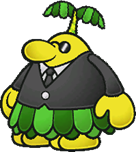
> {: .float-right-desktop }
> While most Piantas are laidback, their strong social skills and large stature has been known to go to their heads.  
> But whether you're in a fight or a business deal, it's always good to have a Pianta backing you up.
>
> ***+1 Heart**{: .heart-color }, **+1 Courage**{: .courage-color }*{: .text-gamma .header-font }  
> *1 Power, 0 Defense*{: .text-gamma .header-font }  
>
> {: .specie-pros-callout }
> > *Pros*{: .text-gamma .header-font }  
> > *+ Athletics (Brawn)*{: .heart-color }  
> > *+ Bully (Shakedown)*{: .courage-color }  
> > *+ Persuade (Deals)*{: .courage-color }  
> > 1 Resist (Earth, Shock, Water)
>
> {: .specie-cons-callout }
> > *Cons*{: .text-gamma .header-font }  
> > Weakness (Fire)  
> > *You take +2 damage and suffer from a Lingering (1) burn, lasting a number of turns equal to the damage taken.*{: .mgl .fs-3 }
>
> {: .specie-inner-callout }
> > *Tech Defaults*{: .text-gamma .header-font }  
> >
> > Flowery  
> > *Launch*{: .alt-grey-line }  
> > Strong  
> > *Throw*{: .alt-grey-line }  
> >
>
> {: .specie-inverted-callout }
> > *Example Techniques*{: .text-gamma .header-font .text-grey-lt-000 }  
> >
> > {: .specie-inner-callout }  
> > > *Brawny Backhand*{: .header-font } (**0 FP**{: .spirit-color })  
> > > Smacks the enemy around with brute strength.  
> > > *Coordination*{: .heart-color }:  
> > > Auto: 2 DMG  
> > > *Nice!*{: .nice-color }: 2 DMG x2  
> > > *Strong*{: .italic }
> > >
> >
> > {: .specie-inner-callout }  
> > > *Chuckster*{: .header-font } (**4 FP**{: .spirit-color })  
> > > Grabs an enemy in melee, then throws them at another target, damaging both targets.  
> > > *Athletics (+ Brawn)*{: .heart-color }:  
> > > *Nice!*{: .nice-color }: 3 DMG  
> > > *Good!*{: .good-color }: 6 DMG  
> > > *Strong x2, Throw x2, Unwieldy*{: .italic }
> > >
> >
>

{: .specie-callout }
> ## Piranha Plant
>
> 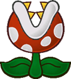
> {: .float-right-desktop }
> Vicious beasts and voracious eaters, it's no surprise Piranha Plants are feared as monsters. They rarely even learn to speak, though they're certainly capable. Most of them seem content to live as beasts.
>
> ***+1 Heart**{: .heart-color }*{: .text-gamma .header-font }  
> *2 Power, 0 Defense*{: .text-gamma .header-font }  
>
> {: .specie-pros-callout }
> > *Pros*{: .text-gamma .header-font }  
> > *+ Athletics (Burrow)*{: .heart-color }  
> > *+ Trickery (Camouflage)*{: .spirit-color }  
> > *+ Bully (Poison)*{: .courage-color }  
> > Immune (Poison, Water)  
> > *You heal **5 HP**{: .heart-color } instead.*{: .mgl .fs-3 }  
> > Elevation  
> > *Requires elevated earth to burrow into.*{: .mgl .fs-3 }
>
> {: .specie-cons-callout }
> > *Cons*{: .text-gamma .header-font }  
> > Weakness (Fire)  
> > *You take +2 damage and suffer from a Lingering (1) burn, lasting a number of turns equal to the damage taken.*{: .mgl .fs-3 }  
> > Weakness (Quake)  
> > *Has no effect unless you're currently underground.*{: .mgl .fs-3 }  
> > *If you're currently underground, you're forced to the surface, dealing +2 damage and completely Stunning (6) you for the next turn.*{: .mgl .fs-3 }  
>
> {: .specie-inner-callout }
> > *Tech Defaults*{: .text-gamma .header-font }  
> >
> > Lingering x2  
> > *Secure (Burrowed)*{: .alt-grey-line }  
> > Selective  
> > *Underfoot*{: .alt-grey-line }  
> >
>
> {: .specie-inverted-callout }
> > *Example Techniques*{: .text-gamma .header-font .text-grey-lt-000 }  
> >
> > {: .specie-inner-callout }  
> > > *Burrowing Bite*{: .header-font } (**0 FP**{: .spirit-color })  
> > > Burrows underground to the target, then bites.  
> > > *Coordination*{: .heart-color }:  
> > > Auto: 2 DMG  
> > > *Nice!*{: .nice-color }: 4 DMG  
> > > *Selective*{: .italic }
> > >
> >
> > {: .specie-inner-callout }  
> > > *Toxic Fangs*{: .header-font } (**4 FP**{: .spirit-color })  
> > > Lashes out in melee with potent toxic.  
> > > *Coordination*{: .heart-color }:  
> > > Auto: 2 DMG  
> > > *Nice!*{: .nice-color }: 4 DMG  
> > > *Bully (+ Poison)*{: .courage-color }:  
> > > *Nice!*{: .nice-color }: Lingering (2) for 4 turns  
> > > *Good!*{: .good-color }: Lingering (3) for 4 turns  
> > > *Great!*{: .great-color }: Lingering (4) for 4 turns  
> > > *Lingering x4, Empower*{: .italic }
> > >
> >
>

{: .specie-callout }
> ## Pokey
>
> 
> {: .float-right-desktop }
> These curious cacti grow in segments, and need very little to sustain themselves. Although only the head of a Pokey is truly alive, they can integrate and detach segments easily, allowing them to split off individual parts without much risk.
>
> ***+2 Heart**{: .heart-color }*{: .text-gamma .header-font }  
> *1 Power, 0 Defense*{: .text-gamma .header-font }  
>
> {: .specie-pros-callout }
> > *Pros*{: .text-gamma .header-font }  
> > *+ Aim (Throw)*{: .heart-color }  
> > *+ Athletics (Reach)*{: .heart-color }  
> > *+ Steady (Poise)*{: .courage-color }  
> >
>
> {: .specie-cons-callout }
> > *Cons*{: .text-gamma .header-font }  
> > Weakness (Air, Blast)  
> > *If you take damage from this attack, you have to make a **Good**{: .good-color } **Steady**{: .courage-color } check or be forced into your Detached State.*{: .mgl .fs-3 }  
> > Weakness (Quake)  
> > *Has no effect unless you're currently underground.*{: .mgl .fs-3 }  
> > *If you're currently underground, you're forced to the surface, dealing +2 damage and completely Stunning (6) you for the next turn.*{: .mgl .fs-3 }  
> > Handless  
> > Legless
>
> {: .specie-inner-callout }
> > *Other Traits*{: .text-gamma .header-font }  
> > State (Detached)
> > *You're able to remove your head from your body and move around as a single segment.*{: .mgl .fs-3}  
> > *Entering your Detached State is a free action that requires no check, but re-combining requires other segments and a **Steady**{: .courage-color } check.*{: .mgl .fs-3}  
> > *While detached you're smaller and slower, and your body is left completely innert. In addition to the obvious issues, your **Guard**{: .heart-color } and most kinds of **Athletics**{: .heart-color } (e.g. Jumping, running) are Weakened (1); however your **Trickery**{: .spirit-color } and certain kinds of **Athletics**{: .heart-color } (e.g. burrowing) are Boosted (1).*{: .mgl .fs-3}  
> > ***Good!**{: .good-color }: You recombine, exiting your Detached State.*{: .mgl .fs-3}  
> > ***Great!**{: .great-color }: You recombine quickly, exiting your Detached State as a free action.*{: .mgl .fs-3 }
>
> {: .specie-inner-callout }
> > *Tech Defaults*{: .text-gamma .header-font }  
> >
> > Minion (Pokeys)  
> > *Ranged*{: .alt-grey-line }  
> > Reach  
> > *Secure (Burrowed)*{: .alt-grey-line }  
> >
>
> {: .specie-inverted-callout }
> > *Example Techniques*{: .text-gamma .header-font .text-grey-lt-000 }  
> >
> > {: .specie-inner-callout }  
> > > *Pokey Throw*{: .header-font } (**0 FP**{: .spirit-color })  
> > > A lobbing attack made with the Pokey's own segments.  
> > > *Aim (+ Throw)*{: .heart-color }:  
> > > Auto: 2 DMG  
> > > *Nice!*{: .nice-color }: 4 DMG  
> > > *Ranged, Strong, Situational (Not while Detached)*{: .italic }
> > >
> >
> > {: .specie-inner-callout }  
> > > *Swaying Swing*{: .header-font } (**3 FP**{: .spirit-color })  
> > > The Pokey swings its whole body like a whip. Can't be used while Detached.  
> > > *Athletics (+ Reach)*{: .heart-color }:  
> > > *Nice!*{: .nice-color }: 4 DMG  
> > > *Good!*{: .good-color }: 8 DMG  
> > > *Bully*{: .courage-color }:  
> > > *Nice!*{: .nice-color }: Lingering (2) for 4 turns 
> > > *Good!*{: .good-color }: Lingering (3) for 4 turns  
> > > *Great!*{: .great-color }: Lingering (4) for 4 turns  
> > > *Reach, Strong x3, Variant(**Athletics**{: .heart-color }), Unweildy, Situational (-2 Full Body)*{: .italic }
> > >
> >
>

{: .specie-callout }
> ## Puff
>
> 
> {: .float-right-desktop }
> Puffs are carefree wind spirits who answer to no one – which unfortunately tends to give them unfounded confidence and a penchant for bullying. Still, their mastery over the skies is second to none, and they're quite useful to have around.
>
> ***+1 Spirit**{: .spirit-color }, **+1 Courage**{: .courage-color }*{: .text-gamma .header-font }  
> *1 Power, 0 Defense*{: .text-gamma .header-font }  
>
> {: .specie-pros-callout }
> > *Pros*{: .text-gamma .header-font }  
> > *+ Knowhow (Weather)*{: .spirit-color }  
> > *+ Notice (From Overhead)*{: .spirit-color }  
> > *+ Bully (Stun)*{: .courage-color }  
> > Fly  
> > Immune (Water)  
> > *You heal **5 HP**{: .heart-color } instead.*{: .mgl .fs-3 }  
> > 1 Resist (Shock)  
> > *You receive the following as a Contact trait, lasting for 1 turn per point of Raw Damage:*{: .mgl .fs-3 }  
> > *The attacker takes 1 Piercing Shock DMG, and you make a **Steady**{: .courage-color } check; the attacker is Dazed (1) for 1 turn for each Grade of Success.*{: .mgl-big .fs-3 }  
> > Clone  
> > Mirage
>
> {: .specie-cons-callout }
> > *Cons*{: .text-gamma .header-font }  
> > Weakness (Air)  
> > *You must make a **Steady**{: .courage-color } check versus Disorientation, lasting a number of turns equal to the damage taken (minimum 1 turn).*{: .mgl .fs-3 }  
> > Weakness (Fire, Ice)  
> > *You drift down to earth and become Dazed, lasting a number of turns equal to the damage taken (minimum 1 turn).*{: .mgl .fs-3 }  
> > Handless
>
> {: .specie-inner-callout }
> > *Tech Defaults*{: .text-gamma .header-font }  
> >
> > Indirect  
> > *Launch*{: .alt-grey-line }  
> > Stun  
> > *Terrain (Weather)*{: .alt-grey-line }  
> >
> > *Optional*{: .underlined }: Element (Air/Water) on Indirect or Ranged Techniques,  
> > *or*{: .underlined } Element (Shock) on Stun Techniques
>
> {: .specie-inverted-callout }
> > *Example Techniques*{: .text-gamma .header-font .text-grey-lt-000 }  
> >
> > {: .specie-inner-callout }  
> > > *Zip Zap*{: .header-font } (**0 FP**{: .spirit-color })  
> > > Bristles with static and collides with the foe.  
> > > *Coordination*{: .heart-color }:  
> > > *Nice!*{: .nice-color }: 1 DMG  
> > > *Good!*{: .good-color }: 2 DMG  
> > > *Bully (+ Stun)*{: .courage-color }:  
> > > *Nice!*{: .nice-color }: Stun (1) for 2 turns  
> > > *Good!*{: .good-color }: Stun (2) for 2 turns  
> > > *Great!*{: .great-color }: Stun (3) for 2 turns  
> > > *Wonderful!*{: .wonderful-color }: Stun (4) for 2 turns  
> > > *Element (Shock), Stun x2, Unwieldy*{: .italic }
> > >
> >
> > {: .specie-inner-callout }  
> > > *Downpour*{: .header-font } (**4 FP**{: .spirit-color })  
> > > Storms over the enemy as far as the wind will carry them.  
> > > *Coordination*{: .heart-color }:  
> > > *Nice!*{: .nice-color }: 4 DMG; attacks up to 1 more target behind the first for each additional Grade of Success.  
> > > *Element (Water), Indirect, Sequential, Strong*{: .italic }
> > >
> >
>

{: .specie-callout }
> ## Puni
>
> 
> {: .float-right-desktop }
> The Punies are small and frail insects who live isolated lives in long forgotten woods. Many scholars believe they're just a myth. However, when they travel abroad, their ability to work in a group makes them stalwart companions.
>
> ***-1 Heart**{: .heart-color }, **+1 Spirit**{: .spirit-color }, **+1 Courage**{: .courage-color }*{: .text-gamma .header-font }  
> *0 Power, 0 Defense*{: .text-gamma .header-font }  
>
> {: .specie-pros-callout }
> > *Pros*{: .text-gamma .header-font }  
> > *+ Notice (Details)*{: .spirit-color }  
> > *+ Trickery (Dodge)*{: .spirit-color }  
> > *or **+ Trickery (Stealth)**{: .spirit-color }*{: .mgl }  
> > *+ Cheer (Cooperate)*{: .courage-color }
>
> {: .specie-cons-callout }
> > *Cons*{: .text-gamma .header-font }  
> > Weakness (Crushing)  
> > *You take +2 damage and become Dazed (1), lasting a number of turns equal to the damage dealt.*{: .mgl .fs-3 }  
> > Handless
>
> {: .specie-inner-callout }
> > *Tech Defaults*{: .text-gamma .header-font }  
> >
> > Allies  
> > *Boost (**Dodge**{: .spirit-color })*{: .alt-grey-line }  
> > Flowery  
> > *Selective*{: .alt-grey-line }  
> > Minion
> >
>
> {: .specie-inverted-callout }
> > *Example Techniques*{: .text-gamma .header-font .text-grey-lt-000 }  
> >
> > {: .specie-inner-callout }  
> > > *Underfoot Jab*{: .header-font } (**0 FP**{: .spirit-color })  
> > > Meekly strikes at an enemy from underneath, escaping their notice  
> > > *Nice!*{: .nice-color }: 1 DMG  
> > > *Selective*{: .italic }
> > >
> >
> > {: .specie-inner-callout }  
> > > *Group Bouquet*{: .header-font } (**3 FP**{: .spirit-color })  
> > > Shares Flower Power with their allies, restoring their *FP*{: .spirit-color }; not including themselves.  
> > > *Cheer (+ Cooperate)*{: .courage-color }:  
> > > *Nice!*{: .nice-color }: *+1 FP*{: .spirit-color }  
> > > *Good!*{: .good-color }: *+2 FP*{: .spirit-color }  
> > > *Great!*{: .great-color }: *+3 FP*{: .spirit-color }  
> > > *Allies, Flowery x3, Harmless*{: .italic }
> > >
> >
>

{: .specie-callout }
> ## Puppet
>
> 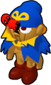
> {: .float-right-desktop }
> Rarely, the Stars have seen fit to bless inanimate objects with life. Puppets come in many forms, but their connection to the Stars always remains strong. For a Puppet, until their duty's done, all the world's a stage.
>
> ***+1 Spirit**{: .spirit-color }, **+1 Courage**{: .courage-color }*{: .text-gamma .header-font }  
> *1 Power, 1 Defense*{: .text-gamma .header-font }  
>
> {: .specie-pros-callout }
> > *Pros*{: .text-gamma .header-font }  
> > *+ Crafts (Woodwork)*{: .spirit-color }  
> > *+ Trickery (Camouflage)*{: .spirit-color }  
> > *+ Perform (Appeal)*{: .courage-color }  
> > Immune (Poison, Stars)  
> > 1 Resist (Shock)  
> > Construct (Lifelike)  
> > Resilient
>
> {: .specie-cons-callout }
> > *Cons*{: .text-gamma .header-font }  
> > Weakness (Blast)  
> > *You crumble to the floor and are unable to act, as if you've been KO'd. You retain your **HP**{: .heart-color }, and can recover through your Resilient Trait.*{: .mgl .fs-3 }  
> > Weakness (Fire)  
> > *You take +2 damage and suffer from a Lingering burn, lasting a number of turns equal to the damage taken.*{: .mgl .fs-3 }  
>
> {: .specie-inner-callout }
> > *Tech Defaults*{: .text-gamma .header-font }  
> >
> > Boost (Any)  
> > *Tool (Built-In)*{: .alt-grey-line }  
> > Variant (*Perform*{: .courage-color })  
> >
> > \+ 1x Custom Set of Traits  
> > Custom Sets are defined during character creation. For Puppets, they can include any Traits totalling no more than *2 FP*{: .spirit-color }, can include Tool (Built-In) for no additional *FP*{: .spirit-color } cost, and can't include negative Traits.
>
> {: .specie-inverted-callout }
> > *Example Techniques*{: .text-gamma .header-font .text-grey-lt-000 }  
> >
> > {: .specie-inner-callout }  
> > > *Hand Gun*{: .header-font } (**0 FP**{: .spirit-color })  
> > > *(Custom Trait: Strong)*{: .italic }  
> > > Blasts the enemy with a built-in popgun.  
> > > *Aim*{: .heart-color }:  
> > > Auto: 2 DMG  
> > > *Nice!*{: .nice-color }: 4 DMG  
> > > *Strong, Tool (Ranged)*{: .italic }
> > >
> >
> > {: .specie-inner-callout }  
> > > *Inspired Performance*{: .header-font } (**3 FP**{: .spirit-color })  
> > > Inspires their allies to put on a grand show.  
> > > *Cheer (+ Cooperate)*{: .courage-color }:  
> > > *Nice!*{: .nice-color }: +1d6 *Perform*{: .courage-color } for 3 turns  
> > > *Good!*{: .good-color }: +2d6 *Perform*{: .courage-color } for 3 turns  
> > > *Great!*{: .great-color }: +3d6 *Perform*{: .courage-color } for 3 turns  
> > > *Boost (**Perform**{: .courage-color }) x3, Allies, Harmless*{: .italic }
> > >
> >
>

{: .specie-callout }
> ## Raven
>
> 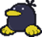
> {: .float-right-desktop }
> These mysterious birds are fast on their feet and from a quiet, contemplative life observing others, become quite knowledgeable in their fields. They tend to keep to themselves (unless they want something), and rarely speak unless they have something important to say.
>
> ***+2 Spirit**{: .spirit-color }*{: .text-gamma .header-font }  
> *1 Power, 0 Defense*{: .text-gamma .header-font }  
>
> {: .specie-pros-callout }
> > *Pros*{: .text-gamma .header-font }  
> > *+ Athletics (Climb)*{: .heart-color }  
> > *+ Knowhow (Any)*{: .spirit-color }  
> > *+ Trickery (Dodge)*{: .spirit-color }
>
> {: .specie-cons-callout }
> > *Cons*{: .text-gamma .header-font }  
> > Handless
>
> {: .specie-inner-callout }
> > *Tech Defaults*{: .text-gamma .header-font }  
> >
> > Aerial  
> > *Boost (Attack)*{: .alt-grey-line }  
> > Overrun  
> > *Snatch*{: .alt-grey-line }  
> >
>
> {: .specie-inverted-callout }
> > *Example Techniques*{: .text-gamma .header-font .text-grey-lt-000 }  
> >
> > {: .specie-inner-callout }  
> > > *Jump Squat*{: .header-font } (**0 FP**{: .spirit-color })  
> > > Leaps at an enemy and attempts to flatten them with a surprisingly heavy slam.  
> > > *Athletics*{: .heart-color }:  
> > > *Good!*{: .good-color }: 4 DMG  
> > > *Bully*{: .courage-color }:  
> > > *Good!*{: .good-color }: -1d6 *Coordination*{: .heart-color } for 2 turns  
> > > *Great!*{: .great-color }: -2d6 *Coordination*{: .heart-color } for 2 turns  
> > > *Aerial, Strong, Weaken (**Coordination**{: .heart-color }) x2, Commitment (Primary), Unwieldy x2*{: .italic }
> > >
> >
> > {: .specie-inner-callout }  
> > > *Sage's Wisdom*{: .header-font } (**3 FP**{: .spirit-color })  
> > > Advises their allies on the best way to fight their opponents.  
> > > *Knowhow (+ Battle)*{: .spirit-color }:  
> > > *Nice!*{: .nice-color }: +1 Attack for 3 turns  
> > > *Good!*{: .good-color }: +2 Attack for 3 turns  
> > > *Great!*{: .great-color }: +3 Attack for 3 turns  
> > > *Boost (Attack) x3, Allies, Harmless*{: .italic }
> > >
> >
>

{: .specie-callout }
> ## Rex
>
> 
> {: .float-right-desktop }
> Rexes are short-tempered dinosaurs from distant lands, with extremely flexible bodies that can scrunch up and stretch out like an accordion. That and their vestigial wings continue to baffle modern scholars, though they seem to be a distant relative to dragon-kind.
>
> ***+1 Heart**{: .heart-color }, **+1 Courage**{: .courage-color }*{: .text-gamma .header-font }  
> *1 Power, 0 Defense*{: .text-gamma .header-font }  
>
> {: .specie-pros-callout }
> > *Pros*{: .text-gamma .header-font }  
> > *+ Athletics (Run)*{: .heart-color }  
> > *+ Athletics (Scrunch)*{: .heart-color }  
> > *or **+ Steady (Scrunch)**{: .courage-color }*{: .mgl }  
> > *+ Bully (Burns)*{: .courage-color }  
> > 1 Resist (Fire)  
> > Carrier (Un-Scrunched)
>
> {: .specie-cons-callout }
> > *Cons*{: .text-gamma .header-font }  
> > Weakness (Aerial)  
> > *You retain your Defense, but if you take damage from this attack, you are forced into your Scrunched State.*{: .mgl .fs-3 }
>
> {: .specie-inner-callout }
> > *Other Traits*{: .text-gamma .header-font }  
> > State (Scrunched)  
> > *You can scrunch your body into a smaller state, or return to normal size, with **Athletics**{: .heart-color } or **Steady**{: .courage-color }.*{: .mgl .fs-3 }  
> > *This lowers your defenses, Weakening **Guard**{: .heart-color } and **Steady**{: .courage-color }. But you also become smaller and faster, Boosting relevant **Athletics**{: .heart-color } and **Trickery**{: .spirit-color } checks.*{: .mgl .fs-3 }  
> > ***Good!**{: .good-color }: You enter/exit your Scrunched State.*{: .mgl .fs-3 }  
> > ***Great!**{: .great-color }: You enter/exit your Scrunched State as a free action.*{: .mgl .fs-3 }  
>
> {: .specie-inner-callout }
> > *Tech Defaults*{: .text-gamma .header-font }  
> >
> > Element (Fire), Ranged  
> > *Launch*{: .alt-grey-line }  
> > Overrun  
> > *Spillover*{: .alt-grey-line }  
> >
>
> {: .specie-inverted-callout }
> > *Example Techniques*{: .text-gamma .header-font .text-grey-lt-000 }  
> >
> > {: .specie-inner-callout }  
> > > *Headlong Charge*{: .header-font } (**0 FP**{: .spirit-color })  
> > > Rushes in to strike all enemies in sight.  
> > > *Coordination*{: .heart-color }:  
> > > *Nice!*{: .nice-color }: 2 DMG  
> > > *Good!*{: .good-color }: 4 DMG  
> > > *Overrun, Strong, Unwieldy*{: .italic }
> > >
> >
> > {: .specie-inner-callout }  
> > > *Fire Breath*{: .header-font } (**3 FP**{: .spirit-color })  
> > > A mighty gout of flame from deep within; it leaves them exhausted for a turn after use.  
> > > *Aim*{: .heart-color }:  
> > > *Nice!*{: .nice-color }: 5 Fire DMG  
> > > *Good!*{: .good-color }: 10 Fire DMG  
> > > *Bully (+ Burns)*{: .courage-color }:  
> > > *Good!*{: .good-color }: Lingering (1) for 3 turns  
> > > *Great!*{: .great-color }: Lingering (2) for 3 turns  
> > > *Wonderful!*{: .wonderful-color }: Lingering (3) for 3 turns  
> > > *Element (Fire), Ranged, Strong x4, Lingering x3, Exhausting, Unwieldy x2*{: .italic }
> > >
> >
>

{: .specie-callout }
> ## Scuttlebug
>
> 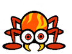
> {: .float-right-desktop }
> A variety of spider-like creatures, collectively referred to as "Scuttlebugs" – though depending on the region, Piders, Arantulas or Skeeters may be better known.  
> In any case, they share the same skittish and reclusive tendencies.
>
> ***+2 Spirit**{: .spirit-color }*{: .text-gamma .header-font }  
> *1 Power, 0 Defense*{: .text-gamma .header-font }  
>
> {: .specie-pros-callout }
> > *Pros*{: .text-gamma .header-font }  
> > *+ Athletics (Climb)*{: .heart-color }  
> > *+ Crafts (Web)*{: .spirit-color }  
> > *+ Notice (Tremors)*{: .spirit-color }  
> > Elevation  
> > *Requires an elevated position to attach a web. Can use **Crafts**{: .spirit-color } in place of **Athletics**{: .heart-color }.*{: .mgl .fs-3 }
>
> {: .specie-cons-callout }
> > *Cons*{: .text-gamma .header-font }  
> > Handless
>
> {: .specie-inner-callout }
> > *Tech Defaults*{: .text-gamma .header-font }  
> >
> > Aerial  
> > *Daze x2*{: .alt-grey-line }  
> > Ranged  
> > *Variant (**Crafts**{: .spirit-color })*{: .alt-grey-line }  
> >
>
> {: .specie-inverted-callout }
> > *Example Techniques*{: .text-gamma .header-font .text-grey-lt-000 }  
> >
> > {: .specie-inner-callout }  
> > > *Web-Launch*{: .header-font } (**0 FP**{: .spirit-color })  
> > > Fires a series of clumped up balls of webbing from the mouth.  
> > > *Aim*{: .heart-color }:  
> > > *Nice!*{: .nice-color }: 1 DMG  
> > > *Good!*{: .good-color }: 1 DMG x2  
> > > *Great!*{: .great-color }: 1 DMG x3  
> > > *Wonderful!*{: .wonderful-color }: 1 DMG x4  
> > > *Ranged, Strong, Unwieldy*{: .italic }
> > >
> >
> > {: .specie-inner-callout }  
> > > *Web Net*{: .header-font } (**5 FP**{: .spirit-color })  
> > > Casts a net of webbing over the enemy group, attempting to tangle them up.  
> > > *Crafts*{: .spirit-color }:  
> > > *Nice!*{: .nice-color }: Daze (1) for 4 turns  
> > > *Good!*{: .good-color }: Daze (2) for 4 turns  
> > > *Great!*{: .great-color }: Daze (3) for 4 turns  
> > > *Wonderful!*{: .wonderful-color }: Daze (4) for 4 turns  
> > > *Daze x4, Group, Variant (**Crafts**{: .spirit-color }), Harmless (Indirect)*{: .italic }
> > >
> >
>

{: .specie-callout }
> ## Shaman
>
> 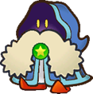
> {: .float-right-desktop }
> While the common people refer to them as Shamans, this tribe are mysterious magicians, drawing power from the Stars themselves. Mystifying though they may be, they're generally good-natured.
>
> ***+2 Spirit**{: .spirit-color }*{: .text-gamma .header-font }  
> *1 Power, 0 Defense*{: .text-gamma .header-font }  
>
> {: .specie-pros-callout }
> > *Pros*{: .text-gamma .header-font }  
> > *+ Knowhow (Lore)*{: .spirit-color }  
> > *+ Magic (Oracle)*{: .spirit-color }  
> > *+ Magic (Status Buffs)*{: .spirit-color }  
> > Efficient (Buffs, Enchantments, Fortune Telling)
>
> {: .specie-cons-callout }
> > *Cons*{: .text-gamma .header-font }  
> > Weakness (Confuse)  
> > *The Level and Duration of any Confusion inflicted on you is doubled.*{: .mgl .fs-3 }
>
> {: .specie-inner-callout }
> > *Tech Defaults*{: .text-gamma .header-font }  
> >
> > Boost (Any)  
> > *Confuse x2*{: .alt-grey-line }  
> > Daze x2  
> > *Ranged*{: .alt-grey-line }  
> >
>
> {: .specie-inverted-callout }
> > *Example Techniques*{: .text-gamma .header-font .text-grey-lt-000 }  
> >
> > {: .specie-inner-callout }  
> > > *Migraine Missile*{: .header-font } (**0 FP**{: .spirit-color })  
> > > Shoots the foe with a magic blast that induces a headache, Confusing them for 2 turns.  
> > > *Aim*{: .heart-color }:  
> > > *Nice!*{: .nice-color }: 1 DMG  
> > > *Good!*{: .good-color }: 2 DMG  
> > > *Magic*{: .spirit-color }:  
> > > *Nice!*{: .nice-color }: Confuse (1) for 2 turns  
> > > *Good!*{: .good-color }: Confuse (2) for 2 turns  
> > > *Great!*{: .great-color }: Confuse (3) for 2 turns  
> > > *Wonderful!*{: .wonderful-color }: Confuse (4) for 2 turns  
> > > *Confuse x4, Ranged, Shorten x2, Unwieldy*{: .italic }
> > >
> >
> > {: .specie-inner-callout }  
> > > *Power Drain*{: .header-font } (**5 FP**{: .spirit-color })  
> > > Steals power from an enemy, lowering their Attack and boosting another target's, for 2 turns.  
> > > *Magic (+ Status Buffs)*{: .spirit-color }:  
> > > *Great!*{: .great-color }: +1/-1 Attack for 2 turns  
> > > *Wonderful!*{: .wonderful-color }: +2/-2 Attack for 2 turns  
> > > *Excellent!*{: .excellent-color }: +3/-3 Attack for 2 turns  
> > > *Split (1: Boost (Attack) x3, Others, 2: Weaken (Attack) x3), Ranged, Shorten, Harmless, Unwieldy x2*{: .italic }
> > >
> >
>

{: .specie-callout }
> ## Shy Guy
>
> 
> {: .float-right-desktop }
> Shy Guys are mysterious, childlike tricksters. While they tend to be selfish and scatterbrained, they have been known to rally together, and prove to be capable craftsmen – although it's usually for selfish causes.
>
> ***+1 Spirit**{: .spirit-color }, **+1 Courage**{: .courage-color }*{: .text-gamma .header-font }  
> *1 Power, 0 Defense*{: .text-gamma .header-font }  
>
> {: .specie-pros-callout }
> > *Pros*{: .text-gamma .header-font }  
> > *+ Crafts (Jury-Rig)*{: .spirit-color }  
> > *+ Trickery (Bluff)*{: .spirit-color }  
> > *+ Cheer (Athletics)*{: .courage-color }  
> > Immune (Charm, Provoke)
>
> {: .specie-cons-callout }
> > *Cons*{: .text-gamma .header-font }  
> > Weakness (Fear)  
> > *The Level and Duration of all Statuses you suffer associated with fear are doubled.*{: .mgl .fs-3 }
>
> {: .specie-inner-callout }
> > *Tech Defaults*{: .text-gamma .header-font }  
> >
> > Aerial  
> > *Disarm x2*{: .alt-grey-line }  
> > Snatch  
> > *Variant (**Trickery**{: .spirit-color })*{: .alt-grey-line }  
> >
>
> {: .specie-inverted-callout }
> > *Example Techniques*{: .text-gamma .header-font .text-grey-lt-000 }  
> >
> > {: .specie-inner-callout }  
> > > *Acrobatics*{: .header-font } (**0 FP**{: .spirit-color })  
> > > Flips onto the enemy, with a chance to hit critically with a foot flurry.  
> > > *Athletics*{: .heart-color }:  
> > > Roll 1d6:  
> > > - 1-5:  
> > >   *Nice!*{: .nice-color }: 1 DMG  
> > >   *Good!*{: .good-color }: 2 DMG  
> > > - 6:  
> > >   *Nice!*{: .nice-color }: 1 DMG  
> > >   *Good!*{: .good-color }: 2 DMG  
> > >   *Great!*{: .great-color }: 2 DMG x2  
> > >   *Wonderful!*{: .wonderful-color }: 2 DMG x3  
> > >  
> > > *Aerial, Lucky Hit (Strong x2), Unwieldy*{: .italic }
> > >
> >
> > {: .specie-inner-callout }  
> > > *Snatch Run*{: .header-font } (**5 FP**{: .spirit-color })  
> > > Runs past grounded targets and attempts to steal their Tools, taking it off the enemy and Disarming them.  
> > > *Trickery*{: .spirit-color }:  
> > > *Nice!*{: .nice-color }: Disarm Tool (3) for 3 turns  
> > > *Good!*{: .good-color }: Disarm Tool (4) for 3 turns  
> > > *Great!*{: .great-color }: Disarm Tool (5) for 3 turns  
> > > *Wonderful!*{: .wonderful-color }: Disarm Tool (6) for 3 turns  
> > > *Disarm (Tool) x6, Empower x2, Overrun, Harmless, Shorten x3*{: .italic }
> > >
> >
>

{: .specie-callout }
> ## Smorg
>
> 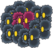
> {: .float-right-desktop }
> Smorgs are artificial lifeforms with shady origins, though most attribute them to X-Naut experiments. They can propagate at alarming rates if left unchecked, collecting into dangerous groups. Each individual Smorg in the hive works together to take on complex shapes.
>
> ***+2 Heart**{: .heart-color }*{: .text-gamma .header-font }  
> *1 Power, 0 Defense*{: .text-gamma .header-font }  
>
> {: .specie-pros-callout }
> > *Pros*{: .text-gamma .header-font }  
> > *+ Athletics (Grapple)*{: .heart-color }  
> > *+ Trickery (Mimicry)*{: .spirit-color }  
> > *+ Steady (Clone)*{: .courage-color }  
> > Immune (Charm)  
> > Clone  
> > Mimicry  
> > *You can use **Athletics**{: .heart-color }, **Trickery**{: .spirit-color } or **Steady**{: .courage-color } for Mimicry checks, but not **Magic**{: .spirit-color }.*{: .mgl .fs-3 }
>
> {: .specie-cons-callout }
> > *Cons*{: .text-gamma .header-font }  
> > Weakness (Air, Blast)  
> > *You take +2 damage and become Disoriented (1) as individual Smorgs are thrown out from the group, lasting a number of turns equal to the damage taken. You can't take on or maintain shapes with Mimicry while Disoriented by this effect.*{: .mgl .fs-3 }  
> > Weakness (Confuse, Fear)  
> > *The Level and Duration of all Statuses you suffer associated with confusion or fear are doubled.*{: .mgl .fs-3 }  
> > Handless  
> > Legless
>
> {: .specie-inner-callout }
> > *Tech Defaults*{: .text-gamma .header-font }  
> >
> > Indirect  
> > *Minion (Smorg)*{: .alt-grey-line }  
> > Reach  
> > *Stun*{: .alt-grey-line }  
> >
>
> {: .specie-inverted-callout }
> > *Example Techniques*{: .text-gamma .header-font .text-grey-lt-000 }  
> >
> > {: .specie-inner-callout }  
> > > *Smorg Stomp*{: .header-font } (**0 FP**{: .spirit-color })  
> > > A single (disposable) Smorg launches through the air at a target.  
> > > *Athletics*{: .heart-color }:  
> > > *Nice!*{: .nice-color }: 2 DMG  
> > > *Indirect, Aerial, Commitment (Primary)*{: .italic }
> > >
> >
> > {: .specie-inner-callout }  
> > > *Miasma Sweep*{: .header-font } (**4 FP**{: .spirit-color })  
> > > A large bundle of Smorgs group into a claw, then swipe! The claw is able to strike at a row of enemies simultaneously, aiming high or low.  
> > > *Coordination*{: .heart-color }:  
> > > *Good!*{: .good-color }: 6 DMG  
> > > *Indirect, Overrun, Reach, Strong x2, Commitment (Primary), Unwieldy*{: .italic }
> > >
> >
>

{: .specie-callout }
> ## Snifit
>
> 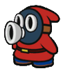
> {: .float-right-desktop }
> Snifits are similar in many ways to Shy Guys, save for their large masked snout. They're not as good at working together and are often more selfish than Shy Guys, but are more cunning and self-reliant as a result.
>
> ***+2 Spirit**{: .spirit-color }*{: .text-gamma .header-font }  
> *1 Power, 0 Defense*{: .text-gamma .header-font }  
>
> {: .specie-pros-callout }
> > *Pros*{: .text-gamma .header-font }  
> > *+ Aim (Shoot)*{: .heart-color }  
> > *+ Notice (Scent)*{: .spirit-color }  
> > *+ Trickery (Bluff)*{: .spirit-color }  
> > Immune (Fumes)
>
> {: .specie-cons-callout }
> > *Cons*{: .text-gamma .header-font }  
> > N/A
>
> {: .specie-inner-callout }
> > *Tech Defaults*{: .text-gamma .header-font }  
> >
> > Disarm x2  
> > *Launch*{: .alt-grey-line }  
> > Ranged  
> > *Variant (**Trickery**{: .spirit-color })*{: .alt-grey-line }  
> >
>
> {: .specie-inverted-callout }
> > *Example Techniques*{: .text-gamma .header-font .text-grey-lt-000 }  
> >
> > {: .specie-inner-callout }  
> > > *Bullet Barrage*{: .header-font } (**0 FP**{: .spirit-color })  
> > > Fires a volley of bullets from their snout.  
> > > *Aim (+ Shoot)*{: .heart-color }:  
> > > *Nice!*{: .nice-color }: 1 DMG  
> > > *Good!*{: .good-color }: 1 DMG x2  
> > > *Great!*{: .great-color }: 1 DMG x3  
> > > *Wonderful!*{: .wonderful-color }: 1 DMG x4  
> > > *Ranged, Strong, Unwieldy*{: .italic }
> > >
> >
> > {: .specie-inner-callout }  
> > > *Cannonball*{: .header-font } (**5 FP**{: .spirit-color })  
> > > Blasts a large single-shot cannonball from their snout, hitting up to 4 targets one-by-one.  
> > > Strikes get weaker after each target.  
> > > *Aim (+ Shoot)*{: .heart-color }:  
> > > *Nice!*{: .nice-color }: 3 DMG / 2 DMG / 1 DMG / 1 DMG  
> > > *Good!*{: .good-color }: 6 DMG / 5 DMG / 4 DMG / 3 DMG  
> > > *Ranged, Strong x2, Strike-Through x3, Unwieldy*{: .italic }
> > >
> >
>

{: .specie-callout }
> ## Siren
>
> 
> {: .float-right-desktop }
> These strange spirits come in many varieties, though as rare as they are it's hard to tell what they are exactly.  
> They're largely gifted with magic of the elements, though given how flighty they are, what they'll choose to do with it is difficult to predict.
>
> ***+2 Spirit**{: .spirit-color }*{: .text-gamma .header-font }  
> *1 Power, 0 Defense*{: .text-gamma .header-font }  
>
> {: .specie-pros-callout }
> > *Pros*{: .text-gamma .header-font }  
> > "Element": Any  
> > *Element must be specified during character creation.*{: .mgl .fs-3 }  
> > *If a Siren gains an Elemental subspecies (e.g. Breezy), their element must match that subspecies.*{: .mgl .fs-3 }  
> > *+ Magic ("Element")*{: .spirit-color }  
> > *+ Magic (Illusion)*{: .spirit-color }  
> > *+ Bully ("Element")*{: .courage-color }  
> > 1 Resist ("Element")  
> > Devotion ("Element")  
> > *Elements besides your own are restricted.*{: .mgl .fs-3 }  
> > Efficient (Curses, De-Buffs, "Element", Illusions)  
> > Fly  
> > Hover
>
> {: .specie-cons-callout }
> > *Cons*{: .text-gamma .header-font }  
> > Weakness (Opposing Elements)  
> > *You take +2 damage and become Dazed (1) for a number of turns equal to the damage taken.*{: .mgl .fs-3 }  
> > *Your Opposing Elements are defined at the same time as your Element.*{: .mgl .fs-3 }  
> > Legless
>
> {: .specie-inner-callout }
> > *Tech Defaults*{: .text-gamma .header-font }  
> >
> > Empower  
> > *Ranged*{: .alt-grey-line }  
> > Weaken (Any)  
> >
> > \+ 1x Custom Set of Traits  
> > Custom Sets are defined during character creation. For Sirens, they can include any Traits totalling no more than *2 FP*{: .spirit-color }, must include Element ("Element") (for no additional *FP*{: .spirit-color } cost), and can't include negative Traits.  
> >
> > *Optional*{: .underlined }: Element ("Element") on any Technique  
> >
>
> {: .specie-inverted-callout }
> > *Example Techniques*{: .text-gamma .header-font .text-grey-lt-000 }  
> >
> > {: .specie-inner-callout }  
> > > *Burning Fist*{: .header-font } (**0 FP**{: .spirit-color })  
> > > Smacks the enemy with a fiery punch, burning them in the process.  
> > > *(Element: Fire, Custom Traits: Lingering x2)*{: .italic }  
> > > *Coordination*{: .heart-color }:  
> > > *Nice!*{: .nice-color }: 1 DMG  
> > > *Good!*{: .good-color }: 2 DMG  
> > > *Bully (+ Fire)*{: .courage-color }:  
> > > *Nice!*{: .nice-color }: Lingering (1) for 4 turns  
> > > *Good!*{: .good-color }: Lingering (2) for 4 turns  
> > > *Great!*{: .great-color }: Lingering (3) for 4 turns  
> > > *Wonderful!*{: .wonderful-color }: Lingering (4) for 4 turns  
> > > *Element (Fire), Lingering x4, Unwieldy*{: .italic }
> > >
> >
> > {: .specie-inner-callout }  
> > > *Hurricane*{: .header-font } (**3 FP**{: .spirit-color })  
> > > Blasts the enemy, pushing them into the targets behind them.  
> > > (Element: Air, Custom Traits: Launch)  
> > > *Magic (+ Air)*{: .spirit-color }:  
> > > *Nice!*{: .nice-color }: 2 DMG  
> > > *Good!*{: .good-color }: 4 DMG  
> > > *Bully (+ Air)*{: .courage-color }:  
> > > For each Grade of Success, the target is launched into an enemy behind them, dealing 2 DMG.  
> > > *Element (Air), Launch, Indirect, Strong, Variant (**Magic**{: .spirit-color }), Unwieldy*{: .italic }
> > >
> >
>

{: .specie-callout }
> ## Spinia
>
> 
> {: .float-right-desktop }
> Strange creatures composed of thin, springy boards.  
> After they wind themselves up they can spin around at high speeds, but have a difficult time with fine movement.
>
> ***+1 Heart**{: .heart-color }, **+1 Spirit**{: .spirit-color }*{: .text-gamma .header-font }  
> *1 Power, 0 Defense*{: .text-gamma .header-font }  
>
> {: .specie-pros-callout }
> > *Pros*{: .text-gamma .header-font }  
> > *+ Athletics (Spin)*{: .heart-color }  
> > *+ Trickery (Dodge)*{: .spirit-color }  
> > *+ Steady (Poise)*{: .courage-color }  
> > Immune (Dizzying)
>
> {: .specie-cons-callout }
> > *Cons*{: .text-gamma .header-font }  
> > Weakness (Crushing)  
> > *The Level and Duration of all Statuses you suffer from these attacks are doubled.*{: .mgl .fs-3 }  
> > Handless  
> > Legless
>
> {: .specie-inner-callout }
> > *Tech Defaults*{: .text-gamma .header-font }  
> >
> > Confuse x2  
> > *Counter*{: .alt-grey-line }  
> > Disorient  
> > *Overrun*{: .alt-grey-line }  
> >
> > *Optional*{: .underlined }: Variant (*Athletics*{: .heart-color }) on melee and Disorient Techniques
>
> {: .specie-inverted-callout }
> > *Example Techniques*{: .text-gamma .header-font .text-grey-lt-000 }  
> >
> > {: .specie-inner-callout }  
> > > *Quick Spin*{: .header-font } (**0 FP**{: .spirit-color })  
> > > Whirls straight into the foe!  
> > > *Athletics (+ Spin)*{: .heart-color }:  
> > > Auto: 1 DMG  
> > > *Nice!*{: .nice-color }: 2 DMG  
> > > *Variant (**Athletics**{: .heart-color })*{: .italic }
> > >
> >
> > {: .specie-inner-callout }  
> > > *Dizzy Blits*{: .header-font } (**3 FP**{: .spirit-color })  
> > > Runs circles around grounded foes while colliding with them, leaving them dizzy for a short time.  
> > > *Athletics (+ Spin)*{: .heart-color }:  
> > > *Good!*{: .good-color }: 4 DMG  
> > > *Athletics (+ Spin)*{: .heart-color }:  
> > > *Nice!*{: .nice-color }: Disorient (1) for 1 turn  
> > > *Good!*{: .good-color }: Disorient (2) for 1 turn  
> > > *Great!*{: .great-color }: Disorient (3) for 1 turn  
> > > *Wonderful!*{: .wonderful-color }: Disorient (4) for 1 turn  
> > > *Disorient x4, Variant (**Athletics**{: .heart-color }) x2, Overrun, Strong, Commitment (Primary), Unwieldy, Shorten x3*{: .italic }
> > >
> >
>

{: .specie-callout }
> ## Squeek  
>
> 
> {: .float-right-desktop }
> Squeeks are crafty little mice. Their keen noses and beady little eyes lead many to lives of crime, but their small stature and their potent senses keep them from getting into any serious trouble.
>
> ***+1 Spirit**{: .spirit-color }, **+1 Courage**{: .courage-color }*{: .text-gamma .header-font }  
> *1 Power, 0 Defense*{: .text-gamma .header-font }  
>
> {: .specie-pros-callout }
> > *Pros*{: .text-gamma .header-font }  
> > *+ Notice (Scent)*{: .spirit-color }  
> > *+ Trickery (Stealth **or**{: .italic } Theft)*{: .spirit-color }  
> > *+ Persuade (Smooth Talk)*{: .courage-color }  
> > Immune (Charm)
>
> {: .specie-cons-callout }
> > *Cons*{: .text-gamma .header-font }  
> > Weakness (Scent)  
> > *The Level and Duration of all Statuses you suffer from scent-based sources are doubled.*{: .mgl .fs-3 }
>
> {: .specie-inner-callout }
> > *Tech Defaults*{: .text-gamma .header-font }  
> > Confuse x2  
> > *Piercing*{: .alt-grey-line }  
> > Snatch 
> > *Variant (**Trickery**{: .spirit-color })*{: .alt-grey-line }
> > 
>
> {: .specie-inverted-callout }
> > *Example Techniques*{: .text-gamma .header-font .text-grey-lt-000 }  
> >
> > {: .specie-inner-callout }  
> > > *Tricky Slap*{: .header-font } (*0 FP*{: .spirit-color })  
> > > Slaps an enemy, ignoring defense.  
> > > *Coordination*{: .heart-color }:  
> > > Auto: 1 Piercing DMG  
> > > *Nice!*{: .nice-color }: 1 Piercing DMG x2  
> > > *Piercing*{: .italic }
> > >
> >
> > {: .specie-inner-callout }  
> > > *Tricky Thief*{: .header-font } (*0 FP*{: .spirit-color })  
> > > Steals an item from the target.  
> > > *Trickery (+Theft)*{: .spirit-color }:  
> > > Choose one option based on your Grades of Success.  
> > > *Nice!*{: .nice-color }: 1d6 Coins, +1d6 per Grade of Success  
> > > *Nice!*{: .nice-color }: A small Item  
> > > *Good!*{: .good-color }: A large Item  
> > > *Great!*{: .great-color }: An equipped Item  
> > > *Snatch, Empower, Harmless*{: .italic }
> > >
> >
>

{: .specie-callout }
> ## Star
>
> 
> {: .float-right-desktop }
> The Stars live high above the land, gazing down fondly upon all its inhabitants. While the most powerful have a responsibility to look over the world, individual Stars occasionally seek to adventure across it themselves.  
> While their magic is potent, it's most powerful when used to grant wishes to others.
>
> ***+2 Courage**{: .courage-color } or **+1 Spirit**{: .spirit-color }, **+1 Courage**{: .courage-color }*{: .text-gamma .header-font }  
> *1 Power, 0 Defense*{: .text-gamma .header-font }  
>
> {: .specie-pros-callout }
> > *Pros*{: .text-gamma .header-font }  
> > *+ Magic (Wishes)*{: .spirit-color }  
> > *+ Cheer (Wishes)*{: .courage-color }  
> > *+ Perform (Appeal)*{: .courage-color }  
> > Immune (Star)  
> > *You recover **HP**{: .heart-color } equal to the attack's raw damage (minimum **1 HP**{: .heart-color }).*{: .mgl .fs-3 }  
> > *If there's any excess **HP**{: .heart-color }, your Defense is Boosted (1) for a number of turns equal to the excess **HP**{: .heart-color }.*{: .mgl .fs-3 }  
> > Efficient (Wishes)  
> > Fly  
> > Hover
>
> {: .specie-cons-callout }
> > *Cons*{: .text-gamma .header-font }  
> > Weakness (Shadow)  
> > *You take double damage. If this Technique wouldn't usually deal damage, it deals 2 Piercing damage.*{: .mgl .fs-3 }  
> > *Your Defense is Weakened (1) for a number of turns equal to the damage taken.*{: .mgl .fs-3 }
> > Handless
>
> {: .specie-inner-callout }
> > *Tech Defaults*{: .text-gamma .header-font }  
> >
> > Aerial  
> > *Boost (Any)*{: .alt-grey-line }  
> > Dismiss  
> > *Flowery*{: .alt-grey-line }  
> >
> > *Optional*{: .underlined }: Element (Light) or Element (Star) on any Technique
>
> {: .specie-inverted-callout }
> > *Example Techniques*{: .text-gamma .header-font .text-grey-lt-000 }  
> >
> > {: .specie-inner-callout }  
> > > *Star Dive*{: .header-font } (**0 FP**{: .spirit-color })  
> > > Dives at the enemy from above.  
> > > 
> > > *(Normal Attack):*{: .italic}  
> > > *Coordination*{: .heart-color }:  
> > > Auto: 1 Star DMG  
> > > *Nice!*{: .nice-color }: 2 Star DMG  
> > > 
> > > *(Plummeting Attack):*{: .italic}  
> > > *Coordination*{: .heart-color }:  
> > > Auto: 2 Star DMG  
> > > *Nice!*{: .nice-color }: 4 Star DMG  
> > > *Aerial, Element (Star)*{: .italic }
> > >
> >
> > {: .specie-inner-callout }  
> > > *Empower*{: .header-font } (**2 FP**{: .spirit-color })  
> > > Grants an ally's wish to be strong with the blessing of the stars.  
> > > *Cheer (+ Wishes)*{: .courage-color }:  
> > > *Nice!*{: .nice-color }: +1 Attack for 4 turns  
> > > *Good!*{: .good-color }: +2 Attack for 4 turns  
> > > *Great!*{: .great-color }: +3 Attack for 4 turns  
> > > *Wonderful!*{: .wonderful-color }: +4 Attack for 4 turns  
> > > *Boost (Attack) x4, Element (Star), Others, Harmless*{: .italic }
> > >
> >
>

{: .specie-callout }
> ## Swooper
>
> 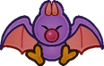
> {: .float-right-desktop }
> Swoopers, or "Swoops", are lonesome shadowy creatures. Their signature swooping motion gives them an edge when diving on foes from above – all the better to snack on their health.
>
> ***+2 Spirit**{: .spirit-color }*{: .text-gamma .header-font }  
> *1 Power, 0 Defense*{: .text-gamma .header-font }  
>
> {: .specie-pros-callout }
> > *Pros*{: .text-gamma .header-font }  
> > *+ Coordination (Swoop)*{: .heart-color }  
> > *+ Notice (Dark Places)*{: .spirit-color }  
> > *+ Steady (Poise)*{: .courage-color }  
> > Immune (Charm)  
> > 1 Resist (Poison, Shadow)  
> > Fly  
>
> {: .specie-cons-callout }
> > *Cons*{: .text-gamma .header-font }  
> > Weakness (Air)  
> > *You must make a **Steady**{: .courage-color } check versus Disorientation, lasting a number of turns equal to the damage taken (minimum 1 turn).*{: .mgl .fs-3 }  
> > Weakness (Sudden Light)  
> > *You are stunned by the light, Dazing you for a turn for each point of damage taken (minimum 1 turn).*{: .mgl .fs-3 }  
> > Handless
>
> {: .specie-inner-callout }
> > *Tech Defaults*{: .text-gamma .header-font }  
> >
> > Aerial  
> > *Drain x2*{: .alt-grey-line }  
> > Lingering x2  
> > *Piercing*{: .alt-grey-line }  
> >
>
> {: .specie-inverted-callout }
> > *Example Techniques*{: .text-gamma .header-font .text-grey-lt-000 }  
> >
> > {: .specie-inner-callout }  
> > > *Swoop*{: .header-font } (**0 FP**{: .spirit-color })  
> > > Swoops at the enemy from overhead.  
> > > 
> > > *(Normal Attack):*{: .italic }  
> > > *Coordination*{: .heart-color }:  
> > > Auto: 1 DMG  
> > > *Nice!*{: .nice-color }: 2 DMG  
> > > 
> > > *(Plummeting Attack):*{: .italic }  
> > > *Coordination*{: .heart-color }:  
> > > Auto: 2 DMG  
> > > *Nice!*{: .nice-color }: 4 DMG  
> > > *Aerial*{: .italic }
> > >
> >
> > {: .specie-inner-callout }  
> > > *Leech Life*{: .header-font } (**1 FP**{: .spirit-color })  
> > > Drains the enemy's life while poisoning them.  
> > > *Aim*{: .heart-color }:  
> > > *Nice!*{: .nice-color }: 2 DMG  
> > > *Good!*{: .good-color }: 4 DMG  
> > > Restore *HP*{: .heart-color } equal to the damage dealt, to a maximum of *4 HP*{: .heart-color }.  
> > > *Bully*{: .courage-color }:  
> > > *Good!*{: .good-color }: Lingering (1) for 3 turns  
> > > *Great!*{: .great-color }: Lingering (2) for 3 turns  
> > > *Wonderful!*{: .wonderful-color }: Lingering (3) for 3 turns  
> > > *Drain x2, Strong, Lingering x3, Unwieldy x2*{: .italic }
> > >
> >
>

{: .specie-callout }
> ## Thwomp
>
> 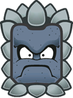
> {: .float-right-desktop }
> Thwomps are menacing brutes, designed as autonomous traps. They live for the simple pleasure of crashing into walls, floors and anything that gets in their way. There are even more deadly varieties, too, which get Bulkier and Spinier.
>
> ***+2 Heart**{: .heart-color }*{: .text-gamma .header-font }  
> *1 Power, 1 Defense*{: .text-gamma .header-font }  
>
> {: .specie-pros-callout }
> > *Pros*{: .text-gamma .header-font }  
> > *+ Athletics (Crash)*{: .heart-color }  
> > *+ Trickery (Camouflage)*{: .spirit-color }  
> > *+ Bully (Shove)*{: .courage-color }  
> > Immune (Poison)  
> > 1 Resist (Earth, Fire, Ice, Shock)  
> > Carrier  
> > Construct  
> > Fly  
> > Sinker 
>
> {: .specie-cons-callout }
> > *Cons*{: .text-gamma .header-font }  
> > Weakness (Blast)  
> > *Your tough veneer is chipped; your **Guard**{: .heart-color } is Weakened for a number of turns equal to the damage taken. Your Defense is negated for the duration.*{: .mgl .fs-3 }  
> > Weakness (Provoke)  
> > *The Level and Duration of any Provocation inflicted on you is doubled.*{: .mgl .fs-3 }  
> > Handless  
> > Legless
>
> {: .specie-inner-callout }
> > *Tech Defaults*{: .text-gamma .header-font }  
> >
> > Aerial (Plummet Only), Strong  
> > *Counter*{: .alt-grey-line }  
> > Overrun  
> > *Quake*{: .alt-grey-line }  
> >
>
> {: .specie-inverted-callout }
> > *Example Techniques*{: .text-gamma .header-font .text-grey-lt-000 }  
> >
> > {: .specie-inner-callout }  
> > > *THWOMP*{: .header-font } (**0 FP**{: .spirit-color })  
> > > SLAMS onto the enemy from above.  
> > > *Athletics (+ Crash)*{: .heart-color }:  
> > > *Nice!*{: .nice-color }: 3 DMG  
> > > *Good!*{: .good-color }: 6 DMG  
> > >  Can only be used while flying. You stop flying afterwards.  
> > > *Aerial (Plummet Only), Strong*{: .italic }
> > >
> >
> > {: .specie-inner-callout }  
> > > *Sideways THWOMP*{: .header-font } (**3 FP**{: .spirit-color })  
> > > SLAMS sideways, hurtling towards as many enemies as possible.
> > > *Athletics (+ Crash)*{: .heart-color }:  
> > > *Nice!*{: .nice-color }: 3 DMG  
> > > *Good!*{: .good-color }: 6 DMG  
> > > *Overrun, Strong x2, Variant (**Athletics**{: .heart-color }), Unwieldy*{: .italic }
> > >
> >
>

{: .specie-callout }
> ## Toad
>
> 
> {: .float-right-desktop }
> While the average Toad is passive to a fault, when driven to action they make for stalwart companions and devoted team players. Though as common as they are, the world is full of exceptions.
>
> ***+2 Courage**{: .courage-color }, or **+1 Heart**{: .heart-color } and **+1 Courage**{: .courage-color }*{: .text-gamma .header-font }  
> *1 Power, 0 Defense*{: .text-gamma .header-font }  
>
> {: .specie-pros-callout }
> > *Pros*{: .text-gamma .header-font }  
> > *+ Heal (Mushrooms)*{: .heart-color }  
> > *+ Perform (Appeal)*{: .courage-color }  
> > *+ Persuade (Schmooze)*{: .courage-color }  
> > \+ ½ Mushroom effectiveness (for Items, as user or target)
>
> {: .specie-cons-callout }
> > *Cons*{: .text-gamma .header-font }  
> > Weakness (Fear)  
> > *The Level and Duration of all Statuses you suffer associated with fear are doubled.*{: .mgl .fs-3 }
>
> {: .specie-inner-callout }
> > *Tech Defaults*{: .text-gamma .header-font }  
> >
> > Drain  
> > *Hearty x2*{: .alt-grey-line }  
> > Shared  
> > *Tool*{: .alt-grey-line }  
> >
> > *Optional*{: .underlined }: Add a single Split Slot to Hearty Techniques; it can't contain strikes
>
> {: .specie-inverted-callout }
> > *Example Techniques*{: .text-gamma .header-font .text-grey-lt-000 }  
> >
> > {: .specie-inner-callout }  
> > > *Drain Punch*{: .header-font } (**0 FP**{: .spirit-color })  
> > > Strike the foe and drain their health.  
> > > *Coordination*{: .heart-color }:  
> > > Auto: 1 DMG; drains to heal *1 HP*{: .heart-color }  
> > > *Nice!*{: .nice-color }: 2 DMG; drains to heal *1 HP*{: .heart-color }  
> > > *Drain*{: .italic }
> > >
> >
> > {: .specie-inner-callout }  
> > > *Mushroom Feast*{: .header-font } (**3 FP**{: .spirit-color })  
> > > Heals up to two targets with delicious mushrooms.  
> > > *Heal (+ Mushrooms)*{: .heart-color }:  
> > > *Nice!*{: .nice-color }: *+4 HP*{: .heart-color }  
> > > *Good!*{: .good-color }: *+6 HP*{: .heart-color }  
> > > *Great!*{: .great-color }: *+8 HP*{: .heart-color }  
> > > *+Split Slot(Hearty x4, Others), Empower, Harmless (Indirect)*{: .italic }
> > >
> >
>

{: .specie-callout }
> ## Ukiki
>
> 
> {: .float-right-desktop }
> A kind of agile monkey, distinguished from typical Kongs by their mischievous and selfish demeanour. Despite this they're quick and nimble, and their wits can prove useful – when they behave.
>
> ***+1 Spirit**{: .spirit-color }, **+1 Courage**{: .courage-color }*{: .text-gamma .header-font }  
> *1 Power, 0 Defense*{: .text-gamma .header-font }  
>
> {: .specie-pros-callout }
> > *Pros*{: .text-gamma .header-font }  
> > *+ Athletics (Climb)*{: .heart-color }  
> > *+ Trickery (Theft)*{: .spirit-color }  
> > *+ Steady (Poise)*{: .courage-color }  
> > Immune (Charm)
>
> {: .specie-cons-callout }
> > *Cons*{: .text-gamma .header-font }  
> > Weakness (Fear)  
> > *The Level and Duration of all Statuses you suffer associated with fear are doubled.*{: .mgl .fs-3 }
>
> {: .specie-inner-callout }
> > *Tech Defaults*{: .text-gamma .header-font }  
> >
> > Aerial  
> > *Disarm x2*{: .alt-grey-line }  
> > Snatch  
> > *Tool*{: .alt-grey-line }  
> >
>
> {: .specie-inverted-callout }
> > *Example Techniques*{: .text-gamma .header-font .text-grey-lt-000 }  
> >
> > {: .specie-inner-callout }  
> > > *Seed Spitter*{: .header-font } (**0 FP**{: .spirit-color })  
> > > Fires a volley of watermelon seeds from their mouth. Requires a steady supply of melons for the greedy monkey.  
> > > *Aim*{: .heart-color }:  
> > > *Nice!*{: .nice-color }: 1 DMG  
> > > *Good!*{: .good-color }: 1 DMG x2  
> > > *Great!*{: .great-color }: 1 DMG x3  
> > > *Wonderful!*{: .wonderful-color }: 1 DMG x4  
> > > *Tool (Ranged), Strong, Unwieldy*{: .italic }
> > >
> >
> > {: .specie-inner-callout }  
> > > *Gimme Gimme!*{: .header-font } (**4 FP**{: .spirit-color })  
> > > Brazenly rushes at the foe, clawing their prized Tools out from their hands – at least for a while.  
> > > *Trickery (+ Theft)*{: .spirit-color }:  
> > > *Nice!*{: .nice-color }: Disarm Tool (4) for 3 turns  
> > > *Good!*{: .good-color }: Disarm Tool (5) for 3 turns  
> > > *Great!*{: .great-color }: Disarm Tool (6) for 3 turns  
> > > *Disarm (Tool) x6, Empower x3, Harmless, Shorten x3*{: .italic }
> > >
> >
>

{: .specie-callout }
> ## Whomp
>
> 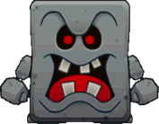
> {: .float-right-desktop }
> Whomps were constructed to be the perfect guards; with single-minded devotion and resilient bodies.  
> However, their design has one major shortcoming – their stubby limbs struggle to get back up. Still, they make reliable shields in battle.
>
> ***+1 Heart**{: .heart-color }*{: .text-gamma .header-font }  
> *1 Power, 2 Defense*{: .text-gamma .header-font }  
>
> {: .specie-pros-callout }
> > *Pros*{: .text-gamma .header-font }  
> > *+ Athletics (Intercept)*{: .heart-color }  
> > *+ Guard (Melee)*{: .heart-color }  
> > *+ Steady (Poise)*{: .courage-color }  
> > Immune (Poison)  
> > 1 Resist (Earth, Fire, Ice, Shock)  
> > Carrier  
> > Construct  
> > Sinker  
>
> {: .specie-cons-callout }
> > *Cons*{: .text-gamma .header-font }  
> > Weakness (Blast, Quake)  
> > *You retain your Defense against this attack, but you are flipped over, and your Defense is negated for the duration.*{: .mgl .fs-3 }  
> > *This leaves you completely Stunned (6) for 2 turns.*{: .mgl .fs-3 }  
> > Weakness (Provoke)  
> > *The Level and Duration of any Provocation inflicted on you is doubled.*{: .mgl .fs-3 }  
>
> {: .specie-inner-callout }
> > *Tech Defaults*{: .text-gamma .header-font }  
> >
> > Boost (Defense)  
> > *Quake*{: .alt-grey-line }  
> > Strong  
> > *Counter*{: .alt-grey-line }  
> >
>
> {: .specie-inverted-callout }
> > *Example Techniques*{: .text-gamma .header-font .text-grey-lt-000 }  
> >
> > {: .specie-inner-callout }  
> > > *WHOMP Tremor*{: .header-font } (**0 FP**{: .spirit-color })  
> > > SLAMS into the ground, causing tremors that deal Piercing damage to all enemies in contact with the ground, wall or ceiling.  
> > > *Athletics*{: .heart-color }:  
> > > *Good!*{: .good-color }: 1 Piercing Earth Quake DMG  
> > > *Great!*{: .great-color }: 2 Piercing Earth Quake DMG  
> > > *Quake, Piercing, Unwieldy x2*{: .italic }
> > >
> >
> > {: .specie-inner-callout }  
> > > *Readied Domino*{: .header-font } (**3 FP**{: .spirit-color })  
> > > Rocks back and forth, getting ready to SLAM onto enemies that attack in melee.  
> > > *Steady (+ Poise)*{: .courage-color }:  
> > > Gain Contact Trait for 1 turn for each Grade of Success, with the following effect:  
> > > *Nice!*{: .nice-color }: 6 DMG  
> > > *Counter, Strong x2, Self*{: .italic }
> > >
> >
>

{: .specie-callout }
> ## Wiggler
>
> 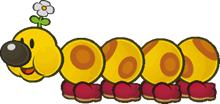
> {: .float-right-desktop }
> Wigglers are jovial creatures of the forest, and generally pleasant to be around – most of the time. When aggravated, these gentle giants become terrifying beasts, and their retribution is terrible.
>
> ***+1 Heart**{: .heart-color }, **+1 Courage**{: .courage-color }*{: .text-gamma .header-font }  
> *1 Power, 0 Defense*{: .text-gamma .header-font }  
>
> {: .specie-pros-callout }
> > *Pros*{: .text-gamma .header-font }  
> > *+ Athletics (Run)*{: .heart-color }  
> > *+ Cheer (FP)*{: .courage-color }  
> > *+ Steady (Poise)*{: .courage-color }  
> > Carrier
>
> {: .specie-cons-callout }
> > *Cons*{: .text-gamma .header-font }  
> > Weakness (Provoke)  
> > *The Level and Duration of any provocation inflicted on you (except from your Berserk State) is doubled.*{: .mgl .fs-3 }
>
> {: .specie-inner-callout }
> > *Other Traits*{: .text-gamma .header-font }  
> > State (Berserk)  
> > *You can become infuriated at the drop of a hat, giving you significant advantages while Provoked. With a successful **Knowhow**{: .spirit-color } action you can even set yourself off, becoming completely Provoked (6) by the nearest enemy target.*{: .mgl .fs-3 }  
> > *When you're dealt damage and aren't Berserk, you immediately become Provoked by the attacker, with a Level and Duration equal to the damage taken.*{: .mgl .fs-3 }  
> > *Going Berserk makes you fearsome in battle, Boosting (1) your **Athletics**{: .heart-color }, **Bully**{: .courage-color }, Attack and Defense.*{: .mgl .fs-3 }  
> > *However, you can't think straight, preventing you from making **Notice**{: .spirit-color }, **Cheer**{: .courage-color } or similar mental checks, and all of your Primary and Secondary Checks receive Unwieldy.*{: .mgl .fs-3 }  
> > *You can still resist and lower Status ailments with **Steady**{: .courage-color } – including Provocation.*{: .mgl .fs-3 }  
> > ***Good!**{: .good-color }: You become Provoked (6) for 2 turns.*{: .mgl .fs-3 }  
> > ***Great!**{: .great-color }: You become Provoked (6) for 3 turns, plus 1 more turn for every extra Grade of Success, as a free action.*{: .mgl .fs-3 }  
>
> {: .specie-inner-callout }
> > *Tech Defaults*{: .text-gamma .header-font }  
> >
> > Charm  
> > *Overrun*{: .alt-grey-line }  
> > Flowery  
> > *Scaling, Situational (Berserk)*{: .alt-grey-line }  
> >
>
> {: .specie-inverted-callout }
> > *Example Techniques*{: .text-gamma .header-font .text-grey-lt-000 }  
> >
> > {: .specie-inner-callout }  
> > > *Singular Stampede*{: .header-font } (**0 FP**{: .spirit-color })  
> > > Charges at all grounded enemies, bowling them over.  
> > > *Athletics (+ Run)*{: .heart-color }:  
> > > *Good!*{: .good-color }: 1 DMG  
> > > *Great!*{: .great-color }: 2 DMG  
> > > *Wonderful!*{: .wonderful-color }: 4 DMG  
> > > *Excellent!*{: .excellent-color }: 6 DMG  
> > > *Overrun, Scaling, Variant (**Athletics**{: .heart-color }), Unwieldy x2*{: .italic }
> > >
> >
> > {: .specie-inner-callout }  
> > > *Berserk Beatdown*{: .header-font } (**2 FP**{: .spirit-color })  
> > > Slams the enemy with a wind-up punch, launching them into other enemies. Can only be used while Berserk; stats are recorded assuming a Berserk State and include Attack boosts.  
> > > *Coordination*{: .heart-color }:  
> > > Auto: 2 DMG / 2 DMG  
> > > *Nice!*{: .nice-color }: 3 DMG / 2 DMG  
> > > *Good!*{: .good-color }: 5 DMG / 3 DMG  
> > > *Great!*{: .great-color }: 7 DMG / 4 DMG  
> > > *Athletics (+ Berserk)*{: .heart-color }:  
> > > For each Grade of Success, the target is launched into an enemy behind them; the damage they take is recorded as the weaker value above.  
> > > *Scaling, Situational (Berserk), Launch*{: .italic }
> > >
> >
>

{: .specie-callout }
> ## Wizzerd
>
> 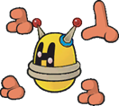
> {: .float-right-desktop }
> Bizarre cyborgs from a long-gone age, with a knack for the mystic arts. Most have long since forgotten their origin, and fewer still are left that could talk about it.  
> They have a surprising degree of utility, but unlike true machines, are vulnerable to illness, poison and the like.
>
> ***+1 Heart**{: .heart-color }, **+1 Spirit**{: .spirit-color }*{: .text-gamma .header-font }  
> *1 Power, 1 Defense*{: .text-gamma .header-font }  
>
> {: .specie-pros-callout }
> > *Pros*{: .text-gamma .header-font }  
> > *+ Coordination (Multi-Handed)*{: .heart-color }  
> > *+ Craft (Gadgets)*{: .spirit-color }  
> > *or **+ Knowhow (Lore)**{: .spirit-color }*{: .mgl }  
> > *+ Magic (Shock)*{: .spirit-color }  
> > Construct (Lifelike)  
> > Hover  
> > Mirage
>
> {: .specie-cons-callout }
> > *Cons*{: .text-gamma .header-font }  
> > Weakness (Shock, Water)  
> > *Shock attacks and Water Techniques deal +2 damage, and force you to make a **Steady**{: .courage-color } check versus Confusion (1), lasting a number of turns equal to the damage taken (minimum 1 turn).*{: .mgl .fs-3 }  
> > Legless
>
> {: .specie-inner-callout }
> > *Tech Defaults*{: .text-gamma .header-font }  
> >
> > Boost (Any)  
> > *Confuse x2*{: .alt-grey-line }  
> > Ranged  
> > *Repeat*{: .alt-grey-line }  
> >
> > *Optional*{: .underlined }: Element (Shock) on Ranged attacks
>
> {: .specie-inverted-callout }
> > *Example Techniques*{: .text-gamma .header-font .text-grey-lt-000 }  
> >
> > {: .specie-inner-callout }  
> > > *Punch Rush*{: .header-font } (**0 FP**{: .spirit-color })  
> > > A rapid flurry from multiple hands.  
> > > *Coordination (+ Multi-Handed)*{: .heart-color }:  
> > > Deal 1 DMG once for each Grade of Success.  
> > > *Repeat*{: .italic }
> > >
> >
> > {: .specie-inner-callout }  
> > > *Charge Beam*{: .header-font } (**3 FP**{: .spirit-color })  
> > > Fires a laser, then uses the remaining static charge to empower the user's attacks.  
> > > *Aim*{: .heart-color }:  
> > > *Good!*{: .good-color }: 4 DMG  
> > > *Magic (+ Shock)*{: .spirit-color }:  
> > > *Nice!*{: .nice-color }: +1 Attack for 2 turns  
> > > *Good!*{: .good-color }: +2 Attack for 2 turns  
> > > *Element (Shock), Ranged, Split(Boost (Attack) x2, Self), Strong, Commitment (Primary), Unwieldy*{: .italic }
> > >
> >
>

{: .specie-callout }
> ## X-Naut
>
> 
> {: .float-right-desktop }
> Mysterious soldiers from outer space – no one can quite agree on what they are, where they came from or even how to pronounce their name. They're firm in their resolve, and skilled with gadgets and chemicals.
>
> ***+1 Heart**{: .heart-color }, **+1 Spirit**{: .spirit-color }*{: .text-gamma .header-font }  
> *1 Power, 0 Defense*{: .text-gamma .header-font }  
>
> {: .specie-pros-callout }
> > *Pros*{: .text-gamma .header-font }  
> > *+ Athletics (Brawn)*{: .heart-color }  
> > *+ Crafts (Chemistry)*{: .spirit-color }  
> > *or **+ Crafts (Gadgets)**{: .spirit-color }*{: .mgl }  
> > *+ Knowhow (Science)*{: .spirit-color }  
>
> {: .specie-cons-callout }
> > *Cons*{: .text-gamma .header-font }  
> > N/A
>
> {: .specie-inner-callout }
> > *Tech Defaults*{: .text-gamma .header-font }  
> >
> > Boost (Any)  
> > *Launch*{: .alt-grey-line }  
> > Weaken (Any)  
> > *Variant (**Crafts**{: .spirit-color })*{: .alt-grey-line }  
> > Variant (*Knowhow*{: .spirit-color })  
> >
> > *Optional*{: .underlined }: Variant (*Crafts*{: .spirit-color }) or Variant (*Knowhow*{: .spirit-color }) on Boost/Weaken Techniques  
>
> {: .specie-inverted-callout }
> > *Example Techniques*{: .text-gamma .header-font .text-grey-lt-000 }  
> >
> > {: .specie-inner-callout }  
> > > *Drop Kick*{: .header-font } (**0 FP**{: .spirit-color })  
> > > Leaps at the enemy and kicks with both feet, trying to send them flying.  
> > > *Coordination*{: .heart-color }:  
> > > *Nice!*{: .nice-color }: 2 DMG  
> > > *Good!*{: .good-color }: 4 DMG  
> > > *Athletics (+ Brawn)*{: .heart-color }:  
> > > For each Grade of Success, the target is launched into an enemy behind them, taking 2 DMG.  
> > > *Launch, Unwieldy, Strong*{: .italic }
> > >
> >
> > {: .specie-inner-callout }  
> > > *Shrink Potion*{: .header-font } (**5 FP**{: .spirit-color })  
> > > Concocts a potion and tosses it at an enemy, shrinking them down to size.  
> > > *Crafts (+ Chemistry)*{: .spirit-color }:  
> > > *Nice!*{: .nice-color }: -2 Attack for 4 turns  
> > > *Good!*{: .good-color }: -3 Attack for 4 turns  
> > > *Great!*{: .great-color }: -4 Attack for 4 turns  
> > > *Weaken (Attack) x4, Variant (**Crafts**{: .spirit-color }), Empower, Harmless (Indirect)*{: .italic }
> > >
> >
>

{: .specie-callout }
> ## Yoshi
>
> 
> {: .float-right-desktop }
> Yoshis are affable dinosaurs from distant lands. While they can talk like other species, most never bother to learn how and choose to live simple lives. In any case, when a Yoshi decides to do something, very little can stop them.
>
> ***+1 Heart**{: .heart-color }, **+1 Courage**{: .courage-color }*{: .text-gamma .header-font }  
> *1 Power, 0 Defense*{: .text-gamma .header-font }  
>
> {: .specie-pros-callout }
> > *Pros*{: .text-gamma .header-font }  
> > *+ Aim (Throw)*{: .heart-color }  
> > *+ Athletics (Jump)*{: .heart-color }  
> > *or **+ Athletics (Run)**{: .heart-color }*{: .mgl }  
> > *+ Steady (VS Weaken)*{: .courage-color }  
> > Immune (Fear)  
> > Carrier
>
> {: .specie-cons-callout }
> > *Cons*{: .text-gamma .header-font }  
> > Weaken (Sleep)  
> > *The Level and Duration of all Statuses you suffer associated with sleep are doubled.*{: .mgl .fs-3 }
>
> {: .specie-inner-callout }
> > *Tech Defaults*{: .text-gamma .header-font }  
> >
> > Aerial  
> > *Dismiss*{: .alt-grey-line }  
> > Ranged  
> > *Throw*{: .alt-grey-line }  
> >
>
> {: .specie-inverted-callout }
> > *Example Techniques*{: .text-gamma .header-font .text-grey-lt-000 }  
> >
> > {: .specie-inner-callout }  
> > > *Gulp*{: .header-font } (**0 FP**{: .spirit-color })  
> > > Swallow an enemy in melee and spit them out at the next target in line. Both targets take damage.  
> > > *Coordination*{: .heart-color }:  
> > > Auto: 1 DMG  
> > > *Nice!*{: .nice-color }: 2 DMG  
> > > *Throw*{: .italic }
> > >
> >
> > {: .specie-inner-callout }  
> > > *Flutter Kick*{: .header-font } (**4 FP**{: .spirit-color })  
> > > A series of rapid kicks from above.  
> > > *Athletics*{: .heart-color }:  
> > > Auto: 1 DMG  
> > > *Nice!*{: .nice-color }: 1 DMG x2  
> > > *Good!*{: .good-color }: 1 DMG x3  
> > > *Great!*{: .great-color }: 1 DMG x4  
> > > *Wonderful!*{: .wonderful-color }: 1 DMG x5  
> > > *Excellent!*{: .excellent-color }: 1 DMG x6  
> > > *Aerial, Strong x2*{: .italic }
> > >
> >
>

{: .specie-callout }
> ## Yux
>
> 
> {: .float-right-desktop }
> Strange artificial beings, originally created by the X-Nauts – though no one can say for sure how many are out in the wild now. With their ability to produce more Yuxes, they're entirely self-sufficient, making them difficult to reason with – but having a couple dozen extra Yux for offense, defense or just to scout around can be quite handy.
>
> ***+1 Spirit**{: .spirit-color }, **+1 Courage**{: .courage-color }*{: .text-gamma .header-font }  
> *1 Power, 0 Defense*{: .text-gamma .header-font }  
>
> {: .specie-pros-callout }
> > *Pros*{: .text-gamma .header-font }  
> > *+ Knowhow (Science)*{: .spirit-color }  
> > *+ Notice (Many Eyes)*{: .spirit-color }  
> > *+ Steady (Propagate)*{: .courage-color }  
> > Clone  
> > Hover
>
> {: .specie-cons-callout }
> > *Cons*{: .text-gamma .header-font }  
> > Weakness (Air)  
> > *You must make a **Steady**{: .courage-color } check versus Disorientation, lasting a number of turns equal to the damage taken (minimum 1 turn).*{: .mgl .fs-3 }  
> > Handless  
> > Legless
>
> {: .specie-inner-callout }
> > *Tech Defaults*{: .text-gamma .header-font }  
> >
> > Minion (Yux)  
> > *Piercing*{: .alt-grey-line }  
> > Ranged  
> > *Secure (Mini-Yux Barrier)*{: .alt-grey-line }  
> >
> > *Optional*{: .underlined }: Element (Shock) on Ranged attacks  
> > *or*{: .underlined } Variant (*Steady*{: .courage-color }) on Minion and Secure Techniques
>
> {: .specie-inverted-callout }
> > *Example Techniques*{: .text-gamma .header-font .text-grey-lt-000 }  
> >
> > {: .specie-inner-callout }  
> > > *Yux Laser*{: .header-font } (**0 FP**{: .spirit-color })  
> > > Fires a ring-shaped laser to pierce through enemy defenses.  
> > > *Aim*{: .heart-color }:  
> > > *Good!*{: .good-color }: 4 Piercing Shock DMG  
> > > *Piercing, Element (Shock), Ranged, Strong, Commitment (Primary), Unwieldy*{: .italic }
> > >
> >
> > {: .specie-inner-callout }  
> > > *Yux Colony*{: .header-font } (**3 FP**{: .spirit-color })  
> > > Produces a cluster of Mini-Yuxes around the user, which are then able to act next turn.  
> > > The user needs a turn to recover before using this Technique again.
> > > *Steady*{: .courage-color }:  
> > > *Nice!*{: .nice-color }: 1 Mini-Yux for 4 turns  
> > > *Good!*{: .good-color }: 2 Mini-Yuxes for 4 turns  
> > > *Great!*{: .great-color }: 3 Mini-Yuxes for 4 turns  
> > > Mini-Yux (*1 HP*{: .heart-color }):  
> > > *Mini-Laser:*{: .mgl .fs-3 }  
> > > *Fired at range. Deals 2 DMG*{: .mgl-big .fs-3 }  
> > > *Hover*{: .mgl .fs-3 }  
> > > *Weakness (Air): Same as Yux's Weakness*{: .mgl .fs-3 }  
> > > *Minion (Yux) x3, Variant (**Steady**{: .courage-color }), Lengthen, Cooldown, Harmless*{: .italic }
> > >
> >
>

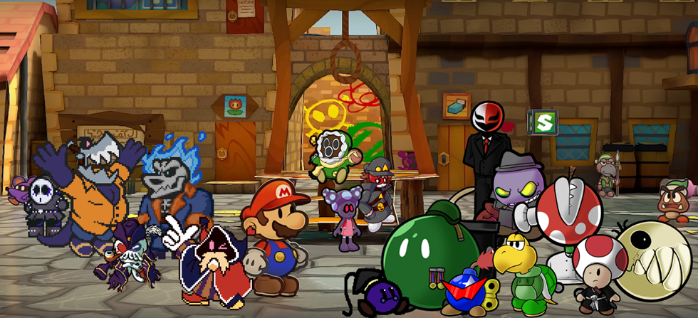
{: .center-img }

I hope the Species Compendium has sparked your imagination, and given you some fun ideas of your own!

Art credits for each original character, from left to right, top to bottom:

- Shy Goth, Mr Jacksaw, Tempestro, Gark & Merlucky: LandsharkRAWR
- Snifenson: yossycoin
- Shroobella: Lanashimi
- afan: afanguy
- Prof. Bobbert: unidentified_goose
- Assorted TTYD-style renders: SomeGuyNamedEric
