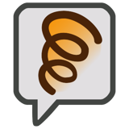
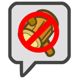

# Statuses
{: .no_toc }

  

    Table of contents
  

  {: .text-delta }
- TOC
{:toc}

A number of different Statuses can be dealt out to characters over the course of a battle or adventure, both positive and negative.  
A Status' duration is measured in turns; for each full turn that passes for the character with that Status (not including Surprise Rounds), its duration is reduced by 1, until it ends at 0.

No matter where a character receives their Status, the same Statuses never stack – you can't be poisoned twice, and you can't Boost Attack twice in a row, so only the highest level of that Status is treated as active.  
In the thick of combat statuses are more volatile and tend to be measured in turns, but outside of battle, you can generally treat each minute of game time as a turn.

The severity of each Status is based on its Status Level, which can be shortened to a number in brackets next to it, like (1).  
If an effect would require you to roll under the Status Level, but success isn't possible (i.e. the Status Level is 6 or more), you don't have to roll.  
And if a Status is mentioned without specifying its Level, assume it's Level 1.

{: .content-callout }
> 
> {: .float-right }
> ## Boosted
> 
> Your abilities are Boosted, increasing them by the Status Level for the duration of this status.  
> You can Boost Attack, Defense, Resists, a Stat or a Skill, though your *HP*{: .heart-color }, *FP*{: .spirit-color } and *BP*{: .courage-color } are never affected by this.  
> Boosts can be even more specific, targeting specific uses of a Skill (such as *Dodging*{: .spirit-color } or attacking).  
> When an enemy has their Stats or Skills Boosted, players suffer an equivalent dice penalty against Boosted actions; for example, an enemy's Boosted *Coordination*{: .heart-color } could take dice away from players when they *Guard*{: .heart-color } against their attacks. 

{: .content-callout }
> 
> {: .float-right }
> ## Charmed 
> 
> You're easier to convince, allowing people to manipulate you to do things against your best interests.  
> Once during your turn the person who Charmed you can make a *Persuade*{: .courage-color } check as a free action, opposed by Steady, to direct your actions. For each Status Level, they receive a +1d6 bonus on this check.  
> If an enemy Charmed you they don't make a Persuade check, but they can still direct you during your turn. You still react with a *Steady*{: .courage-color } check, but you need a Grade of Success for each Status Level to resist it instead.

{: .content-callout }
> 
> {: .float-right }
> ## Confused
> 
> Your senses are addled, causing you to act irrationally. At the start of your turn roll 1d6; if the result is greater than the Status Level, you act as normal.  
> Otherwise, you act against your best interests (as dictated by the GM).

{: .content-callout }
> 
> {: .float-right }
> ## Dazed
> 
> You're temporarily unable to act, though not completely powerless – you may be asleep, staggered, tied up or even frozen!  
> You can't defend yourself or resist enemy actions at all, and the only action you can take on your turn is to try and *Steady*{: .courage-color } yourself.  
> Whenever you're dealt damage, you can make a *Steady*{: .courage-color } check as a reaction; if you earn at least as many Grades of Success as the Status Level, you recover and this Status ends immediately!  
> Enemies affected by Daze instead shake it off when they're dealt damage equal to or greater than the Status Level.

{: .content-callout }
> 
> {: .float-right }
> ## Disarmed
> 
> Your abilities have been Disarmed in some way, such as by mental befuddlement or physically stealing your equipment, preventing you from using a specific kind of attack or Trait (e.g. jump attacks, hammer attacks, group-target attacks).  
> When you attempt to make a check with a Disarmed ability, roll 1d6; if you roll over the Status Level, you're still able to take the action, and may be able to recover on the spot!  
> If you can improvise a solution, you may be able to negate this Status entirely – but on the other hand, it might last longer if you can't reasonably recover.

{: .content-callout }
> 
> {: .float-right }
> ## Disoriented 
> 
> When making a check that requires the use of your eyes, or other senses as appropriate, you suffer a -1d6 penalty per Status Level.  
> Enemies affected by Disorientation instead make player's checks easier, granting a +1d6 bonus per Status Level.

{: .content-callout }
> 
> {: .float-right }
> ## Hustled
>
> Whenever you could take an action on your turn, you can take up to 1 additional action for each Status Level; however, each Hustled action you take requires 1 more Grade of Success for each action taken before it. Your reactions and free actions suffer no penalty, as usual.

{: .content-callout }
> 
> {: .float-right }
> ## Lingering
>
> You suffer from a continuous damaging effect, such as a persistent burn or a poison.  
> At the end of each of your turns you take damage equal to the Status Level, and the Status Level is downgraded by 1 (to a minimum of 1).

{: .content-callout }
> 
> {: .float-right }
> ## Provoked
> 
> You're berserk, and your anger is directed towards one target in particular.  
> Your target must seem legitimate; you couldn't be Provoked to attack an ally, for instance.  
> At the start of your turn roll 1d6; if the result is greater than the Status Level, you can keep a cool head and act as normal.  
> Otherwise, you must make the subject of this Status your primary target, and can't use attacks that affect other targets, use non-damaging Techniques, or take any other action.  
> If an attack would primarily target them, but have consequences for other characters (such as a *Burst*{: .positive-color }, *Launch*{: .positive-color } or *Strike-Through*{: .positive-color } attack), that can still be used.  
> If an attack on the target isn't possible, you can act freely, but you're still Provoked; if in the future it's possible to attack the target, you'll have to resist this Status as normal.

{: .content-callout }
> 
> {: .float-right }
> ## Secure
> 
> You've turned invincible! You're completely immune to attacks and virtually all other Techniques; they either glance off harmlessly or fail to even touch you.  
> Note though that your enemies may be able to bypass you and attack your allies in melee – depending on how you become Secure.  
> This kind of security takes a lot of concentration; if you attack or otherwise target someone with a debilitating effect, this status ends immediately.  
> On top of this, if an effect would trigger one of your Weaknesses, it ignores your Secure Status and immediately neutralises it – in addition to the effects of the Weakness.  
> Regardless, the Status Level is always 1.

{: .content-callout }
> 
> {: .float-right }
> ## Stunned
>
> You've been staggered, and though you can try to resist, you may be unable to act or fight back! You could be paralysed or frozen in time.  
> At the start of your turn, roll 1d6; if you roll over the Status Level, you're able to act as normal, but are otherwise helpless to act. You can't defend yourself, and the only action you can take on your turn is to try and *Steady*{: .courage-color } yourself.

{: .content-callout }
> 
> {: .float-right }
> ## Tutored
> 
> You've learned how to make use of new Technique Traits – or maybe you can't get them out of your head.  
> When you use a Technique, you can include one positive tutored Trait for each Status Level at-will without spending additional *FP*{: .spirit-color }.  
> However, for the duration of the Status, you *must*{: .underlined } include one negative tutored Trait (if applicable) for each Status Level whenever you use a Technique, without affecting the *FP*{: .spirit-color } spent.
> 
> For the purposes of this Status, count multiple instances of the same Technique Trait (e.g. Lingering x2) as separate Traits (requiring a Status Level of 2 to use both Lingering Traits).

{: .content-callout }
> 
> {: .float-right }
> ## Weakened
> 
> Your abilities are Weakened, reducing them by the Status Level for the duration of this status. Stats and Defenses can be reduced to 0, though Attack and Skills can be reduced even further to give them negative values!  
> You can suffer from Weakened Attack, Defense, Resists, Stats or Skills, though your *HP*{: .heart-color }, *FP*{: .spirit-color } and *BP*{: .courage-color } are never affected by this. Weakening can be even more specific than this, targeting specific uses of a Skill (such as *Dodging*{: .spirit-color } or attacking).  
> When an enemy has their Stats or Skills Weakened, players receive an equivalent dice bonus against Weakened actions; for example, an enemy's Weakened *Steady*{: .courage-color } could give players extra dice when dealing status effects to them.

{: .center-img }

{: .tip-callout }
> *Weakening an enemy's abilities is a great way to support your team, and can often be just as impactful as Boosting your allies!* 
> {: .icon-right }