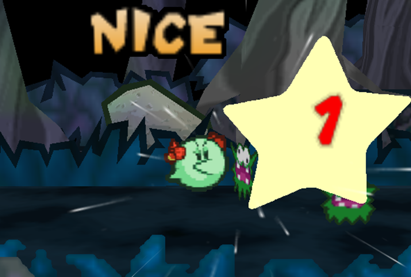

# Techniques
{: .no_toc }

  

    Table of contents
  

  {: .text-delta }
- TOC
{:toc}

Techniques are the myriad ways a character acts in combat, most often by attacking.

By default, all Techniques start from the same template:

{: .specie-inner-callout }
> *Basic Attack*{: .header-font } (*0 FP*{: .spirit-color })  
*Coordination*{: .heart-color }:  
Auto: [Power] DMG  
*Nice!*{: .nice-color }: [2 x Power] DMG  
*(No Traits)*{: .italic }
>

Techniques require the user to pass a Primary Check in order to deal damage, which defaults to their *Coordination*{: .heart-color }. The results vary depending on their overall success.

As in the above example, Techniques can still function with no Grades of Success, but improve with better results – though this threshold for success can be increased, making it harder to hit the minimum and maximum results.

If a Technique doesn't earn enough Grades to achieve any result, though, it fails outright!

## Damage Calculation

Whenever a Primary Check would deal damage as part of a Strike, each Strike is modified by the user's Attack to get the Raw Damage.  
Then, that damage value is reduced by the defender's Defense and any applicable Resistances they have, and that amount of damage is taken from the target's *HP*{: .heart-color }.

Importantly, your Attack can be negative too! In this case, the Attack value is taken out of the Raw Damage, and may reduce it right down to 0!

## Strikes

A Technique can divide its potential damage up into any number of strikes.

- *Single-Strike*{: .italic }  
    Single-Strike attacks can hit one target solidly, dealing [Power] in DMG at a minimum, or [2 x Power] with an additional Grade of Success.  
    Single-Strike attacks hit with more force up-front; as long as they score that additional Grade of Success, and the overall attack would only damage one target, they treat the user's positive Attack modifiers as doubled, and always treat their base damage before Attack as at least 1 (regardless of the user's Power).  
    While Single-Strike attacks can be made to hit additional targets with Traits like *Burst*{: .spirit-color } or *Strike-Through*{: .spirit-color }, this gives up some of the raw power.
- *Multi-Strike*{: .italic }  
    Multi-Strike attacks split some of the force up between their hits, dealing a portion of the attack's damage potential with each hit; as a general rule, each strike should deal no more than [Power] in damage.  
    They strike once if successful, then can make one more strike for each additional Grade of Success earned, but the total base damage of the split strikes can't be more than [2 x Power].

Taking damage at any point during an attack (such as from a Contact Trait) interrupts and cancels the Technique, but doesn't prevent the strike's damage.

{: .center-img }

{: .tip-callout }
> *Multi-Strike attacks take a bit more work than Single-Strike attacks, but the more strikes you make, the more damage you can get from Attack boosts!* 
> {: .icon-right }

## Technique Traits

When defining your Techniques you have a wide variety of Traits to modify them with, which either increase or decrease the Technique's final *FP*{: .spirit-color } cost. If this reduces your *FP*{: .spirit-color } cost to 0 or less, the Technique doesn't cost any *FP*{: .spirit-color }.

Your Species' Tech Defaults are especially useful here – you can add on one of your Tech Default sets without modifying the *FP*{: .spirit-color } cost at all!  
Any Optional Tech Defaults which would apply can be added on as well without *FP*{: .spirit-color }.  
Required Tech Defaults *must*{: .underlined } be added where they would apply, and don't modify *FP*{: .spirit-color }.

Generally you can only take a Trait once, with different forms of the Trait (e.g. different elements) counting as separate distinct Traits.  
While you can stack as many Traits on a Technique as you please, there are limits to how much *FP*{: .spirit-color } you can save with negative Traits. You can only save *FP*{: .spirit-color } from a number of Traits equal to your level.  
Any other negative Traits you add contribute to the overall Technique's effect, but don't modify *FP*{: .spirit-color } at all.

{: .example-callout}
> *Example: Negative Traits*{: .header-font }
>
> A level 1 Buzzy Beetle wants to begin play with a powerful *0 FP*{: .spirit-color } attack.
> They could add Strong for *2 FP*{: .spirit-color }, and offset it with Unwieldy, for a powerful – but inaccurate – melee attack.
> They could add more negative Traits, but since they can only save *FP*{: .spirit-color } from one Trait at a time, they decide to leave it there to start with.

While you can describe a Technique in shorthand by referring to its Traits, in practice it's better to write out the full effect for your own reference – you may not always remember that a Piercing attack ignores Defense, or you may need to record how your Boost Technique works at different Grades of Success.

While the mechanics of building a Technique can be complicated, it's best to work within this system until you have a good idea of how Techniques work and what effects should cost.

If you find that you just can't make the Technique of your dreams, or your Technique isn't as effective as it should be, try discussing alternatives with your GM. You should consider this system to be a starting point for your own exciting ideas!

## Trait Effects

Some Traits have similar functions which are referred to in shorthand, explained here.

### [X]

This Trait can be chosen multiple times to strengthen its effects; additional instances are treated as the same singular Trait, but with effects varying based on how many times the Trait has been taken, [X].  
If there's a limit on how many times it can be taken, this is referred to as the Cap.  
Note that multiple instances of these values are added together, not multiplied. If [X] is 3, then [XX] would be 6 (3 + 3), and [XXXX] would be 12 (3 + 3 + 3 + 3).

### [Secondary]

After the Primary Check is resolved, as long as it didn't fail and there's still a valid target, some Techniques have follow-up effects which require a Secondary Check. The Skill required for this is defined by the Trait it's acquired from – if the Trait lists multiple Skills, choose one of them when you first define the Technique, and if the Technique has multiple [Secondary] Traits, choose one skill to represent all Secondary effects.  
In any case, you only roll one Secondary Check for all relevant effects. If multiple targets would be affected, they all suffer the consequences of the same Secondary Check.

### [Approach]

This Trait modifies the way the user approaches their target(s). Generally, multiple [Approach] Traits can't be taken at once.

### [Target]

This Trait modifies the available targets for this Technique in some way. Generally, multiple [Target] Traits can't be taken at once.

### [Strikes]

This Trait modifies the way Strikes and damage are allocated in some way, making it fundamentally different from a Single-Strike or Multi-Strike Technique.  
Generally, multiple Strikes Traits can't be taken at once.

### [Random]

This Trait features a random element. Multiple [Random] Traits can't be taken 
at once, unless otherwise specified.

## Positive Technique Traits

### *Aerial*{: .positive-color} *(+2 FP)*{: .spirit-color } [Approach]

At the user's option, this Technique's Primary Check can use *Athletics*{: .heart-color } instead.  
The user flies through the air to deliver this attack, striking from above. This allows them to hit targets from anywhere in the fight, though they may struggle to hit targets who are blocked in some way (e.g. under a low ceiling).  
If the user is flying when they make an Aerial attack, they can Plummet as they make this attack.  
Plummeting attacks are made at +1 Power, but require one more Grade of Success on their Primary Check.  
Regardless of the outcome, the user becomes grounded after a Plummeting attack.

### *All*{: .positive-color} *(+3 FP)*{: .spirit-color } [Target]

This Technique affects all available targets, be they friend or foe, besides the user. At the user's option this can also include the *Indirect*{: .positive-color } Trait for no additional cost.

### *Allies*{: .positive-color} *(+2 FP)*{: .spirit-color } [Target]

This Technique affects all of the user's allies, but not themselves. At the user's option this can also include the *Indirect*{: .positive-color } Trait for no additional cost.

### *Alternative*{: .positive-color} *(+2 FP)*{: .spirit-color }

Choose *HP*{: .heart-color }, *SP*{: .courage-color } or Coins:
- *HP*{: .heart-color }: This Technique spends *HP*{: .heart-color } instead of *FP*{: .spirit-color }. It can't recover *HP*{: .heart-color }, and can't be combined with *Blowback*{: .negative-color } or varieties of *Self*{: .negative-color } that deal damage to the user.
- *SP*{: .courage-color }: This Technique spends *SP*{: .courage-color } instead of *FP*{: .spirit-color }. It can't recover *SP*{: .courage-color }, even through [Exceptional Results]({{ "/grades_of_success#exceptional-results" | absolute_url }}) (though [Exceptional Techniques]({{ "/exceptional_techniques" | absolute_url }}) are still possible).
- Coins: This Technique spends 5 Coins for every *1 FP*{: .spirit-color } it would cost. It can't steal Coins through *Snatch*{: .positive-color }, and can't cover an equivalent cost of more than *10 FP*{: .spirit-color } (for 50 Coins).

The effective *FP*{: .spirit-color } cost can't be reduced lower than *1 FP*{: .spirit-color } by negative Traits while using *Alternative*{: .positive-color }.

### *Boost*{: .positive-color} *(+2 FP)*{: .spirit-color } [Secondary - *Cheer*{: .courage-color }/*Magic*{: .spirit-color }] [X]

The target's abilities are [Boosted]({{ "/statuses#boosted" | absolute_url }}) for [X] turns – the exact abilities affected by the Boost are decided when this Trait is bought.  
For every additional Grade of Success, increase the Status Level by 1, to a maximum of [X].  
This Technique can also use the following skills for Secondary Checks, depending on the ability being Boosted:

- Attack: *Athletics*{: .heart-color } or *Coordination*{: .heart-color }
- Defense: *Guard*{: .heart-color }
- Dodge: *Trickery*{: .spirit-color }
- Skill (e.g. *Steady*{: .courage-color }): The same Skill being Boosted

If this Boost Technique has an element, it also has the following effects depending on the ability Boosted:

- Attack: The target's attacks have the same element for the duration.
- Defense: The target's Resist for that element is Boosted, too.

### *Burst*{: .positive-color} *(+2 FP)*{: .spirit-color } [Strikes] [Target] [X]

This Technique acts as a Single-Strike Technique on the initial target, then repeats on up to [X] valid targets in front of them, and up to [X] valid targets behind them, ignoring elevation.

Each subsequent attack deals -1 damage (to a minimum of 1), calculated for each direction separately.

### *Charm*{: .positive-color} *(+2 FP)*{: .spirit-color } [Secondary - *Magic*{: .spirit-color}/*Persuade*{: .courage-color }/*Trickery*{: .spirit-color }] [X]

The target is [Charmed]({{ "/statuses#charmed" | absolute_url }}), causing them to be easily persuaded, for [X] turns.  
For every additional Grade of Success, increase the Status Level by 1, to a maximum of [X].

{: .tip-callout }
> *An enemy Charmed is an enemy you don't have to deal with, **and**{: .underlined } an asset to fight your enemies! Even outside of combat, Charm can be incredibly useful.* 
> {: .icon-right }

### *Coin Toss*{: .positive-color} *(+? FP)*{: .spirit-color } [Random]

This Technique has 2 different Coin Slots made up of Technique Traits, each assigned either Heads or Tails.

When you use this Technique, flip a coin. Only the Slot whose side comes up is active for this use of the Technique, and the other Slot's Traits are ignored.  
Each Coin Slot can include any number of Technique Traits, with their *FP cost*{: .spirit-color } calculated separately from your own Technique, including all of their negative Traits.  
The two Coin Slots must be different from one another in some way.  
The overall *FP cost*{: .spirit-color } Coin Toss adds to your Technique is equal to the sum of the following:

- ½ of the highest positive *FP cost*{: .spirit-color } in both Coin Slots.
- *+1 FP*{: .spirit-color } for each Trait included in the Coin Slot with the most Traits.
- *-1 FP*{: .spirit-color } if one of the Coin Slots is empty.
- If either Coin Slot has a negative *FP cost*{: .spirit-color }, include ½ of it in Coin Toss' *FP cost*{: .spirit-color }.

If after this Coin Toss would have a negative *FP cost*{: .spirit-color }, you can treat it as a negative Trait instead.

{: .example-callout}
> *Example: Heads or Tails*{: .header-font }
>
> A gambling Shy Guy spins into a wild, uncontrolled kick!  
> Essentially, they flip a coin; if it comes up Heads, they can add Strong to their kick! If it comes up Tails, though, they Exhaust themselves instead.  
> On the Heads side, Strong would normally cost *2 FP*{: .spirit-color }, so they add ½ that for *+1 FP*{: .spirit-color } to the cost.  
> Looking at Tails though, Exhausting would save *-4 FP*{: .spirit-color }; so they take ½ that away, for *-2 FP*{: .spirit-color }.  
> Both sides have the same number of Traits, so they add *+1 FP*{: .spirit-color } for 1 Trait.  
> The gambler's kick is so risky, it would actually work out to *0 FP*{: .spirit-color } overall!

### *Counter*{: .positive-color} *(+3 FP)*{: .spirit-color }

This Technique's Primary Check defaults to either *Athletics*{: .heart-color } or *Steady*{: .courage-color }.

Instead of the usual effect of this Technique, the target gains the qualities of this Technique (excluding *Counter*{: .positive-color }, [Approach] and [Target] traits) as a [Contact]({{ "/personal_traits#contact" | absolute_url }}) Trait, either through some direct hazard or a counter-attack from the original user.  
This Contact Trait lasts for 1 turn for each Grade of Success.  
When the Contact Trait is triggered, it automatically succeeds and targets the attacker (ignoring their own Contact traits) with the same number of Grades of Success as the original user's Primary Check.  
Secondary Checks are made as required when their Contact trait is triggered; depending on the nature of the trait, either the target or the original user make the check.

### *Confuse*{: .positive-color} *(+1 FP)*{: .spirit-color } [Secondary - *Bully*{: .courage-color }/*Magic*{: .spirit-color }/*Trickery*{: .spirit-color }] [X]

The target is [Confused]({{ "/statuses#confused" | absolute_url }}), causing them to behave unpredictably, for [X] turns.  
For every additional Grade of Success, increase the Status Level by 1, to a maximum of [X].

### *Daze*{: .positive-color} *(+1 FP)*{: .spirit-color } [Secondary - *Bully*{: .courage-color }/*Magic*{: .spirit-color }/*Trickery*{: .spirit-color }] [X]

The target is [Dazed]({{ "/statuses#dazed" | absolute_url }}) for [X] turns, preventing them from fighting back.  
For every additional Grade of Success, increase the Status Level by 1, to a maximum of [X].

### *Disarm*{: .positive-color} *(+1 FP)*{: .spirit-color } [Secondary - *Bully*{: .courage-color }/*Magic*{: .spirit-color }/*Trickery*{: .spirit-color }] [X]

The target is [Disarmed]({{ "/statuses#disarmed" | absolute_url }}) for [X] turns, preventing them from using the targeted attack or Trait – the exact Traits (e.g. *Tool*{: .positive-color }) or manner of attack (e.g. jump attacks) affected by this status are decided when this Trait is chosen.  
For every additional Grade of Success, increase the Status Level by 1, to a maximum of [X].

### *Dismiss*{: .positive-color} *(+2 FP)*{: .spirit-color } [Secondary - *Bully*{: .courage-color }/*Heal*{: .heart-color }/*Magic*{: .spirit-color }/*Trickery*{: .spirit-color }]

For each Grade of Success, the user can choose one of the target's Statuses, their current Power-Up or a temporary Terrain affecting them.

- Statuses or Terrain: Reduce duration by -1 for each Grade of Success this Technique earned overall.
- Power-Up: The target must try to hold onto their Power-Up, as if they took damage; their check requires an additional Grade of Success for each Grade of Success this Secondary Check earned overall.

### *Disorient*{: .positive-color} *(+2 FP)*{: .spirit-color } [Secondary - *Bully*{: .courage-color }/*Magic*{: .spirit-color }/*Trickery*{: .spirit-color }] [X]

The target is [Disoriented]({{ "/statuses#disoriented" | absolute_url }}) for [X] turns, reducing the effectiveness of all actions requiring their senses.  
For every additional Grade of Success, increase the Status Level by 1, to a maximum of [X].

### *Divider*{: .positive-color} *(+3 FP)*{: .spirit-color } [Secondary - *Bully*{: .courage-color }/*Magic*{: .spirit-color }/*Trickery*{: .spirit-color }] [X]

The target is cut off from their allies, separating into another distinct group for at least [X] turns – or until they can reasonably reconnect with the original group.  
If there are multiple targets, they can be divided into separate groups, creating up to 1 other group for each additional Grade of Success and a maximum of [X] new groups.  
If multiple targets are divided into the same group, they maintain their relative position and turn order in the new group.

### *Drain*{: .positive-color} *(+1 FP)*{: .spirit-color } [X]

This attack heals the user an amount equal to the total damage dealt, up to a maximum of *[XX] HP*{: .heart-color }.

### *Element*{: .positive-color} *(+1 FP)*{: .spirit-color } [X]

This attack carries up to [X] different elemental qualities, such as Fire, Ice or Shock. If it has multiple elements, they all apply at the same time.  
Elements don't do anything on their own, but they can be useful in different situations.  
Note that Immunities apply before Weaknesses, and Immunities and Weaknesses each overrule Resistances. So if one element would trigger an enemy's Immunity, the whole Technique does.

### *Empower*{: .positive-color} *(+2 FP)*{: .spirit-color } [X]

As long as this Technique's Secondary Check succeeds, it functions as if it had [X] additional Grades of Success.

### *Fear*{: .positive-color} *(+1 FP)*{: .spirit-color } [Secondary - *Bully*{: .courage-color }/*Trickery*{: .spirit-color }] [X]

The target either flees the fight or becomes [Stunned]({{ "/statuses#stunned" | absolute_url }}) (their choice) for [X] turns.  
For every additional Grade of Success, increase the Status Level by 1, to a maximum of [X].

### *Flowery*{: .positive-color} *(+2 FP)*{: .spirit-color } [Secondary - *Cheer*{: .courage-color }/*Magic*{: .spirit-color }] [X]

This Technique restores *+1 FP*{: .spirit-color } to the target for every Grade of Success, to a maximum of [X] FP.

### *Group*{: .positive-color} *(+4 FP)*{: .spirit-color } [Target]	

This Technique affects all targets in the chosen group. If targeting their own group, the user can choose whether or not it affects them too. At the user's option this can include the *Indirect*{: .positive-color } Trait.

### *Hearty*{: .positive-color} *(+1 FP)*{: .spirit-color } [Secondary - *Heal*{: .heart-color }/*Magic*{: .spirit-color }] [X]

This Technique heals the target *1 HP*{: .heart-color } for every Grade of Success, to a maximum of *[XX] HP*{: .heart-color }.

### *Homing*{: .positive-color} *(+1 FP)*{: .spirit-color }

This Technique can't be [*Dodged*{: .spirit-color }]({{ "/skills_in_detail#trickery---dodging" | absolute_url }}) and ignores the [Secure]({{ "/statuses#secure" | absolute_url }}) Status. It can still be [*Blocked*{: .heart-color }]({{ "skills_in_detail#guard---reducing-damage" | absolute_url }}K).
If a target has any clones in battle (illusory or otherwise), this Technique can 
ignore them to strike the target instead.

### *Hustle*{: .positive-color} *(+6 FP)*{: .spirit-color } [X - Cap 5]

The target begins to [Hustle]({{ "/statuses#hustled" | absolute_url }}), giving them additional actions, for the next [X]  turns. If you target yourself with this Technique, you don't receive the benefit until after this turn.  
For every additional Grade of Success, increase the Status Level by 1, to a maximum of [X].

### *Indirect*{: .positive-color} *(+2 FP)*{: .spirit-color }

This attack doesn't strike the target directly. The user is generally shielded from the consequences of the target's Contact Traits, though depending on the attack and the Contact trait there are exceptions.

### *Launch*{: .positive-color} *(+2 FP)*{: .spirit-color } [Secondary - *Athletics*{: .heart-color }/*Bully*{: .courage-color }] [X]

The target is launched across the battlefield after being attacked, flying through one valid target in the same group behind them (at the same elevation) for each Grade of Success. If they collide with a target with a relevant Contact trait, they stop flying and suffer the consequences of that Contact.  
Each additional target hit during this launch is struck with base damage equal to this Technique's Power, unmodified by the user's Attack; if the launched target has a relevant Contact trait, each new target suffers the consequences of that Contact.  
A maximum of [X] targets can be launched by this Technique at once, with all launches being resolved simultaneously.  
Afterwards, all targets return to their original position, if able – although in precarious fights, a solid enough launcher could shift the battlefield completely, or bring the fight to an early close.

### *Lengthen*{: .positive-color} *(+1 FP)*{: .spirit-color } [X]

The effects of this Technique which have a duration last [X] more turns.

### *Lingering*{: .positive-color} *(+1 FP)*{: .spirit-color } [Secondary - *Bully*{: .courage-color }/*Magic*{: .spirit-color }] [X]

The target suffers a [Lingering]({{ "/statuses#lingering" | absolute_url }}) burn, poison or other degenerative effect, for [X] turns.
For every additional Grade of Success, increase the Status Level by 1, to a maximum of [X].

### *Lucky Hit*{: .positive-color} *(+? FP)*{: .spirit-color } [Random]

This Technique has a rare special effect! It contains a Lucky Slot made up of Technique Traits.  
When you use this Technique, roll 1d6; the Lucky Slot's Traits are only active if you roll a 6.  
The Lucky Slot can contain any number of Technique Traits, with their *FP cost*{: .spirit-color } calculated separately from your own Technique, including all of their negative Traits; the Lucky Slot's overall *FP cost*{: .spirit-color } *must*{: .underlined } be positive.
The overall *FP cost*{: .spirit-color } *Lucky Hit*{: .positive-color } adds to your Technique is equal to the sum of the following:

- 1/3 of the overall *FP cost*{: .spirit-color }.
- *+1 FP*{: .spirit-color } for each *pair*{: .underlined } of Traits included, including copies of the same Trait.

{: .example-callout}
> *Example: Lucky Critical*{: .header-font }
>
> A roguish Swooper strikes from the shadows! Their attack has a 1 in 6 chance to land a devastating Lucky Hit!  
> The Lucky Slot contains 4 instances of Strong, which would normally cost *8 FP*{: .spirit-color }.  
> This cost is divided by 3 and rounded down, for *2 FP*{: .spirit-color }. Since it contains 4 Traits (two pairs), another *+2 FP*{: .spirit-color } is added.  
> Overall, this Lucky Hit costs *4 FP*{: .spirit-color } – half the usual cost!

You can combine *Lucky Hit*{: .positive-color } with *Fumble*{: .negative-color }. If the Technique has both traits, roll the same die once for both effects.

### *Minion*{: .positive-color} *(+3 FP)*{: .spirit-color } [Secondary - *Bully*{: .courage-color }/*Cheer*{: .courage-color }/*Magic*{: .magic-color }/*Persuade*{: .courage-color }] [Target] [X]

This Technique generates one or more minions in any location in your group, and then targets them with any other effects of this Technique, including damage.  
These minions are all functionally identical to one another, though they might look superficially different, and the number of minions summoned and their qualities are defined separately for each possible result when you buy this Trait.  
These minions don't act during the round they're summoned, and persist for up to [X] rounds after that round. If they would have the Elevation or Fly traits, they can enter the battle with these active with no further action required.  
Minions follow your orders, acting in turn order as usual. They have one Technique, and can reliably use their Personal Traits, but besides that they can't take on complicated tasks which would normally require a skill check (e.g. *Crafts*{: .spirit-color }, *Guard*{: .heart-color }, *Notice*{: .spirit-color }).  
For those actions they can carry out, minions automatically score Grades of Success on their Primary and Secondary checks equal to this Technique's Grades of Success (to a maximum of [X] Grades), with -1 for each minion summoned besides themselves.  
For each Grade of Success, you can assign up to 5 points to their qualities in the following combinations, to a maximum of [XXXXX] points split across up to [X] minions:

- *HP*{: .heart-color }, receiving 2x the points assigned to this quality in *HP*{: .heart-color }. Just like regular characters, minions can't restore *HP*{: .heart-color } beyond their maximum. They begin with just *1 HP*{: .heart-color }.
- Power or Defense, receiving 1 point in either for every 2 points assigned to this quality. Minions begin with 0 Power and 0 Defense.
- Up to [X] positive Traits and up to [X] negative Traits for their Technique.  The Technique's final *FP cost*{: .spirit-color } must be 0 for the minion to use it; you can reduce it by a further *1 FP*{: .spirit-color } for every 1 point assigned to this quality.
- Up to [X] positive Personal Traits (e.g. Fly) and up to [X] negative Personal Traits (e.g. Weakness), at a cost of 2 points for every positive Trait added, and earning a free positive Trait (ignoring the maximum Trait count) for every negative Trait added.  
Distinct copies of the same Trait (e.g. Weakness (Blast) and Weakness (Fire)) must be added separately.  
Distinct effects of Immunities and Weaknesses (such as recovering *HP*{: .heart-color } or causing Daze) can be tailored to suit the minion, though they should be in line with existing Traits.

### *Overrun*{: .positive-color} *(+2 FP)*{: .spirit-color } [Target]

This Technique affects all targets in the target group at the same elevation, as long as the user can reach that height.

### *Piercing*{: .positive-color} *(+3 FP)*{: .spirit-color }

This attack ignores Defense, Resistances and Immunities. It can still be [*Blocked*{: .heart-color }]({{ "/skills_in_detail#guard---reducing-damage" | absolute_url }}).

### *Provoke*{: .positive-color} *(+1 FP)*{: .spirit-color } [Secondary - *Bully*{: .courage-color }/*Magic*{: .spirit-color }/*Trickery*{: .spirit-color }/*Persuade*{: .courage-color }] [X]

The target becomes [Provoked]({{ "/statuses#provoked" | absolute_url }}), causing them to focus their attention on a particular valid target (specified by you), for [X] turns.  
For every additional Grade of Success, increase the Status Level by 1, to a maximum of [XX].

### *Quake*{: .positive-color} *(+3 FP)*{: .spirit-color } [Approach] [Target]

At the user's option, this Technique's Primary Check can use *Athletics*{: .heart-color } instead.  
This attack affects all targets in the chosen group, besides the user, in contact with the ground, wall or ceiling. As a result, it also functions as the *Indirect*{: .positive-color } Trait and, if it has no other element, has *Element (Earth, Quake)*{: .positive-color }.

### *Ranged*{: .positive-color} *(+2 FP)*{: .spirit-color } [Approach]

This Technique's Primary Check defaults to *Aim*{: .heart-color }.  
This Technique can affect its targets in battle without making contact, regardless of their relative position or other targets in the way.

### *Reach*{: .positive-color} *(+1 FP)*{: .spirit-color } [Approach]

This Technique can target flying and grounded enemies that aren't blocked by another target, as if the user was at their elevation. It still makes contact unless paired with *Indirect*{: .positive-color }.

### *Repeat*{: .positive-color} *(+3 FP)*{: .spirit-color } [Strikes]

The user repeatedly attacks with single strikes, hitting once for each Grade of Success; each strike deals damage equal to this Technique's Power, -1 for each successive attack made (to a minimum of 1 damage).  
There's no limit to how many strikes can be made.

### *Revive*{: .positive-color} *(+10 FP)*{: .spirit-color } [Secondary - *Heal*{: .heart-color }/*Magic*{: .spirit-color }]

The target is revived from their KO with *1 HP*{: .heart-color } (in addition to any *HP*{: .heart-color } they would gain from this Technique), and are able to act in the same round; if their turn would have already passed for the round, they're able to act immediately after this turn.  
If for whatever reason this Technique would deal damage, it's dealt after they're revived and healed, and the target can resist as normal.

### *Roulette*{: .positive-color} *(+? FP)*{: .spirit-color } [Random]

This Technique has 6 different Roulette Slots of Technique Traits, each with a different number between 1 and 6 assigned to them.  
When you use this Technique, roll 1d6. Only the Slot whose number is rolled is active for this use of the Technique, and all other Roulette Slot Traits are ignored.  
Each Roulette Slot can include any number of Technique Traits, with their *FP cost*{: .spirit-color } calculated separately from your own Technique, including all of their negative Traits.  
Each Roulette Slot must be different from the others in some way.  
The overall FP cost Roulette adds to your Technique is equal to the sum of the following:

- The highest *FP cost*{: .spirit-color } in all your Roulette Slots (to a minimum of *0 FP*{: .spirit-color }); you don't pay the *FP cost*{: .spirit-color } for any other Slots.
- *+1 FP*{: .spirit-color } for each Trait included in the Roulette Slot with the most Traits.
- *-2 FP*{: .spirit-color } for each Roulette Slot with a negative cost.

If after this *Roulette*{: .positive-color } would have a negative *FP cost*{: .spirit-color }, you can treat it as a negative Trait instead.  
Otherwise, if *Roulette*{: .positive-color } would cost *0 FP*{: .spirit-color }, increase the cost to *1 FP*{: .spirit-color }.

{: .example-callout}
> *Example: Elemental Roulette*{: .header-font }
>
> A Magikoopa conjures a blast of prismatic energy, shifting between 6 different elements at random.  
> Each Roulette Slot has a different Element Trait, but no other Traits.  
> The magician only has to pay for one of those Roulette Slots (costing *1 FP*{: .spirit-color }), then *+1 FP*{: .spirit-color } for the one Trait used.  
> Thus, Roulette would add *+2 FP*{: .spirit-color }, instead of the *+6 FP*{: .spirit-color } normally paid for each Element added together.

### *Safe*{: .positive-color} *(+2 FP)*{: .spirit-color }

This Trait can only be applied to multi-target attacks. This Technique doesn't affect the user or their allies.

### *Scaling*{: .positive-color} *(+3 FP)*{: .spirit-color } [X]

This Technique acts as if the user had +1 Power for each additional Grade of Success achieved on the Primary Check beyond its maximum, up to a maximum of +[XX] Power.

### *Secure*{: .positive-color} *(+4 FP)*{: .spirit-color } [Secondary - *Guard*{: .heart-color }/*Magic*{: .spirit-color }/*Trickery*{: .spirit-color }]

The target becomes [Secure]({{ "/statuses#secure" | absolute_url }}), rendering them completely immune to most Techniques targeting them for 1 turn; if this Technique would deal damage to or inflict status on the target, those effects take priority first.

### *Selective*{: .positive-color} *(+1 FP)*{: .spirit-color } [Target]

This Technique can target any one foe at the same elevation as the user, regardless of blocking or their relative position.

### *Sequential*{: .positive-color} *(+2 FP)*{: .spirit-color } [Strikes] [Target]

The user attacks their target, then for each additional Grade of Success earned beyond the maximum result, moves to and attacks the next available target.  
Each target is struck one after another, and must be a valid target – though the additional targets can be attacked in melee even if they would normally be blocked by their allies.  
Each strike acts as a Single-Strike, dealing twice the user's Power in raw damage.

### *Shared*{: .positive-color} *(+1 FP)*{: .spirit-color }

The user can share in all the effects of this Technique's Secondary Check, as if they were targeted. If the Technique would have targeted them anyway, they don't receive any additional benefit; they're only added as a target.

### *Simple*{: .positive-color} *(+2 FP)*{: .spirit-color } [X]

This Technique is easier to use, acting as if it scored [X] additional Grades of Success on the Primary Check; if the maximum effectiveness can be reached with only those Grades, then the user can choose to forego their roll for the Primary Check.

### *Snatch*{: .positive-color} *(+2 FP)*{: .spirit-color } [Secondary - *Bully*{: .courage-color }/*Trickery*{: .spirit-color }]

This check can be opposed by *Athletics*{: .heart-color }, *Coordination*{: .heart-color } or *Steady*{: .courage-color }.  
Based on the number of Grades of Success, you can choose to take one of the following from the target (if they have something to take):

- *Nice!*{: .nice-color }: 1d6 Coins for each Grade of Success.
- *Good!*{: .good-color }: A small Item
- *Great!*{: .great-color }: A large Item
- *Wonderful!*{: .wonderful-color }: An equipped Item, such as a Tool or a Badge

If multiple targets would be affected by this Technique, you can attempt to steal from each of them by dividing the total Grades of Success between all applicable targets.

{: .example-callout}
> *Example: Multi-Snatch*{: .header-font }
>
> An Overrun Snatch that affected three targets with a *Wonderful*{: .wonderful-color } result could assign two Grades of Success to one target (stealing a small Item), and split up the remaining two Grades of Success to steal from the other targets (stealing 1d6 Coins from each). 

### *Spillover*{: .positive-color} *(+1 FP)*{: .spirit-color } [Target]

This Technique targets a single valid target. However, if it deals enough damage to KO its initial target, you can target another valid target and attack them with the excess raw damage, continuing on until all the raw damage has been allocated.  
Note that since each new target is attacked separately, Attack and other modifiers to damage are calculated separately for each target.

### *Split*{: .positive-color} *(+1 FP)*{: .spirit-color }

The user can divide this Technique's effects between any valid targets, including themselves, such as to heal themselves with *Hearty*{: .positive-color } instead of the target, or to use different *Element*{: .positive-color } traits against different enemies.  
It can't be used to redirect damage, and the new targets must have been valid choices at the time the Technique was used

### *Strike-Through*{: .positive-color} *(+1 FP)*{: .spirit-color } [Strikes] [Target] [X]

This Technique acts as a Single-Strike Technique on the initial target, then repeats on up to [X] valid targets behind them (at the same elevation).  
Each subsequent attack deals -1 damage (to a minimum of 1).

### *Strong*{: .positive-color} *(+2 FP)*{: .spirit-color } [X]

This Technique has +[X] Power.

### *Stun*{: .positive-color} *(+2 FP)*{: .spirit-color } [Secondary - *Bully*{: .courage-color }/*Magic*{: .spirit-color }/*Trickery*{: .spirit-color }] [X]

The target is [Stunned]({{ "/statuses#stunned" | absolute_url }}) for [X] turns, stopped dead in their tracks.  
For every additional Grade of Success, increase the Status Level by 1, to a maximum of [XX].

### *Swap*{: .positive-color} *(+1 FP)*{: .spirit-color } [Secondary - *Bully*{: .courage-color }/*Coordination*{: .heart-color }/*Magic*{: .spirit-color }/*Trickery*{: .spirit-color }] [X]

The target swaps position with another target in the same group, maintaining their current elevation where possible. The second target can't be further away in group order than 1 space for each Grade of Success, to a maximum of [X] spaces away.  
If this Technique affects multiple targets, each target can only be swapped once.

### *Terrain*{: .positive-color} *(+3 FP)*{: .spirit-color } [Secondary - *Crafts*{: .spirit-color }/*Magic*{: .spirit-color }] [X]

The environment around the target shifts for [X] turns, causing a [Terrain]({{ "/terrain" | absolute_url }}) to form around them. The exact Terrain this Technique causes is chosen when this Trait is bought.  
For every additional Grade of Success, increase the Terrain Level by 1, to a 
maximum of [X].  
If the target is already in a similar Terrain (e.g. both Terrains are Weathers), the new Terrain overrides the old one.  
If the target is able to change position (e.g. by [*Swapping*{: .heart-color }]({{ "/skills_in_detail#coordination---swapping" | absolute_url }})), the Terrain stays in the same place, and may affect different targets.

### *Throw*{: .positive-color} *(+2 FP)*{: .spirit-color } [Target] [Strikes] [X - Cap 2]

At the user's option, this Technique's Primary Check can use *Athletics*{: .heart-color } instead.  
The target is bodily hurled into the next available target. Both targets are struck as a single Strike, and trigger any Contact Traits the other target has, though only the original target suffers any secondary effects of the attack.  
If [X] is 2, you can aim the target as if with the *Ranged*{: .positive-color } Trait, and can use *Aim*{: .heart-color } as the Primary Check.

### *Tool*{: .positive-color} *(+1 FP)*{: .spirit-color }

This Technique relies on a hand-held tool, such as a hammer or staff, and can't be used if the appropriate equipment isn't available. As a result it also has *Indirect*{: .positive-color } or *Ranged*{: .positive-color }, at the user's option.  
The [Basic Gear]({{ "/inventory#gear" | absolute_url }}) used for these Techniques don't cost anything during character creation, but they take up an inventory slot, and replacements may cost Coins. Ammunition isn't tracked; if a Tool is represented by a large number of disposable equipment (such as throwing weapons), one Tool is enough to represent the user's supply.  
Built-In Tools (used by [Constructs]({{ "/personal_traits#constructs" | absolute_url }})) are functionally the same as Tools, but are built into the user's body. They still take up an inventory slot.

### *Tutor*{: .positive-color} *(+2 FP)*{: .spirit-color } [Secondary - *Bully*{: .courage-color }/*Cheer*{: .courage-color }/*Magic*{: .spirit-color }] [X]

Choose up to [X] of this Technique's Traits; multiple instances of a Technique (e.g. *Lingering x2*{: .positive-color }) must be selected individually (requiring you to select both instances of *Lingering*{: .positive-color }).  
Those Traits have no effect on this Technique, and the target instead becomes [Tutored]({{ "/statuses#tutored" | absolute_url }}) in their use for [X] turns; for each additional Grade of Success, increase the Status Level by 1, to a maximum of [X].  
Depending on the exact nature of the Traits being Tutored and how the tutelage is carried out, you may also be [Disarmed]({{ "/statuses#disarmed" | absolute_url }}) when trying to use relevant Techniques for the same duration (e.g. if you Tutor someone in *Tool*{: .positive-color } by handing them your equipment).  
If the Tutored Traits are negative, any *FP*{: .spirit-color } that would be saved by them instead becomes a positive value (e.g. *Unwieldy*{: .negative-color } goes from *-2 FP*{: .spirit-color } to *+2 FP*{: .spirit-color }).  
If this Secondary Check uses *Cheer*{: .courage-color }, you must include at least one positive Trait, and if it uses *Bully*{: .courage-color }, you can't include any positive Traits.

### *Underfoot*{: .positive-color} *(+2 FP)*{: .spirit-color } [Approach] [Target]

At the user's option, this Technique's Primary Check can use *Athletics*{: .heart-color } instead.  
This Technique comes from the ground, affecting all targets in the target group in contact with the ground, besides the user. As a result, it also functions as the *Indirect*{: .positive-color } Trait and, if it has no other element, has *Element (Earth, Quake)*{: .positive-color }.

### *Variant*{: .positive-color} *(+1 FP)*{: .spirit-color } [X - Cap 2]

You may choose a different skill to use for either your Primary or Secondary check for this Technique.

### *Weaken*{: .positive-color} *(+2 FP)*{: .spirit-color } [Secondary - *Bully*{: .courage-color }/*Magic*{: .spirit-color }/*Trickery*{: .spirit-color }] [X]

The target's abilities are [Weakened]({{ "/statuses#weakened" | absolute_url }}) for [X] turns – the exact abilities affected by the Weakening are decided when this Trait is chosen.  
For every additional Grade of Success, increase the Status Level by 1, to a maximum of [X].

## Negative Technique Traits

### *Blowback*{: .negative-color} *(-4 FP)*{: .spirit-color }

After finishing this attack, the user loses *HP*{: .heart-color } equal to half this attack's Raw Damage.  
If this attack would affect the target with a Secondary Check, the user is affected as well, though they can resist with *Steady*{: .courage-color } as normal.  
The user's *HP*{: .heart-color } loss can't be resisted in any way (including Defense, *Safe*{: .positive-color } or *Secure*{: .positive-color }) and ignores the user's Weaknesses, Resistances or Immunities.  
The Technique must deal damage, and this Trait cannot be combined with Self.

### *Commitment*{: .negative-color} *(-2 FP)*{: .spirit-color } [X - Cap 2]

Choose Primary Check or Secondary Check:

- Primary: This Technique's Primary Check fails unless its maximum possible effectiveness is achieved, and no higher roll is possible.  
Can't be combined with Traits that have no functional maximum (e.g. *Repeat*{: .positive-color }, *Sequential*{: .positive-color }), or Techniques without a useable reduced state (e.g. 0 Power).
- Secondary: This Technique's Secondary Check only works if the maximum possible result is achieved.  
You can't combine this effect with a Secondary Check that only has one potential outcome, (e.g. *Nice!*{: .nice-color } with no benefits for a *Good!*{: .good-color } result), or a Team effect which has no additional benefit for extra successes.

The Technique must have a Primary or a Secondary Check in order for Commitment to be applied to either.

### *Conditional*{: .negative-color} *(-1 FP)*{: .spirit-color } [X]

Choose up to [X] of this Technique's distinct Positive Traits; they only function in specific circumstances (e.g. midair, underwater), or against specific targets (e.g. Goombas, sleeping targets). If the Trait has multiple instances, this condition applies to all instances of that trait, and the specific circumstances are defined for each Trait separately.  
Otherwise, the Technique continues to function.  
The circumstances don't need to be extremely rare but they can't be so common as to almost always be applicable for the user (e.g. "enemies that can breathe").  
Can't be combined with *Situational*{: .negative-color } effects involving the same circumstance.

### *Cooldown*{: .negative-color} *(-1 FP)*{: .spirit-color } [X - Cap 5]

This Technique can't be used again until [X] turns have passed, counting from the next turn.

### *Delayed*{: .negative-color} *(-2 FP)*{: .spirit-color } [X - Cap 5]

This Technique doesn't take effect immediately, instead being executed [X] rounds after it was used as a free action at the end of the round.  
Targets are declared, *FP*{: .spirit-color } is spent and checks are rolled when this Technique is first used.  
If the target is invalid when the Technique is executed, it either targets the same area (if a valid target has taken the initial target's place), or fails.  
Instead of swapping with their allies, if a targeted character would swap under their own power, they can move the targeted space for this Technique the same distance – and can even move it outside of their group to completely dodge it.

### *Exhausting*{: .negative-color} *(-4 FP)*{: .spirit-color } [X]

The user can't take any more actions for [X] turns. They can still talk, move around (without changing position), take part in other characters' actions (such as *Team*{: .negative-color } Techniques and swapping with *Coordination*{: .heart-color }) and react freely.

### *Fumble*{: .negative-color} *(-? FP)*{: .spirit-color } [Random]

This Technique has a rare chance to backfire.  
It contains a Fumble Slot of Technique Traits. When you use this Technique, roll 1d6; the Fumble Slot's Traits are suppressed, as long as you don't roll a 1.  
The Fumble Slot can contain any number of Technique Traits, with their *FP cost*{: .spirit-color } calculated separately from your own Technique, including all of their negative Traits.  
The Fumble Slot can have any number of Traits, but its overall *FP cost*{: .spirit-color } *must*{: .underlined } be negative.  
The amount of *FP*{: .spirit-color } *Fumble*{: .negative-color } takes off of your Technique is equal to 1/3 of the Fumble Slot's *FP cost*{: .negative-color }.

{: .example-callout}
> *Example: Fumbled Attack*{: .header-font }
>
> A Hammer Bro swings with a devastating melee attack – but their hammer is so heavy, it has a 1 in 6 chance to Fumble!  
> The Fumble Slot contains Harmless, and 6 instances of Penalty (Disarm (Tool)), which would normally save *-9 FP*{: .spirit-color }.  
> This cost is divided by 3, for *-3 FP*{: .spirit-color }.  
> When the Hammer Bro fumbles, they're unable to swing – and worse, they lose their grip on their hammer!

You can combine *Lucky Hit*{: .positive-color } with *Fumble*{: .negative-color }. If the Technique has both traits, roll the same die once for both effects.

### *Harmless*{: .negative-color} *(-3 FP)*{: .spirit-color } [Strikes]

This Technique doesn't deal damage at all; it includes no Strikes, isn't affected by Attack and has no Primary Check, instead skipping to the Secondary Check (if applicable).  
Since it has no need to physically strike at the target, it can also include the *Indirect*{: .positive-color } Trait at the user's option for no added cost.  
This Trait can't be combined with *Weak*{: .negative-color }.

### *Lacking*{: .negative-color} *(-1 FP)*{: .spirit-color } [X]

Choose one of this Technique's distinct Positive Traits; it needs [X] additional Grades of Success in order to function, and is inactive if that threshold isn't met. If that Trait has multiple instances, this *Lacking*{: .negative-color } effect applies to all instances of that trait.  
If you have multiple instances of *Lacking*{: .negative-color } targeting different traits, you can split the additional [X] Grades of Success between them freely.  
This Trait can't save more *FP*{: .spirit-color } than the target Trait's total *FP*{: .spirit-color } cost.  
This Trait can't be added if it would raise the minimum floor for the overall success of relevant checks.

{: .example-callout}
> *Example: Lacking Status*{: .header-font }
>
> If a Technique had both Lingering x3 and Daze x2, you could add Lacking (Daze) to require a *Good*{: .good-color } result or higher for Daze to function. You couldn't then add Lacking (Lingering), because then the Secondary Check would require a *Good*{: .good-color } result at minimum.

### *Others* *(-1 FP)*{: .spirit-color } [Target]

This Technique can only be used on one other willing target (e.g. allies), and not the user or their enemies.

### *Penalty*{: .negative-color} *(-2 FP)*{: .spirit-color } [X - Cap 3]

Choose up to [X] negative Statuses when you add this Trait (e.g. [Confused]({{ "/statuses#confused" | absolute_url }}), [Dazed]({{ "/statuses#dazed" | absolute_url }}), [Disarmed]({{ "/statuses#disarmed" | absolute_url }}), [Disoriented]({{ "/statuses#disoriented" | absolute_url }}), [Lingering]({{ "/statuses#lingering" | absolute_url }}), [Provoked]({{ "/statuses#provoked" | absolute_url }}), [Stunned]({{ "/statuses#stunned" | absolute_url }}) or [Weakened]({{ "/statuses#weakened" | absolute_url }})).  
After this Technique resolves, you receive those Statuses with no opportunity to resist. The Status Level and duration of each Status added must add up to at least [XXXX], and their duration is unaffected by *Shorten*{: .negative-color }.  
If you choose a Status you have an Immunity to, this effect bypasses that Immunity.  
You can reduce this Status with *Steady*{: .courage-color } in later turns, as normal for any Status.

### *Self*{: .negative-color} *(-? FP)*{: .spirit-color } [Target]

This Technique can only be used on the user.  
If this Technique has *Counter*{: .positive-color } or *Harmless*{: .negative-color }, this trait is worth *-1 FP*{: .spirit-color }.  
Otherwise, this trait is worth *-2 FP*{: .spirit-color } for each point of Power in this Technique (after applying other Traits), and the user can't bypass or otherwise resist its damage through Immunities, Resistances, Secure or any other effect.

### *Shorten*{: .negative-color} *(-1 FP)*{: .spirit-color } [X]

The effects of this Technique last for [X] less turns, to a minimum of 1.  
This Trait can't be taken more than the maximum number of turns all of its effects can last.

### *Side-Effect*{: .negative-color} *(-2 FP)*{: .spirit-color } [X - Cap 3]

Choose up to [X] positive Statuses when you add this Trait (e.g. [Boosted]({{ "/statuses#boosted" | absolute_url }}), [Hustled]({{ "/statuses#hustled" | absolute_url }}) or [Secure]({{ "/statuses#secure" | absolute_url }})).  
Before this Technique resolves, regardless of its check result, all targeted enemies receive that Status. The Status Level and duration of each Status added must add up to at least [XXXX], their duration is unaffected by *Shorten*{: .negative-color }, and the Status Level can't exceed the maximum allowed for the Status (e.g. Secure can't go beyond Status Level 1).  
Any Status added with this Trait must be impactful and useful to a general enemy; Boost (Attack) would be fine for most cases, but something like Boost (*Knowhow*{: .spirit-color }) would generally be too niche and require GM approval.

### *Situational*{: .negative-color} *(-? FP)*{: .spirit-color }

Choose one:

- For *-2 FP*{: .spirit-color }, this Technique can't be used while in a specific situation, such as while in a specific State or while using a Power-Up.
- For *-4 FP*{: .spirit-color }, this Technique can't be used at all outside of a specific situation, such as while underwater, while the target is at full health, or while in midair.

In either case, the situation doesn't need to be extremely rare but it must be reasonably plausible for the user (e.g. a Goomba couldn't have "while flipped over"), and it can't be so common as to always be applicable (e.g. a Goomba couldn't have "while able to breathe").  
Can't be combined with *Conditional*{: .negative-color } effects involving the same circumstances.

### *Team*{: .negative-color} *(-2 FP)*{: .spirit-color } [Secondary - *Coordination*{: .heart-color }/*Cheer*{: .courage-color }] [X]

This Technique requires the user and [X] other allies to roll for this Technique's Secondary Check first, before the Primary Check is rolled; if any participant's roll fails to meet the Secondary Check's minimum requirements, the Technique fails.  
Otherwise, you can use the result of any other participant's Secondary Check in place of your Primary Check and/or your Secondary Check.  
If you replace your Primary Check in this way, don't roll for your own Primary Check.  
For the purposes of rewarding Exceptional Results and Exceptional Technique boosts, the user makes all decisions, but *SP*{: .courage-color } earned goes to the character who made the check, and only the checks used for the final Technique can earn *SP*{: .courage-color }.

### *Unwieldy*{: .negative-color} *(-2 FP)*{: .spirit-color } [X]

This Technique requires [X] more Grades of Success to function; you can apply these additional requirements to either its Primary or Secondary checks freely.

### *Weak*{: .negative-color} *(-2 FP)*{: .spirit-color } [X - Cap by Power]

This Technique has –[X] Power. This Trait cannot be combined with *Harmless*{: .negative-color }, and cannot reduce Power lower than 0.

{: .tip-callout }
> *If you're confident you can hit your targets, **Scaling**{: .positive-color } and **Strong**{: .positive-color } combo well with **Unwieldy**{: .negative-color } to make your attacks much more powerful! Consider adding these traits on as you level up and get better at making checks.* 
> {: .icon-right }